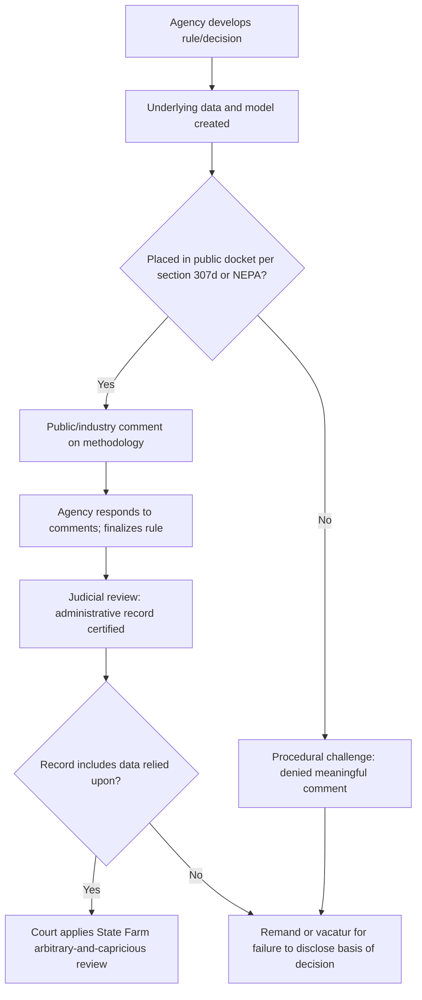

## Congressional and Public Access to Agency Data and Methodology

### Overview

Access to the data, models, and methodologies underlying agency decisions is a distinct legal problem from access to agency records generally. It sits at the intersection of freedom-of-information law, congressional oversight power, evidentiary standards for judicial review, and the practical mechanics of how agencies store and produce technical information (raw datasets, statistical models, source code, algorithms). Administrative and environmental law both depend heavily on this access because agency legitimacy in these fields rests on technical justification — emissions modeling, cost-benefit analysis, risk assessment, epidemiological data — that outside parties must be able to inspect and contest.

### Legal Sources of Access

**Freedom of Information Act (FOIA), 5 U.S.C. § 552**

- Applies to "agency records," a term interpreted to include electronic data, databases, and in many cases underlying model inputs, though not necessarily the software/code itself unless it independently qualifies as an agency record.
- Nine exemptions matter most here: Exemption 4 (trade secrets/confidential commercial information — often invoked to withhold proprietary models submitted by regulated industry), Exemption 5 (deliberative process privilege — often invoked to withhold draft methodologies, internal modeling assumptions, and pre-decisional analyses), and Exemption 6/7 (privacy) where datasets contain personal information.
- Courts have held that segregable factual/scientific data within a deliberative document must be disclosed even if the surrounding analysis is withheld — this is the **factual/deliberative severability doctrine**.

**Environmental-specific access statutes**

- Emergency Planning and Community Right-to-Know Act (EPCRA), 42 U.S.C. § 11001 et seq. — mandates public access to Toxics Release Inventory (TRI) data.
- Clean Air Act § 114 and Clean Water Act § 308 — require regulated entities to submit monitoring data to EPA, which becomes accessible subject to confidentiality claims under 40 C.F.R. Part 2.
- National Environmental Policy Act (NEPA) — requires disclosure of the data and methodology underlying environmental impact statements (EIS) as part of the "hard look" requirement; agencies must make their analytic methodology available for public comment under 40 C.F.R. § 1502.24 (data quality/methodology in EIS).

**Administrative Procedure Act (APA), 5 U.S.C. § 706**

- Judicial review under the "arbitrary and capricious" standard (*Motor Vehicle Mfrs. Ass'n v. State Farm*, 463 U.S. 29 (1983)) requires the reviewing court to examine whether the agency's decision was based on "a consideration of the relevant factors," which in practice means the administrative record — including data and modeling assumptions — must be disclosed for review.
- The **whole record rule** (*Citizens to Preserve Overton Park v. Volpe*, 401 U.S. 402 (1971)) requires the agency to produce the full record actually before the decisionmaker, not a post-hoc rationalization; this has been litigated extensively over whether internal datasets and model runs must be included.

**Congressional oversight authority**

- Congress's investigatory power derives from *McGrain v. Daugherty*, 273 U.S. 135 (1927), and is exercised through committee subpoena power (Rule XI, House Rules; various Senate committee rules).
- Statutory reporting and data-access mandates are common in enabling statutes — e.g., Clean Air Act § 307(d) requires that data relied upon in rulemaking be placed in the docket contemporaneously with proposal.
- Executive privilege and the deliberative process privilege can be asserted against congressional requests but are not absolute; courts balance institutional need against confidentiality interest (*Committee on Judiciary v. McGahn*, D.C. Cir. 2020, for the general framework; environmental agency-specific privilege fights are more often resolved through negotiated accommodation than litigation).

**Information Quality Act (IQA / Data Quality Act), 44 U.S.C. § 3516 note**

- Requires OMB and agencies to issue guidelines ensuring the "quality, objectivity, utility, and integrity" of information disseminated, and creates an administrative mechanism for affected persons to seek correction of agency data — frequently used by regulated industry to challenge environmental risk assessments.

### The Docket Requirement in Environmental Rulemaking

Under Clean Air Act § 307(d)(3)-(4), EPA must place in the rulemaking docket:

- All data, information, and documents relied on in the proposed rule.
- The methodology and "major legal interpretations and policy considerations" underlying the proposal.
- This "e-Docket" requirement (see EPA's regulations.gov integration) is designed precisely to prevent the *State Farm* problem: an agency relying on models or data never exposed to comment, then defending the rule on appeal.

Courts have vacated rules where the agency relied on data or a model not disclosed for comment (**"logical outgrowth" and "notice-and-comment" violations**), because interested parties could not test the methodology. See *Portland Cement Ass'n v. Ruckelshaus*, 486 F.2d 375 (D.C. Cir. 1973) — establishing that agencies must disclose methodology sufficient to allow "meaningful commentary," including underlying data and assumptions in the EIS/rulemaking record.

### Confidential Business Information (CBI) Tension

Environmental statutes routinely require regulated entities to submit proprietary data (formulations, emissions modeling inputs, chemical identities) that the entity claims as CBI.

- TSCA (Toxic Substances Control Act) § 14, 15 U.S.C. § 2613, sets procedures for CBI claims and substantiation requirements (post-2016 Lautenberg Act amendments tightened these, requiring periodic re-substantiation).
- EPA regulations at 40 C.F.R. Part 2, Subpart B govern CBI determinations; a "reverse-FOIA" suit (*Chrysler Corp. v. Brown*, 441 U.S. 281 (1979)) is the vehicle by which a submitter can sue to block agency release of data it deems confidential.
- The core doctrinal tension: public and congressional access interests in verifying agency methodology versus statutory and constitutional (Takings Clause, in some formulations) protection of submitted proprietary data.

### Congressional Access Mechanisms in Practice

**Formal tools**

- Committee subpoenas for documents and data (compliance disputes resolved through negotiation, contempt referrals, or Article III litigation).
- GAO (Government Accountability Office) audits and technical reviews, exercised under 31 U.S.C. § 717, giving Congress an independent technical-verification arm with broad statutory access to agency records, including underlying data.
- Congressional Research Service (CRS) requests, generally informal and non-adversarial.
- Statutory reporting mandates embedded in authorizing/appropriations legislation (e.g., requiring EPA to submit underlying data with certain reports to specific committees).

**Recurring friction points**

- Deliberative process privilege assertions against congressional data requests for draft models/analyses.
- Contractor-held data: when agencies rely on third-party contractors (e.g., climate or health models run by national labs or university partners), access questions arise over whether the contractor's proprietary code/methodology is itself an "agency record."
- Classified or law-enforcement-sensitive environmental data (e.g., critical infrastructure vulnerability data tied to environmental permits) creates additional access carve-outs.

### Judicial Review Mechanics: Why Data Access Matters

The diagram captures the doctrinal chain courts use: failure to disclose data/methodology at the comment stage or in the certified record is independently sufficient grounds for remand, separate from any substantive defect in the data itself.

### Key Doctrinal Distinctions

| Concept | Governs | Key Case/Authority |
| --- | --- | --- |
| Agency record definition | What counts as disclosable under FOIA | *Dep't of Justice v. Tax Analysts*, 492 U.S. 136 (1989) |
| Deliberative process privilege | Withholding pre-decisional data/drafts | *NLRB v. Sears, Roebuck & Co.*, 421 U.S. 132 (1975) |
| Whole record rule | Scope of judicial review record | *Overton Park*, 401 U.S. 402 (1971) |
| Meaningful notice-and-comment | Disclosure of methodology pre-finalization | *Portland Cement*, 486 F.2d 375 (D.C. Cir. 1973) |
| Reverse-FOIA | Submitter's right to block release of CBI | *Chrysler Corp. v. Brown*, 441 U.S. 281 (1979) |
| Congressional investigatory power | Committee access to executive branch data | *McGrain v. Daugherty*, 273 U.S. 135 (1927) |

### Practical Example

An environmental group requests, via FOIA, the emissions dispersion model (including source code and input parameters) EPA used to justify a particulate matter NAAQS revision. EPA:

1. Releases the input datasets (ambient monitoring data) as segregable factual material.
2. Withholds internal sensitivity-analysis memos discussing which model runs to feature, citing Exemption 5 deliberative process privilege.
3. Withholds a subset of facility-level emissions data at the request of a submitting company claiming Exemption 4 CBI protection, triggering possible reverse-FOIA litigation if EPA later decides to release it anyway.

Simultaneously, a House committee investigating the rule subpoenas the same model and the internal memos. EPA may assert deliberative process privilege against the committee too, but this privilege is markedly weaker against a coordinate branch exercising oversight than against a private FOIA requester, and disputes here are typically resolved by negotiated document production ("accommodation process") rather than by the FOIA-exemption framework. [Inference: outcomes vary considerably case-by-case and are shaped more by political dynamics and negotiated accommodation than by settled precedent, since few of these disputes reach final judicial resolution.]

### Practice Pointers

- When challenging an agency rule for concealment of methodology, plead a procedural (notice-and-comment) claim as well as a substantive (arbitrary-and-capricious) claim; the procedural claim is often easier to win and produces a faster remand.
- CBI disputes should anticipate the reverse-FOIA path if representing a data submitter, since simple non-response by the agency does not resolve the confidentiality claim.
- FOIA requests for "code" or "models" should specify format (source code, executable, documentation) precisely, since agencies often argue that raw code is not an "agency record" if it's a commercial off-the-shelf tool merely licensed by the agency.
- For congressional staff, statutory reporting mandates embedded in authorizing language are more reliable than relying on oversight requests alone, since they create an ongoing disclosure obligation rather than a one-time production fight.

### Related Topics

- Deliberative process privilege and its limits in environmental rulemaking
- Confidential Business Information (CBI) determinations under TSCA and EPCRA
- The administrative record doctrine and record supplementation/extra-record evidence
- NEPA's "hard look" doctrine and adequacy of environmental impact statement methodology
- GAO's statutory audit authority (31 U.S.C. § 717) as an oversight tool
- Reverse-FOIA litigation strategy and the *Chrysler v. Brown* framework
- Data Quality Act / Information Quality Act correction petitions
- Congressional subpoena enforcement and executive privilege balancing tests