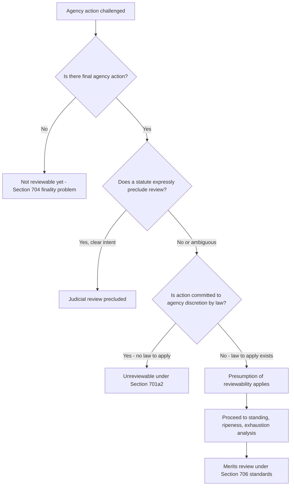

## The Presumption of Judicial Reviewability Under the APA

### Overview

The presumption of judicial reviewability is a foundational canon of administrative law: courts assume that final agency action is subject to judicial review unless Congress has clearly indicated otherwise. This presumption operationalizes the APA's structure, which was designed to guarantee a judicial check on agency power except in narrowly defined circumstances. It is the doctrinal starting point for virtually every justiciability analysis in administrative and environmental law, since most environmental statutes (Clean Air Act, Clean Water Act, ESA, NEPA) are enforced through APA-style review or their own citizen-suit provisions layered on top of this presumption.

### Statutory Basis

**5 U.S.C. § 701(a)** — the operative provision — states that the APA's judicial review chapter applies "except to the extent that (1) statutes preclude judicial review; or (2) agency action is committed to agency discretion by law."

**5 U.S.C. § 702** — grants a right of review to any "person suffering legal wrong because of agency action, or adversely affected or aggrieved by agency action within the meaning of a relevant statute."

**5 U.S.C. § 704** — limits review to "final agency action for which there is no other adequate remedy in a court," introducing the separate **finality** requirement that operates alongside the presumption of reviewability.

**5 U.S.C. § 706** — sets the standards of review a court applies once reviewability is established (arbitrary and capricious, unsupported by substantial evidence, contrary to law, etc.).

### The Foundational Case: *Abbott Laboratories v. Gardner*

*Abbott Laboratories v. Gardner*, 387 U.S. 136 (1967), is the canonical articulation of the presumption:

- The Court held that judicial review of agency action is the norm and that preclusion of review "is not lightly to be inferred."
- The Court emphasized the APA's legislative history reflects a "basic presumption of judicial review" for anyone suffering legal wrong from agency action.
- The case also introduced the modern **ripeness** framework (fitness of the issues for review and hardship to the parties of withholding review) that operates as a companion doctrine.

This presumption has been reaffirmed repeatedly, including in *Bowen v. Michigan Academy of Family Physicians*, 476 U.S. 667 (1986) (requiring "clear and convincing evidence" of congressional intent to preclude review — a formulation later softened but still influential), and *Sackett v. EPA*, 566 U.S. 120 (2012) (unanimously rejecting the argument that the Clean Water Act implicitly precluded pre-enforcement review of EPA compliance orders).

### Two Statutory Exceptions Under § 701(a)

**(1) Preclusion of review**

- Congress can explicitly bar review (e.g., certain immigration and veterans' benefits statutes contain explicit preclusion clauses).
- Implicit preclusion is disfavored but can be inferred from statutory structure — courts look at whether Congress created an alternative, adequate remedial scheme that suggests exclusivity (*Block v. Community Nutrition Institute*, 467 U.S. 340 (1984), finding preclusion implied from a comprehensive regulatory scheme in the milk marketing context).
- Environmental statutes typically go the opposite direction: they contain explicit citizen-suit provisions (e.g., Clean Air Act § 304, Clean Water Act § 505, ESA § 11(g)) that expand rather than restrict access to judicial review, reinforcing rather than rebutting the presumption.

**(2) Committed to agency discretion by law**

- This exception is construed very narrowly — the Supreme Court has held it applies only in the rare instance where a statute is "drawn in such broad terms that in a given case there is no law to apply." *Citizens to Preserve Overton Park v. Volpe*, 401 U.S. 402, 410 (1971).
- The leading modern example is *Heckler v. Chaney*, 470 U.S. 821 (1985), holding that an agency's decision **not to initiate an enforcement action** is presumptively unreviewable because it involves the kind of discretionary balancing (resources, priorities, likelihood of success) courts are ill-suited to second-guess — unless the agency has adopted a rule or policy that constrains that discretion (an exception the Court itself carved out and later cases have applied, e.g., where an agency claims it entirely lacks jurisdiction to act, as opposed to declining to exercise enforcement discretion).
- Other examples: allocation of lump-sum appropriations (*Lincoln v. Vigil*, 508 U.S. 182 (1993)); certain national security and foreign affairs determinations.

### Structure of the Analysis

### Interaction With Other Justiciability Doctrines

The presumption of reviewability is distinct from, but interacts with, several related doctrines:

- **Standing** (Article III and prudential/zone-of-interests) — a plaintiff must still have standing even where the action is reviewable in principle; *Lujan v. Defenders of Wildlife*, 504 U.S. 555 (1992), is the leading environmental-law standing case.
- **Ripeness** — from *Abbott Labs* itself; the action must be fit for review and withholding review must impose hardship.
- **Finality** — under § 704, the action must mark the "consummation" of the agency's decisionmaking process and determine rights or obligations (*Bennett v. Spear*, 520 U.S. 154 (1997), the key environmental-law finality case involving an ESA biological opinion).
- **Exhaustion of administrative remedies** — a prudential (and sometimes statutory) requirement that a party pursue available agency-level appeals before going to court (*Darby v. Cisneros*, 509 U.S. 137 (1993), narrowing the judicially-created exhaustion doctrine where § 704's "final agency action" language already governs).

These doctrines are sometimes discussed together as "justiciability" but each has a separate doctrinal test; the presumption of reviewability specifically answers the § 701(a) threshold question of whether *any* review is available at all, prior to and independent of standing/ripeness/finality analysis.

### Application in Environmental Law

Environmental statutes present the presumption in a distinctive posture because most contain their own review provisions:

- **Clean Air Act § 307(b)** channels certain challenges directly to the D.C. Circuit (for nationally applicable rules) or regional circuits (for locally/regionally applicable rules), with strict timing requirements — this is a statutory review scheme that displaces ordinary APA review procedure but does not eliminate reviewability itself.
- **Citizen suit provisions** (CAA § 304, CWA § 505, RCRA § 7002, ESA § 11) authorize private enforcement actions against both regulated parties and the agency itself for failure to perform non-discretionary duties — these operate as a statutory reinforcement of the presumption, explicitly displacing any argument that Congress intended to insulate agency inaction from review.
- **Sackett v. EPA** (2012) is the paradigmatic recent environmental-law reaffirmation: EPA argued that allowing pre-enforcement judicial review of Clean Water Act compliance orders would undermine the Act's enforcement scheme; the Court unanimously rejected this, applying the *Abbott Labs* presumption with particular force because compliance orders carried severe practical consequences (accruing penalties) for the recipients while under review.
- **Massachusetts v. EPA**, 549 U.S. 497 (2007), while chiefly a standing case, also reinforced reviewability of EPA's denial of a rulemaking petition under the Clean Air Act — an example where the "committed to agency discretion" argument was rejected because the statute supplied a judicially manageable standard (whether greenhouse gases "may reasonably be anticipated to endanger" public health).

### Practical Example

A citizens' group sues EPA for failing to designate certain areas as "nonattainment" under the Clean Air Act's NAAQS implementation provisions.

1. EPA argues designation timing and criteria are "committed to agency discretion."
2. The court examines the statute: does it supply criteria — deadlines, defined pollutant thresholds — that give the court "law to apply"? If yes, *Heckler v. Chaney*'s discretion exception does not apply, because the statute is not the kind of standardless delegation the exception addresses.
3. The court further asks whether the CAA's citizen-suit provision (§ 304(a)(2), authorizing suits against EPA for failure to perform a "non-discretionary duty") supplies an express cause of action, reinforcing rather than displacing ordinary reviewability.
4. Absent express preclusion or the narrow discretion exception, the presumption controls, and the court proceeds to standing, ripeness, and merits analysis under § 706.

### Key Case Summary Table

| Case | Holding | Relevance |
| --- | --- | --- |
| *Abbott Laboratories v. Gardner* (1967) | Establishes presumption of reviewability; review not precluded absent clear congressional intent | Foundational statement of the doctrine |
| *Overton Park* (1971) | "Committed to discretion" exception applies only where there is "no law to apply" | Defines the narrow scope of § 701(a)(2) |
| *Heckler v. Chaney* (1985) | Non-enforcement decisions presumptively unreviewable | Major carve-out from the general presumption |
| *Bennett v. Spear* (1997) | Defines "final agency action" for review purposes | Ties reviewability to the finality requirement |
| *Sackett v. EPA* (2012) | Rejects implied preclusion of pre-enforcement CWA review | Modern, unanimous reaffirmation in environmental context |
| *Massachusetts v. EPA* (2007) | Rulemaking denial reviewable; statute supplied manageable standard | Environmental-law application of the discretion exception's limits |

### Practice Pointers

- Always run the § 701(a) analysis (preclusion / committed-to-discretion) as a discrete threshold step before reaching standing or merits — courts frequently resolve cases on this ground alone.
- When arguing for reviewability, emphasize any statutory standard, deadline, or criterion — however general — since courts read *Heckler v. Chaney*'s "no law to apply" language narrowly.
- When arguing against reviewability of an *enforcement discretion* decision, `Heckler v. Chaney` remains the strongest authority, but note its own exception: agency self-declared *lack of jurisdiction* is treated differently from a discretionary declination to enforce.
- In environmental practice, check the applicable statute's specific judicial review provision (CAA § 307(b), CWA § 509(b), etc.) first, since these often supersede the general APA venue and timing rules even while incorporating the same underlying presumption of reviewability. [Inference: the precise interaction between a statute's specialized review provision and general APA reviewability doctrine can vary by circuit and by the specific statutory text, so counsel should confirm current circuit precedent for the relevant statute.]

### Related Topics

- Finality of agency action under 5 U.S.C. § 704 and *Bennett v. Spear*
- Ripeness doctrine post-*Abbott Laboratories*
- Standing in environmental litigation: *Lujan* and the injury-in-fact/causation/redressability framework
- The *Heckler v. Chaney* presumption against reviewing non-enforcement decisions and its exceptions
- Citizen-suit provisions as statutory reinforcement of reviewability (CAA, CWA, ESA, RCRA)
- Exhaustion of administrative remedies after *Darby v. Cisneros*
- Special statutory review channels (CAA § 307(b), CWA § 509(b)) and venue/timing rules
- Zone-of-interests test for prudential standing