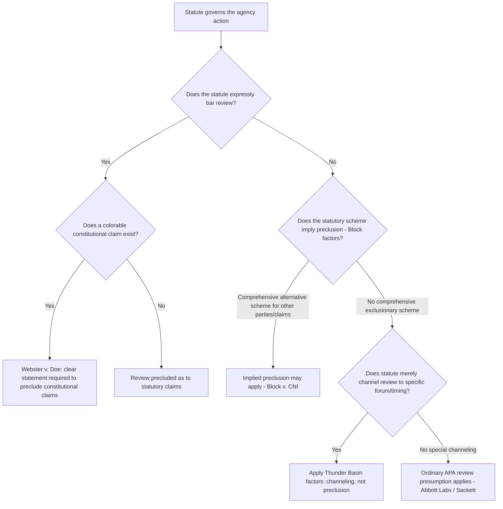

## Preclusion of Review by Statute

### Overview

Preclusion of review is the first of the two statutory exceptions in 5 U.S.C. § 701(a) to the general presumption of judicial reviewability of agency action. It addresses circumstances where Congress itself — expressly or by clear implication from statutory structure and purpose — has withdrawn judicial review of some or all agency action under a given statute. Because it operates as a derogation from the strong presumption favoring review established in *Abbott Laboratories v. Gardner*, 387 U.S. 136 (1967), courts construe preclusion narrowly and require persuasive evidence of congressional intent before finding it.

### Statutory Basis

**5 U.S.C. § 701(a)(1)** — the APA's review chapter does not apply "to the extent that... statutes preclude judicial review."

This is distinct from § 701(a)(2) ("committed to agency discretion by law"), which addresses situations where review is unavailable not because Congress barred it but because the statute supplies no judicially manageable standard. Preclusion, by contrast, is about Congress affirmatively closing the courthouse door — either completely or as to particular parties, claims, or forms of relief.

### Express Preclusion

Congress can bar review explicitly. Common statutory formulations include:

- "The decision of the Secretary shall be final and not subject to judicial review."
- "No court shall have jurisdiction to review..."
- Statutes limiting review to a specific forum, timeframe, or type of claim while excluding others (a form of **partial preclusion**).

Examples across regulatory contexts:

- Certain veterans' benefits determinations (historically insulated from review, though narrowed by later statutory amendments and *Cushman v. Shinseki*-line cases).
- Some immigration provisions under 8 U.S.C. § 1252(a)(2)(B), precluding review of certain discretionary determinations (though the Supreme Court has since read "questions of law" exceptions into these bars, e.g., *Guerrero-Lasprilla v. Barr*, 589 U.S. 221 (2020)).
- Certain benefit eligibility determinations under the Social Security Act.

Even express preclusion clauses are read narrowly where constitutional questions are at stake, under the **constitutional avoidance canon**: courts presume Congress did not intend to preclude review of colorable constitutional claims absent an unmistakably clear statement (*Webster v. Doe*, 486 U.S. 592 (1988), holding that a statute permitting CIA employee terminations "in the discretion of the Director" precluded APA review of the underlying discretionary decision but not a separate colorable constitutional claim).

### Implied Preclusion

Far more litigated than express preclusion is **implied preclusion** — where no statute explicitly bars review, but courts infer that Congress intended to displace it based on statutory structure, legislative history, and the nature of the administrative scheme.

**Leading case: *Block v. Community Nutrition Institute*, 467 U.S. 340 (1984)**

- Consumers challenged a milk marketing order under the Agricultural Marketing Agreement Act, arguing it kept milk prices artificially high.
- The Act provided an elaborate review mechanism for regulated *handlers* (processors) but was silent on consumer suits.
- The Court held that the "detailed and complex" statutory scheme, which contemplated review only for milk handlers, implicitly precluded review by consumers, because Congress's provision of one class of reviewable parties strongly implied exclusion of others.
- This established that a comprehensive alternative remedial scheme can itself be evidence of intent to preclude, especially where extending review to additional parties would undermine the scheme's design (e.g., delaying price orders through unlimited consumer litigation).

**The "fairly discernible" standard**

- Courts examine (1) the statutory language, (2) the legislative history, (3) the statutory scheme as a whole, (4) the nature of the administrative action, and (5) whether Congress's intent to preclude is "fairly discernible in the statutory scheme" (*Block*, 467 U.S. at 351, quoting *Bd. of Governors, FRS v. MCorp Financial*, 502 U.S. 32 (1991), for later refinements).
- This is a lower bar than a "clear statement" requirement but still demands more than mere silence; silence alone does not imply preclusion (reinforcing the *Abbott Labs* presumption).

**Distinguishing preclusion of the claim vs. preclusion of the forum/timing**

- Some statutes do not eliminate review altogether but **channel** it to a specific court or specific procedural moment (e.g., only after final agency adjudication, or only in a court of appeals rather than district court). This is sometimes called **jurisdiction-channeling** and is analytically distinct from true preclusion, though courts sometimes discuss the two together.
- *Thunder Basin Coal Co. v. Reich*, 510 U.S. 200 (1994), articulates factors for whether a statute impliedly precludes district court review in favor of a specialized administrative/appellate review scheme: (1) whether precluding district court jurisdiction could foreclose all meaningful judicial review, (2) whether the claim is wholly collateral to the statute's review provisions, and (3) whether the claim is outside the agency's expertise.

### Preclusion in Environmental Statutes: The Opposite Pattern

Environmental statutes overwhelmingly move in the opposite direction from *Block* — they contain explicit citizen-suit provisions that *expand* access to judicial review rather than narrow it:

- Clean Air Act § 304, 42 U.S.C. § 7604
- Clean Water Act § 505, 33 U.S.C. § 1365
- RCRA § 7002, 42 U.S.C. § 6972
- Endangered Species Act § 11(g), 16 U.S.C. § 1540(g)

These provisions authorize "any person" to sue both regulated entities for violations and the agency itself for failure to perform non-discretionary duties, which courts have treated as strong evidence *against* any inference of preclusion in the environmental context. Where environmental preclusion arguments do arise, they typically concern:

- **Timing/venue channeling** rather than complete preclusion — e.g., Clean Air Act § 307(b)'s requirement that certain challenges be brought within 60 days in a specified circuit court, which the Supreme Court and circuit courts have enforced strictly as a jurisdictional or claims-processing channeling rule, without treating it as eliminating review altogether.
- **Sackett v. EPA**, 566 U.S. 120 (2012) — EPA argued the Clean Water Act's enforcement structure impliedly precluded pre-enforcement judicial review of compliance orders. The Court unanimously rejected this, reasoning that nothing in the CWA's text expressly precluded review, and the "comprehensive scheme" the government pointed to did not carry the same exclusionary implication found in *Block*, especially given the serious practical consequences to the compliance order recipient of being denied any interim review.

### Structural Analysis Framework

### Interaction With Standing and the Zone-of-Interests Test

Preclusion analysis is sometimes conflated with, but is analytically separate from, the **zone-of-interests test** for prudential standing (*Lexmark Int'l, Inc. v. Static Control Components, Inc.*, 572 U.S. 118 (2014), reframing zone-of-interests as a merits question of whether a cause of action exists, rather than a jurisdictional standing bar). A plaintiff might fall outside a statute's zone of interests (no cause of action for that plaintiff) even where the statute does not preclude review generally for any plaintiff — these are different doctrinal questions that courts sometimes discuss in the same breath, particularly in cases descended from *Block*.

### Practical Example

A regulated utility challenges an EPA emissions guideline under the Clean Air Act, but structures its challenge as a district court declaratory judgment action rather than filing within the 60-day window in the court of appeals as required by CAA § 307(b).

1. EPA moves to dismiss, arguing § 307(b) channels — and after 60 days, precludes — review of this type of claim outside the specified appellate process.
2. The court asks whether § 307(b) merely channels timing/forum (a claims-processing rule, potentially subject to equitable exceptions) or whether it operates as a jurisdictional bar extinguishing the claim entirely once the window closes.
3. Under current doctrine, many circuits treat the 60-day requirement as jurisdictional for purposes of triggering direct review in the courts of appeals, meaning the utility's untimely district court challenge would likely be dismissed — not because Congress precluded review of the *substance* of the guideline, but because it precluded review through *this* procedural vehicle after the statutory window closed. [Inference: whether such time bars are treated as strictly jurisdictional or as flexible claims-processing rules has evolved with the Supreme Court's broader jurisdictional/non-jurisdictional distinction jurisprudence (e.g., in the *Hamer v. Neighborhood Housing Services* line of cases), so counsel should verify current treatment in the relevant circuit.]

### Key Case Summary Table

| Case | Holding | Doctrinal Contribution |
| --- | --- | --- |
| *Abbott Laboratories v. Gardner* (1967) | Preclusion "not lightly inferred" | Establishes the strong presumption preclusion must overcome |
| *Block v. Community Nutrition Institute* (1984) | Comprehensive alternative scheme implied preclusion for non-covered parties | Leading implied-preclusion case |
| *Webster v. Doe* (1988) | Clear statement required to preclude review of constitutional claims | Constitutional avoidance limit on preclusion |
| *Thunder Basin Coal Co. v. Reich* (1994) | Three-factor test for implied channeling to specialized review schemes | Distinguishes channeling from true preclusion |
| *Sackett v. EPA* (2012) | CWA did not impliedly preclude pre-enforcement review of compliance orders | Modern environmental-law rejection of implied preclusion |
| *Guerrero-Lasprilla v. Barr* (2020) | "Questions of law" exception read into immigration preclusion statute | Narrow construction of express preclusion language |

### Practice Pointers

- Always distinguish **complete preclusion** (no review anywhere, for anyone) from **channeling** (review available, but only through a specified forum, timing, or procedural vehicle) — the applicable analytical framework and available remedies differ substantially.
- When representing a party challenging preclusion, argue for the *Abbott Labs*/*Sackett* line emphasizing the strength of the presumption and the practical hardship of denying any review; when defending preclusion, marshal *Block*'s "comprehensive scheme" reasoning and identify any parallel avenue Congress did provide for review (which cuts in favor of finding the challenged avenue precluded).
- Raise colorable constitutional claims separately and explicitly, since *Webster v. Doe* preserves review of such claims even under express preclusion clauses that would otherwise bar statutory claims.
- In environmental practice, preclusion arguments are comparatively rare given citizen-suit provisions; focus instead on whether the specific claim falls within a specialized statutory review channel's timing/venue requirements (*Thunder Basin* framework) rather than arguing for complete preclusion.

### Related Topics

- The presumption of judicial reviewability under the APA (§ 701(a) generally)
- "Committed to agency discretion by law" under § 701(a)(2) and *Heckler v. Chaney*
- Finality of agency action and the *Bennett v. Spear* framework
- Jurisdiction-channeling statutes and the *Thunder Basin* three-factor test
- Zone-of-interests and cause-of-action analysis post-*Lexmark*
- Citizen-suit provisions in environmental statutes (CAA, CWA, RCRA, ESA)
- Claims-processing rules versus jurisdictional limitations post-*Hamer*
- Constitutional avoidance canon in statutory interpretation