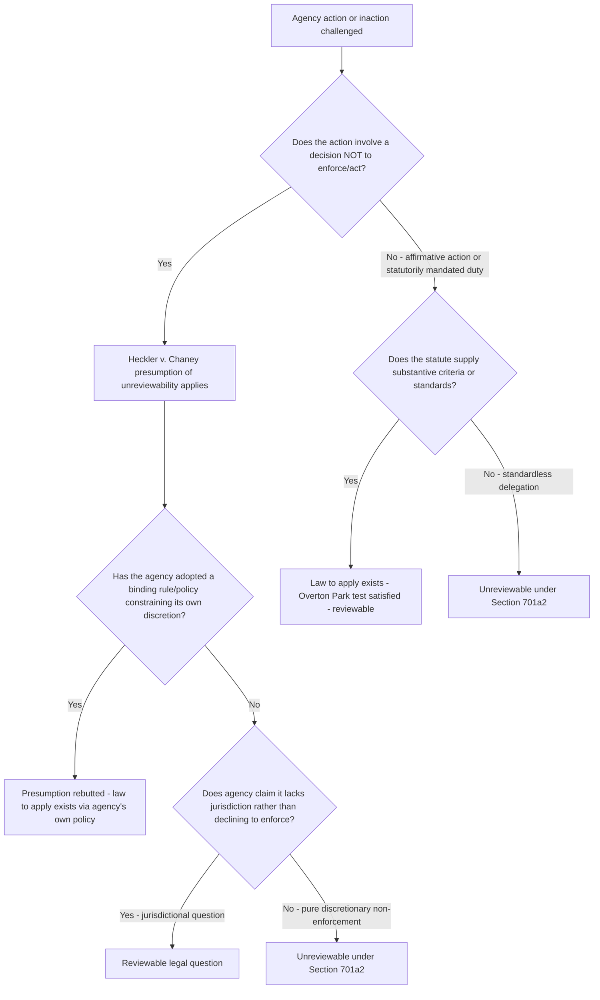

## Action Committed to Agency Discretion by Law

### Overview

This is the second of the two statutory exceptions to reviewability under 5 U.S.C. § 701(a). Unlike preclusion, which addresses situations where Congress has affirmatively barred review, the "committed to agency discretion by law" exception addresses situations where a statute confers such broad, standardless discretion on an agency that a reviewing court has no legal yardstick against which to measure the agency's action. It is construed extremely narrowly and functions as a genuine exception rather than a routine limitation on review.

### Statutory Basis

**5 U.S.C. § 701(a)(2)** excludes from APA review chapter coverage agency action that is "committed to agency discretion by law."

The canonical formulation of the test comes from *Citizens to Preserve Overton Park v. Volpe*, 401 U.S. 402, 410 (1971): this exception applies only in the rare circumstance where a statute is "drawn in such broad terms that in a given case there is no law to apply."

This is a narrow exception; the mere fact that a statute grants an agency discretion does not, by itself, commit the action to unreviewable discretion — discretion is a routine feature of delegated authority, and most discretionary decisions remain reviewable for abuse of discretion under § 706(2)(A)'s arbitrary-and-capricious standard. Section 701(a)(2) is reserved for the subset of discretionary grants so open-ended that no judicially manageable standard exists at all.

### The "No Law to Apply" Test

Courts examine:

- The specificity of statutory language governing the decision.
- Whether the statute provides substantive criteria, factors, or standards the agency must consider.
- Whether legislative history, agency regulations, or established agency practice supply a judicially manageable standard even where the statute itself is broad.
- The traditional unsuitability of the subject matter for judicial oversight (e.g., matters of foreign policy, national security, or internal resource allocation).

Where a statute supplies even general substantive criteria (e.g., "reasonably anticipated to endanger public health," "in the public interest," "feasible"), courts have generally found "law to apply" and rejected the § 701(a)(2) defense — see *Massachusetts v. EPA*, 549 U.S. 497 (2007), where the Clean Air Act's "may reasonably be anticipated to endanger" standard was held to supply enough of a standard to make EPA's denial of a rulemaking petition reviewable.

### Heckler v. Chaney: The Enforcement Discretion Carve-Out

**Heckler v. Chaney*, 470 U.S. 821 (1985)**, is the most significant modern application of § 701(a)(2):

- Prisoners sentenced to death challenged the FDA's refusal to take enforcement action against the use of certain drugs in lethal injection protocols, arguing the drugs were unapproved for that use under the FDCA.
- The Court held that an agency's decision **not to institute enforcement proceedings** is presumptively unreviewable, reasoning that:
  1. Such decisions involve a complex balancing of factors — agency resources, enforcement priorities, likelihood of success, and overall enforcement policy — that agencies, not courts, are best suited to weigh.
  2. Non-enforcement decisions resemble prosecutorial discretion, traditionally unreviewable.
  3. Unlike a decision to act (which typically has a defined statutory trigger a court can measure), a decision *not* to act often has no analogous benchmark.
- The Court characterized this as a **presumption**, rebuttable where:
  - The agency has adopted a rule, regulation, or clear policy statement that itself constrains the discretion (converting a standardless decision into one with "law to apply" derived from the agency's own binding policy) — see *Chaney* itself citing *Adams v. Richardson*, 480 F.2d 1159 (D.C. Cir. 1973) (en banc), as an example of reviewable "abdication" of statutory duty.
  - The agency asserts it **lacks jurisdiction** to act at all, as opposed to declining to exercise enforcement discretion it concededly has — courts have distinguished these as different in kind (a jurisdictional determination is a legal question, generally reviewable, whereas discretionary non-enforcement is not).
  - The statute itself provides guidelines for the agency to follow in exercising its enforcement power, providing courts a standard against which to review the decision not to enforce.

### Distinguishing Discretion-to-Act From Discretion-Not-to-Act

An important asymmetry runs through this doctrine: agency decisions **to take action** are far more likely to be reviewable than agency decisions **not to take action**, even under statutes that grant broad discretion in both directions.

- *Heckler v. Chaney* itself frames this asymmetry: affirmative enforcement action typically involves a discrete, focused exercise of power with a clear statutory trigger, while non-enforcement is diffuse and resembles the traditionally unreviewable domain of prosecutorial discretion.
- This asymmetry has particular salience in environmental law, where citizen-suit provisions (e.g., CAA § 304(a)(2), authorizing suits against EPA for failure to perform "non-discretionary" duties) are drafted specifically to overcome the *Chaney* presumption by making certain agency duties mandatory rather than discretionary — converting what might otherwise be unreviewable inaction into a reviewable failure to perform a statutorily mandated act.

### Other Applications of the Discretion Exception

- **Lump-sum appropriations**: *Lincoln v. Vigil*, 508 U.C. 182 (1993), held that an agency's allocation of a lump-sum appropriation among functions within its authority is committed to agency discretion, absent statutory constraints on how the funds must be spent.
- **Termination of at-will/sensitive employment**: *Webster v. Doe*, 486 U.S. 592 (1988), held that the CIA Director's discretion to terminate an employee "in the interests of the United States" under the National Security Act was committed to agency discretion for statutory purposes (though not for constitutional claims — a "clear statement" is required to preclude those, distinguishing this from a pure § 701(a)(2) case since it also implicated preclusion analysis).
- **Foreign affairs and national security determinations**: courts have generally found such matters presumptively committed to discretion given the constitutional allocation of authority and lack of judicially manageable standards, though this is more a functional/prudential judgment than a rigid categorical rule. [Inference: the precise scope of this category is contested and fact-dependent, since courts have sometimes found reviewable legal questions embedded within otherwise discretion-committed national security contexts.]

### Structural Analysis Framework

### Application in Environmental Law

- **Citizen suits as statutory overrides of *Chaney***: Congress drafted environmental citizen-suit provisions specifically to convert certain agency duties from discretionary to mandatory, thereby supplying "law to apply" and defeating any *Chaney*-style defense. Where a statute uses "shall" language imposing a clear deadline or duty (e.g., EPA "shall" promulgate NAAQS review on a set schedule), courts have found these to be non-discretionary duties reviewable via citizen suit, distinguishing them from the discretionary enforcement-priority decisions at issue in *Chaney* itself.
- ***Massachusetts v. EPA* (2007)**: EPA argued its denial of a petition to regulate greenhouse gas emissions from motor vehicles was a discretionary decision akin to *Chaney*'s non-enforcement context. The Court rejected this, holding the Clean Air Act's "endangerment" standard supplied a statutory standard against which EPA's stated reasons for declining to regulate could be measured — distinguishing a **reasoned denial of a rulemaking petition** (reviewable, because the agency gave reasons tied to a statutory standard) from **pure non-enforcement discretion** (presumptively unreviewable under *Chaney*).
- **Enforcement discretion in permitting/inspection contexts**: EPA's decisions about which facilities to inspect, prioritize, or refer for enforcement remain generally protected by the *Chaney* presumption, absent a specific statutory or regulatory constraint converting that discretion into a mandatory duty.

### Practical Example

An environmental group petitions EPA to designate a chemical as a "hazardous air pollutant" under the Clean Air Act, and EPA declines.

1. EPA argues the decision whether to add a substance to the list is committed to agency discretion, similar to *Heckler v. Chaney*'s treatment of enforcement priorities.
2. The reviewing court examines the statutory listing criteria: does the Act specify substantive standards (e.g., "known to cause or may reasonably be anticipated to cause adverse effects") that a court can apply to evaluate whether EPA's stated reasons for declining are consistent with the statute?
3. Following the *Massachusetts v. EPA* framework, because the statute supplies a substantive standard and EPA gave a reasoned explanation tied (or purportedly tied) to that standard, the decision is treated as a reviewable denial of a petition rather than unreviewable non-enforcement discretion — the group can challenge whether EPA's stated reasons were consistent with the statutory standard, even though the group cannot force EPA to make the listing itself absent a finding of arbitrary-and-capricious reasoning.

### Key Case Summary Table

| Case | Holding | Doctrinal Contribution |
| --- | --- | --- |
| *Overton Park* (1971) | Exception applies only where there is "no law to apply" | Establishes the narrow "no law to apply" test |
| *Heckler v. Chaney* (1985) | Non-enforcement decisions presumptively unreviewable | Central modern application; establishes rebuttable presumption and its exceptions |
| *Lincoln v. Vigil* (1993) | Lump-sum appropriation allocation committed to discretion | Extends doctrine to budgetary/resource allocation |
| *Webster v. Doe* (1988) | Employment termination "in the interests of the U.S." committed to discretion (statutory claims only) | Shows overlap between § 701(a)(2) and constitutional avoidance |
| *Massachusetts v. EPA* (2007) | Rulemaking petition denial reviewable because statute supplied a standard | Environmental-law limit on the discretion exception |

### Practice Pointers

- Before invoking § 701(a)(2), confirm the challenged action is genuinely standardless — courts reject this defense whenever the statute, regulations, or the agency's own binding policy statements supply any workable criterion.
- In enforcement-discretion cases, frame a jurisdictional argument (the agency erroneously believes it lacks authority to act at all) rather than a pure discretion argument (the agency has authority but chooses not to use it) wherever the facts support it, since the former is far more likely to be reviewable under *Chaney*'s own exception.
- In environmental practice, identify whether the statute uses mandatory ("shall," specific deadlines) versus discretionary ("may," "as appropriate") language for the specific duty at issue — this distinction frequently determines whether a citizen suit for agency inaction will survive a *Chaney*-based motion to dismiss.
- When a petition denial is at issue (rather than pure inaction), argue for the *Massachusetts v. EPA* framework: courts are more willing to review the *reasons given* for a denial against a statutory standard than to compel an agency to act in the first instance.

### Related Topics

- The presumption of judicial reviewability under the APA
- Preclusion of review by statute
- Finality of agency action and *Bennett v. Spear*
- Citizen-suit provisions as statutory overrides of enforcement discretion
- Mandatory versus discretionary duties in environmental statutes ("shall" vs. "may")
- Judicial review of rulemaking petition denials
- Arbitrary-and-capricious review under 5 U.S.C. § 706(2)(A)
- Prosecutorial discretion analogies in administrative enforcement