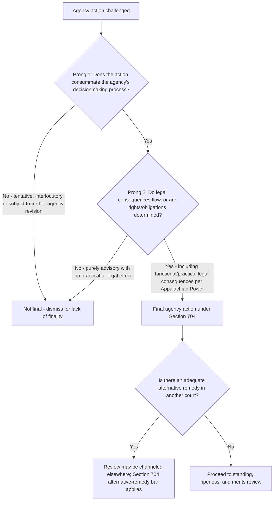

## The Final Agency Action Requirement and *Bennett v. Spear*

### Overview

The finality requirement, codified in 5 U.S.C. § 704, limits judicial review under the APA to "final agency action for which there is no other adequate remedy in a court." It operates as a distinct threshold from the presumption of reviewability and the § 701(a) exceptions: even where an action is reviewable in principle and not committed to agency discretion, a court still lacks a proper subject for review until the agency's decisionmaking process has reached a definitive endpoint. *Bennett v. Spear*, 520 U.S. 154 (1997), supplies the modern two-part test for finality and is a foundational environmental-law case because it arose from a challenge to an Endangered Species Act biological opinion.

### Statutory Basis

**5 U.S.C. § 704** limits reviewable agency action to:

1. Action "made reviewable by statute," or
2. "Final agency action for which there is no other adequate remedy in a court."

This provision does two things simultaneously: it defines finality as a prerequisite to review, and it incorporates an **adequate-remedy** limitation that operates similarly to exhaustion principles (addressed further in *Darby v. Cisneros*, 509 U.S. 137 (1993), which held that § 704 itself displaces judicially-imposed exhaustion requirements except where a statute or agency rule specifically mandates exhaustion as a prerequisite to judicial review).

### The Two-Part *Bennett v. Spear* Test

*Bennett v. Spear*, 520 U.S. 154, 177–78 (1997), synthesizing earlier case law (notably *Franklin v. Massachusetts*, 505 U.S. 788 (1992), and *Port of Boston Marine Terminal Ass'n v. Rederiaktiebolaget Transatlantic*, 400 U.S. 62 (1970)), articulates a two-part test for finality:

**Prong 1 — Consummation of the decisionmaking process**

The action must mark the "consummation" of the agency's decisionmaking process — it must not be of a merely "tentative or interlocutory nature." Preliminary, procedural, or intermediate agency steps generally do not satisfy this prong, since the agency retains the ability to revisit or alter its position before a final determination issues.

**Prong 2 — Legal consequences / rights and obligations determined**

The action must be one "by which rights or obligations have been determined, or from which legal consequences will flow." An action with purely precatory, advisory, or non-binding effect — even if it is the agency's last word on the subject — does not satisfy this prong unless it has some operative legal effect on the parties.

Both prongs must be satisfied; an action that is the agency's last word (satisfying prong one) but carries no legal consequences (failing prong two) is not final, and vice versa.

### Facts and Holding of *Bennett v. Spear*

- The U.S. Fish and Wildlife Service issued a **biological opinion (BiOp)** under ESA § 7 concerning the operation of Klamath Reclamation Project reservoirs, concluding that the proposed water levels would jeopardize two endangered sucker fish species, and recommending minimum water levels as a "reasonable and prudent alternative" (RPA) to avoid jeopardy.
- Irrigation districts and ranchers relying on the reservoir water challenged the BiOp, arguing it improperly restricted water available for their use, and challenged the science underlying the jeopardy determination.
- The government argued the BiOp was not "final agency action" because it was merely advisory to the action agency (the Bureau of Reclamation), which retained formal authority to decide how to operate the project.
- The Supreme Court unanimously held the BiOp **was** final agency action:
  - **Prong 1 (consummation)**: The BiOp represented the Fish and Wildlife Service's definitive position on the project's biological impact; nothing indicated it was tentative or subject to further agency reconsideration as issued.
  - **Prong 2 (legal consequences)**: Although formally advisory, the BiOp had powerful practical and legal effects — it triggered ESA's "incidental take" statement mechanism, and as a practical matter, an action agency proceeding in contravention of the BiOp exposes itself to a heightened risk of ESA liability and loses the "safe harbor" the incidental take statement affords. The Court found these downstream legal consequences sufficient, treating the BiOp as functionally binding despite the government's characterization.

### Additional Significance of *Bennett v. Spear*: The Zone-of-Interests Ruling

*Bennett v. Spear* is also a leading standing case, decided the same term, addressing whether ranchers and irrigation districts — regulated parties seeking *less* environmental protection — fell within the ESA's zone of interests for citizen-suit standing, even though the ESA's primary purpose is species protection.

- The Court held that ESA's citizen-suit provision's "any person" language reflects an unusually broad congressional grant of standing, not limited to parties advancing the environmental purpose of the statute, and that the zone-of-interests test under the citizen-suit provision was satisfied even by parties whose interests ran counter to the statute's conservation purpose.
- This is frequently taught alongside the finality holding but is analytically distinct — it is a standing/cause-of-action question, not a finality question — and it illustrates how a single case can resolve multiple justiciability doctrines.

### Applying the Test: Distinguishing Final From Non-Final Action

| Type of Action | Typically Final? | Rationale |
| --- | --- | --- |
| Final rule after notice-and-comment | Yes | Consummates rulemaking; legal consequences (compliance obligations) attach |
| Proposed rule (NPRM) | No | Merely proposes; agency retains full discretion to revise or withdraw |
| Biological opinion under ESA § 7 | Yes (*Bennett v. Spear*) | Definitive position with practical/legal consequences via incidental take mechanism |
| Interpretive guidance/policy statement | Case-by-case | Final if it has binding, non-discretionary effect in practice regardless of label; non-final if genuinely non-binding and agency retains case-by-case discretion |
| Warning letter/notice of violation | Generally not final on its own | Often a preliminary step before formal enforcement, absent independent legal consequences |
| Denial of a permit application | Yes | Consummates the permitting decision and determines the applicant's legal position |
| Draft environmental impact statement (EIS) | No | Interim NEPA document; final EIS or Record of Decision (ROD) is the consummating action |
| Record of Decision (ROD) under NEPA | Yes | Marks the agency's final decision on the proposed action following the NEPA process |

### The "Legal Consequences" Prong in Practice: Beyond Formal Bindingness

Post-*Bennett*, courts have applied the legal-consequences prong flexibly, looking past an agency's own characterization of a document (e.g., calling something "guidance" or "non-binding") to its actual practical and legal effect:

- *Appalachian Power Co. v. EPA*, 208 F.3d 1015 (D.C. Cir. 2000) — EPA guidance document treated as final agency action because it functioned, in practice, as a binding norm that regulated parties would be required to follow, despite EPA's characterization of it as merely interpretive.
- This "functional" approach prevents agencies from evading review by labeling substantively binding pronouncements as informal guidance — a recurring issue in environmental regulation, where agencies frequently issue guidance documents, memoranda, and policy statements that have significant practical effect on regulated parties without going through notice-and-comment rulemaking.

### Structural Analysis Framework

### Interaction With Ripeness and Exhaustion

Finality overlaps conceptually with ripeness (from *Abbott Laboratories v. Gardner*, 387 U.S. 136 (1967)) but the two doctrines are formally distinct:

- **Finality** asks whether *this particular action* is the kind of consummated, legally consequential decision Congress and the APA intended to make reviewable.
- **Ripeness** asks whether the *dispute as a whole* is suf­ficiently developed for judicial resolution and whether withholding review would impose hardship — it can be relevant even to already-final actions (e.g., a final rule might be final but a pre-enforcement challenge to it might still raise ripeness concerns about hardship and fitness for review).
- **Exhaustion**, post-*Darby v. Cisneros*, is generally not required beyond what § 704 itself demands (i.e., that no adequate alternative remedy exists), except where a statute or agency rule specifically requires exhaustion as a mandatory prerequisite to judicial review.

### Application in Environmental Law

- **NEPA practice**: Challenges to environmental review are properly directed at the final EIS or Record of Decision, not draft EISs or scoping documents, absent unusual circumstances showing the earlier document itself had independent legal consequences.
- **ESA biological opinions**: Following *Bennett*, BiOps are routinely treated as final agency action reviewable under the APA, a holding of major practical significance because BiOps are frequently the primary vehicle through which species-protection measures are imposed on federal projects.
- **Permitting decisions**: Clean Water Act § 404 permit denials/issuances, Clean Air Act Title V permit decisions, and similar permitting actions are treated as final once the agency has completed its permitting process, though intermediate steps (draft permits, notices of intent) are not.
- **Guidance documents on emissions standards, enforcement priorities, or compliance methodologies**: Frequently contested under the *Appalachian Power* functional approach, since EPA has at times used guidance documents to establish standards with practical binding effect on regulated industry without notice-and-comment rulemaking.

### Practical Example

An environmental organization seeks to challenge an EPA "interim final guidance" document that sets numeric thresholds agencies will use in evaluating whether a discharge permit application triggers additional review.

1. EPA argues the guidance is not final agency action because it is labeled "interim" and merely assists internal agency deliberation, retaining full discretion to depart from the thresholds case-by-case.
2. The court examines whether, in practice, permitting staff treat the thresholds as binding — do permit reviewers cite the guidance as dispositive, and do regulated parties face de facto mandatory compliance with the thresholds to avoid permit denial or delay?
3. If the evidence shows the guidance functions as a binding norm applied without case-by-case discretion (per *Appalachian Power*), the court is likely to find both *Bennett* prongs satisfied — consummation (the guidance was issued as EPA's operative position, not a mere draft) and legal consequences (permit applicants face concrete practical consequences from non-compliance) — despite EPA's "interim" and "guidance" labeling.

### Key Case Summary Table

| Case | Holding | Relevance |
| --- | --- | --- |
| *Bennett v. Spear* (1997) | Two-part finality test; ESA BiOp is final agency action; broad zone-of-interests under ESA citizen-suit provision | Central modern finality case; environmental-law origin |
| *Franklin v. Massachusetts* (1992) | Presidential apportionment decision not final because subject to further presidential action | Predecessor case refined by *Bennett* |
| *Darby v. Cisneros* (1993) | § 704 displaces judicial exhaustion doctrine except where statute/rule mandates it | Clarifies relationship between finality and exhaustion |
| *Appalachian Power Co. v. EPA* (2000) | Guidance document treated as final where it functions as binding norm in practice | Functional approach to the legal-consequences prong |

### Practice Pointers

- When challenging agency guidance, memoranda, or policy statements, marshal evidence of their *practical* binding effect (compliance rates, enforcement reliance, absence of case-by-case discretion) rather than relying solely on the document's formal label, per *Appalachian Power*.
- When defending against a finality challenge to a document the agency considers non-binding, emphasize any genuine case-by-case discretion retained by agency staff and the absence of concrete legal consequences for non-compliance.
- In ESA practice, treat biological opinions as presumptively final and reviewable under *Bennett*, but confirm the specific procedural posture (e.g., whether a jeopardy finding or reasonable-and-prudent-alternative determination has actually issued, as opposed to informal consultation still in progress).
- In NEPA litigation, target the Record of Decision or final EIS; challenges to draft NEPA documents risk dismissal for lack of finality absent a showing of independent legal consequence.

### Related Topics

- The presumption of judicial reviewability under the APA
- Ripeness doctrine and the *Abbott Laboratories* fitness/hardship framework
- Exhaustion of administrative remedies after *Darby v. Cisneros*
- Zone-of-interests standing analysis under *Bennett v. Spear* and *Lexmark*
- ESA § 7 consultation process and biological opinions
- NEPA's Record of Decision and the environmental review timeline
- Guidance documents, interpretive rules, and the *Appalachian Power* functional finality test
- Standing doctrine in environmental citizen suits