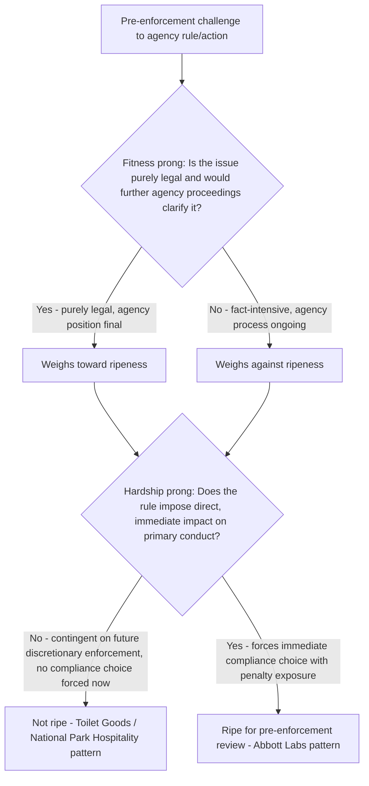

## Ripeness and the *Abbott Laboratories* Framework

### Overview

Ripeness is a justiciability doctrine addressing whether a dispute has matured to the point that judicial resolution is appropriate. It operates alongside, but analytically distinct from, standing, finality, and the presumption of reviewability: even a plaintiff with standing challenging final agency action may face a ripeness problem if the controversy is premature — dependent on contingent future events, insufficiently developed factually, or one where withholding review imposes no meaningful hardship. *Abbott Laboratories v. Gardner*, 387 U.S. 136 (1967), together with its companion cases decided the same day, supplies the modern two-part framework still applied today, though subsequent decisions (notably *National Park Hospitality Ass'n v. Department of Interior*, 538 U.S. 803 (2003)) have narrowed its practical reach.

### Constitutional and Prudential Dimensions

Ripeness has both:

- **A constitutional component**, rooted in Article III's case-or-controversy requirement — a dispute resting on speculative or contingent future events may not present an actual controversy at all.
- **A prudential component**, reflecting judicial policy against deciding issues prematurely, respecting agency processes, and avoiding unnecessary constitutional or statutory rulings.

Where a ripeness problem is purely prudential rather than constitutional, some post-*Abbott Labs* case law (see *MedImmune, Inc. v. Genentech, Inc.*, 549 U.S. 118 (2007), in the declaratory judgment context, and academic commentary questioning "prudential" limits on jurisdiction more broadly) has cast doubt on whether federal courts may decline jurisdiction on purely prudential ripeness grounds once Article III's minimum is satisfied. [Inference: the continuing vitality of a freestanding "prudential ripeness" doctrine independent of constitutional ripeness and statutory finality requirements is somewhat unsettled post-*MedImmune*, and courts and commentators disagree on its scope, so the two-part *Abbott Labs* test is best understood today as operating primarily through the § 704 finality requirement and constitutional case-or-controversy limits rather than as a freestanding judge-made abstention doctrine.]

### The *Abbott Laboratories* Two-Part Test

**Facts**: Drug manufacturers challenged an FDA regulation requiring the generic name of a drug to appear each time the brand name was used in labeling and advertising, before any enforcement action had been taken against any manufacturer. The government argued the case was not ripe because no enforcement proceeding had occurred.

**Holding**: The Supreme Court held the case was ripe for pre-enforcement review, establishing a two-part balancing test:

**Part 1 — Fitness of the issues for judicial decision**

- Is the question presented a purely legal one, not requiring further factual development?
- Is the challenged action final (in the *Bennett v. Spear* sense) rather than tentative?
- Would further agency proceedings clarify or change the legal question presented, counseling for delay?
- Pure legal/facial challenges to a regulation are generally more fit for immediate review than as-applied challenges requiring specific factual context.

**Part 2 — Hardship to the parties of withholding court consideration**

- Does the regulation impose a direct and immediate impact on the plaintiff's primary conduct, forcing a choice between costly compliance and risking enforcement penalties?
- In *Abbott Labs* itself, the Court found substantial hardship: manufacturers faced a choice between incurring significant compliance costs (reprinting all labels) or risking serious criminal and civil penalties for noncompliance, with no practical way to test the regulation's validity except by violating it.

The Court balances these two factors; a case with strong "fitness" but weak "hardship" (or vice versa) may or may not be found ripe depending on the overall balance, though pure legal questions with genuine hardship (the classic *Abbott Labs* fact pattern) are the clearest cases for pre-enforcement review.

### The Companion Cases: Contrast in Application

Decided the same day as *Abbott Labs*, two companion cases illustrate the framework's limits:

- ***Toilet Goods Ass'n v. Gardner*, 387 U.S. 158 (1967)** — A regulation authorizing FDA to suspend certification services for a company that refused to allow inspection of its facilities was held **not** ripe for pre-enforcement review. The Court reasoned the regulation's impact was contingent on future events (an actual refusal to permit inspection, followed by an actual suspension), and that concrete facts arising from an actual enforcement dispute would aid judicial review — the hardship prong was weak because the plaintiffs faced no immediate, direct impact on ongoing conduct simply from the regulation's existence.
- ***Gardner v. Toilet Goods Ass'n*, 387 U.S. 167 (1967)** — Similarly found a related labeling regulation ripe, reinforcing that outcomes turn on the specific character of the regulation and its concrete impact, not a categorical rule about pre-enforcement review generally.

The lesson from the trilogy: ripeness for pre-enforcement review depends heavily on (1) whether the challenge is purely legal versus fact-dependent, and (2) whether the regulation has an immediate, coercive effect on regulated parties' primary conduct, as opposed to imposing consequences only through some future, contingent enforcement action.

### Narrowing Since *Abbott Labs*: *National Park Hospitality Ass'n*

*National Park Hospitality Ass'n v. Department of Interior*, 538 U.S. 803 (2003), reaffirmed but arguably narrowed practical application of the *Abbott Labs* framework:

- Concessioners challenged an NPS regulation interpreting the Concessions Policy Act as not incorporating certain Contract Disputes Act provisions into concession contracts.
- The Court found the case unripe: the regulation was "purely legal" (satisfying part of the fitness prong) but the hardship prong failed because the regulation did not require the plaintiffs to change their primary conduct — it merely stated an interpretive position that would matter only if and when a specific contract dispute arose.
- This illustrates that "purely legal question" fitness alone is insufficient without a genuine, concrete hardship — reinforcing that both prongs must be meaningfully satisfied, not merely that a court will accept a weak showing on one prong if the other is very strong. [Inference: courts differ in how strictly they require both prongs to be independently substantial versus balancing them holistically; the exact weighting is not perfectly uniform across circuits.]

### Structural Analysis Framework

### Application in Environmental Law

Ripeness is a recurring battleground in environmental litigation, particularly for pre-enforcement challenges to rules, permits, and agency guidance:

- **Facial challenges to environmental regulations** — a regulated industry group challenging a newly promulgated emissions rule before any enforcement action typically satisfies *Abbott Labs*: the legal question (statutory authority, procedural validity) is often purely legal, and the hardship is concrete (immediate compliance costs, retrofit expenditures, permitting obligations that must begin before any enforcement occurs).
- **Wetland jurisdictional determinations** — *Sackett v. EPA*, 566 U.S. 120 (2012), while framed primarily as a preclusion case, also implicated ripeness-adjacent reasoning: the Court emphasized that compliance orders had immediate coercive effect (accruing penalties, practical inability to obtain financing or proceed with development while under threat of enforcement) — a hardship analysis closely paralleling *Abbott Labs*.
- **Permitting and NEPA challenges** — challenges to preliminary or draft agency documents (draft EISs, preliminary jurisdictional determinations) are frequently found unripe because further agency process (final EIS, final permit decision) may alter or moot the specific legal question, and no immediate compliance obligation attaches to the draft document itself.
- **Climate and endangerment findings** — challenges to broad regulatory findings (e.g., an endangerment finding preceding specific emission standards) can raise ripeness questions about whether the finding itself, absent an implementing rule imposing concrete obligations, presents sufficient hardship for immediate review.

### Practical Example

A group of power plant operators challenges an EPA rule setting new emissions monitoring and reporting requirements, before EPA has taken any enforcement action against any specific facility.

1. **Fitness**: The operators argue the rule exceeds EPA's statutory authority — a purely legal question of statutory interpretation not requiring further factual development, and EPA's position (the final rule) is not tentative.
2. **Hardship**: The rule requires operators to install new monitoring equipment and submit reports according to a compliance schedule beginning within months, exposing operators to civil penalties for noncompliance and requiring substantial capital expenditure regardless of whether any individual facility is ever the subject of an enforcement action.
3. Applying *Abbott Labs*, the case is likely ripe: the legal question is fit for resolution without awaiting a specific enforcement dispute, and the operators face genuine, immediate hardship from compliance costs and penalty exposure that cannot practically be avoided by simply waiting for an enforcement action to test the rule's validity.

Contrast this with a challenge to an EPA internal enforcement-priority memo indicating which types of facilities EPA intends to inspect first: absent any obligation immediately altering the operators' conduct, this would likely fail the hardship prong under the *Toilet Goods*/*National Park Hospitality* line, since impact depends on the contingent, discretionary decision to actually select a given facility for inspection.

### Key Case Summary Table

| Case | Holding | Doctrinal Contribution |
| --- | --- | --- |
| *Abbott Laboratories v. Gardner* (1967) | Pre-enforcement challenge ripe; establishes fitness/hardship two-part test | Foundational ripeness framework |
| *Toilet Goods Ass'n v. Gardner* (1967) | Contingent enforcement regulation not ripe | Illustrates weak-hardship pre-enforcement claims |
| *National Park Hospitality Ass'n v. Dep't of Interior* (2003) | Purely legal interpretive rule with no immediate compliance impact not ripe | Narrows practical scope; requires genuine hardship even for legal questions |
| *Sackett v. EPA* (2012) | Emphasizes immediate coercive/practical effect of compliance orders | Environmental-law reinforcement of the hardship rationale |

### Practice Pointers

- When seeking pre-enforcement review, marshal concrete evidence of hardship: specific compliance costs already being incurred, specific penalty exposure, and inability to obtain the practical benefits of a delay-and-defend strategy (financing contingent on regulatory compliance, contractual obligations triggered by the rule, etc.) — post-*National Park Hospitality*, a purely legal question alone is not enough.
- When defending against a pre-enforcement challenge, argue that further agency process could clarify or moot the legal question, and that the plaintiff faces no immediate obligation to alter conduct absent a specific, non-hypothetical enforcement decision.
- Distinguish ripeness from finality in briefing: even where an action is unquestionably final under *Bennett v. Spear*, a separate ripeness objection can still be raised if the controversy remains contingent or underdeveloped — the two doctrines address different questions and should not be conflated.
- In environmental practice, frame challenges to substantive, self-executing rules (with independent compliance deadlines and penalty exposure) as the strongest *Abbott Labs* candidates, and be cautious challenging preliminary or interpretive documents that leave a genuine gap before any concrete obligation attaches.

### Related Topics

- The presumption of judicial reviewability under the APA
- The final agency action requirement and *Bennett v. Spear*
- Standing doctrine and the *Lujan* injury-in-fact framework
- Pre-enforcement review of compliance orders: *Sackett v. EPA*
- Facial versus as-applied challenges to agency regulations
- Exhaustion of administrative remedies after *Darby v. Cisneros*
- Declaratory judgment jurisdiction and *MedImmune v. Genentech*
- Mootness doctrine as the temporal counterpart to ripeness