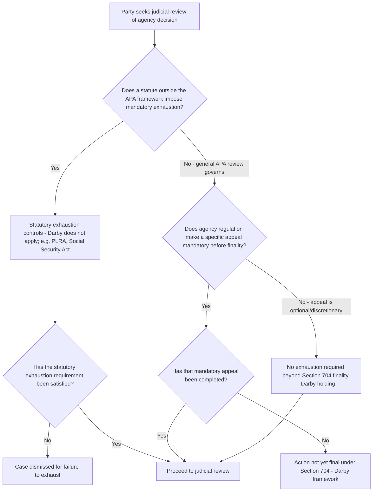

## Exhaustion of Administrative Remedies

### Overview

Exhaustion of administrative remedies requires a party to pursue and complete available agency-level procedures — appeals, reconsideration requests, administrative hearings — before seeking judicial review. Historically a judicially-created prudential doctrine, its scope was substantially narrowed by *Darby v. Cisneros*, 509 U.S. 137 (1993), which held that 5 U.S.C. § 704 displaces freestanding judicial exhaustion requirements in APA cases except where a statute or agency rule specifically mandates exhaustion as a prerequisite to review. Exhaustion remains independently significant, however, wherever Congress has imposed a statutory exhaustion requirement outside the general APA framework — a pattern common in environmental, labor, and benefits statutes.

### Historical Common-Law Doctrine

Before *Darby*, federal courts applied a judicially-developed exhaustion doctrine grounded in several policy rationales:

- **Agency autonomy** — allowing agencies to correct their own errors before judicial intervention.
- **Efficiency** — developing a full factual and legal record at the agency level, potentially avoiding the need for judicial review altogether if the agency grants relief.
- **Respect for congressionally designed administrative processes** — particularly where Congress created specialized adjudicatory bodies with technical expertise.

The leading pre-*Darby* case, *McKart v. United States*, 395 U.S. 185 (1969), balanced these interests against the burden exhaustion imposes on individual litigants, particularly where the question presented was purely legal or where pursuing further administrative process would be futile.

### *Darby v. Cisneros*: The Modern Framework

**Facts**: HUD debarred a developer from participating in federal housing programs following an administrative law judge's finding of wrongdoing. The developer sought judicial review without first pursuing a discretionary administrative appeal to the HUD Secretary, and HUD's own regulations did not require exhausting that discretionary appeal before the ALJ's decision became "final."

**Holding**: The Supreme Court held that **where the APA governs**, courts may not impose a judicially-created exhaustion requirement beyond what 5 U.S.C. § 704 itself requires. The Court reasoned:

- Section 704 specifies which agency actions are "final agency action for which there is no other adequate remedy in a court," and Congress's specification of this standard for finality was intended to be the exclusive framework — a court-made exhaustion doctrine layered on top would improperly add requirements Congress did not include.
- If an agency's own regulations do not mandate an appeal as a prerequisite to finality, and no statute independently requires exhaustion, a litigant need not pursue optional or discretionary administrative appeals before seeking judicial review, so long as the underlying action is otherwise "final" under § 704.
- This significantly narrowed the pre-*Darby* practice of courts imposing exhaustion as a freestanding prudential requirement in APA cases.

**Scope of *Darby*'s holding**: it applies specifically to cases proceeding under the APA's general judicial review provisions. It does **not** displace exhaustion requirements that Congress has imposed by statute independent of the APA, nor does it prevent an agency from making exhaustion of a specific appeal mandatory by regulation (in which case that appeal becomes a component of the § 704 finality analysis itself, since the action would not yet be "final" until the mandatory appeal is exhausted).

### Statutory Exhaustion Requirements Outside *Darby*'s Reach

Many statutes impose exhaustion requirements directly, and these survive *Darby* because they are not merely judicially-created prudential rules but explicit congressional commands:

- **Prison Litigation Reform Act**, 42 U.S.C. § 1997e(a) — requires exhaustion of prison administrative grievance procedures before filing suit, strictly construed by the Supreme Court in *Woodford v. Ngo*, 548 U.S. 81 (2006), and *Ross v. Blake*, 578 U.S. 632 (2016) (recognizing only a narrow "unavailability" exception).
- **Social Security Act** — requires exhaustion of the agency's multi-step administrative review process before judicial review under 42 U.S.C. § 405(g), addressed in *Weinberger v. Salfi*, 422 U.S. 749 (1975), and *Mathews v. Eldridge*, 424 U.S. 319 (1976) (recognizing a narrow exception for certain constitutional claims collateral to the benefits determination).
- **Federal labor and civil rights statutes** — Title VII requires exhaustion of EEOC administrative processes before filing suit.
- **Environmental statutes with specific administrative appeal requirements** — several environmental programs require exhaustion of internal agency appeals boards before judicial review is available (discussed further below).

### Exhaustion in Environmental Law

Environmental statutes present a mixed picture, since Congress has sometimes built mandatory administrative appeal processes into specific programs while leaving others to the general *Darby* framework:

- **Surface Mining Control and Reclamation Act (SMCRA)** and certain Interior Department programs route challenges through the **Interior Board of Land Appeals (IBLA)** or similar internal appellate bodies before judicial review, where agency regulations expressly make such appeal a prerequisite to "final agency action."
- **EPA's Environmental Appeals Board (EAB)** — for many EPA permitting decisions (e.g., certain Clean Air Act PSD/Title V permits, RCRA permits), EPA's own regulations require exhaustion of EAB review before a permit decision becomes "final agency action" subject to judicial review; because this exhaustion requirement is embedded in the regulatory finality definition itself (rather than being a freestanding judicial gloss), it survives *Darby* — a party who fails to pursue EAB review generally cannot establish that final agency action exists at all.
- **National Forest Management Act and Forest Service administrative appeals** — historically required exhaustion of Forest Service internal appeals processes for certain project-level decisions, subject to statutory and regulatory changes over time regarding which projects require an appeals process versis "objection" processes (post-2012 Forest Service planning rule changes). [Inference: the precise current scope of mandatory pre-decisional objection versus post-decisional appeal processes under Forest Service regulations has been revised multiple times and may continue to evolve, so practitioners should verify the currently applicable regulatory framework for the specific project type at issue.]
- **Citizen-suit provisions with notice requirements** — CAA § 304(b), CWA § 505(b), and RCRA § 7002(b) require plaintiffs to provide 60-day (or in some RCRA imminent-hazard contexts, shorter) advance notice to the alleged violator, the state, and EPA before filing suit. This is not "exhaustion" in the classic agency-appeal sense but functions similarly as a statutory precondition to suit, giving the agency and violator an opportunity to address the violation before litigation — courts have strictly enforced these notice requirements as jurisdictional or claims-processing prerequisites (*Hallstrom v. Tillamook County*, 493 U.S. 20 (1989), holding the CWA's parallel 60-day notice requirement is a mandatory precondition that cannot be excused even where diligent prosecution would otherwise be futile).

### Distinguishing Exhaustion From Related Doctrines

| Doctrine | Core Question | Key Authority |
| --- | --- | --- |
| Exhaustion | Has the party completed available/required agency procedures? | *Darby v. Cisneros* |
| Finality | Has the agency reached a consummated, legally consequential decision? | *Bennett v. Spear* |
| Ripeness | Is the dispute sufficiently developed and would delay impose hardship? | *Abbott Laboratories* |
| Citizen-suit notice requirements | Has statutorily-mandated pre-suit notice been given? | *Hallstrom v. Tillamook County* |

These doctrines frequently overlap in practice — a mandatory administrative appeal that must be exhausted before an action becomes "final" blends exhaustion and finality analysis into a single question, as *Darby* itself illustrates.

### Structural Analysis Framework

### Practical Example

An operator receives an adverse permit decision from EPA's regional office regarding Clean Air Act Title V permit conditions. EPA's regulations provide for discretionary review by the Environmental Appeals Board upon petition, and further specify that the regional decision does not become "final agency action" for judicial review purposes until the EAB has acted on a timely petition (or the time to petition has expired).

1. The operator seeks immediate judicial review in the court of appeals without petitioning the EAB.
2. EPA moves to dismiss, arguing the regional decision is not yet "final agency action" because EPA's own regulations make EAB review a prerequisite to finality — this is not a freestanding judicial exhaustion requirement of the kind *Darby* eliminated, but rather part of the regulatory definition of when the agency's decisionmaking process is "consummated" under *Bennett v. Spear*'s first prong.
3. Because the exhaustion requirement here is built into the regulatory finality definition (not judicially imposed), *Darby*'s holding does not assist the operator — the case would likely be dismissed for lack of final agency action until EAB review is completed or waived through the regulatory process.

Contrast this with a hypothetical agency program where an appeal to a higher agency official is available but the agency's own rules do not make it a prerequisite to the underlying decision's finality: under *Darby*, the litigant could seek judicial review immediately without exhausting that optional appeal.

### Key Case Summary Table

| Case | Holding | Doctrinal Contribution |
| --- | --- | --- |
| *McKart v. United States* (1969) | Balances exhaustion policy rationales against burdens on litigants | Pre-*Darby* common-law framework |
| *Darby v. Cisneros* (1993) | § 704 displaces judicial exhaustion doctrine in APA cases absent statutory/regulatory mandate | Central modern exhaustion case |
| *Weinberger v. Salfi* (1975) / *Mathews v. Eldridge* (1976) | Social Security Act exhaustion requirement, with narrow exception for collateral constitutional claims | Statutory exhaustion outside *Darby*'s reach |
| *Woodford v. Ngo* (2006) / *Ross v. Blake* (2016) | PLRA exhaustion strictly enforced; narrow "unavailability" exception only | Modern strict statutory exhaustion approach |
| *Hallstrom v. Tillamook County* (1989) | CWA 60-day citizen-suit notice is a mandatory precondition, not excusable for futility | Environmental-law analog to exhaustion |

### Practice Pointers

- Before assuming *Darby* eliminates an exhaustion obstacle, check whether the specific agency's regulations make the relevant appeal a prerequisite to "final agency action" — if so, the requirement functions as part of the finality analysis and survives *Darby* regardless of its prudential origins.
- Separately check whether an independent statute (outside the general APA framework) imposes its own exhaustion mandate, since *Darby*'s holding is expressly limited to displacing judicially-created exhaustion under the APA's general review provisions.
- In citizen-suit practice under environmental statutes, treat the 60-day notice requirement as a strict jurisdictional-style precondition per *Hallstrom* — courts have generally not recognized futility or other equitable exceptions to excuse noncompliance.
- When litigating before EPA's Environmental Appeals Board or similar bodies (IBLA, etc.), confirm current procedural deadlines and rules carefully, since failure to timely petition for such review can foreclose judicial review entirely by preventing "final agency action" from ever arising.

### Related Topics

- The final agency action requirement and *Bennett v. Spear*
- Ripeness and the *Abbott Laboratories* framework
- Citizen-suit notice requirements under CAA, CWA, and RCRA
- EPA's Environmental Appeals Board and administrative permit review
- The presumption of judicial reviewability under the APA
- Waiver and forfeiture of arguments not raised at the administrative level
- Primary jurisdiction doctrine as a related deferral principle