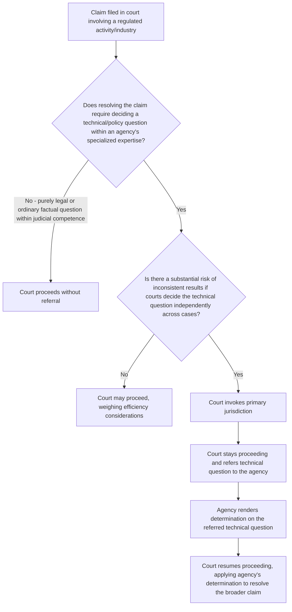

## The Primary Jurisdiction Doctrine

### Overview

Primary jurisdiction is a common-law doctrine of judicial deference that determines the proper sequencing between courts and administrative agencies when a claim within a court's jurisdiction also raises issues within an agency's specialized regulatory competence. Unlike exhaustion (which addresses whether a party must complete an *existing* administrative proceeding before going to court) and unlike subject-matter jurisdiction (which asks whether a court has power to hear a case at all), primary jurisdiction addresses situations where a court *has* jurisdiction over the claim but chooses to stay or dismiss the case so that an agency can first resolve a technical or policy question within its specialized expertise, often in a matter where no administrative proceeding was previously pending.

### Origins and Rationale

**Foundational case: *Texas & Pacific Railway Co. v. Abilene Cotton Oil Co.*, 204 U.S. 426 (1907)** — held that a shipper's common-law claim for unreasonable freight rates first required a determination by the Interstate Commerce Commission of what constituted a "reasonable" rate under the governing statute, since the ICC's specialized ratemaking expertise and its function of achieving uniformity across the regulated industry would be undermined if courts could reach inconsistent conclusions about rate reasonableness in individual private suits.

The doctrine rests on two overlapping policy rationales, refined in later cases including *United States v. Western Pacific Railroad Co.*, 352 U.S. 59 (1956):

1. **Agency expertise** — courts benefit from an agency's specialized technical knowledge on questions requiring scientific, economic, or industry-specific judgment beyond ordinary judicial competence.
2. **Uniformity** — where a regulatory scheme depends on consistent, nationwide application of technical standards, allowing courts to resolve such questions independently risks inconsistent results across jurisdictions that would undermine the regulatory scheme's coherence.

### The Multi-Factor Test

Courts applying primary jurisdiction generally weigh:

- Whether the question at issue involves technical or policy considerations within the agency's particular field of expertise.
- Whether the question is particularly within the agency's discretion.
- Whether there exists a substantial danger of inconsistent rulings if courts and the agency address the same issue independently.
- Whether a prior application to the agency has been made.
- Whether referral would materially aid the court's disposition of the case, weighed against the delay and cost referral imposes on the parties.

There is no rigid formula; the doctrine is applied flexibly and its invocation is committed substantially to the discretion of the trial court. [Inference: courts and commentators describe the doctrine as notoriously imprecise in application, and outcomes can vary significantly based on the specific regulatory context and the court's assessment of the practical benefits of referral versus the costs of delay.]

### Doctrine's Effect: Referral, Not Dismissal for Lack of Jurisdiction

A key structural feature: primary jurisdiction does **not** deprive the court of jurisdiction over the claim. Rather, the court:

- Retains jurisdiction over the case.
- Stays the judicial proceeding (or in some cases dismisses without prejudice) while referring the specific technical question to the relevant agency.
- Resumes the litigation once the agency has rendered its determination on the referred question, typically treating the agency's resolution of the technical issue as controlling or highly persuasive for that discrete question, while retaining ultimate authority to resolve the litigation.

This distinguishes primary jurisdiction from a jurisdictional bar or true preclusion — it is fundamentally a doctrine of sequencing and comity between coordinate decisionmakers, not a limitation on judicial power.

### Distinguishing Primary Jurisdiction From Exhaustion

| Feature | Exhaustion | Primary Jurisdiction |
| --- | --- | --- |
| Typical procedural posture | Plaintiff seeks review of an agency action already in progress or completed | Plaintiff files an original claim in court (often a private cause of action) that happens to implicate an agency-regulated question |
| Whether agency proceeding is already underway | Usually yes — exhaustion presumes an existing administrative process | Often no — the agency may not yet be involved at all until the court refers the issue |
| Effect of doctrine | Bars judicial review until administrative process is completed | Court retains jurisdiction, stays case, refers a discrete issue to agency, then resumes |
| Governing modern framework | *Darby v. Cisneros* (largely statutory since 1993) | Common-law doctrine, largely unaffected by *Darby* |

Primary jurisdiction and exhaustion can appear similar in effect (both delay judicial resolution pending agency involvement) but arise from different procedural postures and serve somewhat different purposes — primary jurisdiction is triggered by the *substantive overlap* between a court's case and an agency's specialized domain, not by an unfinished administrative process the plaintiff was already required to pursue.

### Structural Analysis Framework

### Application in Environmental Law

Primary jurisdiction arises in environmental contexts particularly where common-law tort claims (nuisance, trespass, negligence) overlap with a comprehensive federal or state regulatory scheme governing the same conduct:

- **Common-law nuisance suits against regulated polluters** — where a plaintiff brings a state common-law nuisance claim alleging harm from emissions or discharges that are also subject to a federal permit (e.g., a Clean Air Act Title V permit or Clean Water Act NPDES permit), courts have sometimes considered whether determining what constitutes "unreasonable" pollution levels should await or defer to the agency's technical permitting determinations, though the Supreme Court's climate-nuisance decisions (*American Electric Power Co. v. Connecticut*, 564 U.S. 410 (2011)) have more often resolved such overlaps through **displacement/preemption** analysis rather than primary jurisdiction referral, holding that the Clean Air Act displaces federal common-law nuisance claims for greenhouse gas emissions because Congress delegated the issue to EPA.
- **Technical standard-setting overlaps** — where private litigation would require a court to determine, as a predicate matter, a technical standard an agency has authority to set (e.g., what constitutes a "significant" discharge under a complex regulatory formula), primary jurisdiction principles support staying the litigation while the agency addresses the technical question through its own processes, particularly where the agency has an active rulemaking or adjudicatory proceeding that would resolve the same issue.
- **State public utility and environmental rate/cost-recovery disputes** — matters requiring specialized ratemaking or cost-allocation expertise (e.g., allocating environmental compliance costs among utility ratepayers) are frequently referred to state public utility commissions under primary jurisdiction principles before courts resolve related contract or tort claims.

### Practical Example

A group of downstream landowners sues an industrial facility in state court for common-law nuisance, alleging that permitted discharges from the facility (authorized under an NPDES permit) are nonetheless causing property damage because the permit's discharge limits are based on outdated technical assumptions about the receiving water's assimilative capacity.

1. The facility argues the court should refer the technical question — whether current discharge levels exceed the water body's actual assimilative capacity given updated science — to the state environmental agency responsible for setting water quality standards and permit limits, since this is precisely the kind of specialized, technical determination the agency's permitting expertise is designed to address.
2. The court weighs: (a) whether the underlying question is genuinely technical (yes — it requires specialized water-quality modeling expertise), (b) whether resolving it independently risks inconsistent results with the agency's own ongoing permit-renewal process (potentially yes, if the agency is simultaneously reviewing the same permit), and (c) whether referral would meaningfully aid the litigation without imposing undue delay on the landowners' claims.
3. If the court invokes primary jurisdiction, it stays the nuisance action, refers the assimilative-capacity question to the state agency (potentially through the agency's permit modification or renewal process), and resumes the litigation once the agency reaches a determination — using that determination to inform (though not necessarily conclusively resolve) the ultimate nuisance question, since violation of a permit is not always dispositive of common-law nuisance liability. [Inference: the degree to which an agency's technical determination is treated as dispositive versus merely persuasive on the ultimate common-law claim varies by jurisdiction and by the specific relationship between the regulatory scheme and the common-law cause of action.]

### Key Case Summary Table

| Case | Holding | Doctrinal Contribution |
| --- | --- | --- |
| *Texas & Pacific Railway v. Abilene Cotton Oil Co.* (1907) | Rate reasonableness question first required ICC determination | Foundational primary jurisdiction case |
| *United States v. Western Pacific Railroad Co.* (1956) | Refines expertise/uniformity rationales and referral procedure | Clarifies doctrinal purpose and mechanics |
| *American Electric Power Co. v. Connecticut* (2011) | Clean Air Act displaces federal common-law nuisance claims for GHG emissions | Environmental-law resolution of a similar overlap via displacement rather than primary jurisdiction |

### Practice Pointers

- Invoke primary jurisdiction (rather than exhaustion) when the case is an *original* action in court — often a common-law or statutory private claim — that happens to raise a discrete technical question an agency is specially equipped to resolve, particularly where no administrative process was otherwise underway.
- Frame the referral request narrowly: identify the specific technical or policy question requiring agency expertise, rather than seeking wholesale referral of the entire case, since courts are more receptive to targeted referrals that preserve judicial resolution of the ultimate legal claims.
- When opposing a primary jurisdiction referral, emphasize the delay and cost to the parties, the absence of a genuine risk of inconsistent results, and any argument that the question, while touching a regulated industry, is fundamentally a legal or ordinary factual question within conventional judicial competence.
- In environmental common-law tort litigation involving federally permitted conduct, consider whether displacement/preemption doctrine (per *American Electric Power*) may be a more direct defense than primary jurisdiction, particularly for claims implicating a comprehensive federal regulatory scheme like the Clean Air Act's greenhouse gas provisions.

### Related Topics

- Exhaustion of administrative remedies and *Darby v. Cisneros*
- Preemption and displacement of federal common law by comprehensive regulatory schemes
- The final agency action requirement and *Bennett v. Spear*
- Agency expertise and deference doctrines (*Chevron*/*Skidmore* framework)
- Common-law nuisance claims against permitted polluters
- State public utility commission ratemaking and cost-allocation proceedings
- Concurrent state and federal regulatory jurisdiction in environmental law