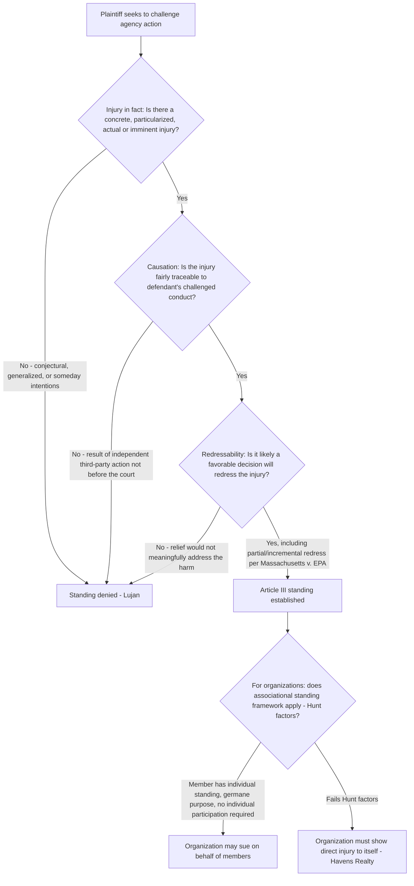

## Constitutional Standing: Injury in Fact, Causation, and Redressability

### Overview

Constitutional standing under Article III limits federal judicial power to actual "Cases" and "Controversies," requiring a plaintiff to demonstrate a concrete personal stake in the litigation's outcome. The modern three-part test — injury in fact, causation, and redressability — was consolidated in *Lujan v. Defenders of Wildlife*, 504 U.S. 555 (1992), which remains the single most important standing case in environmental law because it arose from an ESA citizen suit and because its reasoning has shaped nearly every subsequent environmental standing dispute.

### Statutory and Constitutional Framework

Standing operates on two distinct levels:

- **Constitutional (Article III) standing** — a mandatory, non-waivable jurisdictional requirement derived from the case-or-controversy limitation; courts must satisfy themselves of Article III standing even if unraised by the parties.
- **Statutory/prudential standing (cause of action)** — separately, a plaintiff must fall within the "zone of interests" the relevant statute protects, and post-*Lexmark Int'l, Inc. v. Static Control Components, Inc.*, 572 U.S. 118 (2014), this is now treated as a merits question of whether a cause of action exists, not a jurisdictional standing element.

This entry addresses the constitutional dimension; the zone-of-interests/cause-of-action inquiry is a related but analytically separate doctrine.

### The Three-Part *Lujan* Test

**1. Injury in Fact**

The plaintiff must have suffered "an invasion of a legally protected interest which is (a) concrete and particularized, and (b) actual or imminent, not conjectural or hypothetical." *Lujan*, 504 U.S. at 560.

- **Concrete** — the injury must be real, not abstract, though it need not be tangible (*Spokeo, Inc. v. Robins*, 578 U.S. 330 (2016), holding intangible injuries, including certain informational or procedural injuries, can be concrete if they have a close relationship to harms traditionally recognized at common law or by history and tradition).
- **Particularized** — the injury must affect the plaintiff in a personal and individual way, not merely as an undifferentiated member of the general public (a "generalized grievance" shared identically by all citizens is generally insufficient, per *United States v. Richardson*, 418 U.S. 166 (1974), and subsequent taxpayer/citizen-standing cases).
- **Actual or imminent** — future injury must be "certainly impending" or present a "substantial risk" of occurring, not merely possible or speculative (*Clapper v. Amnesty International USA*, 568 U.S. 398 (2013)).

**2. Causation (Traceability)**

The injury must be "fairly traceable to the challenged action of the defendant, and not the result of the independent action of some third party not before the court." *Lujan*, 504 U.S. at 560, quoting *Simon v. Eastern Kentucky Welfare Rights Organization*, 426 U.S. 26, 41-42 (1976). This does not require the defendant's conduct to be the sole or even primary cause, but there must be a demonstrable causal chain connecting the challenged action to the claimed injury.

**3. Redressability**

It must be "likely, as opposed to merely speculative, that the injury will be redressed by a favorable decision." *Lujan*, 504 U.S. at 561. Even where an injury is real and traceable to the defendant, standing fails if the requested judicial remedy would not actually resolve or alleviate the injury — this becomes particularly complex in multi-party or multi-cause situations, including many environmental cases involving numerous contributing sources.

### *Lujan v. Defenders of Wildlife*: Facts and Application

- Environmental organizations challenged a Department of Interior regulation interpreting ESA § 7 consultation requirements as applying only to actions within the United States and on the high seas, excluding federally funded projects abroad.
- Plaintiffs' members alleged they had previously traveled to observe endangered species in project areas abroad and intended to do so again, and that funded projects might jeopardize those species.
- The Court held plaintiffs lacked standing:
  - **Injury in fact failed**: Vague, unspecified "some day" intentions to return to observe the species, without concrete plans (specific dates or tickets purchased), did not constitute "actual or imminent" injury — this is sometimes called the **"some day" intentions doctrine**, a recurring limitation in environmental standing cases involving future harm to plaintiffs' recreational, aesthetic, or scientific interests in observing wildlife or ecosystems.
  - **Redressability failed** (a plurality/alternative holding): Even if the regulation were invalidated, the funding agencies (not before the court) might still proceed with the projects regardless of ESA consultation outcomes, meaning a favorable decision might not actually prevent the alleged harm to the species.
- The Court also rejected Congress's attempt, through the ESA's broad "any person" citizen-suit provision, to confer standing on plaintiffs asserting a bare "procedural right" (the right to consultation) untethered to any concrete injury — holding that Congress cannot eliminate the Article III injury-in-fact requirement merely by creating a statutory cause of action, though Congress *can* identify and elaborate injuries sufficiently concrete to support standing that might not have been previously recognized at common law.

### Procedural Injury: A Special Category

*Lujan* recognized (in dicta later developed further) that plaintiffs asserting a **procedural right** (e.g., the right to an environmental impact statement, or the right to agency consultation) face a relaxed causation/redressability showing: they need not demonstrate the ultimate substantive outcome would change, only that the procedural safeguard, if honored, could have influenced the outcome affecting a concrete interest of theirs. This is significant in NEPA litigation, where plaintiffs frequently cannot prove that a more thorough environmental review would have led to a different substantive agency decision, but can show a concrete interest (e.g., proximity to the project) connected to the agency's procedural failure.

### Post-*Lujan* Environmental Standing Cases

**Friends of the Earth, Inc. v. Laidlaw Environmental Services, Inc.*, 528 U.S. 167 (2000)** — Clarified and arguably relaxed *Lujan*'s application in the citizen-suit context:

- Held that a plaintiff's reduced use and enjoyment of a river due to reasonable concerns about pollution (even without proof the pollution caused demonstrable environmental harm) constitutes sufficient injury in fact.
- Rejected the argument that a defendant's post-litigation compliance mooted the case, addressing the interaction between standing and mootness in ongoing citizen-suit enforcement actions.
- Emphasized that in civil penalty citizen suits, redressability is satisfied by the deterrent effect of penalties payable to the government, even though such penalties do not directly compensate the plaintiff.

**Massachusetts v. EPA*, 549 U.S. 497 (2007)** — Addressed standing for a state challenging EPA's refusal to regulate greenhouse gas emissions:

- The Court applied a relaxed standing analysis in part because Massachusetts sued in its sovereign/quasi-sovereign capacity (as a state asserting a "special solicitude" in standing analysis, per *Georgia v. Tennessee Copper Co.*, 206 U.S. 230 (1907)), and in part because the injury (coastal land loss from sea-level rise) was widely shared but still held to be sufficiently concrete and particularized to Massachusetts's proprietary interests.
- The causation and redressability elements were satisfied even though many other global sources contributed to climate change and any single regulatory action would produce only an incremental reduction in the risk — the Court held that a partial or incremental redress of a widely shared harm can be sufficient, rejecting an argument that only a complete solution would satisfy redressability.

**Summers v. Earth Island Institute*, 555 U.S. 488 (2009)** — Reaffirmed *Lujan*'s strict approach outside the state-standing "special solicitude" context: environmental organizations lacked standing to challenge Forest Service regulations exempting small fire-rehabilitation projects from notice-and-comment procedures, because plaintiffs could not identify a member with concrete, imminent plans to visit a specific project site affected by the challenged regulation — reinforcing that generalized organizational interest in a regulatory scheme's validity, without a member suffering concrete injury, is insufficient.

### Organizational and Associational Standing

Environmental litigation is frequently brought by organizations rather than individuals, implicating a distinct standing framework:

- **Organizational standing** — an organization can sue in its own right if it suffers a direct injury to its own activities (e.g., diversion of resources to counteract a challenged practice), per *Havens Realty Corp. v. Coleman*, 455 U.S. 363 (1982).
- **Associational standing** — an organization can sue on behalf of its members if (1) at least one member would have standing to sue individually, (2) the interests at stake are germane to the organization's purpose, and (3) neither the claim nor relief sought requires individual member participation, per *Hunt v. Washington State Apple Advertising Comm'n*, 432 U.S. 333 (1977). This is the standard framework for environmental organizations, which typically must identify a specific member with concrete, particularized injury (as *Lujan* and *Summers* both illustrate) rather than relying on the organization's general mission.

### Structural Analysis Framework

### Practical Example

An environmental organization sues EPA challenging a permit issued to a facility for discharges into a nearby river, alleging the permit's pollution limits are unlawfully lax.

1. **Injury in fact**: The organization identifies a specific member who fishes and kayaks in the river regularly, has done so for years, and states a credible, ongoing intention to continue this recreational use, but now avoids certain stretches of the river due to reasonable concerns about water quality — under *Laidlaw*, this reduced enjoyment and use, grounded in reasonable concern rather than certainty of harm, suffices for injury in fact, distinguishing this from *Lujan*'s rejected "some day" intentions.
2. **Causation**: The member's concern is traceable to the specific facility's discharges authorized by the challenged permit, not to some unrelated, independent third-party source — though if multiple facilities discharge into the same river, the organization should be prepared to show the challenged facility's discharges are a substantial contributing cause, not necessarily the sole cause.
3. **Redressability**: A favorable decision (vacating or remanding the permit for stricter limits) would likely reduce the specific pollutant levels affecting the member's use of the river — under *Massachusetts v. EPA*, even a partial or incremental improvement in water quality, rather than complete elimination of all pollution sources, is sufficient for redressability.
4. **Associational standing**: The organization satisfies *Hunt* — the identified member would have standing individually, the claim (challenging a water pollution permit) is germane to the organization's environmental protection purpose, and neither the claim nor the requested relief (permit remand) requires the member's individual participation in the litigation.

### Key Case Summary Table

| Case | Holding | Doctrinal Contribution |
| --- | --- | --- |
| *Lujan v. Defenders of Wildlife* (1992) | "Some day" intentions insufficient for injury in fact; Congress cannot eliminate Article III injury requirement via citizen-suit provisions | Foundational modern three-part test |
| *Friends of the Earth v. Laidlaw* (2000) | Reasonable concerns about pollution reducing recreational use suffice for injury in fact | Relaxes *Lujan* in citizen-suit enforcement context |
| *Massachusetts v. EPA* (2007) | State "special solicitude"; partial/incremental redressability sufficient | Major climate-standing precedent |
| *Summers v. Earth Island Institute* (2009) | Reaffirms strict approach outside state-standing context; requires member with concrete, imminent site-specific injury | Limits organizational standing absent identified injured member |
| *Hunt v. Washington State Apple Advertising Comm'n* (1977) | Three-factor associational standing test | Framework for organizational environmental litigation |
| *Spokeo, Inc. v. Robins* (2016) | Concreteness analysis for intangible/procedural injuries | Refines injury-in-fact for statutory/informational injuries |

### Practice Pointers

- Always identify a specific, named individual (member, if an organization) with concrete, particularized injury tied to a specific, identifiable location or activity — generalized organizational interest in regulatory compliance is insufficient post-*Summers*.
- For procedural injury claims (NEPA, ESA consultation), plead the concrete interest affected by the alleged procedural violation (proximity to the project, specific use of the affected resource) alongside the procedural claim itself, since a "bare" procedural right untethered to a concrete interest fails under *Lujan*.
- For state or municipal environmental plaintiffs, consider whether "special solicitude" under *Massachusetts v. EPA* may relax the standing analysis, though this doctrine's scope outside sovereign/quasi-sovereign interests remains contested. [Inference: lower courts have applied *Massachusetts v. EPA*'s special solicitude doctrine somewhat inconsistently, and its precise boundaries for municipalities versus states, and outside the climate-change context specifically, remain unsettled.]
- In multi-source pollution cases, develop expert evidence connecting the challenged defendant's specific conduct to the plaintiff's injury for causation, and be prepared to argue (per *Massachusetts v. EPA*) that redressability does not require eliminating the entire injury, only meaningfully reducing it.

### Related Topics

- Zone-of-interests and prudential/statutory standing post-*Lexmark*
- Associational and organizational standing: the *Hunt* and *Havens Realty* frameworks
- Procedural injury standing in NEPA and ESA consultation litigation
- State "special solicitude" standing doctrine post-*Massachusetts v. EPA*
- Mootness doctrine and the "capable of repetition yet evading review" exception
- Citizen-suit provisions and their relationship to Article III standing limits
- Redressability in multi-causal environmental harm cases (climate change litigation)
- Third-party and generational standing issues in long-term environmental harm claims