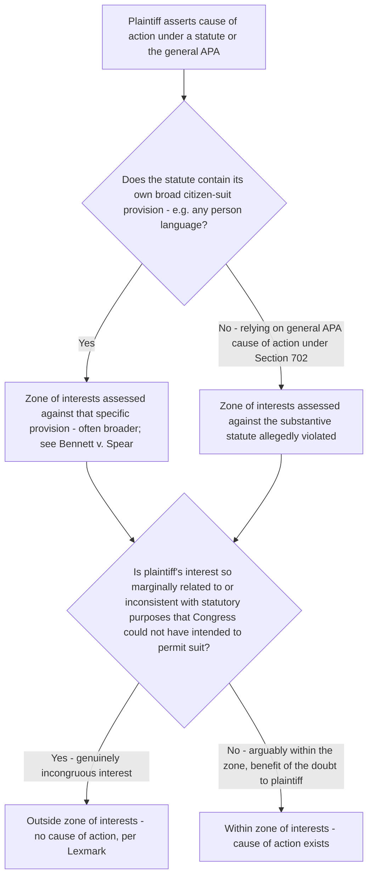

## The Zone of Interests Test Under Section 702

### Overview

The zone-of-interests test asks whether the plaintiff's asserted interest falls within the range of interests the relevant statute was intended to protect or regulate. Historically categorized as an element of "prudential standing," the Supreme Court's decision in *Lexmark International, Inc. v. Static Control Components, Inc.*, 572 U.S. 118 (2014), reframed the inquiry as a **merits question of statutory cause of action** rather than a jurisdictional standing limitation — a significant doctrinal shift with practical consequences for how courts analyze and dispose of these challenges. In administrative law specifically, the test derives from 5 U.S.C. § 702's language granting a right of review to persons "adversely affected or aggrieved... within the meaning of a relevant statute."

### Statutory Basis

**5 U.S.C. § 702** provides that "a person suffering legal wrong because of agency action, or adversely affected or aggrieved by agency action within the meaning of a relevant statute, is entitled to judicial review thereof." The phrase "within the meaning of a relevant statute" is the textual anchor for the zone-of-interests inquiry: Congress intended not every person affected by agency action to have a cause of action, but only those whose interests the specific statute governing the agency's conduct was designed to protect.

### Origins: *Association of Data Processing Service Organizations v. Camp*

**Association of Data Processing Service Organizations, Inc. v. Camp*, 397 U.S. 150 (1970)**, established the test in its original two-part form:

1. Has the plaintiff alleged an "injury in fact" (this component has since been absorbed into and clarified by the constitutional standing framework, particularly post-*Lujan*)?
2. Is the interest the plaintiff seeks to protect "arguably within the zone of interests to be protected or regulated by the statute" the plaintiff claims was violated?

The Court in *Data Processing* deliberately set this second prong as a relatively lenient, non-demanding threshold — "arguably within the zone" is a permissive standard, not requiring the statute to have been enacted specifically to benefit the plaintiff's precise interest, only that the interest is not so marginally related to or inconsistent with the statute's purposes that Congress could not reasonably be assumed to have intended to permit suit.

### The Modern Formulation: *Lexmark* Reframes the Doctrine

*Lexmark International, Inc. v. Static Control Components, Inc.*, 572 U.S. 118 (2014), arose from a Lanham Act false-advertising claim (not an APA case), but the Court's opinion is now the controlling statement of zone-of-interests methodology across contexts, including APA review:

- The Court held that whether a plaintiff falls within a statute's zone of interests is not a matter of prudential "standing" in the jurisdictional sense at all, but rather a question of **statutory interpretation**: has Congress, in creating a cause of action, extended it to plaintiffs whose interests fall within the statute's zone?
- This reframing matters because prudential doctrines were historically treated as flexible, judicially-crafted limits courts could apply or relax; as a statutory cause-of-action question, the zone-of-interests inquiry instead turns strictly on ordinary tools of statutory interpretation, and a court lacking a valid cause of action under this analysis must dismiss for failure to state a claim, not for lack of jurisdiction.
- *Lexmark* also reaffirmed that the zone-of-interests test is "not meant to be especially demanding," particularly in the APA context, citing *Clarke v. Securities Industry Ass'n*, 479 U.S. 388 (1987), for the proposition that the benefit of the doubt goes to the plaintiff, and the test forecloses suit only when a plaintiff's interests are "so marginally related to or inconsistent with the purposes implicit in the statute that it cannot reasonably be assumed that Congress intended to permit the suit."

### Applying the Test: Key Considerations

Courts examine:

- The statute's stated purposes and legislative history.
- Whether the plaintiff is a direct or intended beneficiary of the statutory scheme, or merely an incidental beneficiary.
- Whether the plaintiff's interest is one the statute was designed to protect, *or* one the statute was designed to regulate (the test's "protected or regulated" language means regulated parties, not just intended beneficiaries, can sometimes satisfy the test — see *Bennett v. Spear* below).
- Whether allowing this category of plaintiff to sue would further or frustrate the statutory scheme's purposes.

### *Bennett v. Spear*: Zone of Interests in the Environmental Context

*Bennett v. Spear*, 520 U.S. 154 (1997) — already central to finality doctrine — is equally important for zone-of-interests analysis in environmental law:

- Irrigation districts and ranchers, seeking *less* restrictive water-use limitations, challenged a Fish and Wildlife Service biological opinion that recommended higher reservoir water levels to protect endangered sucker fish.
- The government argued these plaintiffs — whose interests ran directly counter to the ESA's core purpose of species protection — fell outside the ESA's zone of interests, since they sought to weaken rather than strengthen environmental protections.
- The Court rejected this argument, reasoning that:
  1. The ESA's citizen-suit provision, 16 U.S.C. § 1540(g), authorizes suit by "any person" — unusually broad statutory language reflecting congressional intent to allow enforcement by a wide range of parties, not merely those advancing the statute's protective purpose.
  2. The ESA's structure reflects that Congress was concerned not only with the risk of *under*-enforcement (harm to species from insufficient protection) but also implicitly with the risk of *over*-enforcement imposing excessive, unauthorized burdens on regulated parties beyond what the statute requires — since the ESA's procedural requirements (like biological opinions) are meant to ensure compliance with the statute's actual substantive standard, not to authorize arbitrary or excessive restrictions untethered to that standard.
  3. Therefore, parties adversely affected by an agency's overly cautious or legally erroneous application of the ESA fall within the zone of interests, even though their ultimate objective (more water for irrigation, less protection for the fish) is in tension with the statute's overarching conservation goal.
- *Bennett* thus illustrates a critical point: the "any person" citizen-suit language in many environmental statutes is understood as significantly broadening the zone of interests beyond what a court might otherwise infer from the statute's general protective purpose alone — regulated parties seeking to challenge agency overreach, not just environmental plaintiffs seeking stronger protection, generally fall within such statutes' zone of interests.

### The Test's Interaction With Citizen-Suit Provisions

Many environmental statutes contain "any person" citizen-suit language (CAA § 304, CWA § 505, RCRA § 7002, ESA § 11(g)) that broadens standing well beyond what the general APA § 702 zone-of-interests analysis might otherwise permit:

- Where a statute's own citizen-suit provision supplies the cause of action (rather than the general APA review provisions), the zone-of-interests analysis is conducted with reference to *that specific provision's* text and purpose, which — as *Bennett* demonstrates — can be considerably broader than the statute's general substantive purpose might suggest.
- This distinguishes environmental citizen-suit litigation from the more traditional APA § 702 zone-of-interests inquiry applicable when a plaintiff relies on the general APA cause of action rather than a statute-specific citizen-suit provision.

### Illustrative Contrast: *Clarke v. Securities Industry Ass'n*

*Clarke v. Securities Industry Ass'n*, 479 U.S. 388 (1987), predates *Lexmark* but remains an important application of the lenient zone-of-interests standard: securities dealers were held to fall within the zone of interests of banking statutes limiting bank securities activities, even though the statutes' primary purpose was bank regulation rather than protecting competitors, because Congress could reasonably be understood to have intended competitors to be able to challenge agency action permitting banks to exceed their statutory authority — reinforcing that the test screens out only genuinely incongruous plaintiffs, not merely those whose interests are secondary to the statute's primary purpose.

### Structural Analysis Framework

### Practical Example

A coal-fired power plant challenges an EPA emissions guideline as exceeding the agency's statutory authority under the Clean Air Act, arguing the guideline imposes costs the statute does not authorize.

1. If the plant relies on the CAA's own citizen-suit-adjacent review provisions (CAA § 307(b), which authorizes "any person" to petition for review of certain EPA actions in the courts of appeals), the *Bennett v. Spear* reasoning applies directly by analogy: a regulated party challenging agency overreach falls within the zone of interests of a broadly worded review provision, even though the plant's objective (less stringent regulation) runs counter to the Act's general environmental-protection purpose.
2. If instead the plant were relying on the general APA cause of action under § 702 for some collateral claim not covered by the CAA's specific review provision, the court would examine whether the plant's interest in avoiding excessive regulatory costs is "arguably within the zone" of the specific provision allegedly violated — likely satisfied, since statutes authorizing agency regulation of an industry are generally understood to implicitly protect regulated parties from agency action exceeding the statute's actual authorization, consistent with *Bennett*'s reasoning about the ESA's implicit concern with over-enforcement.

### Key Case Summary Table

| Case | Holding | Doctrinal Contribution |
| --- | --- | --- |
| *Ass'n of Data Processing Service Orgs. v. Camp* (1970) | Establishes "arguably within the zone" two-part test | Origin of the zone-of-interests doctrine |
| *Clarke v. Securities Industry Ass'n* (1987) | Lenient application; benefit of the doubt to plaintiff | Confirms non-demanding nature of the test |
| *Bennett v. Spear* (1997) | Regulated parties opposing environmental protection fall within ESA's broad "any person" zone of interests | Central environmental-law zone-of-interests case |
| *Lexmark Int'l v. Static Control Components* (2014) | Reframes zone of interests as a cause-of-action/merits question, not jurisdictional standing | Modern controlling methodology |

### Practice Pointers

- After *Lexmark*, frame zone-of-interests arguments as questions of statutory interpretation and cause of action, not jurisdictional standing — this affects the appropriate procedural vehicle for challenge (a motion to dismiss for failure to state a claim, rather than a jurisdictional motion) and forecloses certain jurisdictional defenses/waiver arguments that would apply to a true standing defect.
- In environmental citizen-suit litigation, identify whether the specific statutory citizen-suit provision's own text (often "any person") independently supplies a broad zone of interests, rather than relying solely on the statute's general substantive purpose, since *Bennett v. Spear* demonstrates these can diverge significantly.
- Remember that regulated parties opposing agency action — not just environmental beneficiaries seeking stronger protection — routinely satisfy the zone-of-interests test in environmental statutes with broad citizen-suit language, per *Bennett*'s reasoning about statutory concern with both under- and over-enforcement.
- Because the test is deliberately non-demanding, do not conflate it with the substantially more rigorous constitutional standing inquiry (injury, causation, redressability) — a plaintiff can easily satisfy zone-of-interests while still failing constitutional standing, and vice versa in unusual cases; both must be independently established.

### Related Topics

- Constitutional standing: injury in fact, causation, and redressability
- The final agency action requirement and *Bennett v. Spear*
- Citizen-suit provisions in environmental statutes (CAA, CWA, RCRA, ESA)
- Cause of action analysis post-*Lexmark* generally
- The presumption of judicial reviewability under the APA
- Associational and organizational standing frameworks