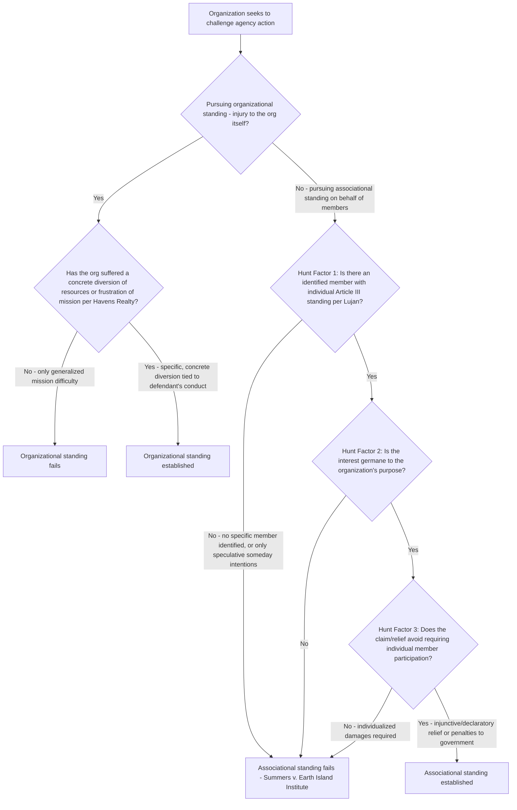

## Associational and Organizational Standing

### Overview

Environmental, public-interest, and industry litigation is disproportionately brought by organizations rather than individual plaintiffs. Because Article III standing normally requires a personal, concrete injury to the litigant itself, organizations must satisfy one of two distinct doctrinal pathways to sue: **organizational standing**, where the organization sues in its own right based on injury to itself, or **associational standing**, where the organization sues on behalf of its injured members. These are separate frameworks with separate tests, and a party's failure to satisfy one does not preclude satisfying the other.

### Organizational Standing: Injury to the Organization Itself

An organization can establish Article III standing in its own name if it satisfies the ordinary *Lujan* three-part test (injury, causation, redressability) with respect to injury suffered by the organization as an entity, distinct from any injury to its members.

**Leading case: *Havens Realty Corp. v. Coleman*, 455 U.S. 363 (1982)**

- A fair-housing organization alleged that a defendant's racial steering practices frustrated the organization's mission and forced it to divert resources — staff time and money — away from its ordinary counseling and referral activities toward investigating and counteracting the defendant's discriminatory practices.
- The Court held this **diversion of resources** and **frustration of mission** constituted a concrete injury to the organization itself, sufficient for organizational standing, distinguishing this from a mere abstract disagreement with the defendant's conduct or a generalized grievance about the organization's inability to accomplish its broader advocacy goals.

**Refinement post-*Havens*: The line between cognizable diversion and abstract mission frustration**

- Courts have distinguished a *Havens*-style concrete diversion of resources (e.g., specific staff hours redirected from planned programmatic activities to counteract a specific defendant's specific conduct) from a more generalized claim that a defendant's conduct makes an organization's overall mission "harder" to achieve, which is more likely to be treated as an insufficiently concrete injury.
- *Food & Water Watch, Inc. v. Vilsack* and similar circuit-level cases (D.C. Circuit) have required that the diverted resources go toward efforts to counteract the specific challenged conduct, not merely general advocacy or public education that the organization would have conducted regardless of the defendant's specific actions. [Inference: circuits have applied this distinction with varying degrees of rigor, and the precise line between a cognizable "diversion" injury and an unqualifying generalized mission-frustration claim remains an area of some doctrinal tension, particularly post-*TransUnion LLC v. Ramirez*, 594 U.S. 413 (2021), which reinforced a generally more demanding approach to concrete injury.]

### Associational Standing: Suing on Behalf of Members

The alternative and more commonly invoked pathway in environmental litigation allows an organization to sue on behalf of its members without the organization itself suffering any direct injury.

**The *Hunt* three-part test**: *Hunt v. Washington State Apple Advertising Commission*, 432 U.S. 333, 343 (1977), establishes that an association has standing to bring suit on behalf of its members when:

1. **Its members would otherwise have standing to sue in their own right** — at least one identified member must independently satisfy the full *Lujan* injury/causation/redressability framework.
2. **The interests it seeks to protect are germane to the organization's purpose** — a relatively undemanding requirement that the claim bears a reasonable connection to the organization's stated mission (e.g., an environmental organization litigating a pollution permit challenge easily satisfies this element).
3. **Neither the claim asserted nor the relief requested requires the participation of individual members in the lawsuit** — typically satisfied where the requested relief is prospective or injunctive/declaratory (benefiting the membership generally) rather than requiring individualized proof of damages for each member, which would necessitate individual member participation.

The first *Hunt* factor is where nearly all environmental associational-standing litigation is won or lost, since it requires identifying a specific member and establishing that member's individual constitutional standing under the full *Lujan* framework (addressed in the companion entry on constitutional standing).

### *Summers v. Earth Island Institute*: Strict Enforcement of the Member-Identification Requirement

*Summers v. Earth Island Institute*, 555 U.S. 488 (2009), is the leading modern case tightening the first *Hunt* factor in the environmental context:

- Environmental organizations challenged Forest Service regulations exempting small fire-rehabilitation and salvage-timber projects from certain notice, comment, and administrative appeal procedures.
- One individual member's declaration describing past visits to a specific national forest site that had since settled through a separate agreement was held insufficient, because that particular site was no longer at issue; the organizations otherwise failed to identify any member with concrete, imminent plans to visit a *specific* site actually affected by the categorically challenged regulation.
- The Court rejected the argument that the organizations' broad institutional interest in the regulatory scheme's validity, combined with the statistical likelihood that some unnamed member somewhere would eventually be affected by some project processed under the challenged regulation, could substitute for identifying an actual member with concrete, site-specific injury.
- This decision significantly narrowed a more permissive approach some lower courts had taken (rejecting reliance on "probabilistic" standing based on the sheer number of projects processed under a challenged regulation and an organization's large membership).

### Statutory Citizen-Suit Provisions and Associational Standing

Environmental citizen-suit provisions ("any person" language in CAA § 304, CWA § 505, RCRA § 7002, ESA § 11(g)) supply the *statutory* cause of action and zone-of-interests satisfaction (as discussed in the companion zone-of-interests entry and reinforced by *Bennett v. Spear*, 520 U.S. 154 (1997)), but do **not** eliminate the independent requirement of constitutional standing under the *Hunt*/*Lujan* framework for organizational plaintiffs. An organization suing under a citizen-suit provision must still:

- Identify a specific member with individual Article III standing (injury, causation, redressability), per *Summers* and *Lujan*.
- Satisfy the germaneness and individual-participation prongs of *Hunt*.

*Friends of the Earth, Inc. v. Laidlaw Environmental Services, Inc.*, 528 U.S. 167 (2000), remains the leading example of an environmental organization successfully satisfying associational standing in a citizen-suit context — members' reasonable, concrete diminishment of recreational and aesthetic enjoyment of a river due to pollution concerns satisfied the *Lujan* injury requirement, and the organizations otherwise readily satisfied the remaining *Hunt* factors.

### Individual Participation and the Third *Hunt* Factor

The third *Hunt* factor — whether individual member participation is required — becomes significant where relief sought includes individualized monetary damages (which would typically require each affected member's participation to establish the extent of harm) as opposed to injunctive or declaratory relief (which benefits the membership as a class without requiring individualized proof). Most environmental citizen-suit relief (injunctions, civil penalties payable to the government rather than to members individually) is structured in a way that satisfies this factor readily, since such relief does not require individualized member participation to determine its scope.

### Structural Analysis Framework

### Practical Example

A river-conservation organization sues a state environmental agency, alleging the agency unlawfully approved a wastewater discharge permit without adequate review of downstream impacts.

1. **Associational standing pathway**: The organization submits a declaration from a specific, named member who kayaks a defined stretch of the affected river regularly, states concrete, ongoing plans to continue this activity, and describes reasonable concern about water quality from the specific discharge at issue — this satisfies *Lujan*'s injury requirement in the manner *Laidlaw* found sufficient, and distinguishes the case from *Summers* by identifying a specific member tied to the specific project/site actually at issue, not a generalized membership interest in permitting policy.
2. **Germaneness**: Challenging a water pollution permit is directly germane to a river-conservation organization's stated purpose.
3. **Individual participation**: The requested relief (vacating or remanding the permit) does not require the individual member's participation beyond the standing declaration itself, since the relief operates on the permit generally rather than requiring individualized proof of the member's specific damages.
4. If, instead, the organization could only offer a declaration describing its members' general concern about water quality throughout the state without identifying any member with a concrete connection to *this* specific discharge or river segment, the claim would likely fail under *Summers*, regardless of how germane the organization's mission is to the subject matter.

### Key Case Summary Table

| Case | Holding | Doctrinal Contribution |
| --- | --- | --- |
| *Hunt v. Washington State Apple Advertising Comm'n* (1977) | Establishes three-factor associational standing test | Foundational associational standing framework |
| *Havens Realty Corp. v. Coleman* (1982) | Diversion of resources/frustration of mission constitutes organizational injury | Establishes organizational standing pathway |
| *Friends of the Earth v. Laidlaw* (2000) | Reasonable concern-based reduced enjoyment satisfies member injury in citizen suits | Successful environmental associational standing application |
| *Summers v. Earth Island Institute* (2009) | Requires identified member with concrete, site-specific, imminent injury; rejects probabilistic standing | Major limitation on environmental organizational plaintiffs |
| *TransUnion LLC v. Ramirez* (2021) | Reinforces demanding concreteness requirement for injury generally | General standing doctrine relevant to organizational injury claims |

### Practice Pointers

- Whenever possible, plead **both** organizational standing (concrete resource diversion under *Havens Realty*) and associational standing (an identified injured member under *Hunt*/*Summers*) as alternative grounds, since courts may reject one theory while accepting the other.
- For associational standing, always identify a specific, named member (or at minimum, a member whose identity can be disclosed to the court, even if pseudonymously for privacy reasons) with concrete, non-speculative, site-specific injury tied to the precise agency action or project being challenged — generalized membership concern about a regulatory scheme's validity is insufficient post-*Summers*.
- For organizational standing based on resource diversion, document specific staff hours, budget allocations, or program disruptions directly attributable to counteracting the defendant's specific challenged conduct, rather than relying on general statements that the conduct makes the organization's mission "more difficult."
- When relief sought includes individualized damages for specific members (as opposed to injunctive, declaratory, or civil-penalty relief), reassess whether associational standing remains available under *Hunt*'s third factor, since individualized damages claims often require the affected members' direct participation.

### Related Topics

- Constitutional standing: injury in fact, causation, and redressability
- The zone of interests test under Section 702 and *Bennett v. Spear*
- Citizen-suit provisions in environmental statutes (CAA, CWA, RCRA, ESA)
- Mootness and "capable of repetition yet evading review"
- State "special solicitude" standing under *Massachusetts v. EPA*
- Concreteness of injury post-*TransUnion LLC v. Ramirez*
- Procedural injury standing in NEPA and ESA consultation litigation