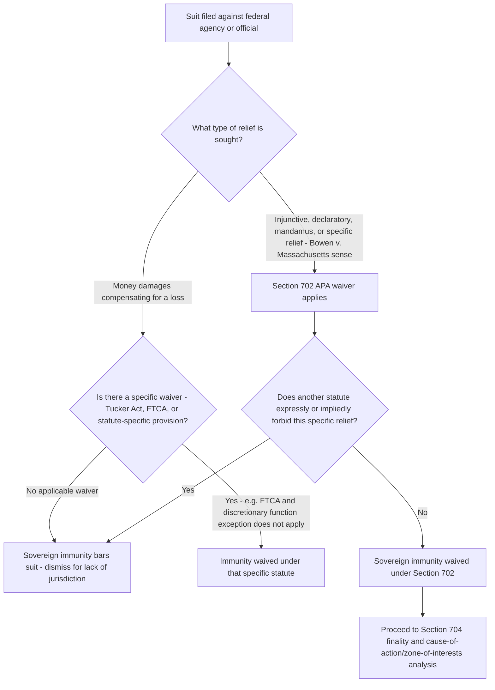

## Sovereign Immunity and Its Waiver for APA Claims

### Overview

Sovereign immunity generally bars suits against the United States absent an explicit congressional waiver — the government cannot be sued without its consent, and any such consent must be construed narrowly and unequivocally. The APA contains one of the most significant general waivers of sovereign immunity for suits challenging federal agency action, codified at 5 U.S.C. § 702's second sentence. Understanding the scope, mechanics, and limits of this waiver is essential to nearly all administrative and environmental litigation against federal agencies, since sovereign immunity operates as a threshold jurisdictional bar independent of standing, ripeness, or finality.

### The Baseline Rule and Its Rationale

Sovereign immunity derives from the common-law principle that the sovereign cannot be sued in its own courts without consent, adapted to the U.S. constitutional structure. The Supreme Court has repeatedly emphasized that:

- Waivers of sovereign immunity must be **unequivocally expressed** in statutory text (*United States v. Nordic Village, Inc.*, 503 U.S. 30, 33-34 (1992)).
- Any such waiver is strictly construed in favor of the sovereign, and ambiguities are resolved against finding a waiver.
- Sovereign immunity is jurisdictional: its absence deprives a court of subject-matter jurisdiction over the claim against the United States, and can be raised at any stage of litigation, including sua sponte by the court.

### The APA's Waiver: 5 U.S.C. § 702

Before 1976, sovereign immunity was a significant obstacle to suits against federal agencies, since many plaintiffs could not identify an independent statutory waiver applicable to their specific claim. The 1976 amendments to § 702 added the following language, now the primary general waiver relied upon in administrative litigation:

"An action in a court of the United States seeking relief other than money damages and stating a claim that an agency or an officer or employee thereof acted or failed to act in an official capacity or under color of legal authority shall not be dismissed nor relief therein be denied on the ground that it is against the United States..."

This waiver has several defining features:

**1. Limited to non-monetary relief**

The waiver applies only to claims "seeking relief other than money damages" — typically injunctive, declaratory, or mandamus-type relief compelling or restraining agency action. Claims for monetary compensation from the federal government generally require a separate waiver (e.g., the Tucker Act, 28 U.S.C. § 1491, for contract and certain constitutional claims; the Federal Tort Claims Act, 28 U.S.C. §§ 1346(b), 2671-2680, for tort claims).

**2. "Money damages" versus specific relief — the *Bowen v. Massachusetts* distinction**

A critical and frequently litigated line: § 702's waiver covers claims for **specific relief** (an order requiring the agency to do or refrain from doing something, or to pay money that is itself the specific thing owed under a statute, such as withheld benefits) but not **money damages** in the sense of substitute compensation for a harm. *Bowen v. Massachusetts*, 487 U.S. 879 (1988), held that a suit seeking payment of Medicaid reimbursements the state was statutorily entitled to receive was a claim for specific relief (the specific sum due under the statute) rather than money damages (compensation for a loss), and thus fell within § 702's waiver despite requiring the government to pay money — illustrating that the money-damages exclusion turns on the *character* of the relief sought (compensatory substitute versus the specific statutory entitlement itself), not merely whether money changes hands.

**3. Preserves other limitations on relief**

Section 702 explicitly states that "nothing herein... confers authority to grant relief if any other statute that grants consent to suit expressly or impliedly forbids the relief which is sought." This preserves more specific, narrower waivers or limitations found elsewhere in federal law — the general APA waiver does not override a more specific statutory limitation on the type of relief available for a particular claim.

**4. Applies broadly to claims against federal officers and employees acting in official capacity**

The waiver extends to actions against agency officials sued in their official capacity for actions taken "under color of legal authority," not merely to suits formally captioned against the United States or an agency itself.

### Interaction With Section 704's Cause-of-Action Requirement

Section 702's waiver of sovereign immunity is analytically distinct from § 704's requirement of a reviewable "final agency action" and from the underlying cause-of-action requirement (whether the plaintiff has a valid claim, addressed via the zone-of-interests analysis under *Lexmark*). A plaintiff must satisfy all three independently:

1. **Sovereign immunity waived** (§ 702) — the court has jurisdiction to hear a suit against the government for this type of relief.
2. **Final agency action exists** (§ 704) — there is a proper subject for review.
3. **Cause of action / zone of interests satisfied** — the plaintiff's interest is one the relevant statute protects or regulates.

Courts sometimes conflate these elements in practice, but they arise from different statutory provisions and serve different doctrinal functions.

### Sovereign Immunity Outside the General APA Waiver

Where a plaintiff seeks relief the § 702 waiver does not cover (most commonly, money damages), a separate waiver must be identified:

- **Tucker Act**, 28 U.S.C. § 1491 — waives immunity for certain contract claims and claims founded on the Constitution, a federal statute, or a federal regulation, for damages against the United States, generally channeled to the Court of Federal Claims for claims exceeding $10,000 (the "Little Tucker Act," 28 U.S.C. § 1346(a)(2), permits certain smaller claims in district court).
- **Federal Tort Claims Act (FTCA)**, 28 U.S.C. §§ 1346(b), 2671-2680 — waives immunity for certain torts committed by federal employees acting within the scope of employment, subject to numerous exceptions, most notably the **discretionary function exception**, 28 U.S.C. § 2680(a), which preserves immunity for claims based on an employee's exercise of a discretionary function or duty, even if the discretion is abused. This exception is frequently litigated in environmental contexts (e.g., claims alleging negligent agency oversight of environmental hazards), since courts apply the two-part *Berkovitz v. United States*, 486 U.S. 531 (1988), and *United States v. Gaubert*, 499 U.S. 315 (1991), test: (1) did the challenged conduct involve an element of judgment or choice (rather than a mandatory, non-discretionary directive), and (2) was that judgment of the kind the exception was designed to shield (grounded in considerations of public policy)?
- **Environmental statute-specific waivers**: some environmental statutes contain their own explicit waivers or consent-to-suit provisions applicable to the federal government as a regulated entity, notably CERCLA and RCRA provisions addressing federal facility cleanup liability, and the citizen-suit provisions of CAA/CWA/RCRA, which explicitly authorize suits against federal agencies for violations in their capacity as regulated dischargers/emitters, not merely against agencies in their regulatory capacity.

### Structural Analysis Framework

### Application in Environmental Law

- **Citizen suits against federal agencies as regulated entities**: CAA § 304(a), CWA § 505(a), and RCRA § 7002(a) explicitly authorize suits against "any person," a term statutorily defined in several of these acts to include federal agencies and departments — this operates as an explicit, statute-specific waiver of sovereign immunity distinct from and independent of the general APA § 702 waiver, since it addresses federal agencies in their capacity as sources of pollution subject to the same substantive requirements as private parties, not merely their regulatory decisionmaking capacity.
- **Tort claims for environmental harm caused by federal facility operations**: often proceed under the FTCA, where the discretionary function exception is a recurring and often dispositive defense — courts have reached varied results depending on whether the specific agency conduct at issue (e.g., a decision about waste disposal methods, monitoring frequency, or hazard mitigation) involved policy-laden discretionary judgment (immune) versus a mandatory, non-discretionary safety directive the agency failed to follow (not immune).
- **NEPA and APA-based challenges to agency environmental decisions**: overwhelmingly proceed under the § 702 general waiver, since the relief sought (vacatur, remand, injunction against project implementation) is specific relief rather than money damages, making sovereign immunity a less frequently dispositive issue in this specific category of environmental litigation compared to tort or damages-based environmental claims.
- **CERCLA cost-recovery actions against federal facilities**: CERCLA contains its own explicit waiver provisions addressing federal facility liability for contamination cleanup costs, operating independently of both the FTCA and the general APA framework.

### Practical Example

An environmental organization sues the Bureau of Land Management, seeking to vacate a resource management plan approved without adequate NEPA review, and separately seeks money damages for alleged harm to a specific parcel of land the organization uses for research.

1. **NEPA vacatur claim**: This seeks specific relief (vacating the plan and remanding for further NEPA review), not money damages — sovereign immunity is waived under § 702, and the analysis proceeds to whether the plan constitutes final agency action and whether the organization's interest falls within NEPA's zone of interests.
2. **Money damages claim**: This seeks compensation for an alleged loss — § 702's waiver does not apply, since it explicitly excludes claims for money damages. The organization would need to identify an independent waiver (e.g., the FTCA, if framed as a tort claim) and would face the discretionary function exception if the alleged harm stemmed from a policy-laden agency decision about land management priorities, versus a more promising claim if it stemmed from a mandatory, non-discretionary safety or procedural requirement the agency simply failed to follow.
3. If the organization cannot identify any applicable waiver for the damages claim, that portion of the suit would be dismissed for lack of subject-matter jurisdiction due to sovereign immunity, while the NEPA vacatur claim could proceed under the § 702 waiver.

### Key Case Summary Table

| Case | Holding | Doctrinal Contribution |
| --- | --- | --- |
| *United States v. Nordic Village, Inc.* (1992) | Waivers of sovereign immunity must be unequivocally expressed | General strict-construction principle |
| *Bowen v. Massachusetts* (1988) | Claim for specific statutory entitlement is "specific relief," not "money damages" | Defines scope of § 702's monetary-relief exclusion |
| *Berkovitz v. United States* (1988) / *United States v. Gaubert* (1991) | Two-part discretionary function exception test under the FTCA | Central FTCA immunity framework relevant to environmental tort claims |

### Practice Pointers

- Always separately analyze sovereign immunity (jurisdictional threshold), finality (§ 704), and cause of action/zone of interests — these are distinct requirements even though courts sometimes discuss them together, and a defect in one does not necessarily indicate a defect in another.
- When relief includes any component resembling money damages, carefully characterize the relief as "specific relief" under *Bowen v. Massachusetts* if a colorable argument exists (i.e., the plaintiff seeks a specific sum owed under a statutory entitlement rather than compensation for a loss), since this can bring the claim within § 702's waiver rather than requiring a separate, potentially unavailable waiver.
- In FTCA claims involving federal environmental agency conduct, develop the factual record early on whether the challenged conduct involved genuine policy-laden discretion (favoring the discretionary function exception) or violated a specific, mandatory, non-discretionary directive (defeating the exception) — this fact-intensive distinction is frequently case-dispositive.
- In citizen-suit litigation against federal facilities, confirm the specific statute's definition of "person" explicitly includes federal agencies before assuming sovereign immunity is waived, since this varies by statute and by the specific type of relief or penalty sought.

### Related Topics

- The final agency action requirement and *Bennett v. Spear*
- The zone of interests test under Section 702 and cause-of-action analysis post-*Lexmark*
- The Federal Tort Claims Act and the discretionary function exception
- CERCLA federal facility liability and cleanup cost recovery
- Citizen-suit provisions applicable to federal agencies as regulated entities
- The Tucker Act and Court of Federal Claims jurisdiction
- Mandamus relief and compelling agency action under 28 U.S.C. § 1361