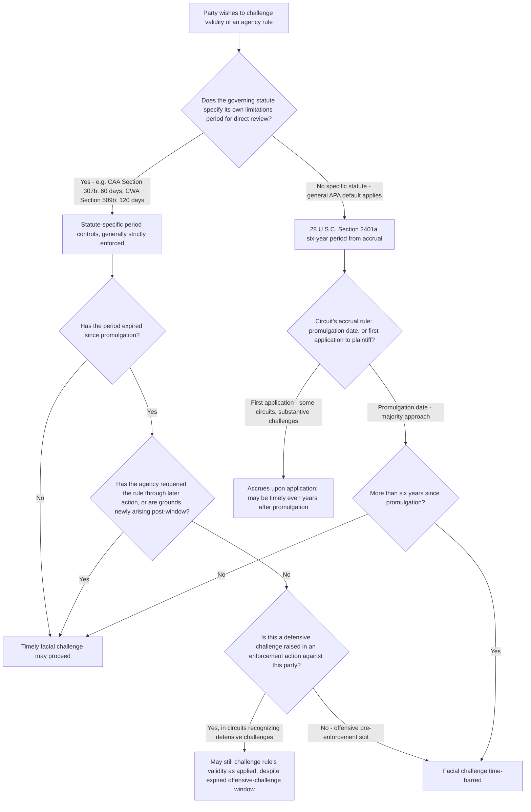

## Statutes of Limitations for Facial Challenges to Agency Rules

### Overview

Facial challenges to agency rules — attacks on a rule's validity on its face, independent of any specific application — are subject to timing rules that differ meaningfully from as-applied challenges. Because a facial challenge typically becomes available the moment a rule is promulgated, statutes of limitations governing such challenges create a hard deadline after which the rule's validity generally cannot be contested directly, even though the rule continues to operate indefinitely. This creates a persistent tension between finality/repose interests (letting settled rules remain settled) and the ongoing right to contest unlawful agency action, resolved differently across statutory schemes and, significantly, differently across circuits for the general default rule.

### The General Default: 28 U.S.C. § 2401(a)

In the absence of a more specific statutory limitations period, the general six-year statute of limitations for civil actions against the United States, 28 U.S.C. § 2401(a), applies to APA challenges to agency rules. This period runs "after the right of action first accrues."

**The critical, circuit-split question: when does a facial challenge to a rule "accrue"?**

- **Facial-challenge accrual at promulgation** (the traditional majority view in several circuits): the right of action accrues when the rule is published/becomes final, meaning a facial challenge must be filed within six years of that date, regardless of when the plaintiff was first affected by the rule.
- **Reopening doctrine**: if an agency later "reopens" the rule for comment (through a subsequent rulemaking that reconsiders or amends the original rule, even partially), courts have held this can restart the limitations clock as to the reopened provisions, allowing a facial challenge otherwise time-barred if brought against the original rule.
- **Wind-River / accrual-upon-application approach**: some circuits, notably following the D.C. Circuit's reasoning in *Wind River Mining Corp. v. United States*, 946 F.2d 710 (9th Cir. 1991) (a Ninth Circuit case despite the "Wind River" association sometimes drawn to broader circuit debates), and further developed in later cases, have permitted certain "substantive" (as opposed to purely "procedural") challenges to be raised when the rule is first *applied* to the plaintiff, even outside the six-year window from promulgation, reasoning that a plaintiff should not be forever barred from challenging a rule's substantive lawfulness merely because more than six years passed since the rule's issuance, if the plaintiff had no occasion or standing to challenge it earlier. [Inference: the scope, terminology, and continuing vitality of this "accrual upon application" approach — and how sharply it is distinguished from "procedural" challenges that remain subject to strict promulgation-date accrual — varies across circuits and has evolved through subsequent case law, so the applicable rule should be confirmed for the specific circuit and type of challenge at issue.]

### Distinguishing Facial From As-Applied Challenges for Limitations Purposes

| Challenge Type | Typical Accrual Point | Limitations Consequence |
| --- | --- | --- |
| Facial challenge (rule invalid on its face, e.g., procedural defect in rulemaking, exceeds statutory authority as written) | Generally, date of rule's promulgation/finality | Six-year clock (§ 2401(a)) or shorter statute-specific period runs from that date |
| As-applied challenge (rule's application to specific facts or a specific party is unlawful) | Generally, date of the specific enforcement action or application to the plaintiff | New limitations period runs from each application, largely independent of the original promulgation date |
| Facial challenge raised defensively in an enforcement proceeding | Some courts permit even a facially time-barred rule to be challenged when first invoked against a party in an enforcement action, treating the enforcement action itself as triggering a fresh opportunity to contest validity | Circuit-dependent; distinguishes offensive pre-enforcement suits from defensive challenges raised when the rule is actually enforced |

This distinction matters enormously in practice: a party who missed the window for an *offensive*, pre-enforcement facial challenge to a rule's validity may still be able to raise the same substantive argument *defensively* once the agency actually seeks to enforce the rule against that specific party, depending on the circuit's approach.

### Statute-Specific Limitations Periods

Many environmental and administrative statutes displace the general § 2401(a) default with their own specific, often considerably shorter, limitations periods for direct review of agency rules:

- **Clean Air Act § 307(b)(1)**, 42 U.S.C. § 7607(b)(1) — requires petitions for review of nationally applicable EPA regulations to be filed in the D.C. Circuit within **60 days** of the rule's publication (locally/regionally applicable rules go to the relevant regional circuit). This 60-day window is strictly enforced and has generated substantial litigation about whether specific EPA actions qualify as "nationally applicable" for venue purposes.
  - The CAA does provide a narrow exception: § 307(b)(1) permits a petition filed after the 60-day period if based *solely* on grounds arising *after* the 60th day (i.e., new grounds that did not exist and could not reasonably have been raised during the original window).
- **Clean Water Act § 509(b)(1)**, 33 U.S.C. § 1369(b)(1) — similarly requires review of specified EPA actions (including certain effluent limitations and NPDES permit actions) within **120 days** of the action, in the relevant court of appeals.
- **Toxic Substances Control Act, Safe Drinking Water Act, and other environmental statutes** contain their own specific direct-review provisions and timing windows, generally ranging from 45 to 90 days, reflecting Congress's general preference in environmental statutes for prompt, centralized, time-bounded review of agency rules rather than allowing the general six-year APA default to apply.

### Rationale for Short Statutory Windows in Environmental Rules

Congress's choice of short limitations periods (60-120 days, as opposed to the general six-year APA default) for direct review of environmental regulations reflects specific policy considerations:

- **Regulatory certainty for compliance planning** — regulated industries need to know promptly whether a rule's validity is settled so they can make capital investment and compliance decisions with confidence.
- **Centralized review avoiding inconsistent regional outcomes** — routing "nationally applicable" challenges to the D.C. Circuit specifically (CAA § 307(b)(1)) promotes national uniformity in interpreting environmental statutes.
- **Preventing delayed collateral attacks that could undermine settled regulatory schemes** — a rule that has been in effect and relied upon for years by both regulators and regulated parties creates significant reliance interests that a much later facial challenge could unsettle.

### The "Reopening" Doctrine in Detail

Even under a statute-specific short limitations period, courts have developed a "reopening" doctrine allowing renewed challenges where an agency's subsequent action effectively reconsiders the original rule:

- If EPA issues a new rule that amends, modifies, or is premised on reconsidering a provision from an earlier (otherwise time-barred) rule, a party may be able to challenge that earlier provision as part of a timely challenge to the new action, on the theory that the agency has "reopened" the issue for fresh consideration.
- Courts distinguish genuine reopening (the agency actually reconsidered the substance of the earlier provision, even if only implicitly, through the later rulemaking) from a mere reference to or reliance on the earlier rule without any substantive reconsideration (which does not reopen the limitations period) — this is a fact-intensive inquiry into whether the agency's later action functioned as a fresh, substantive review of the challenged provision.

### Structural Analysis Framework

### Application in Environmental Law

- **Timely pre-enforcement review is the norm and often the only realistic path**: given the short 60-120 day windows in most major environmental statutes, regulated industry and environmental groups alike must move quickly after a rule's publication to preserve a facial challenge — missing this window is a common and often fatal procedural pitfall in environmental litigation.
- **Reopening arguments frequently arise in the context of periodic statutory review requirements**: several environmental statutes require periodic review and revision of standards (e.g., NAAQS review under CAA § 109(d) on a roughly five-year cycle) — each such periodic revision can potentially reopen specific provisions for renewed challenge, creating recurring windows of opportunity distinct from the original rule's promulgation date.
- **Defensive challenges in enforcement actions**: a facility subject to an EPA enforcement action for violating an emissions standard promulgated many years earlier may, depending on the circuit, still be able to argue the underlying standard was unlawfully promulgated as a defense to the enforcement action, even though an offensive facial challenge would now be untimely — this defensive/offensive distinction is a significant, circuit-dependent strategic consideration in environmental enforcement defense.
- **NEPA and non-rule agency decisions**: statutes of limitations for challenges to project-specific NEPA decisions (as opposed to generally applicable rules) typically run from the specific decision's finality (e.g., issuance of a Record of Decision), a distinct analysis from the rule-focused limitations issues addressed here, generally governed by the general six-year § 2401(a) period absent a more specific statutory provision.

### Practical Example

EPA promulgates an emissions guideline for a category of industrial sources in 2018. A facility begins operating under a permit incorporating that guideline's standards in 2024, and in 2026 EPA brings an enforcement action against the facility for exceeding the guideline's limits.

1. **Offensive facial challenge**: If the facility (or an industry trade association) wished to challenge the guideline's validity directly, the Clean Air Act's 60-day window (assuming this qualifies as "nationally applicable") would have expired in 2018, shortly after promulgation — an offensive suit filed in 2026 seeking to invalidate the guideline on its face would very likely be dismissed as untimely, absent a reopening event or new grounds arising after the original window.
2. **Defensive challenge in the enforcement action**: Depending on the circuit's approach to defensive challenges, the facility might still be permitted to argue, as a defense to the 2026 enforcement action, that the underlying 2018 guideline was promulgated in excess of EPA's statutory authority — some circuits permit this defensive posture even where an offensive challenge would be time-barred, reasoning that a party should not be bound by an unlawful rule merely because the narrow offensive-challenge window passed before enforcement ever became a live issue for that party.
3. **Reopening argument**: If EPA had, in a 2023 rulemaking addressing a related but distinct issue, revisited and readopted (even implicitly) the specific emissions limit at issue, the facility might argue this reopened the 2018 provision, potentially permitting a facial challenge filed within 60 days of the 2023 action even though it substantively concerns the original 2018 standard.

### Key Case Summary Table

| Case/Authority | Holding | Relevance |
| --- | --- | --- |
| 28 U.S.C. § 2401(a) | General six-year limitations period for civil actions against the United States | Default rule absent statute-specific provision |
| Clean Air Act § 307(b)(1) | 60-day window for review of EPA rules, with narrow exception for post-window grounds | Primary environmental-law limitations provision |
| Clean Water Act § 509(b)(1) | 120-day window for review of specified EPA actions | Parallel CWA limitations provision |
| *Wind River Mining Corp. v. United States* (9th Cir. 1991) | Discusses accrual-upon-application approach for certain substantive challenges | Illustrates circuit split on accrual for general APA default period |

### Practice Pointers

- Treat the applicable limitations period as a critical, calendar-driven deadline from the moment a rule is published — for major environmental statutes, this is frequently 60-120 days, dramatically shorter than the general six-year APA default, and missing it is one of the most common and consequential errors in environmental regulatory litigation.
- When representing a party facing enforcement under an old rule it did not previously challenge, research the specific circuit's treatment of defensive challenges to rule validity in enforcement proceedings, since this can preserve an otherwise time-barred substantive argument.
- When a new agency rulemaking references, relies upon, or amends an earlier rule, evaluate whether the new action constitutes a "reopening" of any specific provision, which could create a fresh, timely opportunity to challenge that provision even if the original promulgation-date window has long since closed.
- Distinguish facial challenges to a rule's validity from as-applied challenges and from challenges to project-specific or permit-specific agency decisions (which typically have their own separate finality dates and limitations analysis, unconnected to the underlying generally applicable rule's promulgation date).

### Related Topics

- The final agency action requirement and *Bennett v. Spear*
- Ripeness and the *Abbott Laboratories* framework for pre-enforcement review
- Preclusion of review by statute and jurisdiction-channeling provisions
- Periodic statutory review requirements (e.g., NAAQS review under CAA § 109(d))
- Defensive versus offensive challenges to agency rule validity
- Venue and "nationally applicable" versus "locally/regionally applicable" rule classification under CAA § 307(b)
- Reopening doctrine in administrative rulemaking