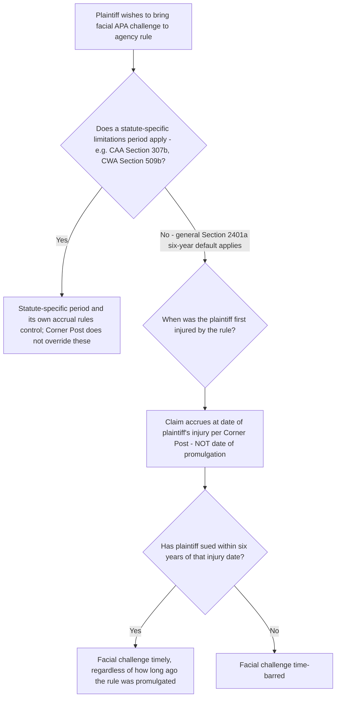

## *Corner Post v. Board of Governors* and Claim Accrual for As-Applied Challenges

### Overview

*Corner Post, Inc. v. Board of Governors of the Federal Reserve System*, 603 U.S. 799 (2024), resolved a significant circuit split over when an APA claim "first accrues" for purposes of the six-year statute of limitations in 28 U.S.C. § 2401(a). The Court held that a facial APA claim does not accrue when a rule is promulgated, but rather when the plaintiff is actually injured by the rule — meaning a newly formed or newly affected entity can bring a facial challenge to a decades-old regulation, so long as it sues within six years of first suffering injury from that regulation. This decision substantially reshapes the timing analysis previously covered under the general § 2401(a) default framework and has significant implications for challenges to longstanding environmental and administrative regulations.

### Statutory Basis

**28 U.S.C. § 2401(a)** sets a six-year statute of limitations for civil actions against the United States, running "after the right of action first accrues." The APA does not itself define "accrual"; *Corner Post* resolves that definitional question by reference to **5 U.S.C. § 702**, which grants a cause of action to a person "suffering legal wrong because of agency action" or "adversely affected or aggrieved by agency action."

### Facts and Procedural History

- In 2011, the Federal Reserve Board promulgated Regulation II under the Dodd-Frank Act, setting a maximum interchange (swipe) fee that payment networks could charge merchants for debit card transactions.
- A trade association challenged the regulation in 2011; that earlier challenge was rejected on the merits by the D.C. Circuit, and the Supreme Court declined review in 2015.
- Corner Post, Inc. — a truck stop and convenience store — did not exist in 2011; it opened for business in North Dakota in 2018 and, as a result of debit card transactions, paid thousands of dollars in interchange fees under the 2011 regulation. [Mayer Brown](https://www.mayerbrown.com/en/insights/publications/2024/07/decision-alert-corner-post-inc-v-board-of-governors-of-the-federal-reserve-system-no-22-1008)
- In 2021, Corner Post sued the Federal Reserve Board, arguing the interchange-fee regulation was invalid under the APA because it permitted higher fees than the governing statute allowed. [Mayer Brown](https://www.mayerbrown.com/en/insights/publications/2024/07/decision-alert-corner-post-inc-v-board-of-governors-of-the-federal-reserve-system-no-22-1008)
- The district court and the Eighth Circuit both dismissed the suit as time-barred, holding that the statute of limitations for facial claims regarding the enforcement of a regulation began to accrue when the regulation was promulgated in 2011 — meaning Corner Post's 2021 suit came ten years after the clock started, well past the six-year window, even though Corner Post did not exist and could not have sued when the clock supposedly began running. [Faegre Drinker](https://www.faegredrinker.com/en/insights/publications/2024/7/supreme-court-decides-corner-post-inc-v-board-of-governors-of-the-federal-reserve-system)

### The Holding

In a 6-3 decision authored by Justice Barrett and joined by the Chief Justice and Justices Thomas, Alito, Gorsuch, and Kavanaugh, the Supreme Court held that an APA claim does not accrue for purposes of Section 2401(a)'s six-year statute of limitations until the plaintiff is injured by the final agency action. The Court's reasoning: [Mayer Brown](https://www.mayerbrown.com/en/insights/publications/2024/07/decision-alert-corner-post-inc-v-board-of-governors-of-the-federal-reserve-system-no-22-1008)

- The APA authorizes suits against the United States when a plaintiff has "suffer[ed] legal wrong because of agency action" or has been "adversely affected or aggrieved by agency action within the meaning of a relevant statute," under 5 U.S.C. § 702. [Mayer Brown](https://www.mayerbrown.com/en/insights/publications/2024/07/decision-alert-corner-post-inc-v-board-of-governors-of-the-federal-reserve-system-no-22-1008)
- A plaintiff's APA claim does not "accrue" until the plaintiff has a "complete and present cause of action" — which requires an injury. A plaintiff who has not yet been injured by a rule has no live claim to assert, and a statute of limitations cannot begin running against a claim that does not yet exist. [Mayer Brown](https://www.mayerbrown.com/en/insights/publications/2024/07/decision-alert-corner-post-inc-v-board-of-governors-of-the-federal-reserve-system-no-22-1008)
- Because Corner Post sued the Federal Reserve Board within six years of being injured (i.e., within six years of opening for business in 2018 and paying the challenged fees), its lawsuit was timely, even though it was filed a decade after the regulation's promulgation. [Mayer Brown](https://www.mayerbrown.com/en/insights/publications/2024/07/decision-alert-corner-post-inc-v-board-of-governors-of-the-federal-reserve-system-no-22-1008)

### Rejection of the Promulgation-Date Accrual Rule

The Court's holding directly overturned the majority approach previously followed in several circuits (including, prior to this decision, the Eighth Circuit below), under which a facial challenge to a rule accrued strictly at the date of promulgation, regardless of when any particular plaintiff was actually affected. This is a marked departure from what many practitioners had assumed was settled doctrine for facial APA challenges, and it resolves — in favor of the injury-based accrual approach — the circuit tension previously described in connection with the "accrual upon application" line of reasoning associated with cases like *Wind River Mining Corp. v. United States*.

### Practical and Doctrinal Consequences

**1. New entities can challenge old rules**

Because accrual is now tied to each plaintiff's own injury, "such a claim does not accrue until the plaintiff is injured by the final agency decision under 5 U.S.C. § 702 of the APA" — meaning a business that did not exist when a rule was promulgated has a fresh six-year window beginning whenever it first becomes subject to and injured by that rule, no matter how long the rule has been on the books. [Faegre Drinker](https://www.faegredrinker.com/en/insights/publications/2024/7/supreme-court-decides-corner-post-inc-v-board-of-governors-of-the-federal-reserve-system)

**2. Undermines the traditional finality/repose rationale for short limitations periods**

Critics of the decision have argued this significantly weakens the settled-expectations rationale that originally justified strict promulgation-date accrual: the ruling "opens the floodgates for challenges to longstanding federal regulations" because "the Court's holding that section 2401(a)'s limitations period does not begin to run for a particular party until that party is injured by a final agency action enables newly formed entities to bring facial challenges to agency rules and regulations that have been in place for decades," which critics argue "effectively destroys the finality that Congress chose to provide by establishing the statute of limitations". [ACS Chapters](https://www.acslaw.org/scotus_update/corner-post-inc-v-board-of-governors-of-the-federal-reserve-system/)[ACS Chapters](https://www.acslaw.org/scotus_update/corner-post-inc-v-board-of-governors-of-the-federal-reserve-system/)

**3. Interaction with *Loper Bright* and the end of *Chevron* deference**

*Corner Post* was decided the same term as *Loper Bright Enterprises v. Raimondo*, 603 U.S. 369 (2024) (overruling *Chevron* deference), and commentators have noted the two decisions work in tandem: *Corner Post* expands the pool of potential plaintiffs and the temporal window for challenging agency rules, while *Loper Bright* simultaneously makes it easier for courts to find that a challenged rule exceeds statutory authority, since courts no longer defer to an agency's reasonable interpretation of ambiguous statutory text. Together, these decisions substantially increase the practical exposure of longstanding agency rules — including many environmental regulations — to fresh facial challenges brought by newly formed or newly affected regulated parties.

### Scope of the Holding: Facial Challenges, Not All As-Applied Timing Issues

It is important to note precisely what *Corner Post* addresses: it resolves accrual for **facial** APA challenges under the general § 2401(a) default — it does not itself alter statute-specific limitations provisions found in individual environmental statutes (e.g., CAA § 307(b)'s 60-day window, CWA § 509(b)'s 120-day window), which contain their own accrual and timing rules independent of § 2401(a) and were not at issue in this case. The decision's reasoning, however — that a cause of action requires an actual injury to exist — is consistent with, and reinforces by analogy, the traditional as-applied challenge framework: a party first affected by a rule's specific application to it has always been understood to have a claim accruing at that point of application, separate from any facial promulgation-date challenge. *Corner Post* effectively imports that same injury-based logic into the *facial* challenge context under the general APA default, collapsing what had previously been treated as a sharper distinction between facial (promulgation-date) and as-applied (application-date) accrual for purposes of § 2401(a).

### Structural Analysis Framework

### Application in Environmental Law

Although *Corner Post* itself arose in the financial-regulation context, its accrual rule applies wherever the general APA § 2401(a) default governs (i.e., where no statute-specific environmental review provision displaces it):

- **Longstanding EPA rules not subject to a short statute-specific review window**: certain EPA rules, guidance-turned-binding-norms, or agency actions not channeled through CAA § 307(b) or CWA § 509(b)'s short windows may now be newly vulnerable to facial challenge by recently formed or newly regulated entities, even where the underlying rule dates back decades, so long as the § 2401(a) default (rather than a statute-specific window) applies.
- **New regulated entities entering long-established industries**: a newly formed company entering an industry subject to a decades-old environmental regulation (again, where the general default rather than a short statute-specific window governs) may now have a fresh opportunity to mount a facial challenge to that regulation's validity — including arguments that the agency exceeded its statutory authority — that existing, longer-established competitors in the same industry may have lost the ability to raise.
- **Strategic significance combined with *Loper Bright***: given the end of *Chevron* deference, a facial challenge brought under this newly expanded window is now evaluated with courts independently determining the best reading of the statute, rather than deferring to the agency's interpretation — significantly changing the litigation calculus for challenging older environmental rules whose statutory authority was previously upheld partly on the strength of *Chevron* deference.
- **Continued primacy of statute-specific windows for most direct environmental rule review**: practitioners should note that most major environmental statutes (CAA, CWA, and others) already displace the general § 2401(a) default with their own short, specific windows for direct review of "nationally applicable" or similarly defined rules — *Corner Post*'s practical impact on environmental law is therefore likely to be concentrated in contexts where those statute-specific windows do not apply or do not cover the specific type of agency action at issue. [Inference: the precise scope of environmental agency actions governed by the general § 2401(a) default versus a statute-specific window is fact- and statute-dependent, and how frequently *Corner Post*'s rule will actually be invoked to unsettle longstanding environmental regulations (as opposed to regulations in other areas like financial services) remains to be seen as litigation develops post-2024.]

### Practical Example

A company incorporates in 2025 and begins operating a facility that becomes subject, for the first time in the company's existence, to an EPA rule originally promulgated in 2005 under a statutory provision that does not carry its own short judicial-review window (so the general APA default applies). In 2027, believing the rule exceeds EPA's statutory authority, the company sues.

1. Under the pre-*Corner Post* majority approach, this claim would have been dismissed as untimely, since more than six years passed between the rule's 2005 promulgation and the 2027 suit.
2. Under *Corner Post*, the claim accrues when the company was first injured by the rule (upon beginning operations subject to it, sometime in 2025 or shortly after), not when the rule was promulgated — since the 2027 suit falls within six years of that injury, it would be timely.
3. Applying *Loper Bright*, the reviewing court would independently determine the best reading of the underlying statute to assess whether the 2005 rule exceeds EPA's authority, without deferring to EPA's own interpretation, substantially changing the substantive analysis from what a similar challenge might have faced before 2024.

### Key Case and Authority Summary Table

| Case/Authority | Holding | Relevance |
| --- | --- | --- |
| 28 U.S.C. § 2401(a) | Six-year limitations period for civil actions against the United States, running from accrual | Statutory text at issue |
| *Corner Post, Inc. v. Board of Governors* (2024) | APA claim accrues upon plaintiff's injury by final agency action, not upon rule's promulgation | Central holding; overturns promulgation-date accrual for facial challenges under general default |
| *Loper Bright Enterprises v. Raimondo* (2024) | Overrules *Chevron* deference; courts independently determine best statutory reading | Decided same term; compounds practical effect of *Corner Post* |

### Practice Pointers

- Before assuming a facial challenge to an old rule is time-barred under the general § 2401(a) default, determine precisely when the specific plaintiff was first injured by the rule — post-*Corner Post*, this (not the rule's promulgation date) is the operative accrual date.
- Confirm whether a statute-specific limitations/review provision (CAA § 307(b), CWA § 509(b), etc.) governs the specific agency action at issue before relying on *Corner Post*'s general-default accrual rule, since the decision does not itself alter those statute-specific windows.
- For newly formed entities entering regulated industries, evaluate whether a facial challenge to longstanding rules governing that industry may now be viable under the *Corner Post* injury-based accrual rule, particularly in combination with a *Loper Bright* statutory-authority argument.
- For agencies and established regulated parties relying on long-settled rules, recognize that reliance interests built up over decades may now be more exposed to renewed facial challenge by newly injured plaintiffs, and consider whether rulemaking practices (e.g., periodic reaffirmation) might affect this exposure. [Inference: how agencies and litigants will adapt regulatory and litigation strategy in response to *Corner Post* is still developing, and this guidance reflects the decision's stated holding and reasoning rather than settled downstream practice.]

### Related Topics

- Statutes of limitations for facial challenges to agency rules
- The end of *Chevron* deference under *Loper Bright Enterprises v. Raimondo*
- Reopening doctrine and periodic statutory review requirements
- Sovereign immunity and its waiver for APA claims under Section 702
- Constitutional standing: injury in fact, causation, and redressability
- Facial versus as-applied challenges to agency regulations
- Strict versus flexible treatment of jurisdictional time bars post-*Hamer*