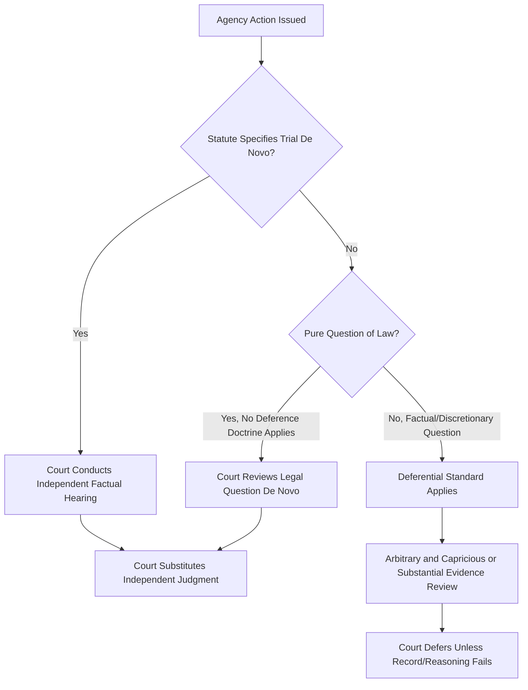

## De Novo Review of Agency Action

### Definition and Core Concept

De novo review is a standard of judicial review under which a reviewing court examines an issue **as if it had not been decided before**, giving no deference to the agency's factual findings, legal conclusions, or the record developed below. The court substitutes its own independent judgment for that of the administrative agency.

The term "de novo" (Latin: "from the new" or "anew") signals a complete reset: the reviewing tribunal is not confined to the agency record, is not bound by the agency's characterization of facts, and does not defer to the agency's interpretation of law. This stands in sharp contrast to deferential standards such as "arbitrary and capricious" review or **substantial evidence** review, where the court's role is merely to check whether the agency acted within a zone of reasonableness.

### Distinguishing De Novo Review from Other Standards

| Standard | Deference to Agency | Scope of Court's Inquiry | Typical Application |
| --- | --- | --- | --- |
| De novo | None | Full independent redetermination | Pure questions of law; jurisdictional facts; constitutional questions |
| Arbitrary and capricious | High | Rational basis / reasoned decision-making | Informal rulemaking, discretionary policy calls |
| Substantial evidence | Moderate-high | Whether record supports finding | Formal adjudication, formal rulemaking |
| Clearly erroneous | Moderate | Deferential fact review | Some fact-finding review in mixed proceedings |

**Key Points**

- De novo review is the **least deferential** standard available to a reviewing court.
- It applies **selectively**, not as a default — most agency action review is deferential (arbitrary/capricious or substantial evidence) unless a specific statutory or constitutional trigger applies.
- The applicable standard is determined by (1) the governing statute (e.g., Administrative Procedure Act provisions), (2) the nature of the question (law vs. fact vs. discretion), and (3) sometimes constitutional doctrine (e.g., jurisdictional or constitutional facts).

### Statutory Basis (APA Framework)

In many administrative law systems modeled on or influenced by the U.S. Administrative Procedure Act (APA), de novo review is expressly authorized in narrow circumstances. Under APA § 706, a reviewing court shall:

1. Compel agency action unlawfully withheld or unreasonably delayed;
2. Hold unlawful and set aside agency action found to be—
   - (A) arbitrary, capricious, an abuse of discretion, or otherwise not in accordance with law;
   - (B) contrary to constitutional right, power, privilege, or immunity;
   - (C) in excess of statutory jurisdiction, authority, or limitations;
   - (D) without observance of procedure required by law;
   - (E) unsupported by substantial evidence (formal proceedings); or
   - (F) **unwarranted by the facts to the extent that the facts are subject to trial de novo by the reviewing court**.

Subsection (F) is the textual anchor for de novo review of agency action. It applies only when a statute specifically provides for a factual trial de novo — this is comparatively rare and typically limited to certain licensing revocations, specific enforcement actions, or statutes expressly authorizing a fresh factual hearing in court.

### When De Novo Review Applies

**1. Pure Questions of Law (Absent Deference-Triggering Ambiguity)**

Courts traditionally review an agency's interpretation of law de novo when:

- The statute is unambiguous (no room for agency interpretation to operate);
- The question is outside the agency's technical expertise (e.g., a question of general federal law, not the specific regulatory scheme the agency administers);
- No deference doctrine (formerly *Chevron*-style deference in the U.S. federal system) attaches — courts independently determine the best reading of the statute.

**2. Jurisdictional and Constitutional Facts**

Some doctrines require de novo judicial determination of facts that bear directly on:

- Whether the agency had jurisdiction/authority to act at all;
- Whether a constitutional right (due process, free speech, takings) was implicated, since courts are traditionally reluctant to let an agency be the final arbiter of the scope of its own constitutional limits.

**3. Explicit Statutory Trial De Novo Provisions**

Certain statutes provide that judicial review of specific agency determinations (e.g., certain benefit denials, licensing actions, or civil penalty assessments) proceeds as a fresh trial in court, with the agency's record playing little or no binding role.

**4. Procedural/Constitutional Due Process Violations**

Where an agency's fact-finding process itself is constitutionally defective (e.g., denial of a fair hearing), a court may need to conduct its own factual inquiry de novo rather than review a tainted record.

**5. Environmental Law Context**

In environmental administrative law specifically, de novo review issues frequently arise in:

- **Citizen suit enforcement actions** under statutes such as the Clean Water Act or Clean Air Act, where courts adjudicating whether a discharge violated a permit condition may need to make independent factual determinations rather than simply reviewing an agency's prior determination.
- **Mixed question cases** — e.g., whether a wetland meets statutory "waters of the United States" jurisdictional criteria can implicate de novo legal interpretation layered atop deferential fact review.
- **De novo review of denial of standing or threshold jurisdictional facts** in environmental citizen suits, distinct from deferential review of the agency's substantive permitting decision.

### Mixed Questions of Law and Fact

Many disputes are not purely legal or purely factual, and courts must **disaggregate** the inquiry:

$$\text{Standard of Review} = f(\text{Question Type}, \text{Statutory Directive}, \text{Institutional Competence})$$

- The **legal component** (e.g., what the statutory term means) may receive de novo review.
- The **factual component** (e.g., whether a particular pollutant discharge meets that legal definition on these facts) may receive substantial evidence or arbitrary/capricious review.
- The **application of law to fact** is the most contested category — some jurisdictions review this de novo, others treat it as a discretionary agency function deserving deference.

**Example**

An agency determines that a company's stormwater runoff qualifies as a "point source discharge" requiring a permit.

- Question of law (de novo): What does "point source" mean under the statute?
- Mixed question (contested standard): Does the runoff mechanism at issue fall within that legal definition?
- Question of fact (deferential): Did the runoff actually occur, and in what volume?

### Procedural Mechanics of De Novo Review

Under true de novo review (per branch C above):

- The court is **not confined** to the administrative record; new evidence may be introduced.
- Neither party benefits from a presumption of correctness attaching to the agency's prior findings.
- The court may take testimony, weigh credibility, and make independent findings of fact and conclusions of law.

### Rationale and Policy Justifications

1. **Separation of powers concerns** — de novo review preserves the judiciary's role as ultimate interpreter of the law under a constitutional structure that assigns interpretive authority to courts rather than executive agencies, particularly where no clear delegation of interpretive authority exists.
2. **Protecting individual rights** — where agency action threatens fundamental rights or jurisdictional limits, courts have historically been unwilling to let the agency be the final word.
3. **Institutional competence** — where the question does not call for the agency's specialized technical expertise (e.g., a pure statutory construction question turning on ordinary legal interpretive tools), there is less reason to defer.
4. **Checking agency overreach** — de novo review of jurisdictional facts prevents an agency from expanding its own authority through self-serving factual or legal findings.

### Criticisms and Limitations

- **[Inference]** Some scholars argue de novo review can undermine the efficiency rationale for agency delegation, since it allows courts to re-litigate matters that specialized agencies are better equipped to resolve.
- De novo review, when triggered on jurisdictional or constitutional grounds, can be **strategically invoked** by litigants seeking a more favorable forum, since courts may reach different conclusions than agencies on the same facts.
- **[Unverified]** The precise boundary between "pure law" (de novo) and "mixed law/fact" (deferential) questions is frequently litigated itself, and appellate courts do not always apply the categorization consistently across circuits or jurisdictions; behavior may vary by court and by the specific statutory scheme at issue.

### Illustrative Case Pattern (Environmental Law)

**Example**

A landowner is cited by an environmental agency for filling a wetland without a permit. The agency determines the site is a jurisdictional wetland and imposes a penalty.

- If the landowner challenges the agency's **legal definition** of "wetland" under the statute, a court may review that legal question de novo (especially absent a deference doctrine or where the statute is unambiguous).
- If the landowner challenges the **agency's factual determination** that water was present on the relevant dates, that fact-bound determination is typically reviewed under a deferential standard (substantial evidence), unless the statute in question explicitly authorizes a trial de novo of the enforcement action.
- If the landowner alleges the enforcement proceeding **violated due process** (e.g., no meaningful opportunity to contest evidence), the court may need to make its own de novo assessment of the fairness of the process, independent of the agency's own self-assessment.

### Diagram: Standard of Review Selection Logic (svg_diagram)

<svg xmlns="http://www.w3.org/2000/svg" viewBox="0 0 900 460">
<rect x="0" y="0" width="900" height="460" fill="#ffffff" />
<text x="450" y="30" font-size="18" font-weight="bold" text-anchor="middle" fill="#1a1a1a">Standard of Review Selection Logic (svg_diagram)</text>
<rect x="340" y="55" width="220" height="50" rx="8" fill="#e8eef7" stroke="#3a5a8c" stroke-width="1.5" />
<text x="450" y="85" font-size="13" text-anchor="middle" fill="#1a1a1a">Agency Action Challenged</text>
<line x1="450" y1="105" x2="450" y2="140" stroke="#555" stroke-width="1.5" />
<polygon points="445,135 455,135 450,145" fill="#555" />
<rect x="310" y="145" width="280" height="55" rx="8" fill="#fff4e0" stroke="#a06a1a" stroke-width="1.5" />
<text x="450" y="168" font-size="12.5" text-anchor="middle" fill="#1a1a1a">Statute mandates factual</text>
<text x="450" y="184" font-size="12.5" text-anchor="middle" fill="#1a1a1a">trial de novo?</text>
<line x1="450" y1="200" x2="200" y2="250" stroke="#555" stroke-width="1.5" />
<text x="300" y="220" font-size="12" fill="#1a6b1a">Yes</text>
<line x1="450" y1="200" x2="700" y2="250" stroke="#555" stroke-width="1.5" />
<text x="600" y="220" font-size="12" fill="#8c1a1a">No</text>
<rect x="90" y="250" width="220" height="55" rx="8" fill="#e0f7e6" stroke="#1a6b1a" stroke-width="1.5" />
<text x="200" y="273" font-size="12.5" text-anchor="middle" fill="#1a1a1a">De Novo Review:</text>
<text x="200" y="289" font-size="12.5" text-anchor="middle" fill="#1a1a1a">Independent Fact-Finding</text>
<rect x="590" y="250" width="240" height="55" rx="8" fill="#fff4e0" stroke="#a06a1a" stroke-width="1.5" />
<text x="710" y="273" font-size="12.5" text-anchor="middle" fill="#1a1a1a">Pure question of law,</text>
<text x="710" y="289" font-size="12.5" text-anchor="middle" fill="#1a1a1a">no deference doctrine applies?</text>
<line x1="710" y1="305" x2="560" y2="355" stroke="#555" stroke-width="1.5" />
<text x="620" y="330" font-size="12" fill="#1a6b1a">Yes</text>
<line x1="710" y1="305" x2="830" y2="355" stroke="#555" stroke-width="1.5" />
<text x="790" y="330" font-size="12" fill="#8c1a1a">No</text>
<rect x="440" y="355" width="240" height="55" rx="8" fill="#e0f7e6" stroke="#1a6b1a" stroke-width="1.5" />
<text x="560" y="378" font-size="12.5" text-anchor="middle" fill="#1a1a1a">De Novo Review:</text>
<text x="560" y="394" font-size="12.5" text-anchor="middle" fill="#1a1a1a">Independent Legal Determination</text>
<rect x="710" y="355" width="180" height="55" rx="8" fill="#fde8e8" stroke="#8c1a1a" stroke-width="1.5" />
<text x="800" y="378" font-size="12.5" text-anchor="middle" fill="#1a1a1a">Deferential Standard</text>
<text x="800" y="394" font-size="12.5" text-anchor="middle" fill="#1a1a1a">(Arbitrary/Substantial Evidence)</text>
</svg>

### Related Topics

- Arbitrary and capricious standard of review
- Substantial evidence rule in formal agency adjudication
- Deference to agency statutory interpretation (post-*Chevron* landscape)
- Jurisdictional facts doctrine
- Mixed questions of law and fact in judicial review
- Standing and threshold review in environmental citizen suits
- Scope of the administrative record on review
- Constitutional facts doctrine
- Trial-type procedures in formal adjudication vs. informal agency action
- Exhaustion of administrative remedies as a precondition to judicial review