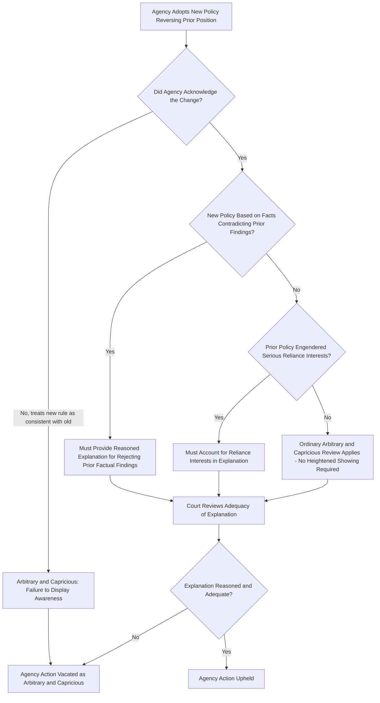

## Reasoned Decision Making and Changed Agency Positions After FCC v. Fox Television

### Overview and Doctrinal Setting

The requirement of **reasoned decision making** is the analytical core of arbitrary and capricious review under APA § 706(2)(A). An agency's action, even one within its statutory authority, must be accompanied by a reasoned explanation connecting the facts found to the choice made. When an agency **changes** a prior position — reverses a rule, abandons a prior interpretation, or adopts a policy contrary to its own precedent — a distinct question arises: does the agency owe a *heightened* justification simply because it changed course?

*FCC v. Fox Television Stations, Inc.*, 556 U.S. 502 (2009), is the controlling case addressing this question in U.S. administrative law. It resolved a circuit split over whether agency policy reversals trigger a more demanding standard of review than ordinary arbitrary and capricious review.

### Factual and Procedural Background

The FCC had for decades permitted isolated, non-literal uses of expletives in broadcasts (the "fleeting expletives" policy) without treating them as actionable indecency. In 2004, the FCC reversed this position, holding that even isolated expletives (e.g., during live award show broadcasts) could constitute actionable indecency under 18 U.S.C. § 1464. Broadcasters challenged the reversal as arbitrary and capricious, arguing the agency had not adequately justified departing from decades of settled policy.

The Second Circuit held that agencies changing policy must provide a **more substantial explanation** than they would need for a policy adopted in the first instance — effectively imposing a heightened arbitrary-and-capricious standard for reversals. The Supreme Court reversed on this procedural/administrative-law point.

### The Supreme Court's Holding

Justice Scalia, writing for the Court, held that:

1. **No heightened standard applies to policy reversals as such.** The APA's arbitrary-and-capricious standard applies with the same rigor whether the agency is adopting a rule for the first time or changing an existing one. There is no special, more exacting standard triggered merely because the agency changed its mind.
2. **The agency must show awareness that it is changing position.** The agency need not demonstrate that the new policy is *better* than the old one — only that it is permissible under the statute — but it must display awareness that it is in fact changing position, rather than pretending its prior position never existed or was consistent with the new one.
3. **The agency must supply good reasons for the new policy.** A reasoned explanation is necessary for disregarding facts and circumstances that underlay, or were engendered by, the prior policy.
4. **A more detailed justification is required only in specific circumstances**, not automatically — namely when:
   - The new policy rests upon factual findings that **contradict** those underlying the prior policy; or
   - The prior policy has engendered **serious reliance interests** that must be taken into account (e.g., parties may have structured their conduct in reliance on the old rule, such that a reversal ignoring that reliance would be arbitrary).

**Key Points**

- Fox rejected a **categorical** heightened-scrutiny rule for changed positions.
- Fox **did not** eliminate scrutiny of reversals — it folded the reversal context into ordinary arbitrary-and-capricious analysis, with reliance interests and contradicted factual findings as triggers for a fuller explanation.
- The agency must acknowledge the change and articulate reasons; it need not prove the new position is superior to the old one.

### The Fox Framework as a Decision Structure

### Application in the Underlying Case

Applying its own framework, the *Fox* Court found:

- The FCC had adequately acknowledged that it was changing its indecency policy regarding fleeting expletives.
- The FCC provided a rational explanation: technological and social change had made it easier for even isolated expletives to reach children, and the "safe harbor" the old policy carved out for fleeting expletives was no longer administrable given changed broadcast realities.
- Because there was no reliance-interest showing sufficient to require a more searching explanation, and no contradicted specific factual finding requiring a heightened response, the FCC's explanation satisfied ordinary arbitrary-and-capricious review.

Justice Kennedy concurred in part, agreeing with the "no heightened standard" holding but urging a **contextual** approach in which the required thoroughness of an explanation still scales naturally with the significance of the reversal and its disruption of settled expectations.

The dissenting justices (Stevens, joined by Ginsburg; and separately Breyer, joined by Stevens, Souter, and Ginsburg) argued reversals of long-settled policy **should** require a more substantial justification precisely because the abrupt change disrupted reliance and represented a significant break from decades of consistent agency practice — a view later echoed in subsequent cases addressing reliance interests.

### Post-Fox Development: Reliance Interests as the Operative Constraint

Subsequent case law has treated the **reliance-interest** prong of Fox as doing significant work, especially in cases involving reversal of major regulatory programs.

**Example**

In *Encino Motorcars, LLC v. Navarro*, 579 U.S. 211 (2016), the Court applied Fox to invalidate a Department of Labor rule reversal (regarding overtime exemptions for service advisors) because the agency:

- Provided almost no reasoned explanation for reversing a longstanding position, and
- Failed to address the significant reliance interests the industry had built on the prior interpretation.

**Example**

In *Department of Homeland Security v. Regents of the University of California*, 591 U.S. 1 (2020) (DACA rescission case), the Court applied Fox's reliance-interest analysis to hold that DHS's rescission memorandum failed adequately to consider whether and how to address reliance interests that had accrued under the prior DACA policy (e.g., recipients' reliance in education, employment, and benefits decisions), rendering the rescission arbitrary and capricious for failure to grapple with those interests — even though the agency had authority to rescind the policy in the first place.

### Doctrinal Significance for Environmental and Administrative Law

The Fox framework is heavily invoked in environmental regulatory contexts where agencies frequently revise standards as science, technology, or administrations change (e.g., emissions standards, permitting criteria, endangered species listings, or NEPA procedural rules).

**Key Points**

- An environmental agency reversing a prior emissions standard, water quality criterion, or permitting policy must (1) acknowledge the change, (2) explain any departure from prior factual findings (e.g., new scientific data or reassessed risk models), and (3) address reliance interests of regulated parties or beneficiaries who structured compliance investments around the prior rule.
- **[Inference]** Because environmental regulations often involve long lead times for capital investment (e.g., pollution control equipment), reliance-interest arguments are particularly salient in this domain and are frequently litigated when standards are relaxed or tightened.
- A reversal grounded in a **new policy judgment** (e.g., a different balancing of costs and benefits) is generally permissible under Fox so long as reasoned; a reversal that silently ignores or mischaracterizes the scientific record underlying the prior rule is vulnerable to arbitrary-and-capricious challenge under the "contradicted factual findings" prong.

### Distinguishing Fox from Related Doctrines

| Doctrine | Core Question | Relationship to Fox |
| --- | --- | --- |
| Fox reasoned-change requirement | Did the agency adequately explain and account for reliance in reversing position? | Governs adequacy of explanation for the reversal itself |
| Chenery doctrine | May a court uphold agency action on grounds the agency itself did not rely on? | Fox explanations must come from the agency's own stated reasoning, not post-hoc rationalization |
| Auer/Kisor deference to agency interpretation of own regulations | How much weight does a court give an agency's interpretation of its own ambiguous rule? | Distinct deference question; Fox concerns explanation adequacy, not interpretive weight |
| Chevron-style deference to statutory interpretation | How much weight does a court give an agency's reading of an ambiguous statute? | Distinct from Fox; Fox operates within arbitrary-and-capricious review of policy choices, not statutory construction |

### Practical Litigation Checklist for Reviewing a Policy Reversal

**Next Steps**

1. Identify precisely what prior position or rule is being changed and confirm it constituted a genuine, settled agency position (not dicta or an isolated adjudication).
2. Examine whether the agency's new decision **acknowledges** that it is departing from precedent, or whether it obscures or denies the change.
3. Determine whether the new policy relies on factual findings that **contradict** those underlying the old policy; if so, assess whether the agency explained the basis for the contradiction.
4. Assess whether regulated parties, beneficiaries, or third parties developed **serious reliance interests** under the old policy (financial investment, structured compliance programs, accrued benefits).
5. If reliance interests exist, evaluate whether the agency's explanation **addressed** those interests (e.g., transition periods, grandfathering, phased implementation) or simply ignored them.
6. Confirm the agency's stated rationale is **contemporaneous** with the decision (Chenery doctrine bars relying on post-hoc litigation rationales to cure a deficient administrative explanation).
7. Apply ordinary arbitrary-and-capricious review to the sufficiency of the explanation as a whole, informed by, but not automatically escalated by, the fact of reversal.

### Related Topics

- Arbitrary and capricious standard under APA § 706(2)(A)
- State Farm "hard look" reasoned decision making requirement
- Chenery I and II doctrines on post-hoc rationalization
- Reliance interests in DHS v. Regents (DACA rescission)
- Encino Motorcars and reversal of interpretive rules
- Chevron/Loper Bright statutory interpretation deference distinguished from Fox
- Notice-and-comment rulemaking requirements for substantive policy changes
- Retroactivity limits on agency rule reversals
- Judicial review of environmental standard rollbacks and reliance-interest litigation
- Auer/Kisor deference to agency interpretations of own regulations