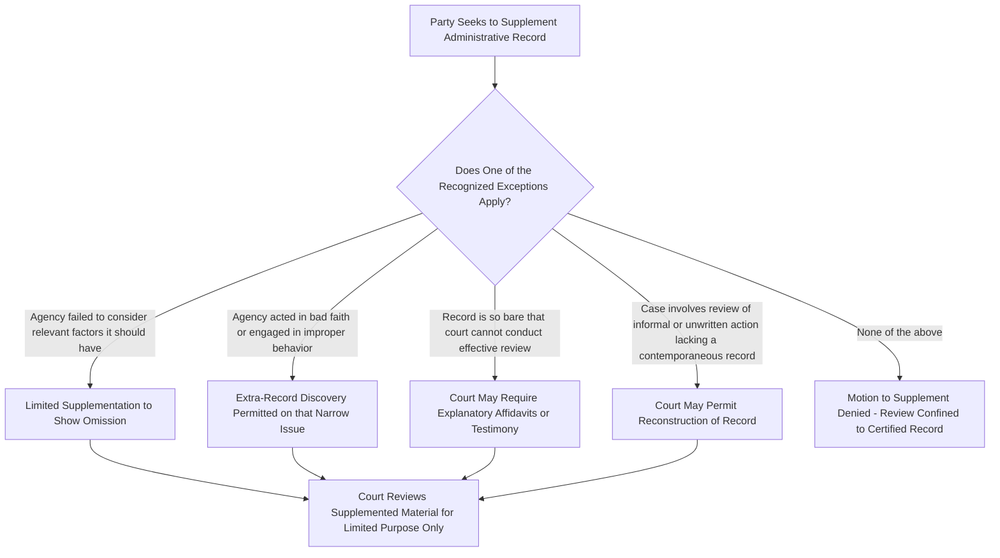

## The Administrative Record Rule and Limits on Record Supplementation

### Core Principle

Judicial review of agency action is ordinarily confined to the **administrative record** — the materials the agency actually considered when it made the decision under review. This is often called the **record review rule** or the **Camp v. Pitts / Overton Park principle**, after the foundational cases establishing that a reviewing court must judge the agency's action on the basis of what the agency had before it at the time, not on new evidence, post-hoc justifications, or a freshly reconstructed rationale.

The rule serves the basic architecture of arbitrary-and-capricious and substantial-evidence review: courts are not supposed to conduct their own independent fact-finding or to second-guess the agency by considering evidence the agency never saw. The task is to review the **reasonableness of the decision the agency actually made**, based on **what the agency actually had**.

### Foundational Cases

**1. Citizens to Preserve Overton Park, Inc. v. Volpe, 401 U.S. 402 (1971)**

Established that review of informal agency action under the arbitrary-and-capricious standard must be based on the full administrative record before the agency, not merely litigation affidavits or post-hoc explanations. The Court remanded for the agency to prepare a proper administrative record and, if that proved inadequate, allowed for limited additional evidence (such as testimony from agency decisionmakers) — a step that later cases treated as an unusual and narrow exception rather than routine practice.

**2. Camp v. Pitts, 411 U.S. 138 (1973)**

Reinforced that if the administrative record is inadequate to enable meaningful review, the proper remedy is ordinarily a **remand to the agency** for further explanation or record development — not for the court to take new evidence itself or for the agency to bolster its case through post-hoc affidavits filed during litigation.

**3. SEC v. Chenery Corp. (Chenery I), 318 U.S. 80 (1943)**

Established that a court may uphold agency action **only on the grounds the agency itself invoked**, not on alternative grounds the agency could have relied upon but did not articulate at the time. This "Chenery principle" is the doctrinal backbone barring **post-hoc rationalization** — a closely related but distinct concept from record supplementation, addressed further below.

### What the Administrative Record Contains

**Key Points**

- The record includes all materials the agency **directly or indirectly considered** in reaching its decision — not merely the materials that support the agency's chosen outcome.
- This includes: comments and data submitted during notice-and-comment rulemaking, internal agency memoranda relied upon, scientific and technical studies considered, and the agency's own explanatory statements (e.g., a rule's preamble or a final order's statement of basis and purpose).
- The record is generally **compiled and certified by the agency itself**, which creates an inherent tension: the agency has an incentive to define the record's boundaries in ways favorable to defending its own decision.
- **[Inference]** Because the agency controls record compilation in the first instance, disputes over whether the record is complete or improperly narrowed are a recurring litigation flashpoint, particularly in environmental cases involving voluminous scientific records.

### The General Rule Against Supplementation

Courts have developed a strong presumption against supplementing the administrative record with material outside what the agency considered. The rationale tracks the purpose of record review itself:

$$\text{Scope of Review} = \text{Record as Compiled by Agency at Time of Decision}$$

Allowing routine supplementation would effectively convert arbitrary-and-capricious review into a de novo fact-finding proceeding, undermining the deferential structure of administrative review and inviting parties to build a better record in litigation than existed when the agency actually decided.

### Recognized Exceptions to the Record Rule

Courts (particularly the D.C. Circuit and other federal circuits addressing this issue extensively) have identified a small set of **narrow, non-routine exceptions** permitting a court to look beyond, or supplement, the certified administrative record:

The commonly cited exception categories are:

1. **The agency deliberately or negligently excluded documents that may be adverse to its position.** If a plaintiff can show the agency omitted relevant material from the certified record, limited supplementation may be permitted to correct the omission — but this exception requires more than speculation; courts generally demand a specific showing of bad faith or improper exclusion.
2. **The agency failed to consider factors that are relevant to its final decision.** Where the challenge is precisely that the agency ignored an important aspect of the problem (a common `State Farm` "hard look" argument), some courts allow limited extra-record evidence to demonstrate what the agency should have considered but did not.
3. **The agency considered evidence that it failed to include in the record.** If it appears the agency relied on material not formally placed in the certified record, that material may need to be added to accurately reflect what was "before" the agency.
4. **Evidence is necessary to explain highly technical matters.** Courts occasionally permit limited extra-record materials (such as expert affidavits) purely to help the court **understand** a complex technical record — not to supply new substantive evidence bearing on the merits.
5. **Plaintiffs make a strong showing of bad faith or improper behavior** on the part of agency decisionmakers — this exception derives from *Overton Park*'s suggestion that in extraordinary circumstances (e.g., evidence the agency's stated reasons were pretextual), a court may permit deposition or testimonial inquiry into the decisionmakers' actual reasoning process.

**[Unverified]** The precise labeling and number of these exceptions (commonly cited as four, five, or eight depending on the circuit and formulation) varies across circuits, and courts frequently disagree about how narrowly to construe them; practitioners should verify the controlling circuit's specific articulation before relying on a particular formulation, since application varies by jurisdiction and case posture.

### Distinguishing Record Supplementation from Post-Hoc Rationalization

These are related but analytically distinct limits, both flowing from the same underlying commitment to record-based review:

| Concept | What It Restricts | Governing Principle |
| --- | --- | --- |
| Record supplementation limits | Adding **new material** to the evidentiary record for the court's review | Overton Park / Camp v. Pitts |
| Post-hoc rationalization bar | Adding **new reasons or justifications** not given by the agency at the time of decision | Chenery I |

**Example**

An agency denies a permit citing "insufficient mitigation measures." In litigation, agency counsel argues the denial can also be justified because the applicant's traffic study was outdated — a rationale the agency's decision never mentioned.

- This is a **Chenery** post-hoc rationalization problem: the court cannot uphold the denial on a ground the agency itself did not rely upon, regardless of whether that ground appears anywhere in the record.
- If, separately, the applicant tries to introduce a brand-new expert report never presented to the agency to show the mitigation measures were actually adequate, that is a **record supplementation** problem: the report was never part of what the agency considered.

### The Remedy When the Record Is Inadequate

When a court concludes the certified record is insufficient to permit meaningful judicial review (rather than simply insufficient to support the agency's conclusion), the standard remedy is **remand to the agency**, not:

- Judicial fact-finding to fill the gap, or
- Automatic reversal on the merits without giving the agency an opportunity to develop or explain the record further.

**Key Points**

- Remand allows the agency to supplement its **reasoning** and explanation — consistent with Chenery's requirement that the agency, not the court or litigating counsel, supply the rationale for its own action.
- A court's decision to remand versus vacate outright often depends on whether the deficiency is correctable and whether vacatur would cause significant disruption — a separate doctrinal inquiry (remand without vacatur) that interacts with, but is distinct from, the record rule itself.

### Application in Environmental Administrative Law

The administrative record rule is especially significant in environmental law given the technical, science-heavy, and often voluminous nature of environmental agency records (e.g., environmental impact statements under NEPA, water quality criteria determinations, species listing decisions under the Endangered Species Act).

**Example**

In a challenge to an agency's Endangered Species Act listing decision, a petitioner might argue the agency ignored certain population studies. Under the record rule:

- If those studies were **submitted to the agency during the comment period** but not addressed in the final decision, they are already part of the record, and the argument is that the agency failed to adequately consider material already before it (a "hard look" argument reviewed on the existing record).
- If the petitioner wants to introduce **brand-new studies never presented to the agency**, that request implicates the record supplementation exceptions above and will typically be denied absent a showing that one of the narrow exceptions applies — the proper vehicle for new scientific information is ordinarily a new petition to the agency, not introduction into the existing judicial record.

**[Inference]** Given the frequency of technically complex, science-driven environmental rulemakings, courts in this domain are relatively likely to encounter and apply the "necessary to explain technical matters" exception, though this does not open the door to substantive new evidence bearing on the merits of the agency's scientific judgment.

### Practical Litigation Checklist

**Next Steps**

1. Obtain and review the agency's certified administrative record index carefully; identify any gaps relative to what the agency's decision document itself cites or references.
2. Determine whether the challenge concerns record supplementation (was the material before the agency?) or post-hoc rationalization (is this the agency's actual stated reason?) — the two require different legal arguments.
3. If seeking to supplement, identify which specific narrow exception applies and gather concrete evidence supporting it (not mere speculation that the agency might have missed something).
4. If the record appears inadequate for review, frame the request as one for **remand to the agency**, not for the court to take new evidence or supply the missing analysis itself.
5. Distinguish arguments that the agency ignored relevant, already-in-record evidence (a valid "hard look" argument reviewable on the existing record) from arguments that require introducing genuinely new evidence (subject to the stringent supplementation bar).

### Related Topics

- Chenery I and II doctrines on post-hoc rationalization
- Remand without vacatur as a judicial remedy
- State Farm hard look review and failure to consider relevant factors
- NEPA environmental impact statement record requirements
- Notice-and-comment rulemaking record compilation (APA § 553)
- Ex parte contacts and their effect on the administrative record
- Standing and the record in environmental citizen suits
- De novo review of agency action distinguished from record review
- Reasoned decision making and changed agency positions (Fox Television)
- Discovery limits in APA record-review litigation