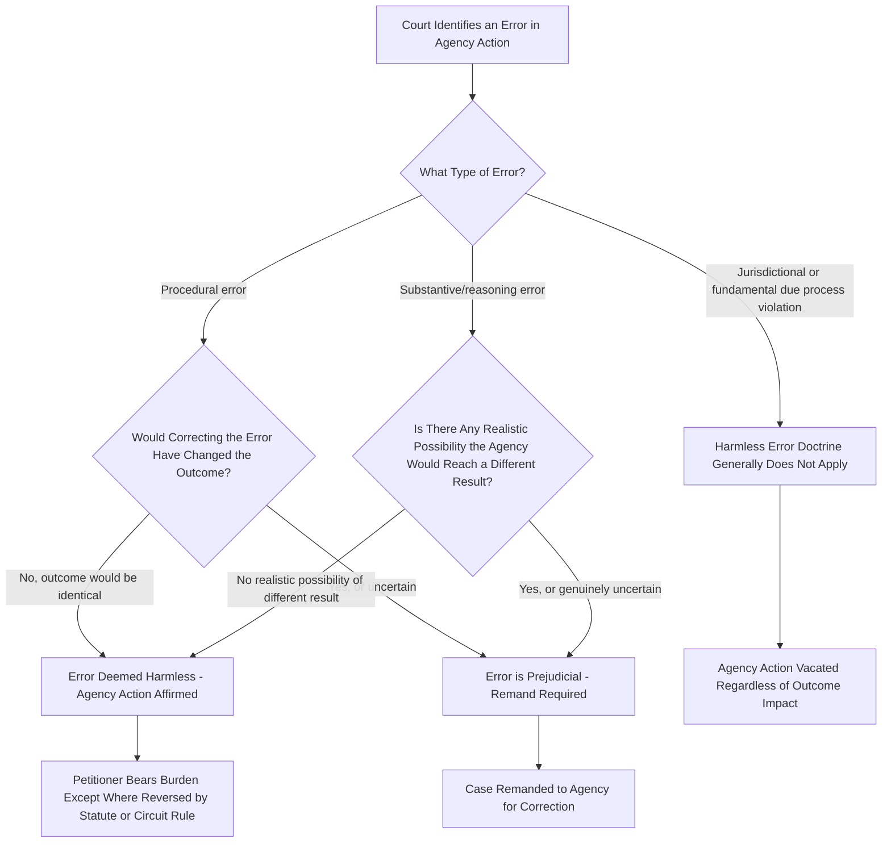

## Harmless Error Analysis in Administrative Litigation

### Core Concept

Harmless error analysis addresses a distinct question from whether an agency erred at all: **given that the agency committed some legal, procedural, or substantive error, must a court nonetheless set aside the agency's action, or may the court affirm because the error made no difference to the outcome?**

The doctrine reflects a judicial reluctance to require wasteful, purely formal remands when it is clear the agency would reach — or could only reach — the same result even without the error. It operates as a **limiting principle** on the remedial consequences of judicial review, applied only after a court has already concluded that some deficiency exists in the agency's action.

### Statutory Basis

In the U.S. federal system, harmless error analysis in administrative litigation is grounded in **5 U.S.C. § 706**, the APA's judicial review provision, which instructs that "due account shall be taken of the rule of prejudicial error." This textual directive imports the general harmless-error principle from civil and administrative procedure directly into the standard for reviewing agency action — a court is not to reverse automatically upon finding *any* error, but must assess whether the error was prejudicial.

**Key Points**

- The "due account" language places an affirmative statutory obligation on reviewing courts to consider whether an identified error actually prejudiced the outcome.
- This is not merely a discretionary matter of judicial economy — it is a **statutory command** built into the review standard itself.
- The doctrine applies across the range of agency error types: procedural violations, evidentiary errors, incomplete explanations, and certain substantive missteps — though its application differs significantly depending on error type (see below).

### The Analytical Framework

### Who Bears the Burden

A significant point of doctrinal and circuit disagreement concerns **which party bears the burden** of showing harm (or harmlessness):

- **Traditional civil litigation analog**: In ordinary civil appeals, the party asserting error (the appellant) typically bears the burden of showing the error was prejudicial.
- **Administrative law application**: Courts and commentators have disagreed about whether this burden allocation transfers cleanly to APA review, given that the agency — not the party challenging the action — is usually the one that created the error and is in the best position to explain whether the outcome would have differed.
- **[Unverified]** The Supreme Court's decision in *Shinseki v. Sanders*, 556 U.S. 396 (2009), addressed this question in the context of veterans' benefits adjudication, holding that ordinarily the party challenging the agency's decision bears the burden of showing that an error was harmful — but the Court was careful to note this default burden allocation can be modified by context, statute, or the specific interests at stake, and application of *Sanders* outside its specific veterans-benefits notice-error context has not been uniform across circuits.

### Distinguishing Error Types

Harmless error analysis is applied with markedly different rigor depending on what kind of error occurred:

| Error Type | Typical Treatment | Rationale |
| --- | --- | --- |
| Minor procedural defect (e.g., notice technicality with no substantive effect) | Frequently deemed harmless | Formal defect did not affect party's ability to participate meaningfully |
| Failure to provide required notice-and-comment opportunity | Rarely deemed harmless | Comment right is substantive and its denial is presumptively prejudicial |
| Incomplete or inadequate explanation (reasoned decision making defect) | Mixed — depends on whether the gap in reasoning affects reviewability | If court can determine agency's path despite the gap, may be harmless; if not, remand required |
| Reliance on improper or extra-record evidence | Fact-specific | Harmless if other, properly considered evidence independently supports the same result |
| Violation of a mandatory statutory procedure | Generally not harmless | Statutory procedural mandates are often treated as prejudicial per se, especially where Congress specified the procedure precisely because of its importance |
| Constitutional due process violation | Harmless error doctrine generally does not apply, or applies only in narrow circumstances | Fundamental rights violations are treated differently from ordinary procedural missteps |

### Relationship to Chenery and Remand-Without-Vacatur Doctrines

Harmless error analysis interacts with, but is distinct from, two related doctrines:

**1. Chenery I (post-hoc rationalization bar)**

Chenery prohibits a court from upholding agency action on grounds the agency did not itself rely upon. Harmless error analysis operates differently: it does not supply a *new* justification for the agency's action — it asks whether the agency's **own stated rationale**, despite containing some flaw, would still have produced the same outcome. Courts must be careful not to let harmless error analysis collapse into a backdoor form of post-hoc rationalization, since finding an error "harmless" based on reasoning the agency never articulated risks substituting the court's judgment for the agency's.

**2. Remand without vacatur**

Remand without vacatur allows a court to identify a defect in agency action yet leave the action in effect while the agency corrects the problem, typically weighing the seriousness of the deficiency against the disruptive consequences of vacatur. This is analytically distinct from harmless error: remand without vacatur presumes the error is **not** harmless (correction is still required) but addresses the *remedy*, whereas harmless error analysis asks whether correction is even necessary in the first place.

### Application in Environmental Administrative Law

Harmless error arguments arise frequently in environmental litigation, particularly regarding NEPA procedural compliance and permitting decisions.

**Example**

An agency fails to circulate a supplemental environmental assessment for public comment before finalizing a permit, but the substantive analysis in the supplemental assessment is materially identical to information already available and commented upon in the original environmental assessment.

- A court applying harmless error analysis would ask whether the **omission of the additional comment period** deprived the public of any **meaningful opportunity** to raise issues not already addressed — if the supplemental information added nothing new and commenters had already raised and the agency had already addressed the relevant concerns, the procedural defect may be deemed harmless.
- Conversely, if the supplemental assessment contained **new data or a materially different analysis** (e.g., updated modeling showing greater environmental impact) that the public never had a chance to respond to, the failure to provide comment is very unlikely to be deemed harmless, because the core purpose of notice-and-comment — informed public participation — was frustrated.

**Example**

An agency's permit denial includes a factual finding that later turns out to rest on an outdated data source, but the agency's decision also rests independently on two other, adequately supported grounds sufficient on their own to justify the denial.

- If those independent grounds are sufficient standing alone, the error in relying on outdated data may be harmless, because correcting it would not change the outcome.
- **[Inference]** Courts applying this reasoning typically require that the independent, unchallenged grounds be clearly sufficient on their own — if there is genuine doubt whether the agency would have reached the same conclusion absent the flawed ground, remand is the safer and more common outcome.

### Limits on the Doctrine

**Key Points**

- Harmless error analysis is **not** a vehicle for excusing agencies from compliance with mandatory statutory procedures Congress specifically required (e.g., certain formal rulemaking procedures, statutorily mandated consultation requirements).
- Courts are generally skeptical of harmless error arguments in contexts involving **third-party participation rights** (e.g., public comment, intervenor rights), because the harm from denying participation is often precisely the loss of the opportunity to influence the outcome — a harm that is inherently difficult to disprove after the fact.
- The doctrine does not extend to correct genuine **jurisdictional defects** — if an agency lacked authority to act at all, the resulting action is void regardless of whether the outcome "would have been the same" under a hypothetical proper procedure.
- **[Speculation]** Some administrative law scholars have argued the doctrine, if applied too expansively, risks undermining the deterrent effect of procedural requirements on agencies, since agencies facing lax harmless-error review may have reduced incentive to comply carefully with procedural obligations in the first instance; this is a normative critique rather than a settled point of doctrine.

### Practical Litigation Checklist

**Next Steps**

1. Identify precisely what type of error occurred (procedural, evidentiary, reasoning gap, statutory violation, constitutional) since the applicable harmless-error framework differs substantially by category.
2. Determine which party bears the burden of showing harm or harmlessness under the controlling circuit's case law, and gather evidence accordingly.
3. For procedural defects, focus argument on whether the defect deprived a party of a **meaningful opportunity** to participate or influence the outcome, not merely on the formal existence of the defect.
4. For reasoning defects, assess whether the agency's decision rests on **independent, adequately supported grounds** sufficient to sustain the outcome without the flawed component.
5. Avoid framing a harmless-error argument in a way that requires the court to supply a rationale the agency itself never gave — that risks running afoul of the Chenery post-hoc rationalization bar.
6. For statutory or constitutional procedural mandates, treat the harmless-error defense as significantly weaker or unavailable, and focus argument instead on whether the mandate was actually satisfied.

### Related Topics

- Chenery I and II doctrines on post-hoc rationalization
- Remand without vacatur as a judicial remedy
- Reasoned decision making and changed agency positions (Fox Television)
- The administrative record rule and limits on record supplementation
- NEPA procedural compliance and adequacy of public comment
- Notice-and-comment rulemaking defects under APA § 553
- Due process requirements in administrative adjudication
- Shinseki v. Sanders and burden allocation in benefits adjudication
- Jurisdictional defects versus procedural error in agency action
- Standing and prejudice requirements in administrative appeals