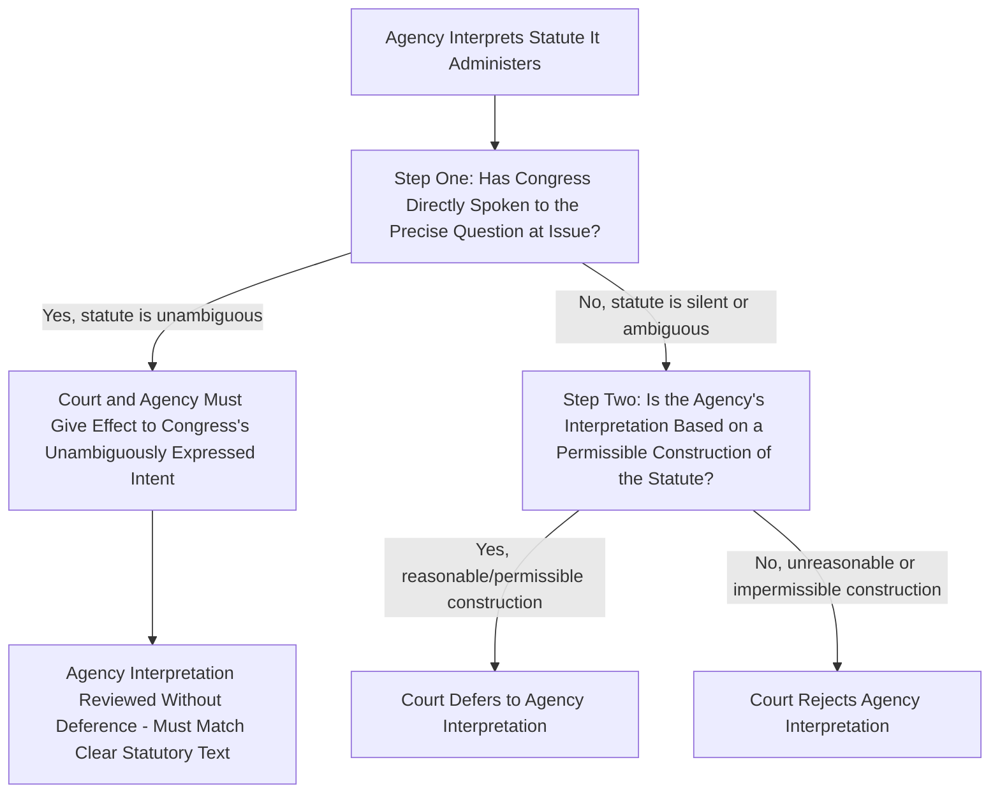

## Chevron USA v. NRDC and the Two-Step Deference Framework

### Overview and Current Status

*Chevron U.S.A., Inc. v. Natural Resources Defense Council, Inc.*, 467 U.S. 837 (1984), established what became the dominant framework for judicial review of an agency's interpretation of the statute it administers for roughly four decades. It was formally **overruled** by *Loper Bright Enterprises v. Raimondo*, 603 U.S. 369 (2024). Because Chevron shaped nearly every administrative law and environmental law decision issued between 1984 and 2024, and because pre-2024 case law (including foundational environmental law precedent) is built on the Chevron framework, understanding it remains essential both historically and for interpreting the large body of law decided under it.

**Key Points**

- Chevron is no longer the operative deference doctrine in U.S. federal courts as of the *Loper Bright* decision (2024).
- The two-step framework described below governed judicial review of agency statutory interpretation for the entire period in which most modern environmental regulatory law developed (Clean Air Act, Clean Water Act, RCRA, CERCLA, ESA implementation, etc.).
- This entry addresses the Chevron doctrine on its own terms, with its post-Loper Bright status addressed in a dedicated section below.

### Factual and Procedural Background

The case arose from an EPA regulation implementing the Clean Air Act's permitting program for new pollution sources. The EPA had defined "stationary source" using a **"bundling" or plant-wide definition** — treating an entire industrial plant as a single source, so that a company could modify one piece of equipment within the plant without triggering permitting requirements, as long as overall plant emissions did not increase. Environmental groups challenged this interpretation as contrary to the statute's purpose.

### The Two-Step Framework

The Supreme Court articulated a now-famous two-step inquiry for reviewing an agency's interpretation of a statute it administers:

**Step One**: The reviewing court first asks whether Congress has "directly spoken to the precise question at issue." This requires ordinary tools of statutory construction — text, structure, purpose, legislative history — to determine whether the statute is genuinely ambiguous on the specific point in dispute, or whether it has a single clear answer. If the statute is clear, that clear meaning controls; neither the agency nor the court has discretion to adopt a different reading.

**Step Two**: If the statute is "silent or ambiguous" on the specific question, the court does not ask what the *best* reading of the statute is. Instead, the court asks only whether the agency's interpretation is **"based on a permissible construction of the statute"** — a reasonableness inquiry, not a correctness inquiry. If the agency's reading is one of the range of interpretations a reasonable agency could adopt, the court defers, even if the court itself might have interpreted the statute differently in the first instance.

### Rationale for Deference

The Chevron Court offered several justifications for this deferential posture:

1. **Implicit congressional delegation**: When Congress leaves a gap or ambiguity in a statute administered by an agency, the Court reasoned this often reflects an implicit delegation of interpretive authority to the agency to fill that gap through its expertise and administrative processes, rather than an oversight for courts to correct.
2. **Agency expertise**: Agencies possess specialized technical and scientific expertise in the subject matter of the statutes they administer (highly salient in environmental, health, and safety regulation) that courts, as generalist bodies, generally lack.
3. **Political accountability**: Agencies, as part of the executive branch, are more politically accountable (through the President) than life-tenured judges, making them arguably better suited to make policy judgments implicit in resolving statutory ambiguity — particularly where such judgments involve competing considerations that are "not for the courts, but for the political branches."
4. **Uniformity and administrability**: Deference promotes a single, nationally uniform interpretation of a statute (the agency's), avoiding the risk of inconsistent interpretations across circuits deciding the same ambiguous provision differently in the absence of deference.

### Threshold Requirement: Chevron Step Zero

Before even reaching Step One, courts developed a threshold inquiry — informally called **"Step Zero"** — asking whether Chevron deference applies **at all** to the type of agency action at issue. This inquiry, developed primarily through *United States v. Mead Corp.*, 533 U.S. 218 (2001), asked whether:

- Congress delegated authority to the agency to make rules carrying the **force of law**, and
- The agency interpretation at issue was promulgated in the exercise of that authority (e.g., through notice-and-comment rulemaking or formal adjudication), as opposed to an informal interpretation (such as an opinion letter, policy statement, or internal guidance) that carries less formal weight.

**Key Points**

- Interpretations announced through **notice-and-comment rulemaking** or **formal adjudication** were generally understood to satisfy the Mead "force of law" threshold and receive full Chevron deference.
- Informal agency pronouncements (opinion letters, guidance documents, internal manuals) that lacked this formal indicia of delegated lawmaking authority typically received a lesser form of deference, called **Skidmore deference** (from *Skidmore v. Swift & Co.*, 323 U.S. 134 (1944)) — a sliding-scale respect based on the thoroughness of the agency's reasoning, consistency with earlier pronouncements, and the persuasiveness of its reasoning, rather than binding deference.

### Chevron Step One in Depth

At Step One, courts employed the traditional tools of statutory interpretation:

- **Plain text and grammar** of the specific provision;
- **Statutory structure** — how the provision fits within the surrounding statutory scheme;
- **Legislative purpose and history**, where relevant and reliable;
- Canons of construction (e.g., avoiding surplusage, expressio unius, noscitur a sociis).

If these tools yield a single clear answer, the inquiry ends there — deference is never reached, because there is no "gap" for the agency to fill. A large body of Chevron-era litigation therefore focused heavily on **characterizing** whether a given statutory term was genuinely ambiguous (opening the door to Step Two deference) or had one clear meaning (foreclosing deference).

**Example**

In the underlying Chevron case, the Court found the term "stationary source" in the Clean Air Act was not defined with the precision needed to resolve whether it meant an entire plant or each individual emitting unit within a plant — this textual gap meant the inquiry proceeded to Step Two.

### Chevron Step Two in Depth

At Step Two, the inquiry was deliberately deferential:

- The question was **not** "did the agency reach the correct answer?"
- The question was whether the agency's reading was a **reasonable, permissible** one among the range of interpretations the ambiguous text could bear.
- Courts upheld agency interpretations reflecting reasonable policy trade-offs (e.g., the EPA's "bundling" approach in Chevron itself, which the Court found reflected a reasonable accommodation of environmental protection goals with economic and administrative flexibility concerns) even where a court, interpreting the statute fresh, might have favored a different reading.

**Example**

The EPA's plant-wide "bundling" definition of "stationary source" was upheld under Step Two because it represented a reasonable policy choice — balancing environmental permitting rigor against regulatory flexibility and administrability — that fell within the range of interpretations the ambiguous statutory term could support, even though environmental groups had argued a stricter, unit-by-unit definition would have been more protective and was, in their view, the better reading.

### Interaction with Other Deference Doctrines

| Doctrine | Subject of Deference | Key Case |
| --- | --- | --- |
| Chevron deference | Agency interpretation of ambiguous statute it administers | Chevron v. NRDC (1984) |
| Skidmore deference | Weight given to less formal agency interpretations | Skidmore v. Swift & Co. (1944) |
| Auer/Seminole Rock deference | Agency interpretation of its own ambiguous regulation | Auer v. Robbins (1997); Bowles v. Seminole Rock (1945) |
| Mead "Step Zero" threshold | Whether Chevron applies at all to a given agency pronouncement | United States v. Mead Corp. (2001) |

Auer deference (interpretation of an agency's **own** regulations) is analytically distinct from Chevron (interpretation of a **statute**), though both were significantly narrowed or reshaped by later decisions — Auer was substantially cabined (though not overruled) in *Kisor v. Wilkie*, 588 U.S. 558 (2019), which required courts to exhaust ordinary interpretive tools and confirm genuine ambiguity, reasonableness, and other safeguards before deferring to an agency's reading of its own rule.

### The Major Questions Doctrine as a Limit

Even before Chevron's formal overruling, courts developed the **major questions doctrine** as a check on Step Two deference in cases involving agency assertions of authority over issues of vast economic or political significance. Under this doctrine, courts required **clear congressional authorization** before finding that an agency had authority to resolve such a major question, effectively declining to extend Chevron deference (or finding statutory ambiguity insufficient to support such sweeping authority) in cases like *West Virginia v. EPA*, 597 U.S. 697 (2022) (limiting EPA's authority to restructure the power generation sector under the Clean Air Act without clearer congressional authorization).

**[Inference]** The major questions doctrine functioned, in practice, as a significant erosion of Chevron's scope well before its formal overruling, since courts applying it declined to reach Step Two deference at all in high-stakes regulatory cases, instead demanding clear statutory authorization as a threshold matter.

### Overruling by Loper Bright Enterprises v. Raimondo (2024)

In *Loper Bright Enterprises v. Raimondo*, 603 U.S. 369 (2024), the Supreme Court overruled Chevron, holding that:

- Courts must exercise their own independent judgment in determining whether an agency has acted within its statutory authority, and may not defer to an agency's interpretation of an ambiguous statute simply because the statute is ambiguous.
- The APA's text (5 U.S.C. § 706, directing that "the reviewing court shall decide all relevant questions of law") requires courts to independently interpret statutes rather than defer to agency readings.
- Skidmore-style respect for agency interpretations (based on the agency's expertise, thoroughness, and persuasiveness) survives, but as a matter of the interpretation's **persuasive force**, not mandatory deference.
- The Court did **not** disturb prior cases that had specifically relied on Chevron as a basis for the specific holding in that case — those precedents remain subject to statutory stare decisis unless and until specifically overruled — but no future case may apply the Chevron framework going forward.

**Key Points**

- Loper Bright shifts the interpretive burden fully onto courts: judges now determine the best reading of an ambiguous environmental or administrative statute themselves, informed by (but not bound by) agency expertise.
- **[Inference]** This shift is likely to significantly affect environmental regulatory litigation going forward, since many environmental statutes (Clean Air Act, Clean Water Act, RCRA, CERCLA, ESA) contain broad or ambiguous terms that regulatory agencies previously received deference in construing; post-Loper Bright, courts must resolve these ambiguities through independent statutory analysis, informed by Skidmore-style respect rather than binding deference.
- The full practical contours of post-Loper Bright review are still developing in the lower courts, and application may vary significantly by circuit and by statute as this body of case law matures.

### Practical Analytical Checklist (Historical Chevron Application, With Post-Loper Bright Note)

**Next Steps**

1. Determine the applicable era: if analyzing a case decided before June 2024, apply the Chevron two-step framework as the operative standard; for anything decided or litigated after Loper Bright, apply independent judicial interpretation informed by Skidmore-style respect instead.
2. For historical Chevron analysis, first resolve the Step Zero/Mead threshold — was the interpretation issued with the force of law (formal rulemaking/adjudication) or informally?
3. At Step One, exhaust ordinary tools of statutory construction before concluding the statute is ambiguous — courts historically resisted finding ambiguity too readily.
4. At Step Two, assess reasonableness (not correctness) of the agency's construction relative to the range of permissible readings.
5. Check whether the major questions doctrine might apply (issues of vast economic/political significance), which could displace ordinary deference analysis even under the old framework.
6. For current litigation, reframe any Chevron-era argument in Loper Bright terms: focus on the best independent reading of the statute, using agency reasoning as persuasive authority under Skidmore rather than as binding deference.

### Related Topics

- Loper Bright Enterprises v. Raimondo and the end of Chevron deference
- Skidmore deference and sliding-scale persuasiveness review
- Major questions doctrine and clear-statement requirements
- Auer/Kisor deference to agency interpretation of own regulations
- United States v. Mead Corp. and the Step Zero threshold
- West Virginia v. EPA and limits on agency authority
- Nondelegation doctrine and its relationship to deference doctrines
- Statutory stare decisis and the retroactive effect of Loper Bright
- Reasoned decision making and changed agency positions (Fox Television)
- De novo review of agency action distinguished from deference doctrines