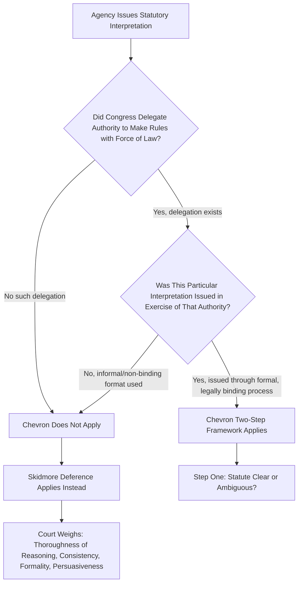

## Chevron's Domain: United States v. Mead and the Force of Law Limitation

### Overview

Before a court could apply the Chevron two-step framework to an agency's statutory interpretation, it first had to determine whether Chevron deference applied **at all** to the type of agency pronouncement at issue. This threshold inquiry — informally called **"Chevron Step Zero"** — was authoritatively addressed in *United States v. Mead Corp.*, 533 U.S. 218 (2001), which limited Chevron's domain to agency actions carrying the **"force of law."** Mead is essential to understanding Chevron's actual operative scope during its four-decade reign (1984–2024), and remains historically important for understanding the large body of pre-*Loper Bright* case law built on this distinction.

### Factual Background

The case arose from a classification ruling letter issued by the U.S. Customs Service, determining the tariff classification of imported "day planners" (three-ring binder organizers) under the Harmonized Tariff Schedule. Customs had reclassified the product, and Mead challenged the reclassification, arguing the classification ruling was contrary to the statute. The government argued the ruling letter was entitled to Chevron deference.

### The Central Holding

The Supreme Court held that Chevron deference applies **only** when:

1. **Congress delegated authority to the agency** to make rules or rulings that carry the **force of law**; and
2. **The agency interpretation at issue was promulgated in the exercise of that delegated authority.**

Customs classification ruling letters, the Court held, did **not** meet this threshold. They were issued without notice-and-comment procedures, were not binding on third parties beyond the specific transaction at issue, could be freely revised by Customs, and numerous different Customs offices could issue such rulings without centralized, formal process. As a result, the ruling letter was not the kind of formal, legally binding agency pronouncement Congress could be understood to have delegated final interpretive authority to make.

Because the classification letter fell outside Chevron's domain, the Court held it was instead entitled only to **Skidmore deference** — a lesser, sliding-scale form of respect based on the persuasiveness of the agency's reasoning, not the binding deference of Chevron Step Two.

### The Force-of-Law Framework

### Indicia of "Force of Law" — What Counts

Mead and subsequent cases identified several markers courts use to assess whether an agency pronouncement carries the force of law sufficient to trigger Chevron:

**Key Points**

- **Notice-and-comment rulemaking** under APA § 553 is the paradigm case of force-of-law action — such rules are generally binding on regulated parties and courts, and interpretations adopted through this process reliably received full Chevron deference.
- **Formal adjudication** — agency decisions issued through trial-type adjudicatory procedures with the rigor and finality Congress specified — similarly qualified.
- **Informal, non-binding pronouncements** — opinion letters, policy statements, interpretive guidance documents, internal agency manuals, and individualized rulings not binding beyond the parties to that specific matter — generally did **not** qualify for Chevron, regardless of how much technical expertise went into them.
- The inquiry focused on the **procedural pedigree and legal effect** of the specific pronouncement, not simply on whether the agency was authoritative or expert in the subject area generally.

### Contrast with Chevron Itself

**Example**

The EPA regulation at issue in Chevron itself — the "bundling" definition of "stationary source" — was promulgated through **formal notice-and-comment rulemaking**, giving it the force of law and squarely triggering the Chevron framework.

By contrast, the Customs ruling letter in Mead was an **individualized, non-binding classification determination** issued without notice-and-comment procedures and without the formal, generally-applicable legal effect associated with binding rules — placing it outside Chevron's domain even though it interpreted an ambiguous statutory/tariff term.

### Skidmore Deference as the Fallback

When an agency pronouncement falls outside Chevron's domain under Mead, courts apply **Skidmore deference** (from *Skidmore v. Swift & Co.*, 323 U.S. 134 (1944)) instead. Skidmore deference is not binding — it is a sliding-scale respect that varies with:

- The **thoroughness** evident in the agency's consideration;
- The **validity of its reasoning**;
- Its **consistency** with earlier and later agency pronouncements; and
- All those factors which give it power to persuade, if lacking power to control.

| Factor | Chevron Deference | Skidmore Deference |
| --- | --- | --- |
| Bindingness | Binding on court if reasonable | Persuasive only, not binding |
| Trigger | Formal, force-of-law agency action | Informal agency action of any kind |
| Court's role at "step two" equivalent | Reasonableness review only | Full independent judgment, informed by persuasiveness of agency's reasoning |
| Typical examples | Notice-and-comment rules, formal adjudications | Opinion letters, policy statements, guidance documents, informal rulings |

### Application to Guidance Documents and Interpretive Rules

Mead's force-of-law limitation had significant practical consequences for the large universe of agency **guidance documents** and **interpretive rules** — instruments agencies frequently use (including in environmental regulatory practice) to communicate their views on statutory or regulatory meaning without going through full notice-and-comment rulemaking.

**Example**

An EPA guidance memorandum interpreting how a Clean Water Act permitting term applies to a category of facilities, issued without notice-and-comment procedures and explicitly stated to be non-binding, would typically receive only Skidmore deference under Mead — a court would weigh the guidance's persuasiveness based on its reasoning and consistency, but would not be bound to accept it merely because it was a "permissible" reading of an ambiguous term.

**[Inference]** This distinction created a structural incentive for agencies seeking maximum judicial deference to route significant interpretive positions through formal notice-and-comment rulemaking rather than informal guidance — though agencies also frequently favored guidance documents for their speed and flexibility, accepting the tradeoff of reduced deference.

### Subsequent Refinement and Tension

Mead's force-of-law test generated substantial subsequent litigation over **how to classify borderline agency pronouncements** — for example, formal adjudications that lacked some trial-type features, or rules that technically went through notice-and-comment but addressed relatively minor procedural matters. Courts also grappled with:

- Whether an agency's **litigating position** in a particular case (as opposed to a pre-existing formal rule) could ever carry the force of law (generally, no — litigating positions were treated as entitled to little or no deference, reflecting concerns about post-hoc rationalization).
- Whether **interpretive rules** exempted from notice-and-comment under APA § 553(b)(A) could nonetheless sometimes carry sufficient formal characteristics to warrant Chevron treatment — this remained a genuinely contested and fact-specific inquiry throughout the Chevron era.

**[Unverified]** The precise line between an "interpretive rule" (generally not entitled to Chevron under Mead) and a "legislative rule" carrying the force of law is itself a distinct and heavily litigated administrative law question, and courts did not apply the distinction with full uniformity across circuits; practitioners analyzing a specific pre-2024 case should verify how the relevant circuit characterized the specific agency pronouncement at issue.

### Interaction with Auer Deference

Mead's force-of-law framework governed deference to agency interpretations of **statutes**. It should not be confused with **Auer deference** (from *Auer v. Robbins*, 519 U.S. 452 (1997), tracing to *Bowles v. Seminole Rock & Sand Co.*, 325 U.S. 410 (1945)), which concerned deference to an agency's interpretation of its **own ambiguous regulations** — a related but doctrinally distinct question, later substantially narrowed in *Kisor v. Wilkie*, 588 U.S. 558 (2019), which imposed its own set of threshold and reasonableness safeguards before such deference would apply.

### Significance for Environmental Law Practice (Historical)

Environmental statutes were administered through a wide range of agency pronouncement types — formal rulemakings, guidance memoranda, permit-specific determinations, enforcement policy statements — making the Mead distinction highly consequential in environmental litigation throughout the Chevron era.

**Example**

A challenge to an EPA rule setting numeric water quality criteria, issued through full notice-and-comment rulemaking, would receive full Chevron analysis (assuming the statute was ambiguous on the relevant point).

A challenge to an EPA regional office's informal letter interpreting how that same numeric criterion applies to a specific discharge scenario would, under Mead, likely receive only Skidmore deference — meaning a court retained significantly more independent latitude to disagree with the agency's specific application, weighing the persuasiveness of the office's reasoning rather than simply asking whether the reading was "permissible."

### Continuing Relevance After Loper Bright

*Loper Bright Enterprises v. Raimondo*, 603 U.S. 369 (2024), overruled Chevron itself, eliminating the binding deference Step Two provided even for force-of-law agency action. However, Mead's underlying **distinction between formal, force-of-law agency action and informal agency pronouncements** remains analytically relevant:

- Skidmore-style respect — turning on the thoroughness and persuasiveness of agency reasoning — survives Loper Bright as the operative mode of according weight to agency interpretations generally.
- **[Inference]** Post-Loper Bright, the practical difference between formal and informal agency pronouncements likely persists in a modified form: courts may still give somewhat greater weight to interpretations adopted through rigorous, formal procedures (as evidence of thorough reasoning) even though no category of agency pronouncement can any longer compel binding judicial deference the way Chevron Step Two once did for force-of-law rules.

### Practical Analytical Checklist

**Next Steps**

1. Identify the procedural form of the specific agency pronouncement at issue — notice-and-comment rule, formal adjudication, guidance document, opinion letter, individualized ruling, or litigating position.
2. For any case decided before June 2024, apply Mead's force-of-law test as the threshold before considering Chevron: does the pronouncement carry the legal effect and formal pedigree of delegated lawmaking authority?
3. If Chevron's threshold is not met, analyze the interpretation under Skidmore's sliding-scale factors: thoroughness, valid reasoning, consistency over time, and overall persuasive power.
4. Distinguish Mead's statutory-interpretation force-of-law inquiry from the separate Auer/Kisor framework governing deference to an agency's interpretation of its own regulations.
5. For current litigation post-Loper Bright, reframe the inquiry: use the formal/informal distinction as one input into assessing the persuasive weight of the agency's reasoning, not as a threshold gate to binding deference.

### Related Topics

- Chevron U.S.A. v. NRDC and the two-step deference framework
- Skidmore v. Swift & Co. and sliding-scale persuasiveness review
- Loper Bright Enterprises v. Raimondo and the end of Chevron deference
- Auer/Kisor deference to agency interpretation of own regulations
- Notice-and-comment rulemaking requirements under APA § 553
- Interpretive rules versus legislative rules distinction
- Formal versus informal adjudication procedures
- Major questions doctrine and clear-statement requirements
- Guidance documents and their evidentiary weight in litigation
- Post-hoc rationalization and litigating positions under Chenery