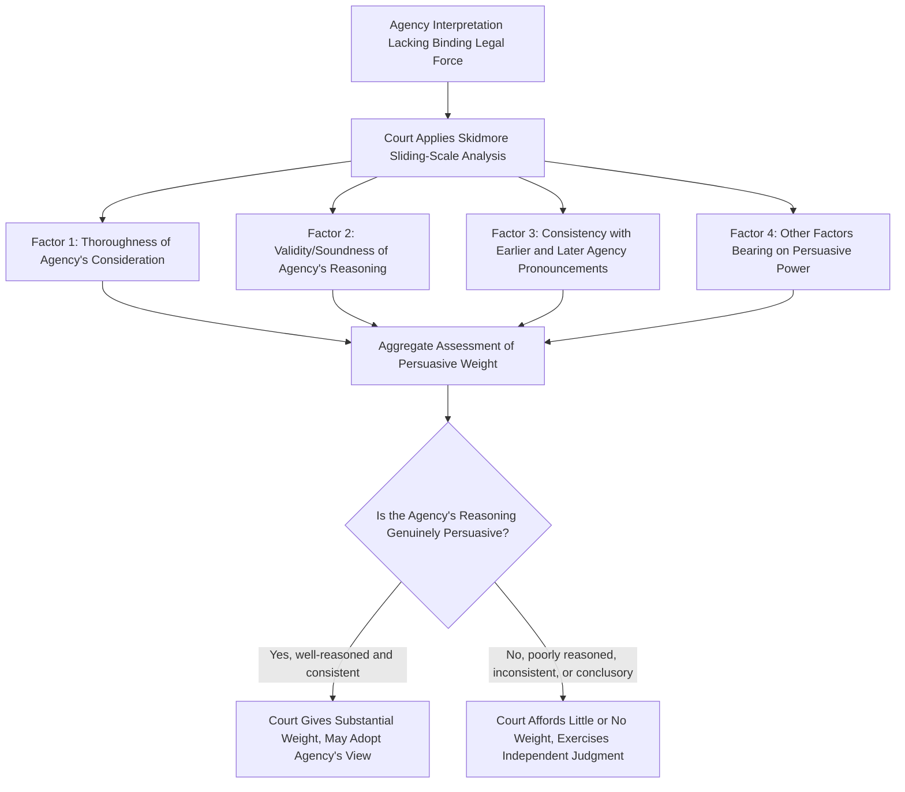

## Skidmore Deference and Persuasive Weight

### Overview

Skidmore deference is the framework courts use to accord respect to an agency's interpretation of a statute or legal question when that interpretation does **not** qualify for binding deference — whether because it lacks the force of law under the *Mead* threshold, or, after *Loper Bright Enterprises v. Raimondo*, 603 U.S. 369 (2024), because binding statutory deference no longer exists at all in U.S. federal courts. Unlike Chevron deference (which asked only whether the agency's interpretation was reasonable), Skidmore deference is fundamentally a matter of **persuasion, not obligation** — a court retains full independent authority to agree or disagree with the agency's reading, giving the agency's view weight only to the extent it is genuinely convincing.

### Origin: Skidmore v. Swift & Co.

*Skidmore v. Swift & Co.*, 323 U.S. 134 (1944), arose under the Fair Labor Standards Act, addressing whether time employees spent on standby duty at a plant constituted compensable "working time." The Administrator of the Wage and Hour Division had issued an interpretive bulletin addressing this question, but the bulletin was not a formal regulation carrying binding legal force.

Justice Jackson's opinion for the Court articulated the now-canonical formulation:

> The weight of such a judgment in a particular case will depend upon the thoroughness evident in its consideration, the validity of its reasoning, its consistency with earlier and later pronouncements, and all those factors which give it power to persuade, if lacking power to control.

This formulation established that an agency interpretation lacking binding legal force is not therefore **irrelevant** — it may still carry substantial persuasive weight, but that weight must be **earned** through the quality of the agency's reasoning rather than presumed from the agency's institutional status.

### The Skidmore Factors

**1. Thoroughness of Consideration**

Courts examine how carefully and comprehensively the agency examined the question — did it engage with the relevant statutory text, competing interpretations, and practical consequences, or was the pronouncement conclusory and cursory?

**2. Validity of Reasoning**

This factor asks courts to independently assess whether the agency's **logic actually holds up** — whether the interpretation follows soundly from the statutory text and relevant considerations, not simply whether the agency asserted a conclusion.

**3. Consistency with Earlier and Later Pronouncements**

An agency that has consistently maintained the same interpretive position over time (across different administrations, rulemakings, or guidance documents) generates more confidence that the position reflects genuine expert judgment rather than a litigation-driven or politically expedient stance adopted for a particular case. Conversely, an agency reversing its position — especially without explanation — undermines persuasive weight (though a well-justified change, per the *Fox Television* framework in the reasoned-decision-making context, need not be fatal).

**4. Other Persuasive Factors**

This catch-all factor allows courts to consider the agency's **specialized expertise** in the subject matter, the **complexity** of the technical or scientific question involved (where agency expertise is especially valuable), and any other indicia bearing on whether the agency's judgment merits genuine intellectual deference on the merits.

### Skidmore Compared to Chevron and Post-Loper Bright Practice

| Feature | Chevron (Historical, 1984–2024) | Skidmore |
| --- | --- | --- |
| Nature of deference | Binding if agency's reading is "permissible" | Persuasive only; never binding |
| Court's ultimate role | Accepts a reasonable agency reading even if not the court's preferred reading | Court reaches its own independent conclusion, informed by agency's reasoning |
| Trigger (historical) | Force-of-law agency action per *Mead* | Any agency interpretation, formal or informal |
| Standard applied | Reasonableness of agency's construction | Persuasiveness of agency's reasoning |
| Outcome if agency reasoning is weak | Court could still defer if construction was "permissible" | Court gives little or no weight; reaches independent judgment |

**Key Points**

- Skidmore is best understood not as a specific numeric standard but as a **methodology**: it directs courts to genuinely engage with and weigh agency reasoning rather than either ignoring it entirely or mechanically deferring to it.
- Skidmore deference could, in a well-reasoned case, functionally approach the practical weight of Chevron deference — a highly thorough, consistent, and well-reasoned agency interpretation might persuade a court just as effectively as binding deference would compel adherence. The doctrinal difference is that under Skidmore, that persuasive force must be **demonstrated** rather than presumed.
- Conversely, a poorly reasoned or inconsistent interpretation receives **little or no weight** under Skidmore, whereas under old Chevron Step Two, even a weak agency explanation might still survive if the underlying construction was reasonable — Skidmore is potentially far less protective of agency positions that are conclusory or thinly justified.

### Skidmore's Role Under the Mead Framework (Historical)

During the Chevron era, Skidmore functioned as the **default fallback** whenever an agency pronouncement failed the *Mead* force-of-law threshold — that is, whenever the agency's interpretation was issued through informal means (opinion letters, guidance documents, policy statements, individualized rulings) rather than notice-and-comment rulemaking or formal adjudication.

**Example**

A Department of Labor opinion letter interpreting whether a category of workers qualifies for a Fair Labor Standards Act exemption, issued without notice-and-comment procedures, would receive Skidmore deference — a court would weigh the letter's reasoning and consistency with the agency's other pronouncements but would retain full authority to reach a contrary conclusion if the letter's reasoning proved unpersuasive.

### Skidmore's Expanded Role After Loper Bright

*Loper Bright Enterprises v. Raimondo*, 603 U.S. 369 (2024), overruled Chevron and eliminated binding statutory deference to agency interpretations altogether — including for formal, force-of-law agency action that previously received full Chevron treatment. The Loper Bright Court explicitly preserved Skidmore-style respect as the surviving mode of accounting for agency expertise:

- Courts must now exercise **independent judgment** in interpreting statutes, using traditional tools of statutory construction, in every case — regardless of whether the agency's interpretation was issued through formal or informal means.
- Agency interpretations remain **relevant and potentially persuasive** — an agency's specialized expertise, especially on technical or scientific questions, can inform and strengthen a court's own independent analysis.
- The formal/informal distinction that mattered under Mead (triggering either Chevron or Skidmore) is no longer a **gate to binding deference**, since no category of agency pronouncement any longer commands binding deference; instead, the distinction may still bear on the persuasive weight a court chooses to accord, as one input among the traditional Skidmore factors (formality and procedural rigor can be evidence of thoroughness).

**[Inference]** Skidmore's practical importance has significantly increased post-Loper Bright, since it is now the primary doctrinal vehicle through which agency expertise and reasoning can influence judicial statutory interpretation at all, for both formal and informal agency pronouncements alike.

### Application in Environmental Law

Skidmore-style analysis is highly relevant in environmental regulatory litigation, particularly given the technical and scientific complexity of many environmental statutes and the frequent use of agency guidance documents to communicate regulatory positions.

**Example**

An EPA guidance document addressing how a particular Clean Air Act emissions testing methodology should be applied to a novel industrial process, if challenged, would be evaluated for persuasive weight based on: how thoroughly EPA engaged with the relevant scientific and engineering considerations, whether EPA's position has been applied consistently across similarly situated facilities, and whether EPA's underlying technical reasoning withstands independent scrutiny.

**Example**

A Fish and Wildlife Service biological opinion addressing whether a proposed action is likely to jeopardize a listed species' continued existence, while carrying substantial scientific expertise, would — to the extent it is challenged and is not otherwise entitled to a specific statutory deference standard — be evaluated on Skidmore-style grounds: the thoroughness of the scientific analysis, the internal consistency of the agency's reasoning, and the persuasiveness of the conclusions reached.

### Practical Litigation Considerations

**Key Points**

- Because Skidmore weight depends on the **quality** of the agency's reasoning rather than its formal status, litigants challenging an agency interpretation should focus on **substantively critiquing the reasoning** (gaps in logic, failure to address contrary evidence, inconsistency with prior positions) rather than merely arguing the pronouncement lacks binding force.
- Conversely, litigants **defending** an agency interpretation under Skidmore should emphasize the depth and rigor of the agency's analysis, its consistency over time, and the agency's genuine subject-matter expertise on the specific technical question — building the persuasive case affirmatively rather than relying on any presumption of correctness.
- **[Unverified]** Because Skidmore's weight is inherently case-specific and courts have not applied its factors with perfect uniformity, outcomes under Skidmore-style review can be less predictable than outcomes were under Chevron's more categorical two-step test; predicting a specific court's likely weighting of the factors requires close attention to that circuit's own precedent and the specific factual record.

### Practical Analytical Checklist

**Next Steps**

1. Confirm the interpretation at issue does not qualify for any distinct binding deference doctrine that might still apply in a particular context (e.g., Auer/Kisor deference to an agency's interpretation of its own regulation, which remains analytically separate from Skidmore).
2. Assess the **thoroughness** of the agency's engagement with the specific interpretive question — did it address counterarguments, alternative readings, and relevant technical complexity?
3. Evaluate the **internal logical soundness** of the agency's reasoning independent of its source — would the reasoning persuade on its own merits?
4. Research whether the agency has taken a **consistent position** over time, across administrations, and across related pronouncements — flag any unexplained shifts.
5. Weigh the agency's **specialized expertise** relative to the complexity of the specific question, particularly for highly technical or scientific determinations common in environmental and health regulatory contexts.
6. Present or rebut Skidmore weight by directly engaging the substance of the agency's reasoning, since post-Loper Bright, this substantive engagement — not procedural formality — is what principally determines how much weight a court will give the agency's view.

### Related Topics

- Chevron U.S.A. v. NRDC and the two-step deference framework (historical)
- United States v. Mead Corp. and the force of law limitation
- Loper Bright Enterprises v. Raimondo and the end of Chevron deference
- Auer/Kisor deference to agency interpretation of own regulations
- Reasoned decision making and changed agency positions (Fox Television)
- Guidance documents and their evidentiary weight in litigation
- Major questions doctrine and clear-statement requirements
- Statutory construction tools and canons of interpretation
- Agency expertise and judicial competence in technical rulemaking
- De novo review of agency action distinguished from deference doctrines