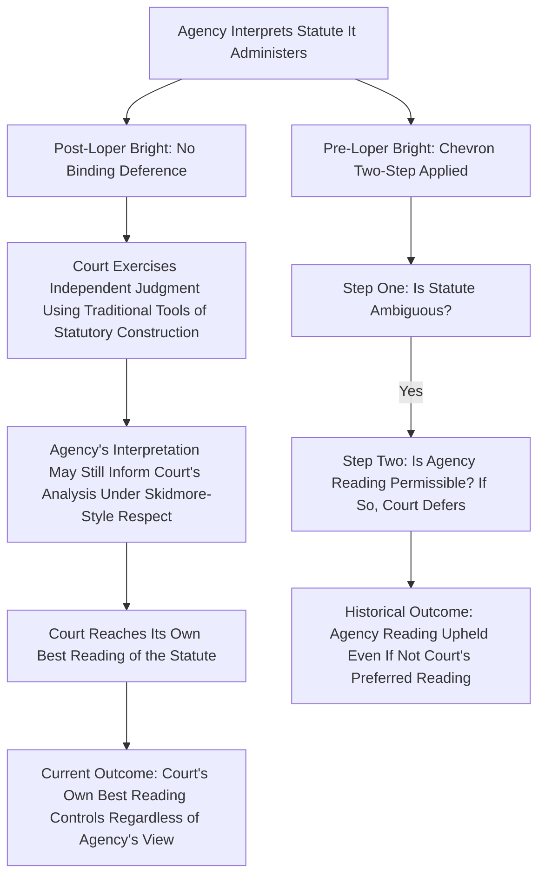

## Loper Bright Enterprises v. Raimondo and the End of Chevron Deference

### Overview

*Loper Bright Enterprises v. Raimondo*, 603 U.S. 369 (2024), decided together with its companion case *Relentless, Inc. v. Department of Commerce*, is the decision that formally overruled the principle of Chevron deference established in Chevron U.S.A., Inc. v. Natural Resources Defense Council, Inc. (1984), which had directed courts to defer to an agency's reasonable interpretation of an ambiguity in a law that the agency enforces. It is one of the most consequential U.S. administrative law decisions in decades, ending the deference framework that had governed judicial review of agency statutory interpretation for forty years. [Wikipedia](https://en.wikipedia.org/wiki/Loper_Bright_Enterprises_v._Raimondo)

**Key Points**

- Decided June 28, 2024, by the Chief Justice's opinion for the Court.
- The Court granted certiorari specifically to decide whether Chevron U.S.A. Inc. v. Natural Resources Defense Council, Inc., 467 U.S. 837, should be overruled or clarified. [Supreme Court of the United States](https://www.supremecourt.gov/opinions/23pdf/22-451_7m58.pdf)
- The decision applies to statutory interpretation generally, across every federal agency and every regulatory statute — not merely to the fisheries context in which the case arose.

### Factual and Procedural Background

The case arose out of a dispute under the Magnuson-Stevens Fishery Conservation and Management Act (FCMA), which authorizes regional councils to set certain standards for fishing off the coast of the United States. To ensure that those standards are followed, vessels may be required to carry an "observer" who monitors their fishing activity. [Faegre Drinker](https://www.faegredrinker.com/en/insights/publications/2024/6/supreme-court-decides-loper-bright-enterprises-v-raimondo)

The petitioners — Loper Bright Enterprises, Inc., H&L Axelsson, Inc., Lund Marr Trawlers LLC, and Scombrus One LLC, family businesses that operate in the Atlantic herring fishery — challenged a National Marine Fisheries Service rule requiring them to pay the costs of the observers placed aboard their vessels. They argued that the statute does not authorize the agency to mandate that they pay for the observers required by a fishery management plan. The lower courts, applying Chevron, upheld the rule on the ground that the statute's silence on cost allocation was an ambiguity to which the agency's interpretation was owed deference. [Legal Information Institute](https://www.law.cornell.edu/supremecourt/text/22-451)[Legal Information Institute](https://www.law.cornell.edu/supremecourt/text/22-451)

### The Central Holding

The Court held that the Administrative Procedure Act requires courts to exercise their independent judgment in deciding whether an agency has acted within its statutory authority, and courts may not defer to an agency interpretation of the law simply because a statute is ambiguous. [SCOTUSblog](https://www.scotusblog.com/cases/loper-bright-enterprises-v-raimondo/)

The Court grounded this holding in the text of Section 706 of the Administrative Procedure Act, holding that the Chevron framework violated that provision — specifically, § 706's command that "the reviewing court shall decide all relevant questions of law." The Court reasoned this text assigns the interpretive task to courts themselves, not to agencies whose readings courts must then simply test for reasonableness. [Congress.gov](https://www.congress.gov/crs-product/R48320)

### The Court's Reasoning

**1. Courts, Not Agencies, Interpret Statutes**

The majority emphasized that courts interpret statutes, no matter the context, based on the traditional tools of statutory construction, not individual policy preferences. Judicial interpretation of law is understood as the core constitutional function of Article III courts, and Chevron improperly transferred a portion of that function to the executive branch. [Supreme Court of the United States](https://www.supremecourt.gov/opinions/23pdf/22-451_7m58.pdf)

**2. Ambiguity Does Not Signal Delegated Interpretive Authority**

Chevron's foundational premise — that statutory silence or ambiguity reflects an implicit congressional delegation of interpretive authority to the agency — was rejected. The Court concluded that ambiguity in a statute is simply a case calling for ordinary judicial interpretation using traditional interpretive tools, not evidence that Congress meant to hand the resolution of that ambiguity to the agency.

**3. Rejecting the Uniformity Rationale**

The Court was skeptical of one of Chevron's original justifications — that deference promotes nationally uniform statutory interpretation. The opinion observed it is unclear how much the Chevron doctrine as a whole actually promotes such uniformity, and in any event, there is no reason to presume that Congress prefers uniformity for uniformity's sake over the correct interpretation of the law. [Supreme Court of the United States](https://www.supremecourt.gov/opinions/23pdf/22-451_7m58.pdf)

**4. Judges Retain Tools to Respect Genuine Delegations**

The Court clarified that this shift does not eliminate the judiciary's obligation to recognize situations where Congress genuinely and expressly delegated discretionary policymaking authority to an agency (as opposed to interpretive authority over what a statute means). As the opinion put it, to stay out of discretionary policymaking left to the political branches, judges need only fulfill their obligations under the APA to independently identify and respect such delegations of authority, police the outer statutory boundaries of those delegations, and ensure that agencies exercise their discretion consistent with the APA. [Supreme Court of the United States](https://www.supremecourt.gov/opinions/23pdf/22-451_7m58.pdf)

### The Companion Case: Relentless, Inc. v. Department of Commerce

The Court decided *Loper Bright* together with *Relentless, Inc. v. Department of Commerce* — on certiorari to the United States Court of Appeals for the First Circuit — presenting the same underlying question about the same Magnuson-Stevens Act observer-cost rule, arising from a different circuit. Deciding the cases together underscored that the ruling was not fact-bound to one circuit's approach but was intended to resolve the Chevron question uniformly across the federal judiciary. [Justia](https://supreme.justia.com/cases/federal/us/603/22-451/)

### Disposition on Remand

Beyond overruling Chevron, the Court did not resolve the underlying merits question of whether the statute actually authorized the challenged rule. Instead, consistent with the Court's holding that courts must now interpret the statute independently, the Supreme Court vacated the opinion of the D.C. Circuit and remanded for further proceedings so the lower courts could apply independent judgment to the statutory question without Chevron deference. [Loper Bright](https://loperbrightcase.com/)

### What Survives: Skidmore-Style Respect and Statutory Stare Decisis

**Key Points**

- The Court did not hold that agency interpretations are now legally irrelevant. Agency expertise can still inform a court's own independent interpretive analysis under *Skidmore v. Swift & Co.*-style persuasive weight — the agency's reasoning matters to the extent it is genuinely thorough, well-reasoned, and consistent, but it no longer commands binding deference merely because the statute is ambiguous and the agency's reading is "permissible."
- The Court addressed the retroactive effect of overruling Chevron on **prior cases** that specifically relied on the Chevron framework to reach their holdings: those precedents remain subject to ordinary principles of statutory stare decisis and are not automatically reopened, even though no future case may apply the Chevron methodology.
- **[Inference]** This stare decisis carve-out means a substantial body of environmental and administrative law decided under Chevron between 1984 and 2024 remains formally binding as precedent on its specific holdings, even though the interpretive method used to reach those holdings is no longer available to courts deciding new questions.

### Comparison: Pre- and Post-Loper Bright Review

| Feature | Chevron Era (1984–2024) | Post-Loper Bright (2024– ) |
| --- | --- | --- |
| Who resolves statutory ambiguity | Agency, if construction is "permissible" | Court, exercising independent judgment |
| Role of agency interpretation | Potentially binding on the court | Persuasive only, under Skidmore-style respect |
| Threshold inquiry | Mead "force of law" test (Step Zero) | No comparable gate to binding deference; formality may still bear on persuasive weight |
| Standard for agency's reading | Reasonableness | No special standard — court seeks the statute's best reading |
| Underlying rationale | Implied delegation, agency expertise, political accountability, uniformity | APA § 706 requires courts to decide all relevant questions of law independently |

### Significance for Environmental and Administrative Law

**[Inference]** Because major environmental statutes (Clean Air Act, Clean Water Act, RCRA, CERCLA, Endangered Species Act) contain numerous broad or ambiguous terms that regulatory agencies previously construed with Chevron's binding deference, Loper Bright is likely to significantly reshape environmental regulatory litigation going forward:

- Agencies can no longer rely on a *permissible* reading of an ambiguous term surviving judicial review simply because it is reasonable; courts will now independently determine the statute's best reading.
- Litigants challenging environmental regulations have a materially different and arguably more favorable posture for statutory challenges, since courts are no longer required to accept an agency's reasonable interpretation over a challenger's competing, equally reasonable interpretation.
- Agencies defending regulations must now build their case on the **actual best reading of the statute** (with genuine textual and structural support) rather than merely on the reasonableness of their interpretation relative to alternatives.
- The **major questions doctrine**, which had already narrowed Chevron's practical scope in high-stakes regulatory cases before 2024 (e.g., *West Virginia v. EPA*, 597 U.S. 697 (2022)), continues to operate as an independent clear-statement requirement, now functioning alongside (rather than as a carve-out from) the post-Loper Bright default of independent judicial interpretation.

### Practical Litigation Checklist

**Next Steps**

1. Identify whether the governing precedent for the specific statutory question was decided under Chevron before June 28, 2024; if so, assess whether that specific holding remains binding under statutory stare decisis, even though its underlying methodology is no longer applied prospectively.
2. For any new or pending challenge to agency statutory interpretation, frame arguments around the **best independent reading** of the statute using traditional tools of construction (text, structure, purpose, canons), not around whether the agency's reading was merely "permissible."
3. Marshal any relevant agency reasoning as **Skidmore-style persuasive support** — emphasizing thoroughness, consistency, and technical expertise — rather than asserting a claim to binding deference.
4. Distinguish arguments about the **existence of a genuine, express delegation** of discretionary policymaking authority (which courts still respect) from arguments that a statute is merely ambiguous (which no longer triggers deference on its own).
5. Watch for continued development of major questions doctrine arguments, which may operate as a heightened clear-statement requirement layered on top of ordinary independent statutory interpretation in high-stakes regulatory disputes.
6. For matters currently in agency proceedings or on judicial review, anticipate that reviewing courts will scrutinize the agency's statutory basis for authority significantly more closely than under the prior Chevron framework.

### Related Topics

- Chevron U.S.A. v. NRDC and the two-step deference framework (historical)
- United States v. Mead Corp. and the force of law limitation
- Skidmore deference and persuasive weight
- Major questions doctrine and clear-statement requirements
- West Virginia v. EPA and limits on agency authority
- Statutory stare decisis and the retroactive effect of overruling precedent
- Nondelegation doctrine and its relationship to deference doctrines
- Auer/Kisor deference to agency interpretation of own regulations
- Reasoned decision making and changed agency positions (Fox Television)
- Magnuson-Stevens Act and fisheries regulatory authority