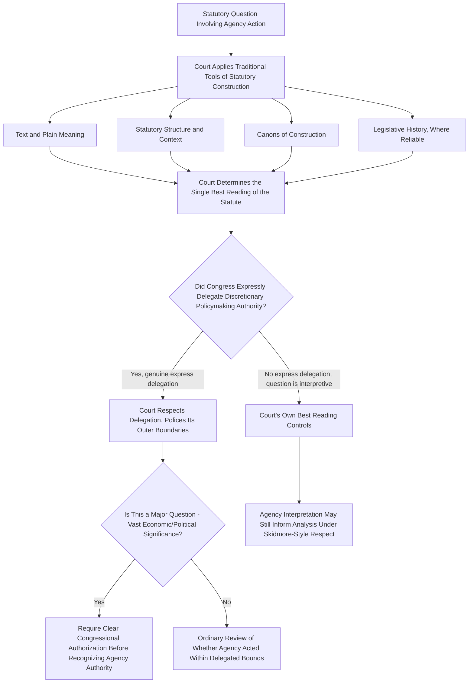

## Statutory Interpretation Methodology in the Post-Loper Bright Landscape

### Overview

Since *Loper Bright Enterprises v. Raimondo*, 603 U.S. 369 (2024), overruled Chevron, courts reviewing agency statutory interpretations no longer ask whether the agency's reading was "permissible." Instead, they must independently determine the statute's meaning using ordinary interpretive methodology. This shift has reshaped not just the outcome of individual cases but the entire **analytical architecture** courts use when agency action is challenged on statutory grounds. This topic surveys the emerging methodology, the doctrines interacting with it, and the significant open questions still developing in the lower courts.

### The Core Methodological Shift: From Deference to Independent Judgment

The central holding requires courts to exercise their independent judgment in deciding whether an agency has acted within its statutory authority, and bars deferring to an agency interpretation of the law simply because a statute is ambiguous. This produces a fundamentally different analytical posture:

**Key Points**

- Loper Bright instructs courts to use their own independent judgment when interpreting statutes — even on technical questions — and to find the **single best meaning** of the statute, meaning statutory meaning, once judicially determined, remains fixed going forward rather than shifting with each new agency interpretation.
- This methodological commitment to finding a single best, fixed meaning is widely understood as effectively directing courts toward **textualism** as the operative interpretive approach, since the search for one correct answer (rather than a range of "permissible" answers) naturally centers text, structure, and established interpretive canons.
- The entire inquiry is now framed as an ordinary question of statutory interpretation, not a specialized administrative-law deference inquiry — collapsing what had been a distinct two-step administrative doctrine back into general interpretive methodology.

### The Surviving Role of Agency Views: "Skidmore" and Contested "Shadow Skidmore"

Although Chevron deference is gone, the Court's opinion did not instruct courts to ignore agency interpretations altogether.

**Key Points**

- The Court returned to Skidmore's factors for judges to consider when interpreting a statute: an agency's contemporaneity and consistency, agency expertise, and the agency's accumulated body of experience and informed judgment — all weighed for their **persuasive**, not binding, force.
- Where an agency interpretation reflects specialized expertise and careful deliberation, courts are expected to give the interpretation significant weight and respect under Skidmore and Loper Bright — but this is fundamentally different from Chevron's rule, since the agency's view must earn its weight through the quality of its reasoning rather than receiving automatic deference merely because the statute is ambiguous.
- **[Unverified]** Commentators have identified a phenomenon sometimes called "shadow Skidmore" — instances where courts, including the Supreme Court itself, appear to give indirect weight to agency views reminiscent of Skidmore without fully explaining the analytical basis, raising questions about whether this practice will persist, evolve into a more explicit and consistent doctrine, or fade away as textualist methodology becomes more settled and courts rely less on any backup reference to agency views, similar to how some textualist judges have over time reduced reliance on legislative history. This is an actively debated and unsettled trajectory, not a resolved doctrinal point.

### Distinguishing Genuine Delegations from Ordinary Ambiguity

A critical piece of the post-Loper Bright methodology is the distinction between:

1. **Interpretive ambiguity** — where a statutory term's meaning is unclear, but this simply calls for ordinary judicial interpretation using traditional tools; the agency receives no special deference merely because the term is hard to pin down.
2. **Express delegation of discretionary authority** — where Congress has genuinely and expressly assigned the agency discretion to make a certain category of policy judgment (for example, authority to set a numeric standard within a statutorily bounded range, or to define technical terms through its own expertise-driven process). Here, the court's role is not to find the "best" substantive answer itself, but to confirm the delegation exists, police its outer statutory boundaries, and ensure the agency exercised its discretion consistent with the APA (e.g., through reasoned decision making).

**Example**

If a statute directs an agency to set an environmental emissions limit "as the Administrator determines is protective of public health, considering costs," this is a genuine delegation of discretionary authority — a court reviewing the agency's chosen numeric limit does not ask what limit the court itself would have picked, but instead reviews whether the agency reasonably exercised the delegated discretion (an arbitrary-and-capricious inquiry), while the definition of a separately disputed statutory term in the same statute (e.g., what counts as a "major source") is treated as an ordinary interpretive question subject to the court's own independent best reading.

### The Major Questions Doctrine's Uncertain Relationship to Loper Bright

Before Loper Bright, the major questions doctrine — under which courts require clear congressional authorization before recognizing agency authority over questions of vast economic or political significance, as in *West Virginia v. EPA*, 597 U.S. 697 (2022), and *Biden v. Nebraska* — had been understood by some as an **exception to Chevron deference**. With Chevron gone, its doctrinal grounding is contested.

**Key Points**

- Some courts and commentators have concluded Loper Bright does **not** disturb the major questions doctrine, treating it instead as an independent clear-statement rule rooted in separation-of-powers concerns rather than as merely a Chevron carve-out — meaning it continues to operate as before.
- Others argue Loper Bright's demise of Chevron deference **enhances** the practical significance of the major questions doctrine, since lower courts are now generally freer to apply more searching judicial scrutiny to agency action, giving the doctrine a larger role in enforcing separation-of-powers limits precisely because the deference regime that used to constrain judicial scrutiny is gone.
- **[Speculation]** Some observers have suggested Loper Bright's removal of Chevron deference could indirectly encourage greater reliance on direct presidential executive action in areas where agencies would otherwise have received deference, on the theory that a President might attempt through executive orders what agencies can no longer achieve through interpretations that would previously have received deference — this is a contested prediction about institutional behavior, not a settled legal consequence.
- **[Unverified]** Whether the major questions doctrine survives, expands, or is refined into a different form — including reports of new doctrinal wrinkles such as a possible presidential foreign policy or national security carve-out under discussion in the term following Loper Bright — remains an actively developing area; specific application should be verified against current circuit and Supreme Court case law rather than assumed static.

### Justifications Offered for Overruling Chevron and Their Methodological Implications

The Court's stated reasons for departing from forty years of precedent inform how lower courts are expected to apply the new framework:

| Justification Cited | Methodological Implication |
| --- | --- |
| Doctrinal narrowing and inconsistent application of Chevron over time | Courts should not attempt to revive Chevron-like deference through ad hoc reasoning; the framework is fully retired |
| Chevron's carveouts (e.g., the Mead "force of law" threshold) made the doctrine complex and unworkable | Courts need not preserve or reason from the old formal/informal distinction as a gate to deference, though formality may still bear on persuasive weight under Skidmore |
| The Court's own reduced reliance on Chevron in recent decisions before 2024 | Signals that lower courts should not expect a returning pendulum toward deference absent further Congressional or constitutional change |
| APA § 706's text directs courts to decide all relevant questions of law | Grounds the entire post-Loper Bright methodology in a textual, not merely policy-based, reading of the APA itself |

### Practical Methodology for Courts and Litigants

**Next Steps**

1. Begin every statutory challenge to agency action with an independent interpretive analysis using text, structure, canons, and (where reliable) legislative history — do not frame the threshold question as whether the statute is "ambiguous," since ambiguity no longer triggers deference.
2. Separately identify whether the statute contains a genuine, express delegation of discretionary policymaking authority to the agency, distinct from an interpretive question about statutory meaning; delegated discretion is reviewed for reasoned exercise, not re-derived by the court.
3. Where the agency's interpretation reflects genuine expertise, thoroughness, and consistency, marshal it as Skidmore-style persuasive support, not as a claim to binding deference.
4. In high-stakes regulatory disputes, assess whether the major questions doctrine's clear-statement requirement independently applies, since its status as separate from (rather than derivative of) Chevron means it may still function as a threshold barrier to agency authority regardless of ordinary interpretive analysis.
5. Track jurisdiction-specific developments closely — post-Loper Bright methodology, including the future of "shadow Skidmore" practices and the doctrine's interaction with major questions, remains in active development across circuits and terms, and application may vary substantially by court until further Supreme Court guidance settles open questions.

### Significance for Environmental Administrative Law

**[Inference]** Given the density of ambiguous and technical terms throughout environmental statutes, the shift to independent judicial interpretation is likely to be especially consequential in this domain: courts will need to develop their own textual and structural analyses of terms like "waters of the United States," "stationary source," or "best available technology" without the backstop of automatic deference to the implementing agency's reasonable construction, increasing the practical importance of careful statutory drafting and of building a persuasive, well-reasoned record during agency rulemaking to maximize Skidmore-style weight in any resulting litigation.

### Related Topics

- Loper Bright Enterprises v. Raimondo and the end of Chevron deference
- Skidmore deference and persuasive weight
- Chevron U.S.A. v. NRDC and the two-step deference framework (historical)
- United States v. Mead Corp. and the force of law limitation
- Major questions doctrine and clear-statement requirements
- West Virginia v. EPA and Biden v. Nebraska
- Nondelegation doctrine and constitutional limits on agency authority
- Textualism and canons of statutory construction
- Auer/Kisor deference to agency interpretation of own regulations
- Reasoned decision making and changed agency positions (Fox Television)