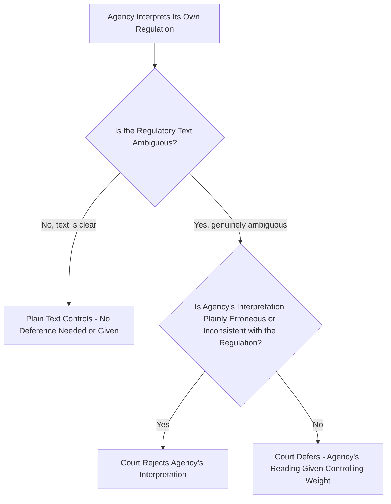
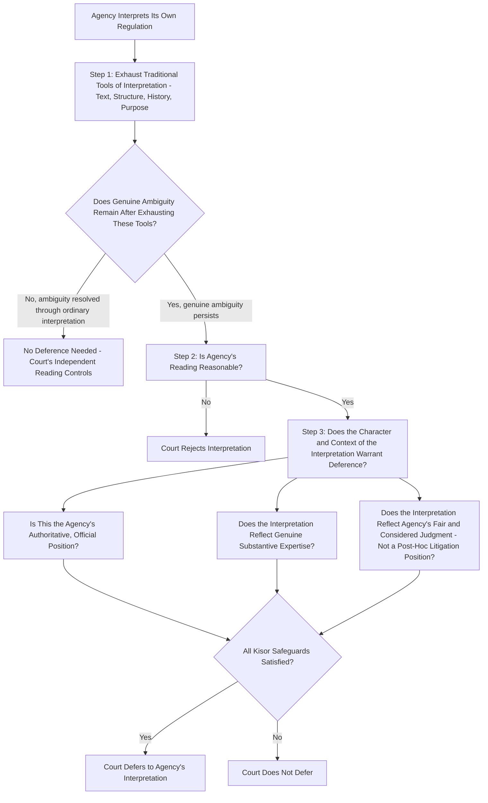

## Deference to Agencies' Interpretations of Their Own Regulations: Auer, Seminole Rock, and Kisor v. Wilkie

### Overview

This doctrine — variously called **Auer deference**, **Seminole Rock deference**, or **Auer/Seminole Rock deference** — governs judicial review of an agency's interpretation of its **own** ambiguous regulations, as distinct from Chevron's (now-overruled) treatment of an agency's interpretation of the **statute** it administers. Although related in spirit to Chevron, this doctrine rests on a different rationale, survived Loper Bright's overruling of Chevron, but was significantly narrowed in *Kisor v. Wilkie*, 588 U.S. 558 (2019). Understanding the distinction between statutory deference (Chevron/Loper Bright) and regulatory deference (Auer/Kisor) is essential, since these are separate doctrinal tracks that are frequently confused.

### Origin: Bowles v. Seminole Rock & Sand Co.

The doctrine traces to *Bowles v. Seminole Rock & Sand Co.*, 325 U.S. 410 (1945), a World War II-era price control case. The Court held that when the meaning of an agency's own regulatory language is in doubt, the agency's interpretation of its own regulation becomes controlling weight unless plainly erroneous or inconsistent with the regulation itself. This established a highly deferential posture: courts would defer to the agency's reading of its own rule except in cases of clear error.

### Reaffirmation: Auer v. Robbins

*Auer v. Robbins*, 519 U.S. 452 (1997), reaffirmed and gave the doctrine its more commonly used modern name. The case involved the Department of Labor's interpretation of its own overtime-exemption regulations under the Fair Labor Standards Act. The Court held that the agency's interpretation of its own ambiguous regulation was, absent some indication it was merely a "post hoc rationalization" advanced to defend past agency action against attack, entitled to controlling weight.

### The Basic Auer/Seminole Rock Framework (Pre-Kisor)

### Rationale for Regulatory Deference

The justifications for Auer deference partially overlap with, but are distinct from, Chevron's rationales:

1. **Author's insight into original intent**: The agency, having drafted its own regulation, is presumed to have unique insight into what the regulation was meant to accomplish — an authorial-intent rationale with no direct analogue in the Chevron statutory context (where the agency did not write the statute).
2. **Technical expertise**: Agencies often draft highly technical regulations in scientific, engineering, or specialized regulatory domains where their ongoing expertise aids faithful interpretation.
3. **Efficiency and administrability**: Permitting agencies to authoritatively resolve ambiguities in their own rules avoids extensive litigation over interstitial regulatory details Congress never directly addressed.

### Growing Criticism and the Path to Kisor

By the 2010s, Auer deference attracted substantial criticism, including from sitting Justices, on separation-of-powers and incentive grounds:

**Key Points**

- Critics argued Auer deference creates a **perverse incentive** for agencies to draft regulations vaguely, knowing that any resulting ambiguity will be resolved in the agency's own favor through deferential interpretation — effectively allowing the agency to control both the lawmaking and the law-interpreting functions over its own rules.
- Critics also argued this arrangement is in tension with due process and fair notice principles, since regulated parties may lack adequate notice of a rule's actual meaning if the agency can later supply a controlling interpretation through litigation.
- Several Justices, in separate writings prior to *Kisor*, expressed openness to overruling Auer/Seminole Rock outright, setting up *Kisor v. Wilkie* as a direct opportunity to reconsider the doctrine.

### Kisor v. Wilkie: Narrowing Rather Than Overruling

*Kisor v. Wilkie*, 588 U.S. 558 (2019), presented the Court with the question whether to overrule Auer and Seminole Rock outright. The Court declined to overrule the doctrine but substantially **narrowed and conditioned** its application, establishing a multi-step threshold before deference may be applied at all.

### The Kisor Safeguards in Detail

**1. Genuine Ambiguity Required — Exhaust Interpretive Tools First**

Before finding a regulation ambiguous enough to trigger deference, a court must exhaust the traditional tools of construction — text, structure, history, and purpose — to determine whether the regulation actually has a discernible best reading despite apparent surface ambiguity. Deference is reserved only for cases of **genuine** ambiguity remaining after this full interpretive effort, not for any case where the text is merely difficult.

**2. Reasonableness of the Agency's Reading**

Even where genuine ambiguity exists, the agency's interpretation must fall within the zone of reasonable readings the ambiguous regulatory text can bear.

**3. The Interpretation Must Reflect the Agency's "Authoritative" or "Official" Position**

Deference is not owed to just any agency statement — the interpretation must be one that represents the agency's considered, authoritative position (e.g., issued by, or with the approval of, agency leadership), not an ad hoc position taken by a lower-level official or litigating counsel without institutional backing.

**4. The Interpretation Must Implicate the Agency's Substantive Expertise**

Deference is most justified when the interpretive question genuinely calls upon the agency's specialized technical or scientific expertise — not for interpretive questions that are purely questions of general legal drafting or grammar unrelated to the agency's substantive domain.

**5. The Interpretation Must Reflect the Agency's "Fair and Considered Judgment"**

Deference is unwarranted where the interpretation is a **post hoc rationalization** advanced to defend past agency action against a legal challenge, or where it creates "unfair surprise" to regulated parties by imposing a new and unanticipated duty or liability that they had no reasonable notice of under the prior understanding of the rule.

**Key Points**

- Kisor's approach is best understood as converting Auer deference from a nearly automatic doctrine into a **conditional, multi-factor gate** — a party seeking deference must affirmatively establish each safeguard, rather than simply pointing to any agency reading of an ambiguous regulation.
- **[Inference]** In practice, Kisor's safeguards mean far fewer cases will actually reach binding deference compared to the pre-Kisor era, since many agency interpretations advanced in litigation are unlikely to satisfy all of the authoritative-position, genuine-expertise, and fair-and-considered-judgment requirements simultaneously.

### Comparison: Auer/Kisor Deference vs. Chevron/Loper Bright

| Feature | Auer/Kisor (Regulatory Interpretation) | Chevron (Historical) / Loper Bright (Current) |
| --- | --- | --- |
| Subject of interpretation | Agency's own regulation | Statute the agency administers |
| Current status | Narrowed but still valid law after Kisor (2019) | Overruled entirely by Loper Bright (2024) |
| Threshold requirement | Genuine ambiguity after exhausting interpretive tools; authoritative, expert, fair and considered judgment | (Historical) Mead force-of-law threshold; (Current) none — independent judgment always applies |
| Rationale | Author's insight into own regulation's intended meaning; technical expertise | (Historical) Implied delegation from statutory ambiguity; agency expertise; political accountability |
| Degree of deference when applicable | Controlling weight if all safeguards satisfied | (Historical) Binding if reasonable; (Current) none — Skidmore-style persuasion only |

### Distinguishing the Two Doctrinal Tracks

**Example**

An environmental agency's rule defines a permitting threshold using a technical term the agency itself coined in its own regulation (e.g., a specific engineering measurement method referenced in the rule text). A dispute over what that agency-created regulatory term means, where the statute itself is silent on the specific technical measurement methodology, is an **Auer/Kisor** question — the court asks whether the regulation is genuinely ambiguous and, if so, whether the agency's authoritative, expert, and fair-and-considered interpretation of its own text merits deference.

By contrast, a dispute over what a term **in the underlying statute** (e.g., the Clean Air Act's definition of "major source") means is a statutory interpretation question, now governed by Loper Bright's independent-judgment framework rather than any deference doctrine.

### Application in Environmental Administrative Law

Auer/Kisor deference remains highly relevant in environmental regulatory practice, since agencies frequently promulgate detailed technical regulations (emissions calculation methodologies, permit application requirements, monitoring protocols) that later require interpretation in specific enforcement or permitting disputes.

**Example**

If an environmental agency's regulation specifies a monitoring methodology using ambiguous technical language, and the agency later issues an authoritative guidance interpreting that methodology consistent with its original technical purpose and without creating unfair surprise for regulated parties, a court applying Kisor would assess: (1) whether the regulatory text is genuinely ambiguous after full interpretive analysis, (2) whether the agency's reading is reasonable, and (3) whether the interpretation is authoritative, reflects genuine technical expertise, and represents fair and considered judgment rather than a litigation-driven reinterpretation.

**[Inference]** Given the highly technical nature of many environmental regulations (emissions testing protocols, water quality measurement methods, hazardous waste characterization procedures), Auer/Kisor deference is likely to remain a significant doctrinal tool in environmental regulatory litigation even as Chevron's statutory counterpart has been eliminated, since the rationale for deferring to genuine agency technical expertise in interpreting its own detailed technical rules is analytically distinct from, and was not disturbed by, Loper Bright's rejection of statutory deference.

### Practical Litigation Checklist

**Next Steps**

1. Classify the interpretive dispute correctly at the outset: is the challenged interpretation directed at the **statute** (now governed by Loper Bright's independent-judgment framework) or at the agency's **own regulation** (governed by Auer/Kisor)?
2. If Auer/Kisor applies, first argue whether genuine ambiguity exists after exhausting ordinary interpretive tools — many disputes can be resolved without ever reaching the deference question.
3. If genuine ambiguity exists, assess the agency's interpretation for reasonableness before reaching the deference-worthiness safeguards.
4. Marshal evidence on each Kisor safeguard separately: authoritative source of the interpretation, genuine connection to agency substantive expertise, and fair-and-considered (non-post-hoc, non-surprising) character of the position.
5. Watch for "unfair surprise" arguments where a regulated party reasonably relied on a different understanding of the ambiguous rule — this can defeat deference even where the other Kisor factors are satisfied.
6. Do not conflate Auer/Kisor arguments with Chevron/Loper Bright arguments in briefing — courts treat these as analytically separate doctrinal tracks with different current legal status.

### Related Topics

- Chevron U.S.A. v. NRDC and the two-step deference framework (historical)
- Loper Bright Enterprises v. Raimondo and the end of Chevron deference
- Skidmore deference and persuasive weight
- United States v. Mead Corp. and the force of law limitation
- Reasoned decision making and changed agency positions (Fox Television)
- Fair notice and due process in regulatory interpretation
- Interpretive rules versus legislative rules distinction
- Post-hoc rationalization and litigating positions under Chenery
- Notice-and-comment rulemaking and technical regulatory drafting
- Statutory interpretation methodology in the post-Loper Bright landscape