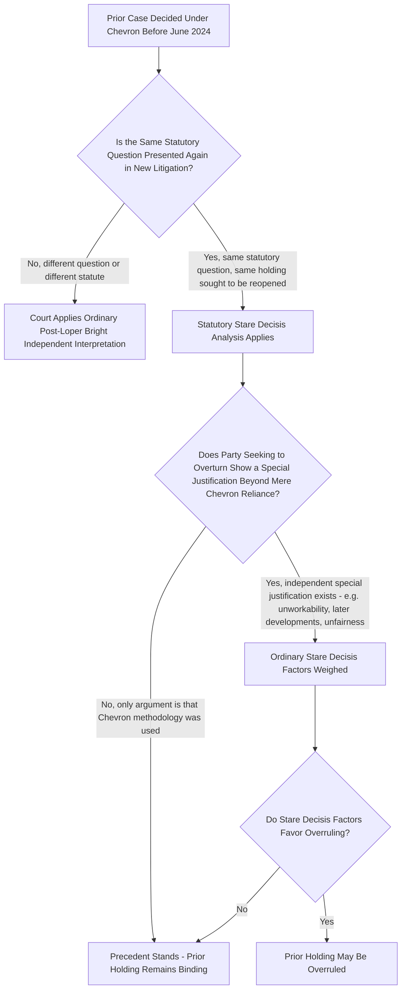

## Retroactive Effects of Loper Bright on Previously Settled Agency Interpretations

### Overview

*Loper Bright Enterprises v. Raimondo*, 603 U.S. 369 (2024), overruled Chevron deference prospectively, but the Court simultaneously addressed — in a passage that has proven doctrinally vexing and heavily litigated since — what happens to the vast body of prior decisions that had **already** upheld specific agency interpretations by applying the now-discarded Chevron framework. This entry addresses the Court's statutory stare decisis holding, the interpretive difficulties it has generated, and how lower courts have begun working through them.

### The Court's Statutory Stare Decisis Holding

The Court expressly stated that in overruling Chevron it did not call into question prior cases that relied on the Chevron framework. Instead, the Court held that holdings of those cases finding specific agency actions lawful are still subject to statutory stare decisis despite the Court's change in interpretive methodology. The Court further cautioned that mere reliance on Chevron cannot constitute a "special justification" sufficient to justify overruling a statutory precedent, because to say a precedent relied on Chevron is, at best, just an argument that the precedent was wrongly decided — and merely arguing a case was wrongly decided is not, standing alone, enough to overcome stare decisis.

**Key Points**

- The practical effect is that Loper Bright's decision is not retroactive in the sense of automatically reopening or invalidating prior judgments — statutory interpretations previously upheld under Chevron remain in effect as binding precedent unless and until specifically challenged and overruled through ordinary stare decisis analysis.
- Stare decisis applies with **especially strong force** in the statutory interpretation context generally (as opposed to constitutional interpretation, where the Court has historically been more willing to revisit precedent), reinforcing the durability of these prior holdings.
- The Court appears to have been consciously seeking to limit the disruptive scope of its ruling — described by commentators as an effort to prevent a flood of lawsuits challenging decades' worth of precedent based simply on Loper Bright's existence.

### Why This Passage Has Proven Doctrinally Difficult

The stare decisis holding, though brief in the opinion itself, left much unanswered, and lower courts continue to grapple with how to apply the principle of stare decisis to prior decisions that had specifically applied Chevron's second step (i.e., cases that upheld an agency's interpretation not because it was the single best reading, but merely because it was a *reasonable* one).

**Key Points — Sources of Difficulty**

- **Ambiguity about scope**: It is unclear exactly what "the holding" of a Chevron Step Two case consists of for stare decisis purposes. One reading gives precedential effect broadly to the reasoning underlying a decision that relied on Chevron — meaning if a prior decision found an agency's interpretation "reasonable," courts would remain bound to continue applying that specific interpretation going forward, even though a Chevron Step Two holding by its nature never determined whether that interpretation was the *best* reading of the statute, only that it was *permissible* among a range of possible readings.
- **The "different agency has different discretion" problem**: Commentators have identified a structural puzzle in giving full stare decisis effect to Chevron Step Two precedents: doing so would leave some agencies, but not others, with discretion to choose among reasonable interpretations of otherwise similar statutory language, or would lock in place Chevron-era interpretations that are not actually the single best interpretation Loper Bright now directs courts to find — creating inconsistency between the methodology courts are supposed to apply going forward and results inherited from a discarded methodology.
- **Empirical context**: Scholarly research examining two decades of agency regulations affirmed by the D.C. Circuit under Chevron has found that agencies infrequently reversed their own interpretive positions — suggesting the disruption risk from Chevron-era regulatory "whiplash" may be less severe than initially feared, and correspondingly that courts should require an extraordinary justification before overruling or avoiding precedent that affirmed an agency regulation under the old Chevron framework, since the underlying regulatory landscape has generally proven more stable than the doctrinal shift might suggest.

### Emerging Lower Court Treatment

**[Unverified]** Lower courts, including notably the Fourth Circuit, have begun directly confronting these open questions in specific cases, generally rejecting government attempts to invoke earlier circuit precedent applying Chevron Step Two as controlling stare decisis where the underlying case can be distinguished (for example, on the basis of a different agency, a different statutory provision, or different factual circumstances) — but even in rejecting the specific stare decisis argument presented, courts have acknowledged in accompanying discussion that the broader question of how much precedential weight is owed to Chevron Step Two holdings generally remains unresolved and is being worked out incrementally, case by case, rather than through a single controlling framework. Because this area is still actively developing, any specific circuit's approach should be verified directly rather than assumed to generalize.

### Practical Consequences for Litigants and Regulated Parties

**Key Points**

- Because reliance on Chevron alone is not, by itself, a suffient basis for overturning a precedent, a party seeking to reopen a previously settled agency interpretation must identify some **independent special justification** for overruling the prior decision — the mere fact that Loper Bright changed the interpretive methodology used to reach that decision is not enough on its own.
- Practically, this means any regulation or agency legal position that was previously upheld under Chevron deference is now a **potential target** for renewed litigation, but success requires more than simply invoking Loper Bright — litigants must articulate why the prior precedent should be overruled under ordinary stare decisis principles (e.g., that the decision has proven unworkable, that it conflicts with later developments, or that circumstances have changed in a way that undermines its rationale independent of the deference methodology used).
- For genuinely **new** statutory questions not previously the subject of binding Chevron-era precedent, courts apply the full post-Loper Bright independent-judgment methodology from the outset, with no prior holding to work around.
- The Court's own language in Loper Bright — noting that the best reading of a statute "may well be that the agency is authorized to exercise a degree of discretion" — suggests that in many cases, a fresh independent interpretation might still recognize substantial agency discretion, meaning the practical outcome in a given case may not differ dramatically from the Chevron-era result even without applying Chevron itself; this reduces, but does not eliminate, the disruptive potential of revisiting settled interpretations.

### Distinguishing Retroactivity Questions from Ordinary Prospective Application

It is important to separate two distinct questions that are sometimes conflated in discussion of Loper Bright's effect:

| Question | Answer Under Loper Bright |
| --- | --- |
| Does Loper Bright apply to new cases and new statutory questions decided after June 28, 2024? | Yes — courts must apply independent judgment going forward, with no exceptions for the type of question presented |
| Does Loper Bright automatically reopen or invalidate specific agency actions previously upheld under Chevron in a final judicial decision? | No — those specific holdings remain subject to ordinary, strong statutory stare decisis; mere Chevron reliance is not itself a special justification for overruling them |
| Can a party still challenge a previously Chevron-upheld interpretation in new litigation? | Yes, but must show an independent special justification for overruling the precedent beyond simply noting that Chevron was used to reach it |
| Does Loper Bright change how courts interpret statutes in ongoing or future agency rulemakings not yet the subject of final judicial precedent? | Yes — fully governed by the new independent-judgment framework with no stare decisis protection, since no final precedent exists to protect |

### Significance for Environmental Administrative Law

**[Inference]** A substantial body of environmental regulatory law was decided under Chevron between 1984 and 2024, including foundational interpretations of terms across the Clean Air Act, Clean Water Act, RCRA, CERCLA, and the Endangered Species Act. The statutory stare decisis holding means:

- Long-settled interpretations of key environmental statutory terms that were previously upheld under Chevron Step Two (e.g., certain historical EPA interpretations that survived judicial review specifically because they were "reasonable," not because a court found them to be the single best reading) are not automatically invalidated by Loper Bright and remain binding precedent absent an independent special justification for revisiting them.
- Parties seeking to challenge such settled interpretations going forward face a genuinely elevated burden — they cannot simply argue "this was only upheld because of Chevron deference"; they must identify a free-standing reason the precedent should be overruled under ordinary stare decisis principles.
- **[Speculation]** Some commentators anticipate that this stare decisis protection may be tested most aggressively in cases involving significant deregulatory or regulatory-rollback efforts, where a party might seek to leverage Loper Bright to reopen a previously settled, environmentally protective interpretation — though whether courts will find sufficient independent justification in such cases remains genuinely unsettled and is likely to be litigated extensively in the coming years.

### Practical Litigation Checklist

**Next Steps**

1. Determine whether the specific statutory question at issue was already the subject of a **final, binding judicial decision** applying Chevron before June 28, 2024; if so, statutory stare decisis analysis governs rather than a fresh independent interpretation.
2. If seeking to overturn such a precedent, identify an **independent special justification** for overruling it — unworkability, inconsistency with subsequent developments, or similar traditional stare decisis factors — rather than relying solely on the fact that Chevron was used to decide it.
3. If defending a previously settled interpretation, emphasize the Court's explicit statement that mere Chevron reliance does not itself constitute a special justification, and marshal the strong-force-in-statutory-cases stare decisis principle.
4. For questions not previously the subject of binding precedent, proceed directly to independent judicial interpretation under the ordinary post-Loper Bright framework, since no stare decisis protection is implicated.
5. Track how the litigant's own circuit is currently resolving the ambiguity in "Chevron stare decisis" — whether by giving broad precedential effect to Chevron Step Two holdings themselves, or by treating them as narrower and more readily distinguishable — since courts have not yet converged on a single uniform approach.

### Related Topics

- Loper Bright Enterprises v. Raimondo and the end of Chevron deference
- Statutory interpretation methodology in the post-Loper Bright landscape
- Chevron U.S.A. v. NRDC and the two-step deference framework (historical)
- Skidmore deference and persuasive weight
- Major questions doctrine and clear-statement requirements
- Stare decisis doctrine and special justification standards
- Reasoned decision making and changed agency positions (Fox Television)
- Deregulation litigation and reopening of settled agency interpretations
- Auer/Kisor deference to agency interpretation of own regulations
- Judicial legitimacy and democratic accountability in administrative law