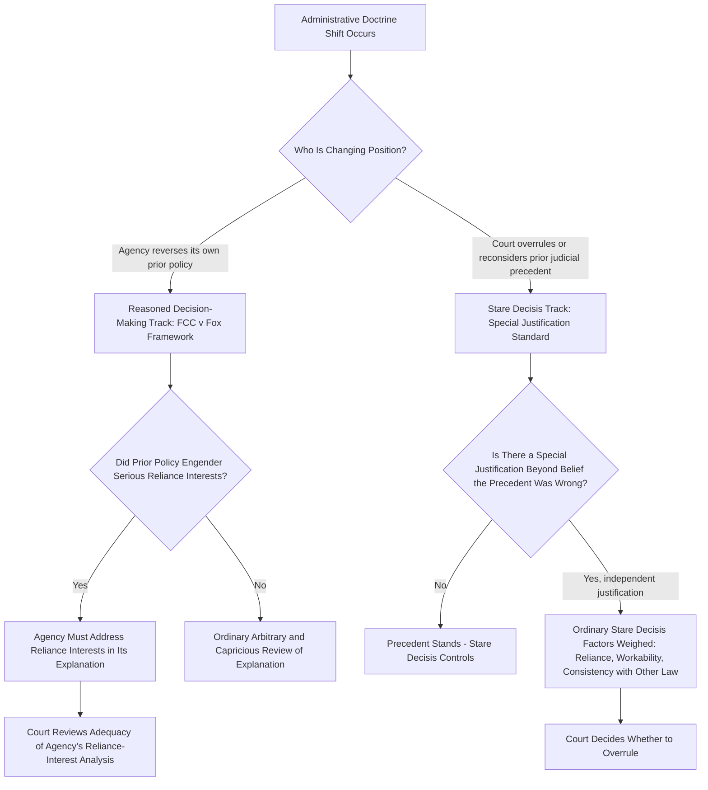

## Reliance Interests and Stare Decisis in Administrative Doctrine Shifts

### Overview

Two related but distinct concepts operate whenever an established administrative-law doctrine changes: **stare decisis** (the presumption that courts should adhere to prior decisions) and **reliance interests** (the practical expectations regulated parties, beneficiaries, and third parties have built on the strength of settled law). This topic examines how these concepts interact across three major sites of administrative doctrine shift: (1) an agency reversing its own prior policy position, (2) a court overruling a prior precedent interpreting a statute or doctrine, and (3) the specific, currently unfolding context of courts revisiting Chevron-era holdings after *Loper Bright*. Understanding how these concepts operate together — and how they differ depending on whether the "decisionmaker" changing course is an agency or a court — is essential to analyzing any doctrinal shift in administrative law.

### Two Distinct Analytical Tracks

### Track One: Agency Policy Reversals and Reliance Interests (Fox Television Framework)

When an **agency** changes its own prior position, the governing framework is *FCC v. Fox Television Stations, Inc.*, 556 U.S. 502 (2009), addressed in depth elsewhere in this chapter's discussion of reasoned decision making. The relevant reliance-interest principle here is:

**Key Points**

- An agency need not show its new policy is *better* than the old one — only that it is a permissible policy choice under the statute — but it must display awareness that it is changing position and supply good reasons for the new policy.
- A **more detailed justification** is required specifically where the prior policy has engendered serious reliance interests that must be taken into account, or where the new policy rests on factual findings that contradict those underlying the prior policy.
- This reliance-interest principle has been applied with real teeth in subsequent cases — most notably *Department of Homeland Security v. Regents of the University of California*, 591 U.S. 1 (2020), where the Court held that DHS's rescission of the DACA program was arbitrary and capricious in part because the agency's rescission memorandum failed to adequately grapple with the reliance interests that had accrued under the program (e.g., recipients' reliance in employment, education, and family-planning decisions), even though DHS had the underlying authority to rescind the program.

### Track Two: Judicial Stare Decisis and the "Special Justification" Standard

When a **court** (rather than an agency) reconsiders and potentially overrules its own prior precedent — including precedent interpreting an administrative-law doctrine itself — a different framework applies, rooted in the Supreme Court's general stare decisis jurisprudence.

**Key Points**

- Stare decisis is the principle that courts should adhere to prior decisions when deciding cases presenting the same issue; when a court decides a question of **statutory interpretation** specifically, stare decisis applies with **extra force** compared to constitutional interpretation, where the Court has historically shown more willingness to revisit precedent.
- To overrule a prior precedent, a court generally requires a **"special justification"** beyond the belief that the precedent was simply wrongly decided — merely disagreeing with a prior decision's reasoning or result is not, by itself, sufficient.
- Traditional stare decisis factors include: the quality of the precedent's reasoning, its workability in practice, its consistency with other related legal doctrines, developments in the law since the decision, and — centrally relevant here — the **reliance interests** that have developed around the precedent.

### The Loper Bright Illustration: Both Tracks Interacting

The Court's decision in *Loper Bright Enterprises v. Raimondo*, 603 U.S. 369 (2024), and its treatment of prior Chevron-era precedent illustrates how the judicial stare decisis track operates in the specific context of overruling a foundational administrative-law doctrine.

**Example**

In overruling Chevron itself, the Court held that prior cases relying on the Chevron framework to find specific agency actions lawful remain subject to statutory stare decisis, and that mere reliance on Chevron cannot constitute a special justification for overruling such a holding — because arguing that a precedent relied on Chevron is, at most, just an argument that the precedent was wrongly decided, which is not by itself sufficient under ordinary stare decisis principles.

This illustrates the **special justification standard** operating exactly as it does in any other stare decisis context: the fact that the *methodology* used to reach a specific holding has since been discarded does not, standing alone, supply the independent justification needed to discard the specific *result* reached using that methodology.

### Reliance Interests as a Stare Decisis Factor in the Chevron Context

Reliance interests specifically operate as one of the traditional factors courts weigh when deciding whether a "special justification" exists to overrule precedent — including precedent that upheld specific agency regulations under the old Chevron framework.

**Key Points**

- Empirical research examining agency regulations affirmed under Chevron over roughly two decades has found that agencies **infrequently reversed** their own interpretive positions once judicially affirmed — suggesting a meaningful degree of institutional and regulatory settlement built up around Chevron-era holdings, which in turn implies **significant reliance interests** (by regulated industries, beneficiaries, and the agencies themselves) have accumulated around many such precedents.
- This regulatory-settlement research suggests that courts revisiting Chevron-era precedents should require an **extraordinary justification** before overruling or avoiding them, precisely because unwinding settled regulatory interpretations risks substantial disruption to parties who have structured conduct, investment, and compliance systems around the existing interpretation for years or decades.
- **[Inference]** This means reliance interests function as a **stabilizing force** cutting against wholesale reopening of Chevron-era holdings even in a legal environment where the underlying deference methodology has been discarded — the disruption to reliance interests, not just abstract doctrinal purity, does real work in the stare decisis calculus.

### Comparing the Two Tracks Side by Side

| Feature | Agency Policy Reversal (Fox Track) | Judicial Precedent Reversal (Stare Decisis Track) |
| --- | --- | --- |
| Who is reversing course | The agency itself | A court, reconsidering its own or a lower court's prior holding |
| Governing standard | Arbitrary and capricious review, informed by Fox's reliance-interest principle | Special justification standard for overruling precedent |
| Role of reliance interests | Must be *addressed* in the agency's explanation when serious reliance interests exist | Weighed as *one factor* among several in deciding whether special justification exists |
| Consequence of ignoring reliance interests | Agency action held arbitrary and capricious; remand required | Precedent more likely to be preserved; reliance interests support NOT overruling |
| Example | DHS's DACA rescission (Regents) | Loper Bright's treatment of prior Chevron-era holdings |

### Why the Distinction Matters

**[Inference]** Conflating these two tracks is a common analytical error: an agency reversing its own policy is subject to a **procedural adequacy** inquiry (did it explain itself adequately, including addressing reliance?), whereas a court reconsidering precedent is subject to a **substantive threshold** inquiry (is there an independent justification strong enough to overcome the presumption favoring stability?). Both inquiries treat reliance interests as important, but they operate at different levels: in the agency context, inadequate treatment of reliance interests can itself be the *basis* for a court to invalidate the reversal; in the judicial stare decisis context, strong reliance interests are a *reason to preserve* the existing precedent rather than a procedural box the court itself must check.

### Application in Environmental Administrative Law

Both tracks are highly salient in environmental law, an area characterized by both frequent agency policy shifts (as environmental priorities change across administrations) and a large body of Chevron-era judicial precedent interpreting environmental statutes.

**Example**

If an environmental agency seeks to reverse a longstanding permitting policy that regulated industries have relied upon to make multi-year capital investments in pollution control infrastructure, the agency's reversal is analyzed under the Fox framework — the agency must acknowledge the reversal, explain its new policy, and specifically address how it is accounting for the reliance interests of parties who invested based on the old policy (e.g., through phased implementation, grandfathering provisions, or a reasoned explanation for why those interests do not warrant a different outcome).

**Example**

If a litigant later seeks to challenge a decades-old judicial precedent that upheld a specific EPA regulatory interpretation under Chevron Step Two, a court considering whether to overrule that precedent would weigh — among other stare decisis factors — the reliance interests that have built up around the regulation over the intervening years (compliance systems, industry practices, downstream regulatory dependencies), which may counsel strongly against overruling even though the Chevron methodology that originally validated the interpretation no longer exists.

### Practical Analytical Checklist

**Next Steps**

1. First identify which track applies: is the entity changing position an **agency** (triggering Fox's reasoned-decision-making and reliance-interest analysis) or a **court** reconsidering precedent (triggering stare decisis and the special-justification standard)?
2. For agency reversals, assess whether the prior policy engendered **serious reliance interests** and, if so, whether the agency's explanation for the reversal specifically addressed those interests rather than ignoring them.
3. For judicial precedent reversals, identify whether the party seeking to overrule the precedent has articulated an **independent special justification** beyond simply arguing the precedent's underlying methodology (e.g., Chevron) was flawed.
4. In either track, marshal concrete evidence of reliance — specific investments, compliance systems, or structured expectations — rather than generalized assertions, since courts scrutinize reliance-interest arguments for genuine substance.
5. Recognize that strong reliance interests function differently in each track: as a **substantive requirement the agency must satisfy** in the Fox context, versus as a **factor supporting preservation** of existing law in the stare decisis context.
6. In environmental and other heavily regulated domains where multi-year capital and compliance investments are common, anticipate that reliance-interest arguments will carry particular weight in both tracks, given the practical disruption a reversal can cause.

### Related Topics

- Reasoned decision making and changed agency positions (FCC v. Fox Television)
- Department of Homeland Security v. Regents of the University of California
- Retroactive effects of Loper Bright on previously settled agency interpretations
- Loper Bright Enterprises v. Raimondo and the end of Chevron deference
- Chevron U.S.A. v. NRDC and the two-step deference framework (historical)
- Encino Motorcars v. Navarro and reversal of interpretive rules
- Statutory stare decisis and special justification standards
- Statutory interpretation methodology in the post-Loper Bright landscape
- Remand without vacatur as a judicial remedy
- Arbitrary and capricious review under APA § 706(2)(A)