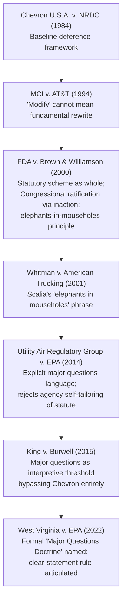

## Early Formulations: FDA v. Brown & Williamson and Utility Air Regulatory Group

### Doctrinal Overview

The Major Questions Doctrine (MQD), before its formal naming and consolidation in *West Virginia v. EPA* (2022), developed through a series of Supreme Court decisions that resisted straightforward application of *Chevron U.S.A., Inc. v. Natural Resources Defense Council* (1984) deference to agency interpretations touching matters of vast economic and political significance. Two cases form the essential doctrinal bridge between the doctrine's earliest articulation in *FDA v. Brown & Williamson Tobacco Corp.* (2000) and its refinement in *Utility Air Regulatory Group v. EPA* (2014, commonly "UARG").

Both cases share a common structural logic: courts should be skeptical that Congress delegated authority to resolve issues of major economic or political significance through vague or ancillary statutory language, particularly where the agency's assertion of authority represents a transformative expansion of its regulatory power.

### FDA v. Brown & Williamson Tobacco Corp. (2000)

#### Facts and Procedural Background

In 1996, the Food and Drug Administration promulgated regulations asserting jurisdiction over tobacco products, classifying nicotine as a "drug" and cigarettes/smokeless tobacco as "drug delivery devices" under the Food, Drug, and Cosmetic Act (FDCA). This was a dramatic reversal: the FDA had consistently disclaimed authority to regulate tobacco for decades, repeatedly representing to Congress that it lacked jurisdiction absent specific legislative action.

Tobacco manufacturers and retailers challenged the rule, arguing the FDCA did not grant the FDA authority to regulate tobacco products.

#### Holding

The Supreme Court (5-4, Justice O'Connor writing) held that **Congress had not granted the FDA authority to regulate tobacco products** under the FDCA.

#### Reasoning

**Key Points**

- The Court applied *Chevron* Step One but interpreted it through a distinctive lens: rather than reading "drug" and "device" in isolation, it read the FDCA "as a whole" and in the context of the entire regulatory scheme governing tobacco.
- The FDCA required the FDA to ban any drug or device it deemed unsafe. Applying this logic to tobacco (given the FDA's own findings on health dangers) would mandate a ban — an outcome Congress had repeatedly declined to enact through a separate, tobacco-specific regulatory regime (labeling, advertising restrictions under statutes like the Federal Cigarette Labeling and Advertising Act).
- **Congressional ratification through inaction**: Congress had enacted six distinct tobacco-specific statutes since 1965, consistently premised on the understanding that the FDA lacked jurisdiction. This "created a distinct regulatory scheme" that would be undermined by FDA's assertion of authority.
- **The "elephants in mouseholes" principle** (articulated by Justice Scalia in *Whitman v. American Trucking*, cited approvingly here): Congress does not delegate decisions of major economic and political significance through vague statutory provisions or ancillary/subtle grants of authority.
- The Court emphasized the sheer **economic and political magnitude** of tobacco regulation — an industry generating substantial revenue, employing hundreds of thousands, and long subject to a distinct legislative history — as a reason to expect explicit congressional authorization rather than inference from general "drug" and "device" definitions.

**Doctrinal Formula (as later distilled)**

$$\text{MQD Trigger} = f(\text{Economic Magnitude}, \text{Political Significance}, \text{Agency Historical Position}, \text{Congressional Specificity})$$

This is descriptive shorthand for the multi-factor reasoning, not a formula stated by the Court itself.

#### Significance

*Brown & Williamson* is widely regarded as the **doctrinal origin point** of the Major Questions Doctrine, though the Court did not use that label. It established the interpretive principle that extraordinary regulatory assertions require extraordinarily clear congressional authorization — later termed the "clear statement" requirement.

### Utility Air Regulatory Group v. EPA (2014)

#### Facts and Procedural Background

Following *Massachusetts v. EPA* (2007), which held greenhouse gases (GHGs) qualify as "air pollutants" under the Clean Air Act (CAA), the EPA determined GHG emissions from motor vehicles endanger public health, triggering regulation under the CAA's mobile-source provisions. The EPA then took the position that this same "air pollutant" determination automatically triggered permitting requirements for **stationary sources** under the Prevention of Significant Deterioration (PSD) and Title V programs.

The problem: PSD/Title V permitting thresholds (100 or 250 tons per year) were calibrated to conventional pollutants like particulate matter and sulfur dioxide. Applying those same numeric thresholds to GHGs — emitted in vastly greater volumes (e.g., ordinary CO2 output) — would have swept in millions of small sources (offices, apartment buildings, even large residences) never intended to be covered, increasing permitting parties from roughly 15,000 to over 6 million.

To avoid this absurd result, EPA promulgated the **"Tailoring Rule,"** administratively rewriting the statutory numeric thresholds upward (to 100,000 tons/year) to limit permitting to only the largest GHG emitters.

#### Holding

The Supreme Court (majority opinion by Justice Scalia, fractured on parts) held:

1. **EPA could not "tailor"** (i.e., rewrite) unambiguous statutory thresholds simply because applying them literally to GHGs produced impractical results — an agency cannot use its own regulatory fix to justify an interpretation Congress did not authorize.
2. However, EPA **could** require sources that are already subject to PSD/Title V permitting for *other* pollutants ("anyway sources") to also install Best Available Control Technology (BACT) for their GHG emissions.
3. EPA **could not** treat GHG emissions alone as sufficient to trigger PSD/Title V permitting obligations for sources that would not otherwise need a permit.

#### Reasoning

**Key Points**

- **Explicit invocation of the major questions concept**: Justice Scalia wrote that "[w]hen an agency claims to discover in a long-extant statute an unheralded power to regulate 'a significant portion of the American economy,' we typically greet its announcement with a measure of skepticism" — directly echoing and citing *Brown & Williamson*.
- The Court reasoned that EPA's interpretation would have given the agency permitting authority over **millions of previously unregulated small entities**, a "triggering" of authority so expansive it amounted to an unrecognized transformation of the PSD/Title V permitting programs — from covering ~15,000 sources to潜在ially 6+ million.
- Critically, the Court held that **an agency's own recognition that its interpretation is unworkable** (evidenced by its need to "tailor" or rewrite express statutory numbers) is itself strong evidence the interpretation is incorrect. "An agency has no power to 'tailor' legislation to bureaucratic policy goals by rewriting unambiguous statutory terms."
- The Court distinguished **permissible "gap-filling"** at the margins of authority already possessed (the "anyway sources"/BACT holding) from **impermissible bootstrapping** of entirely new jurisdictional authority via an atextual reading.
- The decision showed the Court applying heightened scrutiny not merely to whether the agency's reading was "reasonable" under *Chevron* Step Two, but to whether Congress could plausibly be understood to have delegated authority of that transformative scope in the first place.

#### Illustrative Comparison Table

| Dimension | *Brown & Williamson* (2000) | *UARG* (2014) |
| --- | --- | --- |
| Agency | FDA | EPA |
| Statute | Food, Drug, and Cosmetic Act | Clean Air Act (PSD/Title V) |
| Claimed authority | Regulate tobacco as "drug"/"device" | Use GHG "air pollutant" status to trigger stationary-source permitting |
| Economic scale invoked | Multi-billion dollar tobacco industry | Millions of newly covered small sources |
| Agency history | FDA long disclaimed jurisdiction | EPA sought to expand a program from ~15K to ~6M sources |
| Outcome | No FDA authority at all | Partial: BACT required for "anyway sources"; GHG-alone triggering rejected |
| MQD language | Precursor reasoning; no explicit "major questions" label | Explicit citation and elaboration of the "major questions" framework |

### Diagram: Doctrinal Lineage

### SVG: Conceptual Structure of the Doctrine's Trigger Factors (svg_diagram)

<svg xmlns="http://www.w3.org/2000/svg" viewBox="0 0 720 380">
<text x="360" y="30" text-anchor="middle" font-size="18" font-weight="bold" font-family="sans-serif">Major Questions Doctrine — Early Trigger Factors (svg_diagram)</text>
<circle cx="220" cy="180" r="110" fill="none" stroke="#2c3e50" stroke-width="2" />
<circle cx="380" cy="180" r="110" fill="none" stroke="#2c3e50" stroke-width="2" />
<circle cx="300" cy="280" r="110" fill="none" stroke="#2c3e50" stroke-width="2" />
<text x="150" y="140" font-size="13" font-family="sans-serif" width="140">Economic</text>
<text x="150" y="158" font-size="13" font-family="sans-serif">Magnitude</text>
<text x="150" y="176" font-size="11" font-family="sans-serif">(Brown &amp; Williamson:</text>
<text x="150" y="192" font-size="11" font-family="sans-serif">tobacco industry scale)</text>
<text x="430" y="140" font-size="13" font-family="sans-serif">Political</text>
<text x="430" y="158" font-size="13" font-family="sans-serif">Significance</text>
<text x="430" y="176" font-size="11" font-family="sans-serif">(long legislative history</text>
<text x="430" y="192" font-size="11" font-family="sans-serif">of tobacco-specific statutes)</text>
<text x="230" y="330" font-size="13" font-family="sans-serif">Agency Self-Doubt /</text>
<text x="230" y="348" font-size="13" font-family="sans-serif">Historical Disclaimer</text>
<text x="230" y="366" font-size="11" font-family="sans-serif">(UARG: need to "tailor" statute)</text>
<text x="300" y="200" text-anchor="middle" font-size="12" font-weight="bold" font-family="sans-serif">Skepticism of</text>
<text x="300" y="216" text-anchor="middle" font-size="12" font-weight="bold" font-family="sans-serif">Implicit Delegation</text>
</svg>

### Relationship to Subsequent Doctrine

**Key Points**

- *Brown & Williamson* supplied the **substantive intuition**: Congress speaks clearly when authorizing agencies to regulate matters of vast economic/political significance.
- *UARG* supplied the **structural mechanism**: courts may reject agency interpretations that would produce a *transformative expansion* of regulatory jurisdiction, especially where the agency itself concedes the literal statutory text is unworkable at that scale.
- Neither case fully articulated a standalone "major questions doctrine" as a formal clear-statement rule; that consolidation occurred later in *King v. Burwell* (2015) and was formally named and systematized in *West Virginia v. EPA* (2022), which established the requirement that agencies point to "clear congressional authorization" for actions of "economic and political significance."
- [Inference] Scholars and the Court's own later opinions treat *Brown & Williamson* and *UARG* as the two principal precursor cases cited to demonstrate the doctrine's pre-2022 pedigree, though the precise weight each case carries in the doctrine's current formulation remains a subject of ongoing academic and judicial debate.

### Criticisms and Open Questions

**Key Points**

- Critics (e.g., Justice Kagan's dissents in *West Virginia v. EPA* and related cases) argue the doctrine as extended from these cases lacks a clear, predictable test for what counts as "major," risking judicial policymaking under the guise of statutory interpretation.
- Defenders argue the doctrine operationalizes constitutional nondelegation concerns and separation-of-powers values without requiring the Court to revive the more aggressive nondelegation doctrine.
- [Unverified] The precise boundary between permissible "gap-filling" (as in UARG's BACT holding) and impermissible "major question" overreach continues to be litigated in lower courts on a case-by-case basis, and outcomes may vary by circuit and by the specific statutory scheme at issue.

### Related Topics

- *West Virginia v. EPA* (2022) — formal codification of the doctrine
- *King v. Burwell* (2015) — major questions bypassing *Chevron* Step One entirely
- *Alabama Association of Realtors v. HHS* (2021) — CDC eviction moratorium
- *Biden v. Nebraska* (2023) — student loan forgiveness and the HEROES Act
- The "elephants in mouseholes" canon (*Whitman v. American Trucking Associations*)
- *Loper Bright Enterprises v. Raimondo* (2024) — overruling *Chevron* deference and its interaction with MQD
- Nondelegation doctrine and its historical relationship to major questions analysis
- Clear-statement rules generally (e.g., federalism clear-statement canon, sovereign immunity canon)
- Comparative agency behavior: EPA's regulatory posture under the Clean Air Act versus FDA's posture under the FDCA