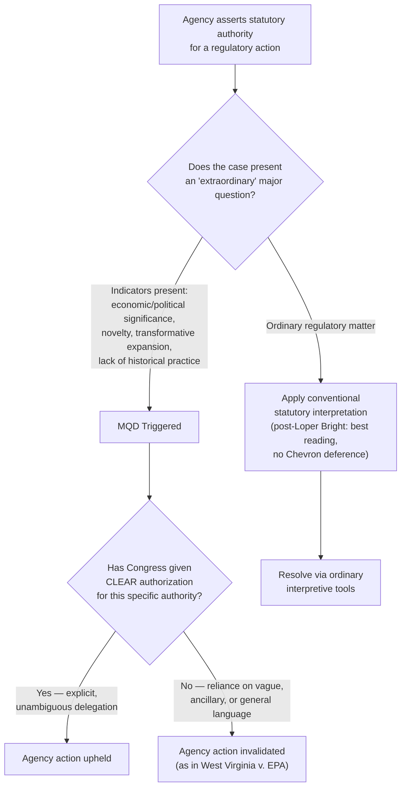

## West Virginia v. EPA and the Clear Congressional Authorization Requirement

### Doctrinal Overview

*West Virginia v. Environmental Protection Agency*, 597 U.S. 697 (2022), is the case in which the Supreme Court **formally named and systematized** the Major Questions Doctrine (MQD) as a distinct interpretive framework, consolidating decades of precursor reasoning from cases like *FDA v. Brown & Williamson* and *Utility Air Regulatory Group v. EPA* into an explicit, labeled doctrine with an articulated triggering test and evidentiary burden. The decision curtailed EPA's authority to regulate greenhouse gas (GHG) emissions from existing power plants under Section 111(d) of the Clean Air Act (CAA) and established that in "extraordinary cases," courts require **clear congressional authorization** before crediting an agency's claim to regulatory power of vast economic and political significance.

### Facts and Procedural Background

#### The Clean Power Plan

In 2015, the EPA promulgated the **Clean Power Plan (CPP)** under CAA Section 111(d), which authorizes EPA to set emission guidelines for existing stationary sources based on the "best system of emission reduction" (BSER) "adequately demonstrated."

**Key Points**

- Historically, EPA had interpreted "best system of emission reduction" as technology or operational measures applicable **at and to** an individual regulated source (e.g., installing scrubbers, improving combustion efficiency) — "inside the fenceline" measures.
- The CPP departed from this by setting state-wide emission caps calculated using a **"generation shifting"** approach: reducing utilization of higher-emitting coal plants and shifting electricity generation to lower- or zero-emitting sources (natural gas, renewables) — an "outside the fenceline" system operating at the level of the electricity grid as a whole.
- The practical effect would have required a nationwide restructuring of the electricity generation mix, projected to shutter a substantial share of coal-fired capacity.
- The CPP never took effect: the Supreme Court stayed it in 2016 (*West Virginia v. EPA*, an earlier stay order), and the Trump administration EPA repealed and replaced it with the **Affordable Clean Energy (ACE) rule**, which reverted to inside-the-fenceline measures.
- The D.C. Circuit vacated the ACE rule and its repeal of the CPP in 2021, prompting review by the Supreme Court even though the CPP itself was defunct and the Biden EPA had not yet issued a replacement rule — raising a live question of **justiciability/mootness** that the majority addressed under the "capable of repetition yet evading review" and voluntary-cessation doctrines.

#### Procedural Posture

Multiple states (led by West Virginia), coal companies, and industry groups petitioned for review of the D.C. Circuit's vacatur, challenging EPA's statutory authority to adopt generation-shifting as the "best system of emission reduction" under Section 111(d).

### Holding

The Supreme Court (6-3, Chief Justice Roberts writing for the majority) held that:

1. The case was justiciable despite the CPP's non-operative status, given the D.C. Circuit's judgment and the reasonable expectation the EPA would rely on the same generation-shifting authority in a future rule.
2. **This was an "extraordinary case"** warranting application of the major questions doctrine.
3. Congress did not **clearly authorize** EPA to adopt a generation-shifting approach to regulating power plant emissions under Section 111(d).
4. The EPA's assertion of this authority was therefore invalid absent clear congressional authorization.

### The Doctrinal Test as Articulated

#### Step One: Identifying an "Extraordinary Case"

The majority opinion synthesized several non-exclusive indicators that a case involves a "major question" warranting heightened scrutiny rather than ordinary *Chevron* analysis:

**Key Points**

- **Economic and political significance**: The agency's action involves billions of dollars in compliance costs and/or has significant political salience (e.g., prior congressional consideration and rejection of similar proposals, such as cap-and-trade legislation that failed in Congress).
- **Lack of history and expertise**: The agency is asserting a novel form of authority it has not previously claimed, in an area outside its traditional expertise (EPA regulating the composition of the national electricity generation mix, a matter more traditionally within the expertise of the Federal Energy Regulatory Commission (FERC) and state utility regulators).
- **"Transformative expansion"**: The agency's claimed authority represents a fundamental revision of a statute's scope — using a "previously little-used backwater" provision (Section 111(d) had rarely been invoked) to accomplish a sweeping policy goal.
- **Discovery of "unheralded power"**: Echoing *Brown & Williamson* and *UARG*, the Court was skeptical that Congress would delegate a decision of such magnitude through the vague phrase "best system of emission reduction" without more explicit direction.
- **Fit with agency's convenient interpretation of its own power**: The Court noted the CPP would allow EPA to effectively decide the optimal mix of energy generation for the entire country — a decision of "such magnitude and consequence" that it rests with Congress or an agency acting under clear congressional authorization.

#### Step Two: Applying the Clear Statement Requirement

Once a case is identified as "extraordinary," the burden effectively shifts: the agency must point to "clear congressional authorization" for the specific authority claimed, rather than relying on a plausible or reasonable reading of ambiguous statutory text.

$$P(\text{Authority Upheld}) \propto \text{Clarity}(\text{Statutory Text}) \times \mathbb{1}[\text{Delegation Explicit}]$$

This is illustrative shorthand for the heightened evidentiary standard, not a formula articulated by the Court. [Inference] The Court did not specify a precise quantum of textual clarity required, leaving significant interpretive discretion to lower courts applying the doctrine in subsequent cases.

**Key Points**

- This reverses the ordinary *Chevron* presumption. Under conventional *Chevron* Step Two, statutory ambiguity favors the agency if its interpretation is reasonable. Under MQD, in extraordinary cases, statutory ambiguity favors the *challenger* — ambiguity is treated as evidence Congress did **not** clearly delegate that authority.
- The Court held the phrase "best system of emission reduction" was not the kind of clear delegation needed to support a decision "of such economic and political significance."
- Justice Gorsuch's concurrence (joined by Justice Alito) offered the fullest doctrinal elaboration, tracing the doctrine's roots to constitutional avoidance principles and nondelegation concerns, and proposing a more structured framework of factors.

### Diagram: The Clear-Statement Analytical Sequence

### SVG: Inside-the-Fenceline vs. Generation-Shifting Regulatory Approaches (svg_diagram)

<svg xmlns="http://www.w3.org/2000/svg" viewBox="0 0 740 360">
<text x="370" y="28" text-anchor="middle" font-size="17" font-weight="bold" font-family="sans-serif">BSER Approaches Under CAA §111(d) (svg_diagram)</text>
<rect x="30" y="60" width="320" height="260" fill="none" stroke="#2c3e50" stroke-width="2" rx="8" />
<text x="190" y="90" text-anchor="middle" font-size="14" font-weight="bold" font-family="sans-serif">"Inside the Fenceline"</text>
<text x="190" y="108" text-anchor="middle" font-size="12" font-family="sans-serif">(ACE Rule approach)</text>
<rect x="60" y="130" width="260" height="50" fill="none" stroke="#34495e" stroke-width="1.5" />
<text x="190" y="160" text-anchor="middle" font-size="12" font-family="sans-serif">Heat-rate efficiency upgrades</text>
<rect x="60" y="195" width="260" height="50" fill="none" stroke="#34495e" stroke-width="1.5" />
<text x="190" y="225" text-anchor="middle" font-size="12" font-family="sans-serif">Equipment at the specific plant</text>
<text x="190" y="280" text-anchor="middle" font-size="11" font-family="sans-serif">Traditional understanding of</text>
<text x="190" y="296" text-anchor="middle" font-size="11" font-family="sans-serif">"system of emission reduction"</text>
<rect x="390" y="60" width="320" height="260" fill="none" stroke="#c0392b" stroke-width="2" rx="8" />
<text x="550" y="90" text-anchor="middle" font-size="14" font-weight="bold" font-family="sans-serif">"Generation Shifting"</text>
<text x="550" y="108" text-anchor="middle" font-size="12" font-family="sans-serif">(Clean Power Plan approach)</text>
<rect x="420" y="130" width="260" height="50" fill="none" stroke="#922b21" stroke-width="1.5" />
<text x="550" y="160" text-anchor="middle" font-size="12" font-family="sans-serif">Shift output: coal → gas/renewables</text>
<rect x="420" y="195" width="260" height="50" fill="none" stroke="#922b21" stroke-width="1.5" />
<text x="550" y="225" text-anchor="middle" font-size="12" font-family="sans-serif">Grid-wide, statewide caps</text>
<text x="550" y="280" text-anchor="middle" font-size="11" font-family="sans-serif">Rejected: transformative expansion</text>
<text x="550" y="296" text-anchor="middle" font-size="11" font-family="sans-serif">absent clear authorization</text>
</svg>

### Comparative Table: Ordinary Deference vs. Major Questions Analysis

| Dimension | Ordinary Statutory Interpretation | Major Questions Doctrine |
| --- | --- | --- |
| Ambiguity resolution | (Pre-2024) Deference to reasonable agency reading under *Chevron*; (Post-*Loper Bright*, 2024) Court determines "best reading" independently | Ambiguity counts *against* the agency |
| Presumption | Agency expertise/political accountability favored | Congressional specificity required |
| Trigger | Any statutory gap or ambiguity | "Extraordinary" cases: high economic/political stakes, novelty, transformative scope |
| Burden | Agency need show reasonableness | Agency must show clear, explicit delegation |
| Rationale | Separation of powers via delegation to expert agencies | Separation of powers via nondelegation-adjacent concerns; major policy choices belong to Congress |

### Justice Kagan's Dissent (Key Counterarguments)

**Key Points**

- Argued the majority "appoints itself... the decisionmaker on climate policy," substituting judicial judgment for the technical and policy judgments Congress assigned to EPA.
- Contended Section 111(d)'s broad "best system" language was precisely the kind of open-ended delegation Congress uses when it wants agencies to exercise ongoing judgment as circumstances (including technology and the electricity grid) evolve.
- Criticized the doctrine as lacking a principled, predictable boundary — arguing "extraordinary case" status is determined by an ad hoc, multi-factor balancing test invented by the Court rather than derived from the statutory text itself.
- Warned the decision would hamper agencies' ability to address large-scale, evolving problems (climate change paradigmatically) precisely where flexible, expert-driven regulation is most needed.

### Relationship to *Loper Bright Enterprises v. Raimondo* (2024)

**Key Points**

- *West Virginia v. EPA* operated in a legal landscape still governed by *Chevron* deference; MQD functioned partly as an *exception* or *threshold override* to *Chevron* — if a case was "major," courts skipped *Chevron* deference altogether and demanded clear authorization instead.
- *Loper Bright* (2024) overruled *Chevron* deference generally, instructing courts to use independent judgment to determine the "best reading" of a statute using traditional interpretive tools.
- [Inference] Because ordinary deference no longer exists post-*Loper Bright*, the practical relationship between MQD's clear-statement requirement and ordinary interpretation is an evolving question; some scholars suggest MQD may function as a heightened clear-statement canon layered atop ordinary "best reading" analysis in major cases, though the Supreme Court has not definitively resolved how the two frameworks interact going forward.

### Applications and Progeny

**Key Points**

- *Biden v. Nebraska* (2023) — applied MQD to invalidate the Secretary of Education's student loan forgiveness program under the HEROES Act, citing the program's ~$430 billion cost and political salience.
- *Alabama Association of Realtors v. HHS* (2021) (pre-dating formal naming but consistent reasoning) — invalidated CDC's nationwide eviction moratorium.
- *NFIB v. OSHA* (2022) — invalidated OSHA's COVID-19 vaccination-or-testing emergency standard for large employers as exceeding the agency's authority absent clear congressional authorization.
- [Unverified] Application of the doctrine in lower federal courts since 2022 has produced varying outcomes across environmental, healthcare, labor, and financial regulatory contexts, and the precise scope of "extraordinary case" status continues to be litigated and may vary by circuit.

### Related Topics

- *Loper Bright Enterprises v. Raimondo* (2024) — the end of *Chevron* deference
- *Biden v. Nebraska* (2023) — student loan forgiveness and the HEROES Act
- Clean Air Section 111(d) rulemaking history and the EPA's post-*West Virginia* replacement rules (e.g., 2024 Carbon Pollution Standards)
- Nondelegation doctrine and its constitutional relationship to MQD
- The "clear statement rule" family (federalism canon, sovereign immunity canon, extraterritoriality canon)
- Justice Gorsuch's concurrence and its proposed multi-factor structuring of MQD
- State implementation plans and cooperative federalism under the Clean Air Act
- FERC's jurisdiction over wholesale electricity markets and its interaction with EPA authority