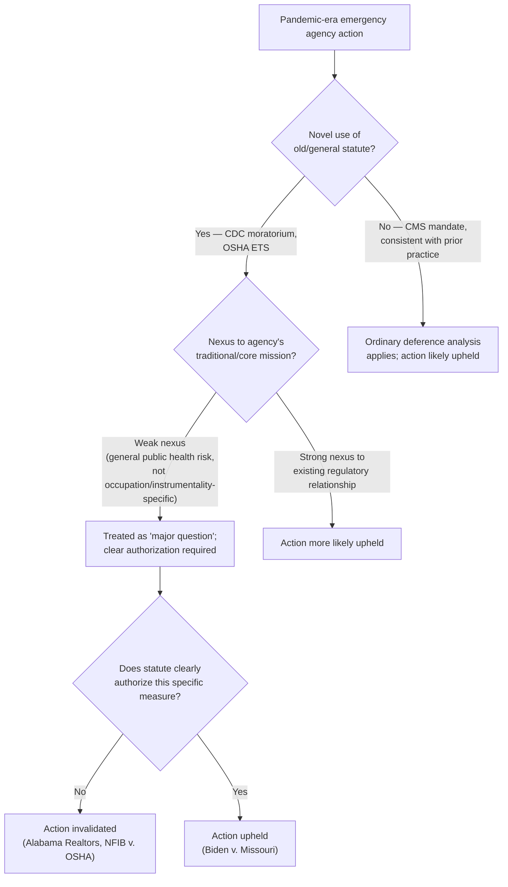

## Application to Pandemic-Era Action: Eviction Moratoria and Vaccine Mandates

### Doctrinal Overview

The COVID-19 pandemic produced a cluster of emergency regulatory actions that became the Supreme Court's principal proving ground for the Major Questions Doctrine (MQD) *before* the doctrine was formally named in *West Virginia v. EPA* (2022). Two cases — *Alabama Association of Realtors v. Department of Health and Human Services* (2021) (the CDC eviction moratorium) and *National Federation of Independent Business v. OSHA* (2022) (the OSHA vaccine-or-testing mandate) — applied major-questions-style reasoning to invalidate sweeping emergency measures grounded in old, general statutory provisions never previously used for such purposes. A third case, *Biden v. Missouri* (2022), upheld a related mandate, illustrating the doctrine's limits and the significance of statutory specificity.

### Alabama Association of Realtors v. HHS (2021) — The CDC Eviction Moratorium

#### Facts and Procedural Background

**Key Points**

- In September 2020, the CDC issued a nationwide eviction moratorium, invoking Section 361(a) of the Public Health Service Act (PHSA), which authorizes the Surgeon General (via delegated authority to the CDC) to make and enforce regulations "necessary to prevent the introduction, transmission, or spread of communicable diseases."
- The statute's illustrative list of permissible measures includes "inspection, fumigation, disinfection, sanitation, pest extermination, [and] destruction of animals or articles found to be so infected or contaminated" — measures targeting the instrumentalities of disease transmission, not broad economic relationships like landlord-tenant law.
- The moratorium was extended multiple times (initially by Congress via the CARES Act for a limited period, then unilaterally by the CDC after congressional authorization lapsed), eventually covering the majority of U.S. counties experiencing "substantial or high" COVID-19 transmission.
- Landlords and real estate associations challenged the moratorium as exceeding the CDC's statutory authority and violating the Take Clause of the Fifth Amendment (the merits reached primarily addressed the statutory question).

#### Holding and Reasoning

The Supreme Court, in a **per curiam** opinion (unsigned, but understood to reflect a 6-3 majority) issued via the shadow docket, held that the CDC's moratorium likely exceeded its statutory authority and vacated a stay that had kept the moratorium in effect, effectively ending it.

**Key Points**

- **Textual disconnect**: The Court found it improbable that Congress, in giving CDC authority to act against the vectors and instrumentalities of disease (fumigation, sanitation, pest control), intended to authorize the CDC to reorder the landlord-tenant relationship across the entire national economy.
- **Economic magnitude**: The moratorium was estimated to affect $50 billion or more in unpaid rent nationally and implicated the property and contract rights of millions of landlords — an intervention "into an area that falls squarely within the States' police power" (housing and landlord-tenant regulation being a traditionally state-law domain).
- **"If a federally imposed eviction moratorium is to continue, Congress must specifically authorize it"** — the Court's opinion explicitly stated that the CDC's public-health rationale, however sympathetic, did not substitute for clear statutory authorization, particularly because Congress itself had enacted (and allowed to lapse) a time-limited version of the same policy, suggesting Congress understood ongoing extension required its own action.
- **Novelty of the assertion**: The Court noted that in the PHSA's history since 1944, the CDC had never before used Section 361(a) to impose a measure of this kind or scope — a hallmark "lack of historical practice" indicator later formalized in *West Virginia v. EPA*.
- Dissent (Justice Breyer, joined by Justices Sotomayor and Kagan) argued the statutory text was broad enough to cover measures reasonably necessary to prevent disease spread, and that unwinding the stay mid-pandemic risked immediate, irreversible harm to vulnerable tenants.

### National Federation of Independent Business v. OSHA (2022) — The Vaccine-or-Testing Mandate

#### Facts and Procedural Background

**Key Points**

- In November 2021, OSHA issued an Emergency Temporary Standard (ETS) under the Occupational Safety and Health Act, requiring employers with 100+ employees to mandate that workers either be vaccinated against COVID-19 or undergo weekly testing and wear masks — covering an estimated 84 million workers.
- OSHA invoked its authority under 29 U.S.C. §655(c), which permits emergency temporary standards where the agency determines employees are exposed to a "grave danger" from toxic substances or "physically harmful" agents, and where the standard is "necessary" to protect employees from that danger.
- OSHA had used its ETS authority only a handful of times in the statute's roughly 50-year history and had never before issued a broad public-health vaccination mandate covering nearly all employers above a headcount threshold.

#### Holding and Reasoning

The Supreme Court (6-3, per curiam) **stayed the OSHA ETS**, holding petitioners were likely to succeed on the merits that OSHA lacked authority to impose the mandate.

**Key Points**

- **Distinguishing workplace-specific risk from general societal risk**: The majority characterized COVID-19 as a risk "not limited to the workplace" — it exists wherever people gather — and reasoned the OSH Act empowers OSHA to regulate *occupational* hazards (industry-specific dangers like toxic chemicals or fire hazards) rather than serving as a general public health authority applicable to all Americans merely because they happen to be employed.
- **"A blunt instrument"**: The Court characterized the mandate as an indiscriminate requirement applying regardless of industry, workplace risk profile, or exposure levels — sweeping in bakers and accountants alongside meatpackers, rather than being calibrated to occupation-specific danger as the "grave danger" standard would ordinarily require.
- **Scale**: Affecting 84 million workers with significant compliance costs (estimated in the billions of dollars) and requiring either vaccination (an irreversible medical intervention) or ongoing testing, the Court found this the kind of "significant encroachment into the lives — and health — of a vast number of employees" requiring clear congressional authorization.
- **Historical absence**: OSHA's sparing use of its ETS authority historically, combined with the absence of any prior vaccine mandate of this kind, supported the inference that Congress had not contemplated OSHA would use this authority so broadly.
- Dissent (Justices Breyer, Sotomayor, and Kagan, jointly) argued the statute's "grave danger" language plainly covered a highly transmissible, lethal airborne virus present in workplaces, and that the majority substituted its own judgment for OSHA's technical expertise on occupational safety during an active public health emergency.

### Contrast: Biden v. Missouri (2022) — The CMS Healthcare Worker Mandate

#### Facts and Holding

**Key Points**

- Decided the same day as *NFIB v. OSHA*, this case addressed a separate mandate by the Centers for Medicare & Medicaid Services (CMS) requiring vaccination for staff at healthcare facilities participating in Medicare and Medicaid.
- The Supreme Court (5-4) **upheld** this mandate, reasoning it fell within CMS's authority under statutes explicitly empowering the agency to condition provider/supplier participation in Medicare/Medicaid on requirements necessary for "the health and safety of individuals who are furnished services."
- **Key distinguishing factors** from the OSHA case: (1) CMS's authorizing statutes contained long-standing, specific authority to impose health and safety conditions on participating facilities, including a history of similar conditions (e.g., infection control, staff vaccination against other diseases like hepatitis B); (2) the mandate was targeted at a discrete population (healthcare workers treating vulnerable patients) rather than the entire economy; (3) Congress had authorized CMS to impose exactly this type of condition as a matter of course in the Medicare/Medicaid regulatory relationship, making it not a "transformative expansion" but an ordinary exercise of existing, frequently-used authority.

#### Why the Outcomes Diverged

| Factor | CDC Eviction Moratorium (Struck) | OSHA ETS (Struck) | CMS Healthcare Mandate (Upheld) |
| --- | --- | --- | --- |
| Statutory hook | General disease-prevention measures (fumigation, sanitation) | "Grave danger" from toxic/harmful agents in the *workplace* | Explicit authority to set health/safety conditions on program participation |
| Historical agency practice | Never used this way in ~80 years | ETS authority used sparingly; never for vaccination | Frequently used to impose health/safety conditions, including vaccination |
| Scope of population affected | Nationwide landlord-tenant relationships | 84 million workers across all industries | Healthcare facility staff (a defined, high-risk population) |
| Nexus to agency's core mission | Weak (housing regulation is traditionally state law) | Weak (general public health risk, not occupation-specific) | Strong (direct nexus to patient safety in regulated facilities) |
| Congressional specificity | Congress itself had only authorized a time-limited version | No comparable specific authorization | Statute specifically contemplates conditions of this type |

### Diagram: Comparative Analytical Pathway

### SVG: Scope and Population Comparison (svg_diagram)

<svg xmlns="http://www.w3.org/2000/svg" viewBox="0 0 740 320">
<text x="370" y="26" text-anchor="middle" font-size="16" font-weight="bold" font-family="sans-serif">Population Scope of Pandemic-Era Mandates (svg_diagram)</text>
<rect x="40" y="60" width="200" height="50" fill="none" stroke="#c0392b" stroke-width="2" />
<text x="140" y="90" text-anchor="middle" font-size="12" font-family="sans-serif">CDC Moratorium</text>
<rect x="40" y="120" width="640" height="30" fill="none" stroke="#c0392b" stroke-width="1" />
<text x="360" y="140" text-anchor="middle" font-size="11" font-family="sans-serif">All U.S. residential tenants/landlords in covered counties</text>
<rect x="40" y="170" width="200" height="50" fill="none" stroke="#c0392b" stroke-width="2" />
<text x="140" y="200" text-anchor="middle" font-size="12" font-family="sans-serif">OSHA ETS</text>
<rect x="40" y="230" width="560" height="30" fill="none" stroke="#c0392b" stroke-width="1" />
<text x="320" y="250" text-anchor="middle" font-size="11" font-family="sans-serif">~84 million workers, all industries, 100+ employee firms</text>
<rect x="40" y="270" width="130" height="30" fill="none" stroke="#27ae60" stroke-width="2" />
<text x="105" y="290" text-anchor="middle" font-size="11" font-family="sans-serif">CMS Mandate</text>
<rect x="180" y="270" width="180" height="30" fill="none" stroke="#27ae60" stroke-width="1" />
<text x="270" y="290" text-anchor="middle" font-size="10" font-family="sans-serif">Healthcare facility staff (defined subset)</text>
</svg>

### Significance for MQD's Formalization

**Key Points**

- These shadow-docket decisions, issued via emergency applications rather than full merits briefing and argument, nonetheless **articulated and applied the core MQD factors** — economic/political significance, lack of historical practice, weak nexus to agency's traditional authority, and demand for clear statutory authorization — roughly a year before *West Virginia v. EPA* formally named and systematized the doctrine.
- [Inference] Commentators generally view the pandemic-era cases as the "proving ground" where the modern, more assertive version of MQD was field-tested before its full articulation, though the Court itself did not explicitly frame them at the time as building a unified doctrine.
- The pattern of striking down two mandates while upholding a third demonstrates the doctrine functions as **calibrated skepticism** rather than a categorical bar on emergency public health action — specificity of statutory authorization and historical/institutional fit with the agency's mission were dispositive distinguishing factors.
- Critics note the shadow-docket posture (minimal briefing, no oral argument, unsigned per curiam opinions) drew separate criticism regarding procedural transparency, distinct from but related to substantive MQD critiques.

### Related Topics

- *West Virginia v. EPA* (2022) — formal naming and systematization of MQD
- The Supreme Court's "shadow docket" and emergency application practice
- Public Health Service Act §361 and CDC's communicable disease authority
- The Occupational Safety and Health Act's Emergency Temporary Standard mechanism (29 U.S.C. §655(c))
- Federalism and the states' traditional police power over landlord-tenant law
- *Biden v. Nebraska* (2023) — student loan forgiveness under the HEROES Act
- Executive emergency powers during declared public health emergencies
- The Take Clause and regulatory takings claims arising from the eviction moratorium litigation