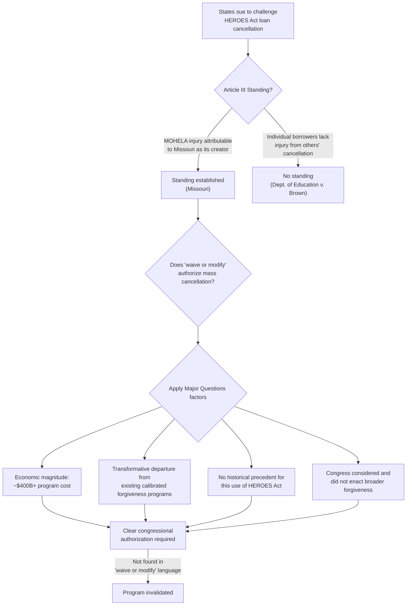

## Biden v. Nebraska and Student Loan Cancellation

### Doctrinal Overview

*Biden v. Nebraska*, 600 U.S. 477 (2023), applied the newly formalized Major Questions Doctrine (MQD) from *West Virginia v. EPA* (2022) to invalidate the Secretary of Education's plan to cancel up to $10,000–$20,000 in federal student loan debt per qualifying borrower. The case is significant both as the doctrine's first major post-*West Virginia* application and as a vehicle for the Court to address standing doctrine in the context of state-initiated challenges to federal executive action.

### Facts and Procedural Background

#### The Loan Forgiveness Program

**Key Points**

- In August 2022, the Secretary of Education announced a plan to cancel federal student loan debt: up to $10,000 for borrowers earning under $125,000 individually ($250,000 for households), and up to $20,000 for Pell Grant recipients meeting the same income thresholds.
- The Department of Education invoked the **Higher Education Relief Opportunities for Students Act of 2003 (HEROES Act)**, 20 U.S.C. §1098bb, enacted after 9/11 to give the Secretary authority to "waive or modify" provisions of federal student financial assistance programs to ensure borrowers affected by a "war or other military operation or national emergency" are not placed in a "worse position financially" as a result of that emergency.
- The Department relied on the COVID-19 national emergency declaration as the triggering emergency, reasoning that the pandemic's economic effects (increased default and delinquency risk) justified broad debt cancellation to prevent borrowers from being financially worse off.
- The projected cost of the program was estimated by the Congressional Budget Office at approximately **$400 billion** over the relevant budget window, with some estimates ranging higher; it would have affected an estimated 43 million borrowers, with roughly 20 million eligible for complete loan forgiveness.

#### Procedural Posture and the Standing Question

**Key Points**

- Six states (Nebraska, Missouri, Arkansas, Iowa, Kansas, and South Carolina) sued, arguing the Secretary lacked statutory authority for the plan and that it violated the separation of powers and the Administrative Procedure Act (APA).
- The lead standing theory involved **MOHELA** (the Missouri Higher Education Loan Authority), a nonprofit government corporation created by Missouri that services federal student loans. The states argued the forgiveness plan would financially injure MOHELA (by reducing the volume of loans it services and associated fees), and that this injury was attributable to Missouri for standing purposes.
- A separate case, *Department of Education v. Brown*, brought by individual borrowers challenging the program on procedural (APA notice-and-comment) grounds, was decided the same day; the Court held those individual plaintiffs lacked standing because they could not show the program's cancellation of *other* borrowers' debt caused them cognizable injury.

### Holding

The Supreme Court (6-3, Chief Justice Roberts writing) held:

1. **Missouri had standing** because MOHELA's financial injury (a "public corporation" created by and performing a public function for the state) was properly attributable to the state for Article III purposes.
2. **The HEROES Act did not authorize** the Secretary's debt cancellation program.

### Reasoning on the Merits

#### Statutory Text Analysis

**Key Points**

- The HEROES Act permits the Secretary to "waive or modify" existing statutory or regulatory provisions applicable to student financial assistance programs.
- The majority held that "waive or modify" cannot reasonably be stretched to mean the Secretary may **create an entirely new forgiveness program** canceling debt for tens of millions of borrowers. The Court characterized this as not modification of existing provisions but "effectively the introduction of a new regulatory regime."
- Applying the interpretive canon from *MCI Telecommunications v. AT&T* (1994) — a precursor case establishing that agencies cannot use authority to "modify" requirements to make "basic and fundamental changes" to a regulatory scheme — the Court reasoned that canceling $430 billion in debt was not "modification" in any ordinary sense but a wholesale rewrite.
- The Court noted the "waiver or modification" language had historically been used for modest adjustments (e.g., waiving certain documentation requirements, adjusting repayment timelines for affected borrowers) — never for mass, unconditional cancellation of principal balances.

#### Application of the Major Questions Framework

**Key Points**

- **Economic and political significance**: The Court emphasized the plan's ~$400+ billion price tag as "among the most consequential" exercises of executive authority in the nation's history in dollar terms, and noted its significant political salience, including prior congressional debate over broader loan forgiveness proposals that had not been enacted.
- **"Basic and fundamental change" to a program Congress carefully calibrated**: Congress had separately enacted detailed, income-based loan forgiveness programs (e.g., Income-Driven Repayment plans, Public Service Loan Forgiveness) with specific eligibility criteria, waiting periods, and conditions — evidence the HEROES Act's emergency "waiver" authority was not meant to bypass this carefully constructed statutory scheme.
- **Historical absence of similar use**: The HEROES Act had been used only for narrow adjustments since 2003; this was its first use to cancel loan principal on a mass, categorical basis.
- **Congressional awareness and inaction**: The majority noted Congress had considered and not enacted broad loan forgiveness legislation, supporting the inference that the Executive Branch could not achieve through emergency "waiver" authority what Congress itself had not authorized through ordinary legislation — echoing the "Congress does not hide elephants in mouseholes" reasoning from *Brown & Williamson* and *Whitman v. American Trucking*.
- The Court explicitly invoked the *West Virginia v. EPA* framework, asking whether the Secretary had "clear congressional authorization" for a decision of this "economic and political significance" — and concluded he did not.

### Diagram: Standing and Merits Analytical Structure

### Justice Barrett's Concurrence

**Key Points**

- Justice Barrett wrote separately to defend the MQD's legitimacy against charges that it is an ad hoc, results-driven canon, arguing it reflects ordinary principles of communication: **listeners (including courts) reasonably interpret speakers (including Congress) as not intending unusual or highly consequential results from ordinary, general language** absent a clear signal.
- She characterized MQD as a "communication-based" canon rather than a substantive limit on delegation — a tool for discerning what Congress actually meant by ambiguous text, rather than a freestanding rule imposing extra-textual limits.
- [Inference] This concurrence is frequently cited by commentators as the most developed defense of MQD's interpretive (rather than purely separation-of-powers-based) theoretical foundation, though its ultimate influence on the doctrine's future formulation remains to be seen in subsequent cases.

### Justice Kagan's Dissent

**Key Points**

- Joined by Justices Sotomayor and Jackson, argued the majority manufactured Article III standing where none existed — MOHELA, a legally distinct entity, did not sue, and Missouri suffered no direct financial injury itself.
- On the merits, argued the HEROES Act's text was **broad by design**, given its enactment to handle unforeseen, evolving national emergencies, and that "waive or modify" naturally encompasses cancellation when a "modification" reduces a balance to zero for a defined category of affected borrowers.
- Criticized the majority for using MQD to override the Executive's judgment about how best to respond to a *bona fide* declared national emergency (COVID-19), arguing this was precisely the kind of context-dependent, expertise-driven decision Congress intended to leave to the Secretary.
- Described the majority's standing analysis as a vehicle allowing the Court to reach a merits outcome it favored, echoing broader institutional critiques of MQD as outcome-oriented.

### Comparative Analysis with Prior MQD Cases

| Factor | *West Virginia v. EPA* (2022) | *Biden v. Nebraska* (2023) |
| --- | --- | --- |
| Statutory hook | CAA §111(d) "best system of emission reduction" | HEROES Act "waive or modify" |
| Dollar magnitude | Billions in compliance costs, restructuring of electricity sector | ~$400+ billion in direct debt cancellation |
| Historical agency practice | Section rarely used; never for generation-shifting | HEROES Act used only for narrow adjustments since 2003 |
| Existing calibrated scheme | N/A (novel regulatory approach) | Displaced existing income-driven repayment/PSLF frameworks |
| Congressional consideration | Cap-and-trade legislation failed to pass | Broad loan forgiveness legislation considered, not enacted |
| Outcome | Agency action invalidated | Agency action invalidated |

### Aftermath and Related Developments

**Key Points**

- Following the decision, the Department of Education pursued **alternative pathways** to debt relief, including a negotiated rulemaking process under the Higher Education Act (a different statutory basis with its own notice-and-comment requirements) and expansion of income-driven repayment terms (the "SAVE Plan"), some of which faced their own separate legal challenges.
- [Unverified] The extent to which subsequent, narrower debt-relief initiatives survive MQD-style scrutiny depends on statutory basis, program scope, and historical agency practice, and outcomes of related litigation may have continued to develop after this content's reference point.

### Related Topics

- *West Virginia v. EPA* (2022) — the formal articulation of MQD applied here
- *MCI Telecommunications v. AT&T* (1994) — "modify" cannot mean fundamental rewrite
- Article III standing doctrine and state-created public corporations (MOHELA)
- The HEROES Act of 2003 and its legislative history
- Higher Education Act negotiated rulemaking as an alternative regulatory pathway
- Justice Barrett's "communication theory" defense of the major questions doctrine
- *Loper Bright Enterprises v. Raimondo* (2024) and the end of *Chevron* deference
- Separation of powers and the spending/appropriations power in executive debt relief