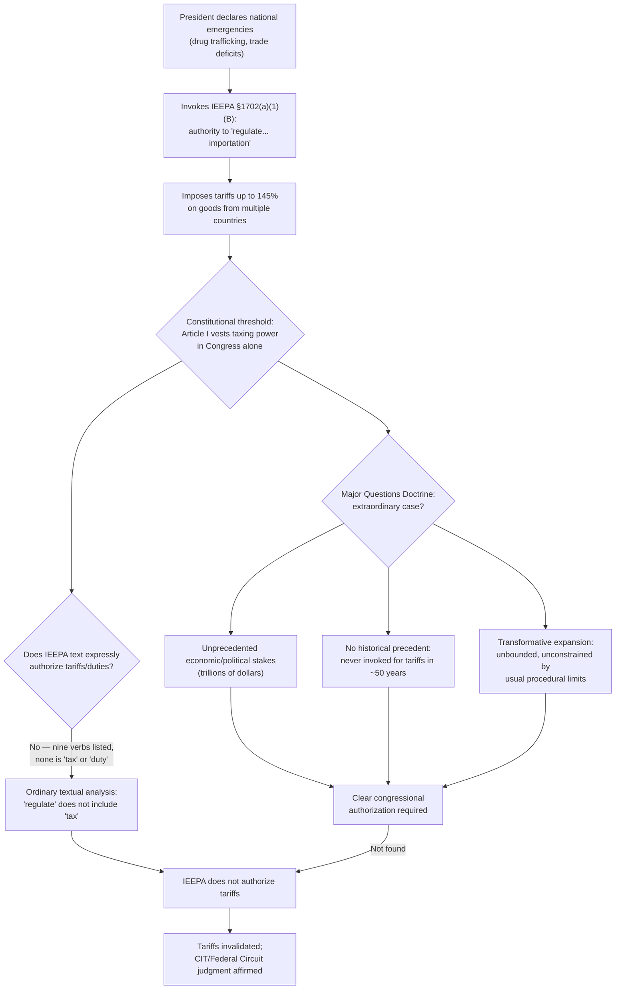

## Learning Resources v. Trump and Trump v. VOS Selections: Tariffs, IEEPA, and Presidential Action

### Doctrinal Overview

*Learning Resources, Inc. v. Trump* and *Trump v. V.O.S. Selections, Inc.*, 607 U.S. ___ (2026), consolidated and decided February 20, 2026, apply the Major Questions Doctrine (MQD) to invalidate the President's unilateral imposition of tariffs under the International Emergency Economic Powers Act (IEEPA). This is the doctrine's first major application to an assertion of *presidential* (rather than administrative-agency) authority, and its first application squarely implicating the constitutional allocation of the taxing power between Congress and the Executive.

### Facts and Procedural Background

**Key Points**

- Shortly after taking office in 2025, President Trump declared national emergencies as to two perceived threats: an influx of illegal drugs from Canada, Mexico, and China, and "large and persistent" trade deficits.
- Invoking IEEPA, he imposed tariffs ranging from a 25% duty on most imports from Canada and Mexico to an effective tariff rate on most Chinese goods of 145%, later subject to numerous further increases, reductions, and modifications by executive order.
- Two sets of plaintiffs sued: Learning Resources (two small businesses) in the U.S. District Court for the District of Columbia, and V.O.S. Selections (five small businesses and 12 states) in the U.S. Court of International Trade (CIT).
- The district court entered a preliminary injunction against the tariffs; the CIT granted summary judgment for the plaintiffs; and the Federal Circuit, sitting en banc, affirmed, holding that IEEPA's grant of authority to "regulate... importation" did not authorize tariffs "unbounded in scope, amount, and duration."
- The Supreme Court granted certiorari, consolidated the cases, and heard expedited oral argument.

### Holding

The Supreme Court held **6-3** that the President's authority to "regulate... importation" under IEEPA does not authorize him to impose tariffs. Chief Justice Roberts announced the judgment and delivered the opinion of the Court, joined in full by Sotomayor, Kagan, Gorsuch, Barrett, and Jackson as to the core statutory holding (Parts I, II-A-1, and II-B), with Gorsuch and Barrett joining an additional major-questions-based rationale (Parts II-A-2 and III).

### Reasoning: The Constitutional Foundation

**Key Points**

- The Court began from first principles: a tariff is a tax, and the Framers did not vest any of the taxing power in the Executive Branch; under Article I, revenue-raising bills must originate in the House of Representatives.
- The Government conceded the President has no inherent peacetime authority to impose tariffs and relied exclusively on IEEPA's grant of authority to "regulate... importation" as a delegation broad enough to authorize unlimited tariffs on any product, from any country, for any duration.

### Reasoning: The Major Questions Analysis

**Key Points**

- Writing for a plurality on this portion, the Chief Justice (joined by Gorsuch and Barrett) applied the MQD framework directly, citing the doctrine's precursors in *Brown & Williamson*, *Utility Air Regulatory Group*, *West Virginia v. EPA*, *NFIB v. OSHA*, *Alabama Association of Realtors*, and *Biden v. Nebraska*.
- **Economic and political significance**: The Government itself touted enormous stakes — projections that the tariffs would reduce the national deficit by trillions of dollars and that resulting international agreements could be worth trillions more — leading the Court to observe these stakes "dwarf those of other major questions cases," including the $430 billion at issue in *Nebraska* and the compliance costs in *West Virginia*.
- **Lack of historical precedent**: In IEEPA's roughly half-century of existence, no President had ever invoked the statute to impose tariffs of any kind, let alone tariffs of this magnitude and scope — a "telling indication" the asserted power exceeds the President's legitimate statutory reach.
- **Transformative expansion**: The Government's reading would let the President unilaterally impose unbounded tariffs, unconstrained by the procedural limits (agency investigations, public hearings, caps on rate and duration) that Congress has consistently attached to every other tariff-delegating statute — representing a "transformative expansion" of executive authority over both tariff policy and the broader economy.
- **No emergency-statute exception**: The Court rejected the argument that MQD should not apply to emergency-response statutes, reasoning that emergency powers "tend to kindle emergencies" and that dozens of IEEPA emergencies (some declared decades earlier) remain perpetually "ongoing" — precisely the kind of open-ended authority requiring, not excusing, a clear-statement requirement.
- **No foreign-affairs exception**: The Court rejected a categorical foreign-affairs carve-out from MQD, reasoning that the Constitution gives the tariff power to "Congress alone" notwithstanding the obvious foreign-affairs implications of tariffs, and that such implications do not make it more plausible Congress silently relinquished that power.
- **"No major questions exception to the major questions doctrine"**: The Court rejected the argument that statutes addressing "the most major of major questions" should be read *more* broadly — reasoning it is precisely in such statutes that sweeping, unstated delegations of core congressional power are most likely to be lurking and most warrant scrutiny.

### Reasoning: The Textual Holding (Part II-B)

**Key Points**

- Independent of MQD, the majority (six Justices, without Gorsuch/Barrett's additional major-questions gloss but joining this textual section) held IEEPA's text does not support a tariff power on ordinary interpretive grounds.
- IEEPA authorizes the President to "investigate, block during the pendency of an investigation, regulate, direct and compel, nullify, void, prevent or prohibit... importation or exportation" — a list of nine specific verbs containing no mention of tariffs or duties, which the Court found telling given Congress's practice of naming tariff authority expressly elsewhere.
- "Regulate," given its ordinary dictionary meaning ("fix, establish, or control; adjust by rule... direct by rule or restriction"), is broad but does not naturally include taxation; the Government could not identify any other statute in which a grant of regulatory authority was understood to include the power to tax.
- A contrary reading would render IEEPA partly unconstitutional, since the statute also purports to let the President "regulate... exportation," and taxing exports is expressly forbidden by the Constitution's Export Clause.
- The Court rejected the Government's reliance on *United States v. Yoshida International* (a 1975 Court of Customs and Patent Appeals decision upholding limited Nixon-era tariffs under IEEPA's predecessor, the Trading with the Enemy Act), finding a single, narrow, intermediate-appellate-court opinion insufficient to establish a "well-settled" judicial gloss Congress could be presumed to have incorporated into IEEPA.
- The Court distinguished *Federal Energy Administration v. Algonquin SNG* (upholding license fees under Section 232 of the Trade Expansion Act) as resting on different, more discretion-conferring statutory language, and found *Dames & Moore v. Regan* inapposite because it never addressed the "regulate" power or tariffs at all.

### Diagram: Structural Path to the Holding

### The Concurrences: A Fractured Court on MQD's Theoretical Basis

#### Justice Gorsuch's Concurrence

**Key Points**

- Gorsuch situated MQD within a long common-law tradition of construing delegated authority strictly — surveying 18th- and 19th-century corporate bylaw cases, agency/power-of-attorney law, and early railroad-commission cases — to argue the doctrine is not a novel invention but a "return to form" displaced temporarily by the mid-20th-century rise of *Chevron*-style deference.
- He characterized MQD as **"pro-Congress," not "anti-administrative-state"**: because Article I vests all federal legislative power in Congress, and because a lost delegation is difficult for Congress to reclaim (the President can veto any effort to take back a power once granted), courts should require clear authorization before crediting a transfer of that power.
- He pointedly noted the irony that Justices who had previously criticized MQD as reading statutory language too narrowly in other contexts (*NFIB v. OSHA*, *Alabama Realtors*, *West Virginia*, *Nebraska* dissents) here found IEEPA's similarly broad "regulate" language *insufficient* — suggesting the doctrine's core intuition commands broader assent than its critics acknowledge.
- He also critiqued Justice Barrett's "communication-based" theory of MQD (that the doctrine merely reflects ordinary principles of how listeners interpret speakers), arguing that unlike simple idiom cases (e.g., "drew blood" not covering a surgeon), the major-questions cases involve statutory language that is genuinely broad enough on its face to cover the claimed power — meaning the skepticism applied is not "common sense" but a substantive, Article I-based clear-statement rule by another name.

#### Justice Barrett's Concurrence

**Key Points**

- Continued to defend her view (from *Nebraska*) that MQD reflects "commonsense principles of communication" rather than a freestanding, extra-textual clear-statement rule — though she joined the majority's application of the doctrine here.

#### Justice Kagan's Opinion (Concurring in Part, Concurring in Judgment)

**Key Points**

- Joined by Sotomayor and Jackson, Kagan agreed IEEPA does not authorize tariffs but argued the Court need not invoke MQD at all, reasoning that "ordinary tools of statutory interpretation amply support that result" — i.e., this is a case resolvable through "straight-up statutory construction" without resort to a special canon.
- Gorsuch's concurrence directly challenged this position, arguing Kagan's approach was inconsistent with her broader statutory readings in prior major-questions dissents (*NFIB*, *Alabama Realtors*, *West Virginia*, *Nebraska*), where comparably broad delegating language was read expansively in the agency's favor.

#### Justice Jackson's Opinion (Concurring in Part, Concurring in Judgment)

**Key Points**

- Would have relied on legislative history — House and Senate Reports accompanying IEEPA and its predecessor TWEA — to conclude Congress did not intend IEEPA to authorize tariffs, without necessarily invoking MQD as the operative framework.

### The Dissents

**Key Points**

- **Justice Kavanaugh** (joined by Thomas and Alito) accepted that MQD applies and that the President must show clear authorization, but argued IEEPA's text, structure, and history satisfy that standard — pointing to the breadth of "regulate," the historical Nixon-era TWEA precedent, and the argument that tariffs are less extreme than the "compel"/"prohibit" powers IEEPA expressly grants. He also argued for a foreign-affairs-based exception or attenuation of MQD, given the President's independent constitutional role in that domain.
- **Justice Thomas** dissented separately, taking the broadest view that Congress may permissibly delegate the tariff power (among others) to the President without the kind of clear-statement constraint the majority imposed.

### Comparative Table: MQD Across Its Major Applications

| Case | Actor | Statute | Stakes | Historical Practice | Outcome |
| --- | --- | --- | --- | --- | --- |
| *Brown & Williamson* (2000) | FDA | FDCA "drug"/"device" | Multi-billion dollar tobacco industry | FDA long disclaimed jurisdiction | Invalidated |
| *UARG* (2014) | EPA | CAA PSD/Title V | Millions of newly regulated sources | Never used this way | Partially invalidated |
| *West Virginia v. EPA* (2022) | EPA | CAA §111(d) | Billions in compliance costs | Rarely invoked provision | Invalidated |
| *Biden v. Nebraska* (2023) | Sec. of Education | HEROES Act | ~$430 billion | Used only for narrow adjustments | Invalidated |
| *Learning Resources/V.O.S.* (2026) | The President | IEEPA | Trillions of dollars (per Government's own figures) | Never invoked for tariffs in ~50 years | Invalidated |

### Significance

**Key Points**

- This decision extends MQD beyond administrative agencies to **direct presidential assertions of statutory authority**, confirming the doctrine is not limited to Chevron-style agency rulemaking contexts.
- It squarely resolves that there is **no emergency-statute exception** and **no foreign-affairs exception** to MQD — significant given that many broad delegations to the President (national security, sanctions, emergency economic powers) are cast in similarly open-ended terms.
- The proliferation of separate opinions — a plurality-based major-questions rationale, two concurrences disputing the doctrine's theoretical foundation, two opinions arguing MQD was unnecessary to the result, and two dissents split between disputing the doctrine's application and its legitimacy altogether — reflects that, as of this decision, the Court remains **unsettled on MQD's doctrinal grounding** (constitutional avoidance/nondelegation-adjacent vs. ordinary communicative inference) even while converging on its application in high-stakes cases.
- [Inference] Given the fractured reasoning, lower courts and commentators will likely continue debating whether future major-questions cases require the full Gorsuch-style historical/structural justification, the Barrett-style "communication" framing, or can be resolved on ordinary textual grounds as Kagan and Jackson urged, since no single rationale commanded a majority for the doctrine's theoretical basis even though the result commanded six votes.
- [Unverified] The practical effects on the broader tariff regime — including the status of related executive orders, potential congressional responses, and downstream litigation over the many modifications the President made to the tariffs prior to the decision — were still developing as of this decision's release and may have continued to evolve afterward.

### Related Topics

- *West Virginia v. EPA* (2022) — the formal articulation of MQD applied and extended here
- *Biden v. Nebraska* (2023) — the immediately preceding major MQD application
- Article I, Section 8's Taxing and Spending Clause and the Export Clause
- The nondelegation doctrine and its relationship to MQD (Justice Gorsuch's *West Virginia* concurrence and its historical sources)
- IEEPA and its predecessor, the Trading with the Enemy Act (TWEA)
- *United States v. Yoshida International* (1975) — the sole prior tariff-related invocation of TWEA/IEEPA-type authority
- Justice Barrett's "communication theory" of clear-statement canons and its critics
- Separation of powers and unilateral executive economic policymaking
- Section 232 of the Trade Expansion Act of 1962 and other congressionally-delegated tariff authorities as alternative statutory bases