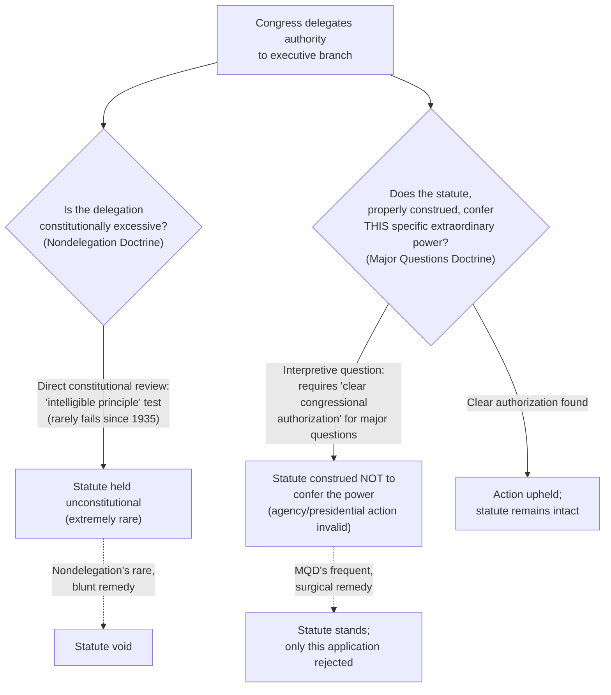
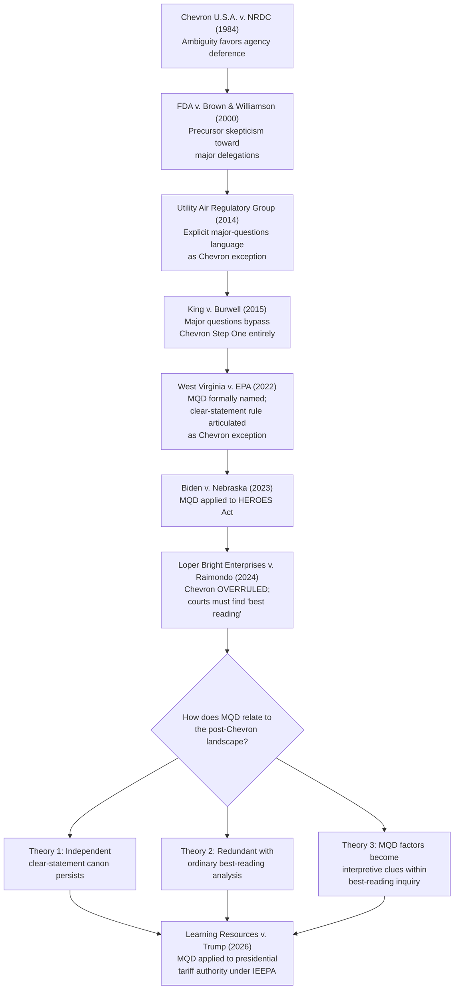

## The Doctrine's Relationship to Nondelegation and to Chevron's Demise

### Doctrinal Overview

The Major Questions Doctrine (MQD) does not operate in isolation. It sits at the intersection of two other significant constitutional and administrative-law developments: the **nondelegation doctrine**, which polices Congress's ability to hand off its legislative power in the first place, and the collapse of ***Chevron* deference** in *Loper Bright Enterprises v. Raimondo* (2024), which restructured how courts review agency statutory interpretation generally. Understanding MQD requires situating it against both — as a substitute for an atrophied nondelegation doctrine, and as a doctrine whose relationship to ordinary statutory interpretation has been reshaped now that *Chevron* is gone.

### Part One: MQD and the Nondelegation Doctrine

#### The Nondelegation Doctrine's Modern Dormancy

**Key Points**

- The nondelegation doctrine holds that Article I's Vesting Clause ("All legislative Powers herein granted shall be vested in a Congress") forbids Congress from transferring its lawmaking power to another branch.
- Since *J.W. Hampton, Jr. & Co. v. United States* (1928), the Supreme Court has required only that Congress supply an "intelligible principle" to guide agency discretion — a famously permissive standard.
- The Court has invalidated federal statutes on nondelegation grounds only **twice** in its history, both in 1935: *Panama Refining Co. v. Ryan* and *A.L.A. Schechter Poultry Corp. v. United States*, both New Deal-era cases. Since then, the doctrine has been effectively dormant for nearly nine decades, with the Court upholding delegations as broad as EPA's authority to set air quality standards "requisite to protect the public health" (*Whitman v. American Trucking Associations*, 2001).

#### MQD as a "Nondelegation Canon"

**Key Points**

- Justice Gorsuch's concurrence in *West Virginia v. EPA* (2022) offered the most developed account of MQD as functionally substituting for a more robust nondelegation doctrine. He characterized MQD as one of several **"nondelegation canons"** — interpretive tools that enforce Article I's separation-of-powers values without requiring courts to declare a statute unconstitutional.
- Under this view, rather than asking "did Congress delegate *too much* power to survive constitutional scrutiny" (the nondelegation question), MQD asks the interpretive question "did Congress delegate *this particular* power *at all*" — resolving the issue through statutory construction rather than constitutional invalidation.
- This is a significant institutional advantage: striking down a statute as an unconstitutional delegation is a blunt, rare, and doctrinally fraught remedy; declining to read an ambiguous statute as conferring a particular extraordinary power is a more surgical, lower-stakes judicial tool that leaves the statute otherwise intact and leaves Congress free to legislate more clearly if it wishes.
- **Justice Gorsuch's historical argument** (elaborated at length in his *Learning Resources v. Trump* concurrence, 2026) traces this technique to centuries of common-law practice: courts construing corporate bylaws, powers of attorney, and delegated authority generally required "express words" before crediting a claim to "extraordinary" power — a lineage he argues shows MQD is a "return to form" rather than a judicial invention.

#### The Constitutional Avoidance Framing

**Key Points**

- MQD can be understood as a species of the **constitutional avoidance canon**: where one reading of an ambiguous statute would raise serious constitutional doubts (here, nondelegation doubts), courts should prefer a narrower reading that avoids the constitutional question.
- On this account, MQD doesn't just reflect discomfort with nondelegation abstractly — it operationalizes the same underlying concern (that Congress must make the fundamental policy choices, not merely gesture toward them) through the ordinary tools of interpretation rather than judicial review of the statute's constitutionality.
- This framing explains why MQD cases never actually **hold a statute unconstitutional** — they simply hold that the statute, properly construed, does not confer the asserted power.

#### Competing Views: MQD as Independent of Nondelegation

**Key Points**

- Not all Justices accept the nondelegation-canon framing. Justice Barrett's concurrences (in *Biden v. Nebraska*, 2023, and reaffirmed with modification in *Learning Resources v. Trump*, 2026) argue MQD instead reflects **"commonsense principles of communication"** — ordinary inferences a reasonable reader draws about what a speaker (Congress) likely meant, given context, rather than a substantive constitutional canon imported to override the statute's most natural reading.
- Justice Kagan and other critics have historically argued MQD lacks *any* firm grounding — constitutional or interpretive — and instead operates as an ad hoc vehicle for judicial policy preferences, "appointing" the Court as the decisionmaker on major questions of the day (*West Virginia v. EPA* dissent).
- [Inference] The unresolved disagreement among the Justices about MQD's theoretical foundation — canon enforcing nondelegation values vs. ordinary interpretive inference vs. illegitimate judicial invention — means the doctrine's future scope and rigor may depend significantly on which theoretical account eventually commands a majority, a question the Court has not definitively resolved even as it has repeatedly applied the doctrine's practical test.

#### Diagram: MQD's Position Relative to Nondelegation

### Part Two: MQD and the Demise of Chevron Deference

#### Chevron's Framework (Pre-2024)

**Key Points**

- *Chevron U.S.A., Inc. v. Natural Resources Defense Council* (1984) established a two-step framework: (1) if Congress has directly addressed the precise question at issue, courts give effect to that unambiguous intent; (2) if the statute is silent or ambiguous, courts defer to the agency's interpretation so long as it is "reasonable" or "permissible."
- Under *Chevron*, statutory **ambiguity favored the agency** — courts presumed Congress implicitly delegated interpretive authority to the agency whenever it left a gap or ambiguity, on the theory that agencies possess relevant technical expertise and greater political accountability than courts.

#### MQD as a Pre-2024 Exception to Chevron

**Key Points**

- Before *Chevron*'s demise, MQD functioned as a **threshold override**: in "extraordinary cases" involving major economic or political significance, courts skipped *Chevron* analysis entirely rather than proceeding to Step Two deference.
- This reflected the Court's view (articulated in *King v. Burwell*, 2015, and *Utility Air*) that Congress does not implicitly delegate resolution of major questions to agencies through statutory ambiguity — the *Chevron* step-two assumption of implicit delegation was considered implausible precisely in the highest-stakes cases.
- The practical effect: MQD **inverted** the *Chevron* presumption for a defined category of cases. Ordinary ambiguity favored the agency; major-question ambiguity favored the challenger, requiring the agency to show clear, affirmative congressional authorization instead of merely a reasonable reading.

#### Loper Bright Enterprises v. Raimondo (2024): Chevron Overruled

**Key Points**

- *Loper Bright Enterprises v. Raimondo*, 603 U.S. 369 (2024), overruled *Chevron* deference outright. The Court (6-3, Chief Justice Roberts writing) held that the Administrative Procedure Act requires courts to exercise **independent judgment** in deciding whether an agency acted within its statutory authority, and that courts may not defer to an agency's reading of an ambiguous statute simply because it is "reasonable."
- Courts must now determine the **"best reading"** of a statute using traditional tools of statutory construction (text, structure, purpose, canons of interpretation), according appropriate respect to longstanding and consistent agency interpretations (under the older *Skidmore v. Swift & Co.* framework) as persuasive but not binding authority.
- The Court reasoned *Chevron* was inconsistent with the judiciary's Article III duty to "say what the law is" and had proven unworkable, generating decades of confusion over what counts as "ambiguity" sufficient to trigger deference.

#### The Post-Loper Bright Relationship

**Key Points**

- With *Chevron* gone, the doctrinal question of **how MQD now relates to ordinary interpretation** has become significantly murkier, since MQD's original function — as an exception carving out major questions from the *Chevron* deference regime — no longer has a deference regime to except from.
- Several competing theories have emerged among commentators and in concurring/dissenting opinions:
  - **Theory 1 — MQD as a surviving clear-statement canon layered atop "best reading" analysis**: Even without *Chevron*, courts might still apply heightened skepticism (demanding "clear congressional authorization") specifically for major questions, while using ordinary "best reading" analysis for everything else. This preserves MQD as an independent, freestanding canon operating within the *Loper Bright* framework.
  - **Theory 2 — MQD as redundant with ordinary "best reading" interpretation**: If courts are now required to find the single best reading of every statute regardless of ambiguity, the argument for a specially heightened standard in major-questions cases weakens, since courts are already not supposed to defer to agency readings merely because they are "reasonable." On this view, MQD's practical work is substantially absorbed into ordinary interpretation.
  - **Theory 3 — MQD as evidence in the "best reading" inquiry**: A hybrid view where the factors MQD identifies (economic magnitude, lack of historical practice, transformative scope) function as important **interpretive clues** courts weigh in determining the best reading, rather than a separate override triggered only in "extraordinary" cases.
- The Court's own decisions have not resolved which theory governs. In *Learning Resources v. Trump* (2026), Justice Gorsuch's concurrence explicitly argued that MQD "is not invention so much as return to form" now that *Chevron* is gone, suggesting the two doctrines' historical relationship (nondelegation-era skepticism preceding and outlasting the *Chevron* interlude) confirms MQD's independent vitality post-*Loper Bright*. Justice Kagan's concurrence in the same case, by contrast, suggested the result could be reached through "ordinary tools of statutory interpretation" without needing MQD as a separate doctrine at all — arguably supporting Theory 2 or Theory 3.

#### Comparative Table: Chevron, MQD, and Loper Bright

| Framework | Ambiguity Resolution | Agency's Burden | Status |
| --- | --- | --- | --- |
| *Chevron* Step Two (1984–2024) | Ambiguity favors the agency | Show interpretation is "reasonable" | Overruled by *Loper Bright* (2024) |
| MQD (pre-2024, as *Chevron* exception) | Ambiguity favors the challenger, in "extraordinary" cases only | Show "clear congressional authorization" | Formally named in *West Virginia v. EPA* (2022) |
| *Loper Bright* "best reading" (2024–present) | Courts determine the single best reading using ordinary tools; no deference for reasonableness | N/A — court decides independently | Governing framework |
| MQD post-*Loper Bright* | Unsettled: freestanding canon, redundant with best-reading analysis, or an interpretive factor | Unsettled | Actively applied (e.g., *Learning Resources v. Trump*, 2026) but theoretical relationship undefined |

#### Diagram: Timeline and Interaction

### Synthesizing the Two Relationships

**Key Points**

- MQD's relationship to nondelegation explains **why** the doctrine exists: it operationalizes Article I separation-of-powers concerns without the blunt remedy of constitutional invalidation.
- MQD's relationship to *Chevron*'s demise explains **how** the doctrine currently operates: it emerged as, and long functioned as, an exception to a deference regime that no longer exists, leaving its precise doctrinal placement within the *Loper Bright* "best reading" framework an open and actively contested question.
- [Inference] Because both relationships remain theoretically unsettled at the Supreme Court level — with different Justices favoring nondelegation-canon, communication-based, and ordinary-interpretation accounts — practitioners should expect continued doctrinal refinement in future major-questions cases, and should not assume any single theoretical account definitively governs the doctrine's application going forward.
- [Unverified] The extent to which lower courts have converged on a consistent post-*Loper Bright* application of MQD, as opposed to continuing to apply the pre-2024 "extraordinary case" threshold test largely unchanged, may vary by circuit and continues to develop.

### Related Topics

- *J.W. Hampton, Jr. & Co. v. United States* (1928) — the "intelligible principle" test
- *Panama Refining Co. v. Ryan* and *A.L.A. Schechter Poultry Corp. v. United States* (1935) — the only successful nondelegation challenges
- *Gundy v. United States* (2019) — Justice Gorsuch's dissent and the modern nondelegation revival movement
- *Loper Bright Enterprises v. Raimondo* (2024) — full case study of *Chevron*'s overruling
- *Skidmore v. Swift & Co.* (1944) — the persuasive-authority framework now governing agency interpretations
- Justice Gorsuch's taxonomy of "nondelegation canons" (federalism canon, sovereign immunity canon, MQD)
- Justice Barrett's "communication theory" of clear-statement rules
- *Learning Resources v. Trump* / *Trump v. V.O.S. Selections* (2026) — MQD's extension to presidential tariff authority