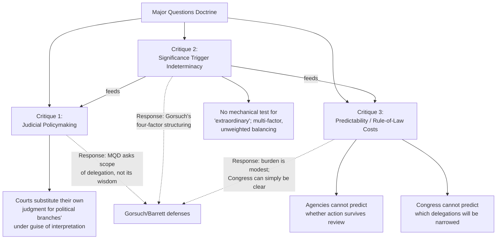

## Critiques: Judicial Policymaking, Significance Triggers, and Predictability Concerns

### Doctrinal Overview

The Major Questions Doctrine (MQD), despite its consolidation across *FDA v. Brown & Williamson*, *Utility Air Regulatory Group*, *West Virginia v. EPA*, *Biden v. Nebraska*, and *Learning Resources v. Trump*, remains one of the most academically and judicially contested doctrines in modern administrative law. Critics — including sitting Justices in dissent, lower-court judges, and a substantial body of legal scholarship — have raised three interlocking objections: that the doctrine enables **judicial policymaking** under the guise of interpretation; that its **"significance" trigger** lacks a coherent, principled test; and that these two defects combine to produce serious **predictability and rule-of-law concerns** for agencies, regulated parties, and Congress itself.

### Critique One: Judicial Policymaking

#### The Core Objection

**Key Points**

- Critics argue MQD allows courts to substitute their own policy judgments for those of politically accountable actors (Congress and the Executive) while dressed in the neutral language of statutory interpretation.
- Justice Kagan's dissent in *West Virginia v. EPA* (2022) crystallized this critique, accusing the majority of "appoint[ing] itself... the decisionmaker on climate policy" — arguing the Court substituted its own view of the socially optimal degree of climate regulation for that of the expert agency Congress charged with the task.
- The mechanism of the critique: because MQD requires courts to first decide whether a case is "extraordinary" enough to trigger heightened scrutiny, and only comparatively "major" cases trigger that scrutiny, courts are effectively **selecting which policy outcomes deserve skepticism** based on their own assessment of stakes and novelty — an inherently evaluative, non-mechanical judgment.
- Critics contend this inverts the ordinary relationship between judicial and political branches: rather than Congress deciding how much authority to delegate and courts enforcing that choice, courts under MQD effectively decide **how much delegation is "too much"** on a case-by-case, outcome-sensitive basis — a role traditionally reserved (if at all) for the nondelegation doctrine's constitutional analysis, not statutory construction.

#### The Response

**Key Points**

- Defenders (notably Justice Gorsuch, and Justice Barrett via her "communication" theory) respond that MQD does not ask courts to evaluate whether a policy is *wise*, only whether Congress *actually* authorized the agency or President to make that particular policy choice — a question about the scope of delegated authority, not its substantive merits.
- Gorsuch's *Learning Resources v. Trump* (2026) concurrence extends this defense: MQD is "pro-Congress," not "anti-administrative-state," because it protects Article I's assignment of lawmaking power against executive aggrandizement — precisely the opposite of judicial policymaking, on this account, since it returns unresolved policy questions *to* Congress rather than resolving them itself.
- [Inference] The persuasiveness of each side likely turns on a prior, largely unstated disagreement about how much interpretive discretion is inherent in resolving genuine textual ambiguity — those who see substantial discretion in ordinary interpretation are more likely to view MQD's added skepticism as just one more discretionary judgment, while those who see ordinary interpretation as more determinate are more likely to view MQD as adding a distinct, and distinctly policy-laden, judicial move.

### Critique Two: The Significance Trigger

#### The Absence of a Clear Threshold

**Key Points**

- MQD applies only in "extraordinary cases" — but the doctrine offers no numerical, textual, or otherwise mechanical test for what counts as sufficiently "extraordinary," "major," economically "significant," or politically salient to trigger heightened scrutiny.
- The factors the Court has invoked across its major-questions cases — dollar magnitude, political salience, novelty of the agency's claimed authority, lack of historical practice, "transformative expansion," mismatch with agency expertise — are **non-exclusive and unweighted**. No case has specified how many factors must be present, in what combination, or above what threshold of magnitude.
- Justice Kagan's dissents have repeatedly pressed this point: the doctrine functions as a **multi-factor balancing test invented by the Court**, not derived from any statutory or constitutional text, giving judges wide latitude to characterize a case as "major" or "ordinary" based on intuitions about how consequential or unusual the underlying policy seems to them.
- Illustrative doctrinal tension: the Court struck down a program affecting 84 million workers (*NFIB v. OSHA*) and one costing roughly $50 billion (*Alabama Association of Realtors*) as "major," while other agency actions of comparable or greater scale have proceeded without MQD scrutiny — without a clear, ex ante metric explaining why some large-scale actions trigger the doctrine and others do not.

#### The Line-Drawing Problem in Practice

**Key Points**

- Lower courts applying MQD have struggled to determine how the doctrine's threshold should be operationalized outside the handful of Supreme Court applications, since the Court has resolved only a small number of paradigm cases at the extreme end of the spectrum (mass debt cancellation, nationwide eviction moratoria, nationwide vaccine mandates, sweeping tariffs) without clarifying the doctrine's application to more moderate exercises of agency authority.
- Scholars have noted the risk of **"significance inflation"** — litigants challenging ordinary regulatory action have incentive to characterize any economically consequential rule as "major," inviting courts to apply heightened scrutiny well beyond the paradigm cases the Court has actually decided.
- Conversely, without a clear floor, agencies face genuine uncertainty about how much regulatory ambition triggers the doctrine, potentially chilling valid exercises of authority Congress did intend to confer, simply because the agency cannot confidently predict whether a reviewing court will deem the action "major."

#### Attempted Structuring: Justice Gorsuch's Factors

**Key Points**

- Justice Gorsuch's *West Virginia* concurrence, elaborated further in *Learning Resources v. Trump*, proposed four recurring inquiry points to help structure the "extraordinary case" determination: (1) whether the power claimed is "unheralded" or "newfound" in a long-extant statute; (2) how the executive branch has historically interpreted the statute; (3) whether there is a "mismatch" between the claimed authority and the agency's traditional expertise or mission; and (4) whether the claimed authority rests on "oblique, elliptical, or cryptic" statutory language (the "elephants in mouseholes" concern).
- Even this structuring effort, however, does not resolve the critique: as the *Learning Resources* dissent (Kavanaugh, joined by Thomas and Alito) demonstrated, reasonable jurists applying the *same four factors* to the *same facts* reached opposite conclusions about whether IEEPA clearly authorized the President's tariffs — illustrating that the factors narrow, but do not eliminate, the underlying indeterminacy.
- [Inference] The persistence of this disagreement among Justices who nominally agree on the relevant factors suggests the significance-trigger critique may be less about the *absence* of any test than about the test's *irreducible reliance on contestable, non-quantifiable judgment calls* at each step.

### Critique Three: Predictability and Rule-of-Law Concerns

#### Costs to Agencies and Regulated Parties

**Key Points**

- Because MQD's trigger is retrospectively applied by reviewing courts rather than prospectively knowable by agencies at the time of rulemaking, agencies face substantial uncertainty about whether a given regulatory initiative — however grounded in plausible statutory text — will survive judicial review.
- This uncertainty imposes real costs: agencies may under-regulate out of caution (declining to exercise authority Congress may have validly granted), over-invest in defensive rulemaking records to anticipate MQD challenges, or face prolonged litigation uncertainty that delays implementation of programs with genuine economic significance regardless of outcome.
- Regulated parties and the public face parallel uncertainty: businesses cannot easily predict, ex ante, whether a newly announced federal program will ultimately survive judicial review, complicating compliance planning and investment decisions.

#### Costs to Congress and the Legislative Process

**Key Points**

- Because MQD demands a *clear statement* specifically for major questions, but offers no advance notice of which questions will be deemed "major," Congress faces a moving target when drafting delegating language — it cannot reliably anticipate which of its broad grants of authority will later be narrowed by a reviewing court applying heightened scrutiny.
- Critics argue this creates a perverse incentive: Congress may need to anticipate and expressly enumerate every possible major application of a statute at the time of enactment, which is often infeasible for statutes (like IEEPA or the HEROES Act) designed to give the Executive flexibility to respond to future, unforeseen circumstances — precisely the situations in which broad, general delegating language is most functionally necessary.
- Defenders respond that this is a feature, not a bug: if Congress wants an agency or the President to be able to make major, unforeseen policy choices flexibly, MQD simply requires that intention to be made explicit — a modest textual burden on the legislative process in exchange for confidence that transformative shifts in regulatory or executive authority reflect actual congressional will rather than interpretive inference from silence or ambiguity.

#### Consistency and Political-Valence Concerns

**Key Points**

- A related critique, advanced by scholars and echoed in various dissents, is that MQD's application has tracked cases with significant political salience and has been invoked to invalidate high-profile initiatives associated with a range of presidential administrations across environmental regulation, healthcare, labor, education, and trade policy — inviting the concern (whether or not empirically borne out in any systematic sense) that the doctrine functions less as a neutral interpretive canon and more as a tool selectively available to challenge disfavored regulatory ambition.
- [Unverified] Whether the doctrine's application has in fact tracked ideological or political valence in a statistically meaningful way, as opposed to tracking genuinely comparable indicia of statutory ambiguity and regulatory novelty across cases, is a contested empirical question in the scholarly literature, and different studies and commentators have reached different conclusions on this point.
- Defenders note the doctrine has been applied to invalidate assertions of authority across different administrations and policy areas (COVID-19 executive actions, EPA climate regulation, student loan forgiveness, and IEEPA tariffs among them), arguing this cross-cutting application undercuts the claim that the doctrine is merely a vehicle for one political orientation's preferred outcomes.

### Diagram: The Critique Structure

### Comparative Table: Critique and Principal Response

| Critique | Core Claim | Principal Judicial Response | Persistent Weakness in Response |
| --- | --- | --- | --- |
| Judicial policymaking | Courts pick outcomes, not just meanings | MQD asks scope of delegation, not policy wisdom | Line between "scope" and "wisdom" judgments is itself contestable |
| Significance trigger | No principled threshold for "major" | Gorsuch's four structuring factors | Same factors yield different results among jurists (*Learning Resources* split) |
| Predictability | Agencies/Congress cannot anticipate application | Congress can simply legislate more clearly | Statutes designed for flexibility inherently resist advance enumeration |

### Scholarly and Institutional Reception

**Key Points**

- [Inference] The doctrine has generated a substantial academic literature spanning administrative law, constitutional law, and legislation scholarship, with perspectives ranging from full-throated defense (grounding MQD in nondelegation and separation-of-powers principles) to sharp criticism (viewing it as an unprincipled vehicle for deregulatory outcomes), and the balance of scholarly opinion on the doctrine's legitimacy remains genuinely contested rather than settled.
- Lower courts have had to apply the doctrine's underspecified test to a wide range of agency actions beyond the Supreme Court's paradigm cases, and the resulting body of lower-court MQD jurisprudence — while informative — has not produced the kind of settled, predictable multi-factor test that would fully answer the predictability critique.
- The doctrine's application to *presidential* action in *Learning Resources v. Trump* (2026) — rather than solely administrative-agency rulemaking — has renewed critique-related debate, since presidential emergency and foreign-affairs authority is often exercised under time pressure and with limited opportunity for the kind of careful statutory drafting the doctrine's defenders say Congress should undertake.

### Related Topics

- Justice Kagan's dissents in *West Virginia v. EPA* and *Biden v. Nebraska* — the fullest judicial articulation of the policymaking critique
- Justice Gorsuch's four-factor structuring framework (*West Virginia* concurrence, elaborated in *Learning Resources v. Trump*)
- Justice Barrett's "communication theory" of MQD and its critique by Justice Gorsuch
- The nondelegation doctrine's own indeterminacy problem (the "intelligible principle" test) as a parallel critique
- Empirical and quantitative studies of MQD's application across political administrations
- Legislative drafting responses to MQD: express-authorization clauses in subsequent legislation
- Comparative administrative law: analogous clear-statement doctrines in other legal systems
- The relationship between MQD critiques and broader debates over *Loper Bright*'s elimination of *Chevron* deference