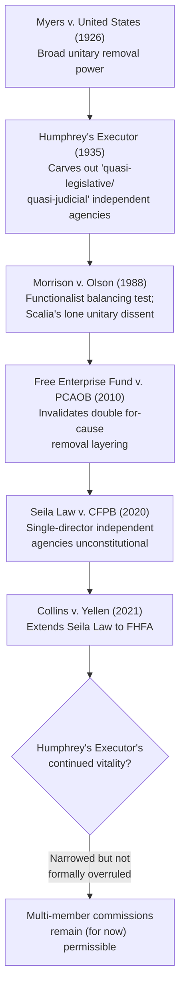

## Unitary Executive Theory and Its Critics

### Doctrinal Overview

The unitary executive theory holds that Article II of the Constitution vests all federal executive power in a single President, who must therefore possess plenary authority to direct, supervise, and remove all officials who exercise executive power on the government's behalf. The theory has become a central organizing framework in modern separation-of-powers litigation, driving a series of Supreme Court decisions curtailing "independent" agency structures — while remaining deeply contested among scholars, jurists, and, most consequentially, among the sitting Justices themselves.

### The Constitutional Text and Core Claim

#### Article II's Vesting Clause

**Key Points**

- Article II, Section 1 provides: "The executive Power shall be vested in a President of the United States of America" — in contrast to Article I's more qualified vesting of "all legislative Powers *herein granted*" in Congress.
- Unitary executive theorists argue this textual asymmetry is deliberate and significant: Article II vests the entirety of "the executive Power" (an undivided, singular quantum) in one person, rather than distributing fragments of executive authority among multiple accountable or semi-independent officials.
- The theory further relies on the **Take Care Clause** ("he shall take Care that the Laws be faithfully executed"), read as imposing on the President a personal, non-delegable duty requiring correspondingly complete authority to direct those who execute the laws on his behalf.
- From these clauses, unitary executive theorists derive three core structural entailments: (1) the President must have the power to **remove** at will any officer exercising executive power; (2) the President must have the power to **direct** the discretionary decisions of executive officials; and (3) Congress cannot vest "executive power" in officials insulated from Presidential control (e.g., through for-cause removal protections or multi-member, politically balanced commissions).

#### Historical Grounding: The Decision of 1789

**Key Points**

- Proponents trace the theory to the First Congress's debate over the removal power in 1789 (sometimes called the "Decision of 1789"), when Congress, in structuring the Department of Foreign Affairs, is argued to have implicitly recognized that the President possesses unilateral removal power over executive officers as an incident of the vesting of "the executive Power."
- [Inference] The historical record of the 1789 debate is itself contested among scholars and historians as to how clearly or consistently it establishes an unqualified presidential removal power, and originalist historical arguments on both sides of the unitary executive debate continue to be actively litigated in both scholarship and briefing.

### Doctrinal Development Through Supreme Court Precedent

#### The Early Foundational Cases

**Key Points**

- ***Myers v. United States*** (1926) held that the President has an unrestricted power to remove purely executive officers (a postmaster), reasoning broadly that the removal power is inherent in "the executive Power" and any congressional restriction on it is unconstitutional — the high-water mark of an early unitary executive position.
- ***Humphrey's Executor v. United States*** (1935) sharply qualified *Myers*, upholding for-cause removal protections for commissioners of the Federal Trade Commission on the theory that the FTC exercised "quasi-legislative" and "quasi-judicial," rather than purely executive, functions — establishing the doctrinal basis for "independent agencies" removable only for cause (inefficiency, neglect of duty, or malfeasance) rather than at will.
- ***Morrison v. Olson*** (1988) further entrenched the multi-factor, functionalist approach, upholding for-cause removal protection for an independent counsel and largely abandoning any bright-line distinction between "purely executive" and "quasi-legislative/quasi-judicial" officials in favor of a balancing test asking whether the removal restriction unduly interfered with the President's ability to perform his constitutional duties. Justice Scalia's solo dissent in *Morrison* — arguing "this wolf comes as a wolf" and that the independent counsel statute violated Article II's unqualified vesting of executive power — became the touchstone modern unitary-executive text, later vindicated in substantial part by subsequent decisions.

#### Modern Doctrinal Revival

**Key Points**

- ***Free Enterprise Fund v. Public Company Accounting Oversight Board*** (2010) invalidated a "double for-cause" removal structure (PCAOB members removable only for cause by SEC commissioners who were themselves removable only for cause), holding that such multiple layers of insulation from presidential control unconstitutionally diffused accountability, even though it left *Humphrey's Executor* nominally intact.
- ***Seila Law LLC v. Consumer Financial Protection Bureau*** (2020) held that a single-director independent agency (the CFPB) with for-cause removal protection was unconstitutional, reasoning that single-headed independent agencies — as opposed to multi-member commissions — present a uniquely acute accountability problem, since there is no internal, deliberative check on one unaccountable official wielding significant executive power. The majority (Chief Justice Roberts) treated *Humphrey's Executor* as a narrow, historically bounded exception rather than a general validation of independent agencies.
- ***Collins v. Yellen*** (2021) extended *Seila Law*'s reasoning to the Federal Housing Finance Agency's single director, reinforcing the single-director vulnerability while continuing to leave traditional multi-member independent commissions (the paradigm *Humphrey's Executor* structure) formally undisturbed.
- [Inference] The cumulative trajectory of these decisions — progressively narrowing *Humphrey's Executor* while declining to formally overrule it — has led many observers to view the modern Court as sympathetic to unitary executive theory and potentially inclined toward further narrowing or eventual reconsideration of *Humphrey's Executor* itself, though the Court has not yet taken that formal step as of the most recent decisions addressing the issue.

### Diagram: Doctrinal Trajectory

### The Case for Unitary Executive Theory

**Key Points**

- **Political accountability**: A single, electorally accountable President directing all executive officials ensures voters can identify and hold accountable one person for the performance of the executive branch, rather than diffusing responsibility across numerous insulated officials answerable to no one at the ballot box.
- **Energy and dispatch**: Echoing Hamilton's *Federalist No. 70* argument that "energy in the executive is a leading character in the definition of good government," proponents argue a unified executive enables decisive, coordinated action, while fragmented, independent power centers produce policy incoherence and gridlock within the executive branch itself.
- **Constitutional structure and checks**: Proponents argue the Constitution's checks on executive power come from Congress (legislation, appropriations, oversight, impeachment) and the courts (judicial review), not from insulating pockets of the executive branch from the President himself — an internally fragmented executive is not a "check" contemplated by the constitutional design, but a novel fourth branch unaccountable to any of the three the Constitution actually creates.
- **Textual clarity**: The asymmetry between Article I's "herein granted" qualifier and Article II's unqualified vesting is treated as strong textual evidence that the Founders intended a structurally different, more unified allocation of executive power than legislative power.

### Critiques of Unitary Executive Theory

#### Historical and Originalist Critiques

**Key Points**

- Critics dispute that the "Decision of 1789" or other founding-era evidence establishes anything close to a settled, unqualified consensus for presidential removal power, pointing to the fragmentary and contested nature of the 1789 debates themselves and to the existence of founding-era and early-Republic offices with tenure protections.
- Some historians and legal scholars argue the unitary executive theory is a substantially **20th- and 21st-century doctrinal construction** — traced to Reagan-era Department of Justice Office of Legal Counsel theorizing in the 1980s — that has been projected backward onto the founding with more confidence than the historical record supports.

#### Functional and Structural Critiques

**Key Points**

- Critics argue independent agencies exist precisely because Congress has legitimate reasons to insulate certain functions — particularly monetary policy (the Federal Reserve), securities and financial regulation, and law enforcement-adjacent functions — from short-term political pressure, and that this insulation serves rather than undermines good governance and long-term policy stability.
- The "accountability" argument is contested on functional grounds: critics note that Senate-confirmed, multi-member commissions with staggered terms provide their own form of accountability (through the confirmation process and through deliberative, multi-member decisionmaking) that may better balance expertise and political responsiveness than concentrating removal power in one person subject to short-term political incentives.
- Critics also raise a **stability and market-confidence concern** specific to certain institutions: Federal Reserve independence, in particular, is widely defended (including by many economists across the ideological spectrum) as essential to credible monetary policy, since a Fed subject to at-will presidential removal could face pressure to pursue short-term political goals (e.g., stimulating the economy before an election) at the expense of long-term price stability — a concern the Court has itself flagged in dicta as a potential basis for distinguishing the Federal Reserve from other independent agencies, without yet resolving the question definitively.

#### The "Formalism vs. Functionalism" Divide

**Key Points**

- Much of the academic and judicial debate can be characterized as a clash between **formalist** and **functionalist** approaches to separation-of-powers questions.
- Formalists (aligning with modern unitary executive theory) argue the Constitution draws bright, categorical lines — all "executive power" belongs to the President, full stop — and that any statutory scheme diffusing that power, regardless of its functional justification, is constitutionally suspect.
- Functionalists (aligning with *Humphrey's Executor* and *Morrison*'s balancing approach) argue the relevant constitutional question is whether a given insulation from presidential control **unduly interferes** with the President's ability to perform his core constitutional functions — a contextual, case-by-case inquiry that can accommodate legitimate institutional-design reasons for independence where the interference is not severe.
- [Inference] The trajectory of the Court's decisions since *Free Enterprise Fund* suggests a formalist approach has gained significant ground relative to *Morrison*'s functionalist balancing, though the Court's continued (if narrowed) retention of *Humphrey's Executor* indicates the formalist position has not been adopted in full, leaving genuine doctrinal uncertainty about where the ultimate line will be drawn for the Federal Reserve and other legacy independent agencies.

#### Concerns About Presidential Overreach

**Key Points**

- Critics argue that concentrating removal and direction power entirely in the President creates risks of **politicization of ostensibly neutral or technical functions** — for example, statistical agencies, inspectors general, or antitrust and securities enforcement — where insulation from at-will removal has historically been understood to protect the integrity and perceived neutrality of the function itself.
- Some critics frame the unitary executive theory's practical trajectory as enabling a form of **presidential aggrandizement** at odds with the very separation-of-powers values its proponents invoke — arguing that in practice, the doctrine has been invoked to eliminate checks Congress designed, without a correspondingly robust judicial or congressional mechanism to check an emboldened, more unified executive.

### Comparative Table: Formalist vs. Functionalist Positions

| Dimension | Unitary Executive (Formalist) | Independent Agency Defenders (Functionalist) |
| --- | --- | --- |
| Reading of Article II Vesting Clause | Complete, undivided grant requiring full presidential control | Grant of executive power compatible with congressionally structured insulation |
| Governing test | Categorical: all executive power = presidential control | Balancing: does insulation "unduly interfere" with presidential functions? |
| View of *Humphrey's Executor* | Historical anomaly to be narrowed/overruled | Legitimate, settled precedent protecting valuable institutional design |
| Core value emphasized | Political accountability, unified command | Expertise, stability, insulation from short-term political pressure |
| Federal Reserve implications | Logically vulnerable under full theory | Distinguishable/specially protected due to unique monetary-stability rationale |
| Leading cases | *Myers*, *Seila Law*, *Collins v. Yellen* | *Humphrey's Executor*, *Morrison v. Olson* |

### Related Topics

- *Humphrey's Executor v. United States* (1935) and its continued (narrowed) vitality
- *Seila Law v. CFPB* (2020) and *Collins v. Yellen* (2021) — the modern removal-power cases
- The Federal Reserve's distinctive constitutional and functional status
- Inspector General independence and removal protections
- The Appointments Clause and its interaction with removal-power doctrine
- Justice Scalia's *Morrison v. Olson* dissent as the modern theory's foundational text
- Congressional oversight and appropriations as alternative accountability mechanisms
- Comparative constitutional design: parliamentary vs. presidential systems' approaches to administrative independence