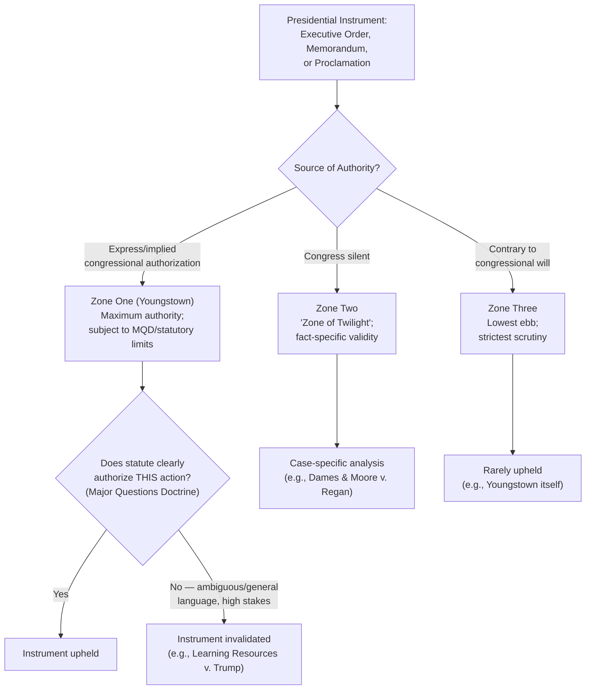

## Executive Orders, Memoranda, and Proclamations as Governance Tools

### Doctrinal Overview

Presidents govern not only through the appointment and removal power but through a set of unilateral written instruments — executive orders, presidential memoranda, and proclamations — that direct the executive branch, announce policy, and, in certain cases, purport to have direct legal effect on private parties. These instruments occupy an ambiguous constitutional space: they are neither statutes enacted by Congress nor mere internal management directives, and their legal force depends entirely on whether the President is validly exercising either inherent Article II authority or delegated statutory authority. Understanding these tools requires distinguishing their forms, their sources of authority, and the doctrinal limits — most importantly the Major Questions Doctrine and the nondelegation-adjacent scrutiny discussed elsewhere in this chapter — that increasingly constrain their use.

### The Three Principal Instruments

#### Executive Orders

**Key Points**

- An executive order is a directive from the President to executive branch officials and agencies, published in the Federal Register, and numbered sequentially (the numbering system dates to the early 20th century, though presidents have issued such directives since the founding).
- Executive orders can direct agencies to reorganize internal operations, set policy priorities, implement or interpret statutes, or manage federal property and personnel — but their legal force depends on the President having either constitutional authority (e.g., Commander-in-Chief power for military matters) or a valid statutory delegation for the specific action taken.
- Executive orders are subject to judicial review when they exceed the President's constitutional or statutory authority, as demonstrated by cases like *Youngstown Sheet & Tube Co. v. Sawyer* (1952) (invalidating an executive order seizing steel mills during the Korean War) and, more recently, *Learning Resources, Inc. v. Trump* (2026) (invalidating executive orders and proclamations imposing tariffs under IEEPA).

#### Presidential Memoranda

**Key Points**

- Presidential memoranda function similarly to executive orders — directing agency action or announcing policy — but historically were not required to be published in the Federal Register or numbered, giving them a lower public visibility profile, though modern practice frequently publishes significant memoranda as well.
- Memoranda are often used for directives the administration considers more routine, more narrowly targeted at a single agency, or less appropriate for the more formal "executive order" designation, though the functional and legal distinction between the two instruments is thin and largely a matter of administration practice and internal convention rather than constitutional or statutory requirement.
- Courts generally treat presidential memoranda as functionally equivalent to executive orders for purposes of judicial review — the label attached to the instrument does not determine its legal validity; the underlying source of authority does.

#### Proclamations

**Key Points**

- Presidential proclamations are typically used to declare a state of affairs, recognize a date or event (ceremonial proclamations), or — more legally consequentially — to formally invoke a statutorily or constitutionally authorized power, such as declaring a national emergency under the National Emergencies Act, or imposing tariffs and trade restrictions where a statute (like Section 232 of the Trade Expansion Act) specifically directs the President to act via proclamation.
- Many proclamations are purely ceremonial and legally inert (e.g., designating National Foster Care Month), but others carry direct legal effect precisely because the underlying statute specifies that the President's action must take the form of a proclamation to trigger statutory consequences.
- The *Learning Resources v. Trump* litigation involved both executive orders and a presidential proclamation (Proclamation No. 10886) declaring the relevant national emergencies as the predicate for the subsequently invalidated IEEPA tariffs — illustrating how proclamations often serve as the triggering mechanism for a broader regulatory or economic action effectuated through subsequent orders.

### Sources of Legal Authority

#### Inherent Constitutional Authority

**Key Points**

- Some executive orders rest on the President's own Article II powers without need for statutory delegation — for example, orders directing the conduct of foreign relations, managing the armed forces as Commander-in-Chief, or directing internal executive branch operations and personnel management (matters understood as core "housekeeping" functions of the executive).
- The scope of "inherent" authority is itself contested and varies significantly by subject matter; foreign affairs and military command are the areas of broadest undisputed inherent authority, while domestic economic regulation affecting private parties is an area where inherent authority is narrow to nonexistent absent congressional delegation.

#### Delegated Statutory Authority

**Key Points**

- The vast majority of executive orders, memoranda, and legally consequential proclamations rest on delegated authority — a statute in which Congress has authorized the President (rather than an agency) to take specified action, often triggered by a formal declaration (an emergency, a finding, a determination) that the statute requires.
- Prominent examples of presidential-delegation statutes include the National Emergencies Act (procedural framework for emergency declarations), IEEPA (economic sanctions and, until *Learning Resources v. Trump*, tariffs), Section 232 of the Trade Expansion Act of 1962 (national-security-based tariffs, following an investigation and report by the Secretary of Commerce), and various immigration and public-lands statutes granting the President specific proclamation authority.
- Because these instruments rest on statutory delegation, they are subject to the same interpretive scrutiny — including MQD — as agency rules interpreting their own delegating statutes. *Learning Resources v. Trump* (2026) confirmed that presidential invocations of statutory authority receive no special exemption from MQD analysis merely because the delegate is the President rather than an administrative agency.

#### The Youngstown Framework

**Key Points**

- Justice Jackson's concurrence in *Youngstown Sheet & Tube Co. v. Sawyer* (1952) remains the canonical framework for assessing the validity of unilateral executive action, organizing presidential authority into three zones:
  - **Zone One**: The President acts pursuant to express or implied congressional authorization; his authority is at its "maximum," incorporating both his own constitutional powers and whatever Congress can delegate.
  - **Zone Two** (the "zone of twilight"): Congress has neither granted nor denied authority; the President and Congress "may have concurrent authority, or... its distribution is uncertain," and the validity of executive action depends on the specific circumstances, including any "imperatives of events and contemporary imponderables" rather than abstract theories of power.
  - **Zone Three**: The President acts incompatibly with the express or implied will of Congress; his authority is at its "lowest ebb," and any claim to authority "must be scrutinized with caution," since it can rest only on his own constitutional powers with Congress's own powers subtracted.
- Executive orders resting on a clear statutory grant fall in Zone One and receive the most judicial deference (subject to ordinary statutory-interpretation limits, including MQD); orders where Congress has been silent fall into the contested Zone Two; and orders that contradict an existing statutory scheme — as in *Youngstown* itself, where Congress had considered and declined to authorize seizure of industrial property during labor disputes — fall into the disfavored Zone Three.

### Diagram: The Youngstown Framework and Instrument Types

### Comparative Table: The Three Instruments

| Dimension | Executive Order | Presidential Memorandum | Proclamation |
| --- | --- | --- | --- |
| Typical publication | Federal Register, numbered | Historically less formal; increasingly published | Federal Register, often ceremonial or emergency-triggering |
| Typical use | Agency direction, policy implementation | Narrower/single-agency directives | Formal invocation of statutory triggers; ceremonial declarations |
| Legal force | Depends entirely on underlying authority | Same as executive order — label is not dispositive | Ranges from legally inert (ceremonial) to legally essential (statutory trigger) |
| Judicial review standard | *Youngstown* zones; MQD if statutory | Same as executive order | Same as executive order when legally consequential |
| Illustrative case | *Youngstown* (1952) — steel seizure invalidated | N/A (label-neutral doctrinally) | *Learning Resources v. Trump* (2026) — emergency proclamation underlying invalidated tariffs |

### Judicial Review and Justiciability Considerations

**Key Points**

- Courts generally treat challenges to executive orders, memoranda, and proclamations under ordinary administrative law and constitutional doctrines — statutory ultra vires review (did the President exceed delegated authority), constitutional review (did the President exceed Article II power or violate individual rights), and, where a triggering emergency declaration is challenged, sometimes threshold justiciability questions about whether the emergency determination itself is reviewable.
- The Government in *Learning Resources v. Trump* argued that the President's emergency declarations under IEEPA were unreviewable; the Court's decision addressed the scope of the *delegated tariff authority* itself rather than definitively resolving whether the emergency-declaration predicate is independently subject to judicial review, leaving that specific question's full contours a matter for future litigation. [Unverified] The precise boundaries of judicial reviewability for presidential emergency declarations as a threshold matter, as opposed to review of the actions subsequently taken pursuant to such declarations, remain an area of ongoing doctrinal development.
- The Administrative Procedure Act (APA) generally does not apply directly to the President himself (*Franklin v. Massachusetts*, 1992, holding the President is not an "agency" under the APA), meaning presidential action is typically challenged either as unconstitutional, as exceeding statutory delegation (ultra vires), or through review of the *implementing* agency action that carries out the presidential directive, which may independently trigger APA review.

### Practical Governance Functions

**Key Points**

- Beyond their legal-authority dimension, these instruments serve important **internal management functions**: setting administration priorities, coordinating interagency policy, directing regulatory review processes (e.g., OMB/OIRA review of significant agency rules), and establishing personnel and ethics policies for the executive branch — functions generally uncontroversial as exercises of the President's supervisory authority over subordinate officials.
- They also serve a significant **political and communicative function**, allowing a President to signal policy priorities quickly, symbolically, and without the delay or negotiation inherent in the legislative process — a feature that makes them attractive tools of governance precisely because they bypass the bicameralism-and-presentment process the Constitution otherwise requires for lawmaking, which is also the source of much of the constitutional tension surrounding their more ambitious uses.
- [Inference] The tension between executive orders' utility as rapid governance tools and their vulnerability to invalidation when they attempt to substitute for legislation — rather than merely implement or manage within existing statutory authority — appears likely to remain a recurring feature of separation-of-powers litigation, particularly as MQD scrutiny has now been extended to presidential (not merely agency) invocations of statutory delegation.

### Related Topics

- *Youngstown Sheet & Tube Co. v. Sawyer* (1952) — the foundational three-zone framework
- *Learning Resources v. Trump* / *Trump v. V.O.S. Selections* (2026) — MQD applied to presidential proclamations and executive orders under IEEPA
- The National Emergencies Act and its procedural framework for emergency declarations
- *Franklin v. Massachusetts* (1992) — the President's exemption from direct APA review
- *Dames & Moore v. Regan* (1981) — a Zone Two case upholding emergency-based executive action
- OMB/OIRA regulatory review (Executive Order 12866 and its successors) as an internal governance mechanism
- Unitary executive theory's relationship to the scope of inherent presidential authority
- Section 232 of the Trade Expansion Act as a contrasting, procedurally-constrained delegation model