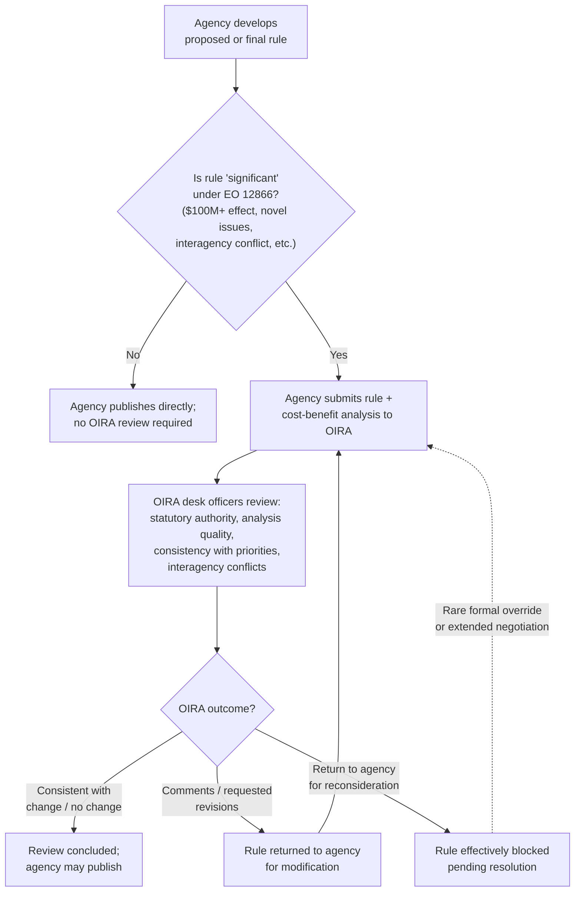

## OIRA Review as a Mechanism of Presidential Control

### Doctrinal Overview

The Office of Information and Regulatory Affairs (OIRA), housed within the Office of Management and Budget (OMB) in the Executive Office of the President, is the principal institutional mechanism through which the President exercises centralized, systematic control over administrative rulemaking across the executive branch. Established by statute in 1980 and empowered through a lineage of executive orders beginning with Executive Order 12291 (1981) and consolidated in the still-governing Executive Order 12866 (1993), OIRA review represents a distinctly different mode of presidential control than removal power or direct executive orders: rather than controlling *who* holds office or issuing freestanding directives, OIRA review inserts a centralized White House checkpoint into the agency rulemaking process itself.

### Statutory and Institutional Foundation

#### The Paperwork Reduction Act

**Key Points**

- OIRA was created by the **Paperwork Reduction Act of 1980**, initially to review and minimize the paperwork and information-collection burdens federal agencies impose on the public — a narrower original mandate than its current regulatory-review function.
- OIRA sits within OMB, itself part of the Executive Office of the President, giving it institutional proximity to the President and insulation from the individual agencies whose rules it reviews.
- The OIRA Administrator is a Senate-confirmed position, giving the office both political accountability to the President (who nominates the Administrator and can remove him or her, OMB not being an independent agency) and a degree of formal legitimacy through the confirmation process.

#### Executive Order 12291 and the Reagan-Era Foundation

**Key Points**

- **Executive Order 12291** (1981), issued by President Reagan, first required executive branch agencies to submit "major rules" (generally those with an annual economic effect of $100 million or more, or other significant effects) to OIRA for review before publication, and required agencies to prepare **cost-benefit analyses** (Regulatory Impact Analyses) for such rules.
- This order marked a significant expansion of presidential control over the previously more agency-autonomous rulemaking process, reflecting a broader administration goal of centralizing regulatory oversight to curb what the administration viewed as excessive or economically inefficient regulation.

#### Executive Order 12866: The Governing Framework

**Key Points**

- **Executive Order 12866** (1993), issued by President Clinton, replaced EO 12291 and remains the core governing framework for OIRA review today (as subsequently amended by later administrations, including modifications under Executive Orders 13563, 13771, 13992, and others reflecting each administration's regulatory philosophy).
- EO 12866 requires agencies to submit "significant regulatory actions" to OIRA for review, defining significance broadly to include rules with an annual effect on the economy of $100 million or more (later adjusted for inflation in subsequent orders), rules that create serious inconsistency with another agency's actions, rules that materially alter entitlement or grant programs, or rules raising novel legal or policy issues.
- The order directs agencies to assess costs and benefits and, "to the extent permitted by law," to choose the regulatory approach that maximizes net benefits, while also directing OIRA to review rules for consistency with the President's regulatory priorities and with the actions of other agencies.
- Unlike EO 12291's more unilateral cost-benefit mandate, EO 12866 frames the process partly in consultative and coordinative terms — OIRA is to act as an interagency coordinator as well as a substantive gatekeeper, and the order includes principles emphasizing that agencies retain primary responsibility for their regulatory decisions.

### The Mechanics of OIRA Review

#### The Review Process

**Key Points**

- Before a covered agency may publish a proposed or final "significant" rule in the Federal Register, it must submit the rule, along with supporting analysis (including a Regulatory Impact Analysis for "economically significant" rules), to OIRA.
- OIRA reviewers (career staff, sometimes referred to as "desk officers," assigned to particular agencies or subject areas) examine the rule for consistency with the President's priorities, statutory authority, quality of the supporting cost-benefit analysis, and potential conflicts with other agencies' regulations or with the regulatory principles articulated in the governing executive order.
- OIRA can return a rule to the agency with comments, request changes, or in some cases decline to complete review — creating a de facto veto point, since covered rules generally cannot be published without OIRA clearing review (a step termed "concluding review").
- The review process, formally time-limited under EO 12866 (typically 90 days, extendable), has in practice sometimes extended well beyond formal deadlines for significant or contested rules, and interagency disputes are frequently resolved through informal negotiation mediated by OIRA rather than through the formal override mechanisms the order technically provides.

#### Interagency Coordination Function

**Key Points**

- Beyond substantive review of individual rules, OIRA serves a horizontal coordination function — flagging when multiple agencies are pursuing potentially conflicting or duplicative regulatory approaches to related problems, and facilitating resolution before rules are finalized.
- OIRA also maintains the **Unified Agenda of Regulatory and Deregulatory Actions**, a twice-yearly compilation of planned and pending agency rulemakings across the executive branch, giving the White House (and the public) visibility into the aggregate regulatory pipeline.

### Diagram: The OIRA Review Pipeline

### OIRA as a Presidential Control Mechanism: The Theoretical Case

**Key Points**

- OIRA review operationalizes unitary-executive-adjacent accountability values discussed elsewhere in this chapter: rather than relying solely on removal power (a blunt, rarely-exercised tool) or piecemeal executive orders, OIRA embeds a **continuous, systematic White House checkpoint** into the day-to-day substance of administrative policymaking across dozens of executive agencies.
- Because OIRA sits within the Executive Office of the President and its Administrator serves at the President's pleasure, its review function allows the President to ensure agency rules are consistent with the administration's regulatory philosophy and priorities without needing to remove agency heads or issue rule-specific executive orders for every significant regulatory action.
- The cost-benefit analysis requirement, consistently required (with varying emphasis) since EO 12291, is often defended as promoting regulatory quality and rationality independent of its function as a control mechanism — forcing agencies to rigorously justify regulatory costs against quantified benefits, in theory improving decision quality regardless of which administration is in power.
- **Independent agencies are traditionally exempted** from mandatory OIRA review under both EO 12291 and EO 12866, reflecting a longstanding — though periodically contested — distinction between executive agencies (subject to full presidential control including OIRA review) and independent, multi-member commissions (traditionally insulated from this form of centralized White House review, consistent with their broader removal-power insulation under *Humphrey's Executor*-style doctrine).

### Critiques of OIRA Review

#### Delay and Opacity Concerns

**Key Points**

- Critics argue OIRA review, particularly when rules languish well beyond the formal 90-day review period, can function as a mechanism for **indefinite, unaccountable delay** of regulations the administration disfavors substantively but prefers not to formally reject — a "pocket veto" dynamic that avoids the transparency of a formal rejection while achieving the same practical effect.
- OIRA's internal deliberations, including meetings with outside stakeholders during the review process, have historically drawn criticism for insufficient transparency relative to the formal notice-and-comment process agencies themselves must follow under the APA — critics argue this allows regulated industries and other interested parties an additional, less visible avenue to influence rules through White House channels rather than the public rulemaking record.

#### Cost-Benefit Analysis Critiques

**Key Points**

- Critics of the cost-benefit analysis requirement argue that many important regulatory benefits (environmental protection, public health, distributional fairness, protection of non-market values) resist confident quantification, and that a cost-benefit framework can systematically undervalue such benefits relative to more easily quantified compliance costs — potentially biasing the review process toward deregulation regardless of the administration's stated neutrality.
- Defenders respond that cost-benefit analysis, properly conducted, need not be deregulatory in valence — it can equally support regulations whose quantified benefits clearly exceed costs — and that the alternative (no systematic analytical discipline at all) risks regulatory decisions driven by unexamined assumptions or agency self-interest in expanding jurisdiction.

#### Accountability and Legitimacy Critiques

**Key Points**

- Some critics argue OIRA review, especially as its scope and assertiveness has grown across administrations, risks **substituting White House policy judgments for the expert, statutorily-directed judgments of agency personnel** possessing subject-matter expertise Congress specifically intended to be brought to bear — echoing, in the domestic rulemaking-process context, broader debates about the proper balance between political accountability and agency expertise.
- Conversely, defenders argue this is precisely the accountability OIRA review is designed to provide: agency expertise operates within, not instead of, the constitutionally accountable structure of the executive branch, and centralized review ensures that expert judgments remain answerable to the elected President rather than operating as an unchecked technocracy.
- [Inference] The intensity and substantive direction of these critiques has varied significantly by administration and political orientation — OIRA review has been criticized at different times as excessively deregulatory and excessively regulation-friendly, suggesting the underlying institutional critique (concern about centralized, less transparent White House influence over rulemaking) is somewhat separable from any particular administration's substantive use of the tool.

### Comparative Table: OIRA Review Across Presidential Control Mechanisms

| Mechanism | Locus of Control | Timing | Scope | Formal Legal Basis |
| --- | --- | --- | --- | --- |
| Removal power | Personnel (who holds office) | Point-in-time, often disruptive | Individual officials | Article II; *Seila Law*, *Myers* line |
| Executive orders/memoranda | Direct substantive/procedural directive | Ad hoc, issue-specific | Varies; can be narrow or sweeping | Article II + statutory delegation |
| OIRA review | Embedded procedural checkpoint | Continuous, pre-publication | All "significant" executive-agency rules | Paperwork Reduction Act + EO 12866 |

### Related Topics

- Unitary executive theory and its relationship to centralized regulatory review
- Executive Order 12866 and its subsequent amendments across administrations (EO 13563, EO 13771, EO 13992)
- The Administrative Procedure Act's notice-and-comment rulemaking process and its interaction with OIRA review
- Regulatory Impact Analysis methodology and cost-benefit analysis in administrative law
- The distinction between executive agencies and independent agencies for purposes of OIRA review coverage
- *Humphrey's Executor* and the independent-agency exemption from centralized White House review
- The Unified Agenda of Regulatory and Deregulatory Actions
- Comparative regulatory review institutions (e.g., European Commission's Regulatory Scrutiny Board)