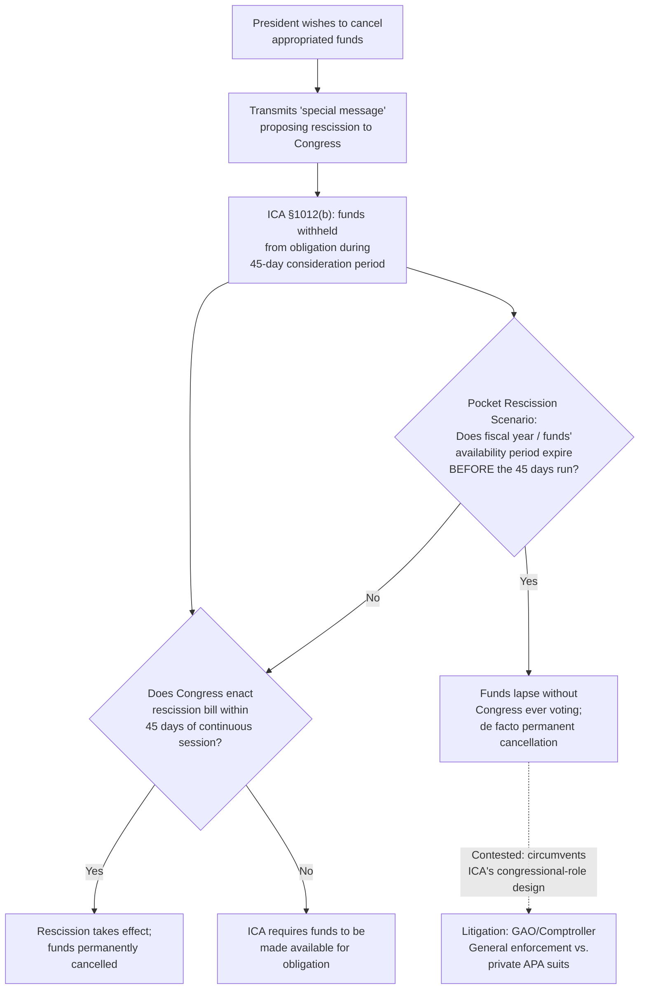
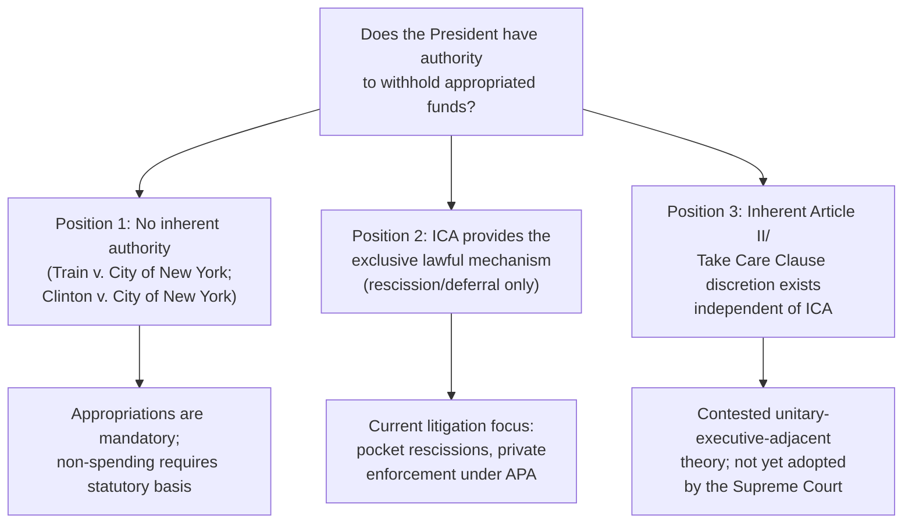

## Impoundment and Control Over Appropriated Funds

### Doctrinal Overview

Impoundment refers to a President's refusal, delay, or failure to spend funds that Congress has appropriated by law. It sits at the constitutional intersection of Congress's Article I power of the purse and the President's Article II execution authority, and it has re-emerged as one of the most actively contested separation-of-powers battlegrounds in current litigation. The governing statutory framework — the Impoundment Control Act of 1974 (ICA) — was designed to constrain unilateral presidential non-spending, but its enforcement mechanisms, procedural loopholes, and interaction with emergency litigation have become the subject of significant, still-developing Supreme Court engagement.

### Historical Background

#### Early Practice and the Nixon-Era Crisis

**Key Points**

- Impoundment is not a new practice: Thomas Jefferson withheld appropriated funds as early as 1801 (declining to spend money Congress had appropriated for gunboats after the Louisiana Purchase reduced the perceived need), and various presidents thereafter withheld funds in limited, generally uncontroversial circumstances (e.g., achieving savings through efficient contracting).
- The practice became acutely controversial during the **Nixon administration**, which used impoundment aggressively and programmatically to withhold funds for programs the President opposed on policy grounds — including, notably, environmental and water-pollution-control funding that Congress had appropriated over Nixon's veto.
- ***Train v. City of New York*** (1975) unanimously rejected the Nixon administration's impoundment of water pollution control funds, holding the relevant statute did not grant the President discretion to withhold the appropriated amounts — an important precedent establishing that presidential non-spending must be grounded in genuine statutory or constitutional authority, not mere policy disagreement with Congress's spending choices.
- This conflict directly precipitated Congress's enactment of the **Impoundment Control Act of 1974**, part of the broader Congressional Budget and Impoundment Control Act, designed to constrain future presidential impoundment through a structured statutory process.

### The Impoundment Control Act of 1974: Statutory Framework

#### Rescissions

**Key Points**

- Under the ICA, if the President wishes to **permanently cancel** budget authority Congress has appropriated, he must transmit a "special message" to Congress proposing a **rescission**, identifying the amount, the affected programs, and his reasons.
- Congress then has 45 days of continuous session to approve the rescission through legislation; if Congress does not enact a rescission bill within that window, the President must make the funds available for obligation.
- Critically, during the 45-day period, Section 1012(b) of the ICA permits the President to **withhold the funds from obligation** while Congress considers the request — this withholding-pending-congressional-action mechanism has become the focus of intense recent litigation, particularly regarding so-called "pocket rescissions."

#### Deferrals

**Key Points**

- The ICA separately permits the President to propose a **deferral** — a temporary delay in spending — for specified, limited purposes (such as providing for contingencies or achieving savings through efficient management), also via special message to Congress, but deferrals may not be used to policy-based non-spending and cannot extend beyond the fiscal year.

#### Enforcement Mechanism

**Key Points**

- The ICA designates the **Comptroller General** (head of the Government Accountability Office, GAO — a legislative-branch officer) as the primary enforcement authority, empowered to bring a civil action to compel the release of unlawfully impounded funds if the executive branch fails to comply with the Act's procedures.
- This structural choice — vesting primary enforcement in a legislative-branch official rather than private plaintiffs — has become central to recent litigation over whether private parties (grantees, contractors, and other funding recipients) may independently sue under the Administrative Procedure Act (APA) to enforce the ICA's requirements, or whether the ICA's enforcement scheme displaces such suits.

### The "Pocket Rescission" Controversy

**Key Points**

- A **"pocket rescission"** refers to a rescission proposal transmitted to Congress late enough in the fiscal year that the funds' period of availability expires before the ICA's 45-day congressional consideration window runs — meaning the funds could lapse (become permanently unavailable) without Congress ever having to actually vote on the rescission, simply because the fiscal year end overtakes the review period.
- Critics argue this technique allows the executive branch to achieve unilateral, permanent defunding of appropriated programs through the withholding authority the ICA grants only for the *pendency* of congressional consideration — using a procedural mechanism designed to preserve Congress's role to instead circumvent it entirely.
- In August 2025, the administration transmitted a special message proposing rescission of approximately $4 billion in foreign aid funding, with the fiscal year (ending September 30) set to expire before the ICA's 45-day window would run — precipitating emergency litigation.

### Recent Supreme Court Engagement: Department of State v. AIDS Vaccine Advocacy Coalition (2025)

**Key Points**

- Nonprofit organizations sued to compel obligation of approximately $10.5 billion in appropriated foreign aid funding set to expire, of which $4 billion had been proposed for rescission via the August 2025 special message.
- The District Court for the District of Columbia entered a preliminary injunction directing the executive branch to obligate the funds; the D.C. Circuit denied a stay pending appeal.
- The Government sought emergency relief from the Supreme Court. On **September 26, 2025**, the Court granted a stay of the injunction, holding that the Government had made a "sufficient showing" at this early procedural stage that the **ICA precludes suits brought under the APA** to enforce the appropriations at issue, and that mandamus relief was unavailable to the respondents.
- The Court explicitly characterized the order as **not a final determination on the merits**, reflecting only a preliminary assessment under the standards governing interim relief — leaving the ultimate constitutional and statutory questions about pocket rescissions and private enforcement unresolved.
- Justice Kagan dissented from the stay, and Justice Alito (joined by Thomas, Gorsuch, and Kavanaugh) had separately expressed strong views in related proceedings characterizing lower-court intervention as improperly compelling payment of billions in taxpayer funds.
- [Unverified] Because this and related emergency-docket orders are explicitly preliminary, the ultimate merits resolution of whether the ICA's Comptroller-General enforcement mechanism displaces private APA suits, and whether pocket rescissions are a lawful use of the Act's withholding authority, remained pending and subject to further litigation and possible additional Supreme Court review as of these decisions.

### Diagram: The ICA Rescission Process and the Pocket-Rescission Problem

### GAO and Comptroller General Enforcement Actions

**Key Points**

- Separate from the AIDS Vaccine Advocacy Coalition litigation, the Government Accountability Office has issued multiple formal decisions in 2025 finding executive branch agencies in violation of the ICA — including a finding that the Department of Energy violated the Act regarding delayed awards under a schools energy-efficiency program, and a finding that the Department of Transportation violated the ICA by imposing requirements not contemplated by statute on the National Electric Vehicle Infrastructure Program, effectively delaying disbursement.
- The Office of Management and Budget has, in response to at least one such GAO finding, characterized the GAO's decision as "wrong and legally indefensible" and directed the affected agency to disregard it — illustrating a direct institutional conflict between the legislative branch's designated ICA enforcer (GAO) and the executive branch over the Act's binding force.
- [Unverified] The ultimate legal resolution of these GAO-executive branch conflicts — including whether GAO findings carry independently enforceable legal weight absent a Comptroller General lawsuit — remains an area of active and unresolved dispute.

### Constitutional Dimension: Is There Inherent Impoundment Authority?

**Key Points**

- A distinct and more fundamental question underlying the current litigation wave is whether the President possesses **inherent constitutional authority to impound funds** independent of, or superior to, the ICA's statutory framework — a position some in the current administration have publicly advocated as a matter of executive power theory, arguing the Take Care Clause and broader unitary executive principles support presidential discretion not to spend appropriated funds the President deems wasteful or contrary to policy.
- The traditional and majority scholarly view — reflected in *Train v. City of New York* and the ICA's own enactment — is that the President has **no freestanding constitutional impoundment power**; appropriations are mandatory spending directives from Congress exercising its Article I power of the purse, and the President's Take Care Clause duty is a duty to execute the laws (including appropriations laws) faithfully, not a license to decline execution based on policy disagreement.
- The Supreme Court in *Clinton v. City of New York* (1998), while not an impoundment case in the ICA sense, reinforced this general framework by invalidating the Line Item Veto Act's grant of unilateral cancellation authority to the President over specific spending items, holding that such unilateral, post-enactment alteration of a duly enacted appropriations law violated the Constitution's bicameralism-and-presentment requirements — a precedent frequently invoked (as reflected in contemporaneous legal commentary) as establishing that the President lacks a line-item veto and, by extension, casting doubt on any claimed inherent authority to achieve a functionally similar result through unilateral non-spending.
- [Inference] The current litigation wave's ultimate significance may depend heavily on whether courts treat the ICA's rescission/deferral procedures as the *exclusive* lawful channel for presidential non-spending (consistent with *Train* and *Clinton v. City of New York*'s anti-unilateralism principles) or instead recognize a broader zone of executive discretion — a question the Supreme Court's 2025 emergency-docket rulings have explicitly declined to resolve on the merits.

### Diagram: Constitutional Positions on Impoundment Authority

### Related Topics

- *Train v. City of New York* (1975) — the foundational anti-impoundment precedent
- *Clinton v. City of New York* (1998) — the line-item veto case and bicameralism/presentment
- Congress's Article I power of the purse and its relationship to the Take Care Clause
- The Government Accountability Office's institutional role and the Comptroller General's enforcement authority
- Unitary executive theory's application to spending and appropriations control
- The Major Questions Doctrine's potential (contested) applicability to appropriations litigation
- Congressional Budget and Impoundment Control Act of 1974 — full budget-process context
- Ongoing 2025-2026 litigation over pocket rescissions and private rights of action under the ICA