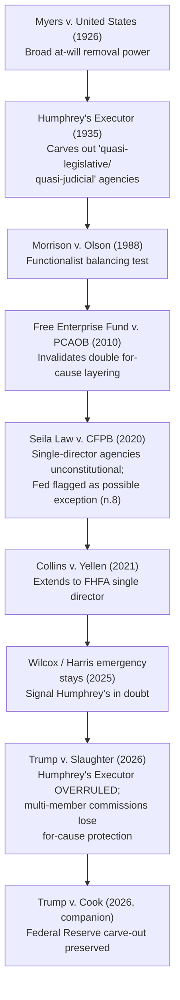

## Political Control of Formerly Independent Agencies After Trump v. Slaughter

### Doctrinal Overview

*Trump v. Slaughter*, 609 U.S. ___ (2026), decided June 29, 2026, is the culmination of the modern unitary executive line of cases discussed elsewhere in this chapter. The Court, 6-3, **overruled *Humphrey's Executor v. United States*** (1935), holding that the Federal Trade Commission Act's "for-cause" removal protection for FTC commissioners violates the separation of powers. The decision eliminates the constitutional foundation for for-cause removal protection across the broad category of multi-member independent regulatory commissions, while carving out a narrow, separately-decided exception for the Federal Reserve in the companion case *Trump v. Cook*. The result is the most significant restructuring of presidential control over the administrative state since *Humphrey's Executor* itself was decided nearly a century earlier.

### Facts and Procedural Background

**Key Points**

- In March 2025, President Trump removed FTC Commissioner Rebecca Kelly Slaughter, stating her continued service was "inconsistent" with the administration's priorities — an explicitly policy-based rationale rather than a claim of "inefficiency, neglect of duty, or malfeasance in office," the exclusive removal grounds specified by the FTC Act.
- Slaughter sued, arguing her removal was *ultra vires* under the FTC Act as authoritatively construed in *Humphrey's Executor*, which had specifically upheld for-cause removal protection for an FTC commissioner (William Humphrey) on the theory that the FTC exercised "quasi-legislative" and "quasi-judicial," rather than purely executive, functions.
- The District Court for the District of Columbia granted summary judgment for Slaughter, reinstated her, and permanently enjoined interference with her duties, reasoning that *Humphrey's Executor* remained binding precedent directly on point.
- A divided D.C. Circuit denied the Government's motion for a stay pending appeal, reasoning the case was controlled by binding Supreme Court precedent that only the Supreme Court itself could overrule.
- The Government sought emergency relief; the Supreme Court stayed the district court's reinstatement order and granted certiorari before judgment, directing the parties to brief and argue squarely "[w]hether the statutory removal protections for members of the Federal Trade Commission violate the separation of powers and, if so, whether *Humphrey's Executor*... should be overruled."
- The case was argued December 8, 2025, and decided June 29, 2026.

### Holding

The Supreme Court (6-3, opinion by Chief Justice Roberts) held that the **FTC's for-cause removal provision is unconstitutional** because it impermissibly restricts the President's authority to remove executive officers, and **explicitly overruled *Humphrey's Executor*** to the extent it stood for a general principle protecting multi-member independent commissions from at-will presidential removal.

### Reasoning

#### Constitutional Text, Structure, and History

**Key Points**

- The Court grounded its holding in the Constitution's text, structure, and history, reaffirming the "Decision of 1789" and its prior articulation in *Myers v. United States* (1926) that the Constitution grants the President the power to remove executive officers at will as an incident of the vesting of "the executive Power" in a single President.
- The Court explained that while Article II expressly addresses the President's power to *appoint* officers (with Senate advice and consent), it contains no explicit textual provision on removal — but reasoned, consistent with the *Myers*/unitary-executive line, that removal authority is structurally implicit in the vesting of executive power and the President's accountability for the execution of the laws.
- Echoing Hamiltonian arguments about accountability, the Court reasoned that to remain accountable to the President — and, through him, to the electorate — officers exercising executive power must remain removable at his discretion; the Framers deliberately departed from models diffusing executive accountability, having witnessed the flaws of divided executive power under the arrangements they rejected.

#### Distinguishing and Overruling Humphrey's Executor

**Key Points**

- The Court characterized *Humphrey's Executor*'s original rationale — that the FTC exercised "quasi-legislative" and "quasi-judicial" functions but "no part of the executive power" — as **no longer descriptive of the modern FTC**, which the Court found has "accumulated vast rulemaking, enforcement, and adjudicatory powers," including the authority to issue legally binding regulations and to enforce statutes both in administrative adjudications and in federal court — functions the Court held unquestionably constitute the exercise of executive power.
- Because the agency exercises executive power, the Court reasoned, the President must have authority to remove its officers at will; there is no longer a coherent category of "quasi-legislative/quasi-judicial" officer exercising "no part of the executive power" for *Humphrey's* carve-out to protect.
- The Court noted that *Humphrey's Executor* had been applied by the Court only once since 1935, involved a body understood at the time to be purely adjudicatory, and had been progressively undermined by the Court's own jurisprudence in the decades since — including *Free Enterprise Fund*, *Seila Law*, and *Collins v. Yellen* — and that lower courts had increasingly found the decision "confusing and indeterminate" to apply.
- The Court rejected Slaughter's reliance argument — that Congress had built dozens of independent agencies on the settled assumption that *Humphrey's Executor* permitted for-cause insulation — reasoning this was not a legitimate reliance interest to be protected through *stare decisis*, but rather "precisely the" constitutional harm the separation of powers is designed to prevent: an accumulated, congressionally-engineered erosion of presidential accountability that the Constitution's structure does not permit regardless of how long-settled the practice has become.

### The Federal Reserve Carve-Out: Trump v. Cook

**Key Points**

- In a **companion decision, *Trump v. Cook***, decided the same day, the Court preserved limited removal protections for Federal Reserve governors, creating a distinct exception for the nation's central bank.
- The Court's opinion in *Slaughter* itself flagged this distinction, noting the Federal Reserve as an example of an entity that may be treated differently "to the extent that it follows in the tradition of the First and Second Banks of the United States" — language tracing to a footnote in *Seila Law* (2020) that had already signaled the Fed's potentially unique historical and functional status.
- The Court explicitly declined to resolve, and left "for another day," related questions such as the permissibility of tenure protections for non-Article III courts (e.g., administrative law judges and other adjudicatory officials whose independence rests on different constitutional footing).
- [Inference] The Federal Reserve carve-out appears to rest on a combination of the Fed's distinctive historical lineage (tracing to the First and Second Banks of the United States, pre-dating the modern independent-agency model) and the functional monetary-policy-stability rationale long emphasized by economists and by the Court's own prior dicta, though the Court's precise doctrinal test for identifying which other entities (if any) might qualify for similar treatment was not fully elaborated in either decision.

### Scope of the Holding

**Key Points**

- Commentary and Congressional Research Service analysis following the decision indicate the ruling likely invalidates for-cause removal protections not only for the FTC but for officials at other **commission-style agencies that wield executive power** — including rulemaking authority, enforcement authority, and adjudicatory authority — such as the National Labor Relations Board (NLRB), the Consumer Product Safety Commission, and potentially others sharing the FTC's structural and functional characteristics.
- The Court's decision follows and builds upon its earlier emergency-docket signals in related litigation (including *Wilcox*, involving an NLRB member's removal, and *Harris*, involving a comparable removal dispute) where the Court had granted stays suggesting *Humphrey's Executor*'s continued vitality was already in doubt before *Slaughter* formally resolved the question.
- Agencies such as the Federal Energy Regulatory Commission, which share similar multi-member, for-cause-removal statutory structures, are widely understood to fall within the decision's reach, though the Court addressed only the FTC's removal provision directly, leaving application to each other agency's specific statutory and functional characteristics for subsequent case-by-case determination.
- [Unverified] The precise agency-by-agency scope of *Slaughter*'s application — which formerly "independent" bodies retain any residual for-cause protection and which do not — was, as of the decision, still being worked out in subsequent litigation regarding specific removed officials (including the ongoing *Wilcox* and *Harris* disputes), and the long-term boundaries of the decision's reach may continue to develop.

### Diagram: Doctrinal Trajectory to Slaughter

### Practical Consequences for Formerly Independent Agencies

**Key Points**

- **Increased policy volatility**: Because commissioners and board members at affected agencies are now removable at will, agency leadership — and consequently agency enforcement priorities, rulemaking agendas, and adjudicatory outcomes — can shift immediately and completely with a change in the President's preferences, rather than gradually as staggered terms expire.
- **Loss of regulatory continuity assumptions**: For nearly ninety years, businesses and regulated parties could assume a baseline of policy stability at independent agencies regardless of presidential transitions; that assumption no longer holds, requiring compliance programs and long-term business planning to account for more rapid and complete regulatory reversals between administrations.
- **Convergence with executive agencies**: Agencies previously understood as structurally distinct from Cabinet departments and other executive agencies (in terms of presidential control, though still often retaining multi-member structure and specialized adjudicatory functions) now more closely resemble ordinary executive agencies for removal purposes — advancing the broader unitary executive trajectory traced elsewhere in this chapter.
- **New litigation landscape**: Removed officials at other agencies (such as those in the *Wilcox* and *Harris* disputes) face a substantially weakened legal basis for reinstatement claims, since *Humphrey's Executor*'s core holding — the basis for such claims — no longer exists as binding precedent.
- **Federal Reserve as a distinctive institutional island**: The *Trump v. Cook* carve-out means the Fed's removal-protection structure remains a notable exception requiring separate analysis, likely continuing to generate litigation over the precise contours and justification for its distinct treatment relative to other financial and economic regulators (e.g., the FDIC, the SEC, the FCC) that were not before the Court in either case.

### Comparative Table: Pre- and Post-Slaughter Landscape

| Dimension | Pre-*Slaughter* (Under *Humphrey's Executor*) | Post-*Slaughter* (2026) |
| --- | --- | --- |
| FTC commissioner removal | For-cause only ("inefficiency, neglect of duty, malfeasance") | At will |
| Doctrinal basis | Quasi-legislative/quasi-judicial function exception | No exception; FTC exercises "executive power" |
| Multi-member commissions generally | Presumed protected, per *Humphrey's* | Presumptively unprotected, pending agency-specific litigation |
| Federal Reserve | Protected under general independent-agency framework | Separately, narrowly protected under *Trump v. Cook* |
| Policy stability across administrations | High — insulated from rapid leadership turnover | Substantially reduced |
| *Stare decisis* weight of 90-year-old precedent | Controlling | Overruled; reliance interests held insufficient |

### Related Topics

- *Humphrey's Executor v. United States* (1935) — the overruled precedent
- *Seila Law v. CFPB* (2020) and *Collins v. Yellen* (2021) — the immediate doctrinal predecessors
- *Trump v. Cook* (2026) — the companion Federal Reserve carve-out decision
- Unitary executive theory and its critics (this chapter) — the theoretical foundation vindicated by *Slaughter*
- The *Wilcox* and *Harris* removal disputes and their post-*Slaughter* resolution
- Institutional design rationales for agency independence (monetary policy stability, technical expertise, regulatory continuity)
- Congressional responses: potential legislative restructuring of affected agencies post-*Slaughter*
- The National Labor Relations Board, Consumer Product Safety Commission, and Federal Energy Regulatory Commission as agencies likely affected by the decision's reach