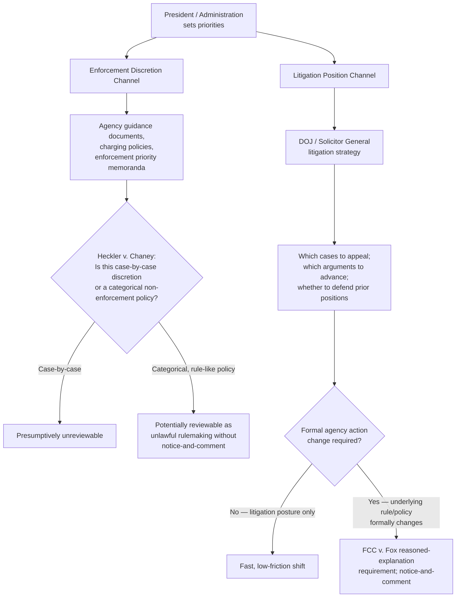

## Directive Authority Over Enforcement Discretion and Litigation Positions

### Doctrinal Overview

Beyond removal power, executive orders, and OIRA review, a President's control over administration is exercised through **directive authority over enforcement discretion** — the power to instruct executive agencies on how, whether, and against whom to enforce federal law — and through **control over litigation positions**, principally exercised through the Department of Justice's traditional role as the government's advocate in court. These twin mechanisms allow the President to shape administrative outcomes not merely through personnel and rulemaking, but through the more granular, case-by-case and priority-setting decisions that determine which violations are pursued, which legal theories are advanced, and which positions the government takes when its own actions are challenged in court. Following *Trump v. Slaughter*'s elimination of for-cause removal protection for most independent commissions, this directive authority now extends more completely across a larger share of the administrative state.

### Prosecutorial and Enforcement Discretion

#### The Constitutional and Doctrinal Basis

**Key Points**

- Enforcement discretion — the decision whether to investigate, charge, prosecute, or pursue civil enforcement in any individual case — has long been recognized as a core exercise of executive power, closely tied to the Take Care Clause's directive that the President "take Care that the Laws be faithfully executed."
- ***Heckler v. Chaney*** (1985) established the modern doctrinal baseline: agency decisions *not* to undertake enforcement action are presumptively **unreviewable** under the APA, reflecting the Court's view that such decisions closely resemble the traditionally unreviewable exercise of prosecutorial discretion, informed by considerations (resource allocation, case priorities, likelihood of success, the agency's overall enforcement strategy) that courts are ill-suited to second-guess.
- This presumption of unreviewability creates substantial practical space for centralized presidential direction: because individual non-enforcement decisions are rarely subject to judicial check, the President (through agency heads and DOJ leadership) can set enforcement priorities — which industries to target, which statutory provisions to emphasize, which types of cases to deprioritize — with limited risk of successful legal challenge to the *prioritization decision itself*, as distinct from any individual enforcement action ultimately taken.

#### Mechanisms of Directive Control

**Key Points**

- **Formal guidance documents**: Agencies (directed by politically appointed leadership) issue enforcement priority memoranda, guidance documents, and policy statements articulating which violations will be prioritized for investigation and prosecution — common across agencies from the Department of Justice's Criminal Division to the EPA's enforcement office to the NLRB's General Counsel.
- **Prosecutorial guidelines and charging policies**: The Department of Justice's own internal guidance (historically reflected in documents such as the U.S. Attorneys' Manual/Justice Manual) sets department-wide charging and plea policies that can shift substantially between administrations, reflecting differing enforcement priorities regarding, for example, drug offenses, immigration violations, or corporate criminal liability.
- **Agency-specific enforcement discretion**: Independent regulatory bodies with enforcement authority (the FTC, SEC, and others) similarly set enforcement priorities through their leadership — priorities that, following *Trump v. Slaughter*'s removal of for-cause protection for commissioners at agencies exercising executive power, are now considerably more directly responsive to presidential preference than under the *Humphrey's Executor* regime, since agency leadership more fully accountable to at-will removal has correspondingly less institutional independence to resist centrally directed enforcement priorities.
- **Deferred and non-enforcement policies**: Formal or informal policies of non-enforcement against defined categories of conduct or persons (immigration enforcement priorities being a recurring, heavily litigated example) represent an especially visible and contested form of directive enforcement authority, testing the limits of *Heckler v. Chaney*'s unreviewability presumption particularly where such policies function as a de facto categorical rule rather than case-by-case discretion.

#### Limits on Enforcement Discretion

**Key Points**

- *Heckler v. Chaney*'s unreviewability presumption is not absolute: it can be overcome where a statute provides sufficiently clear guidelines or standards that a court could apply to review the agency's enforcement decision, or where an agency's non-enforcement policy amounts to an abdication of its statutory responsibilities so complete that it constitutes a *de facto* failure to implement a statutory mandate rather than an ordinary exercise of case-by-case discretion.
- Courts have distinguished between (a) individual case-by-case enforcement discretion (generally unreviewable) and (b) broad, categorical non-enforcement policies that resemble substantive rulemaking in their practical effect — the latter potentially subject to APA challenge as an unlawful policy pronouncement, particularly if adopted without required notice-and-comment procedures where such a policy has the practical effect of a binding rule.
- Enforcement discretion, however broad, does not permit an agency to act contrary to clear statutory commands — a President or agency head may deprioritize enforcement resources within the bounds of the discretion Congress has granted, but may not use non-enforcement as a mechanism to functionally repeal a statutory requirement Congress has not repealed.

### Control Over Litigation Positions

#### The Department of Justice's Representational Role

**Key Points**

- The Department of Justice, under the Attorney General's direction (and, ultimately, subject to presidential removal and direction consistent with unitary executive principles), traditionally represents the United States and its agencies in litigation, including litigation defending agency action against legal challenge.
- This creates a distinct form of presidential control: even where an agency's *substantive* action was taken under a prior administration or reflects institutional continuity, the DOJ's *litigation posture* defending or declining to defend that action reflects current administration priorities — the government's chosen legal arguments, its willingness to appeal adverse rulings, and its positions on the scope of statutory authority are all subject to centralized, politically accountable direction.
- The **Solicitor General's Office**, historically understood to exercise a degree of professional and institutional independence in Supreme Court advocacy specifically, nonetheless ultimately answers to the Attorney General and the President, and Solicitor General litigation positions — including which cases to appeal, which arguments to advance, and whether to confess error in a lower court's judgment favorable to the government — are understood to reflect, at least at the margins, the administration's substantive priorities.

#### Declining to Defend Federal Statutes or Actions

**Key Points**

- In rare but doctrinally significant instances, an administration may conclude a federal statute or a predecessor administration's action is unconstitutional or legally indefensible and decline to defend it in litigation — a decision requiring notification to Congress under longstanding DOJ practice, and one that raises distinct separation-of-powers questions about the Executive's obligation to defend duly enacted law versus its own constitutional judgment about that law's validity.
- Litigation-position shifts between administrations are common and well-precedented with respect to the government's *interpretive* positions on ambiguous statutes (the kind of positions previously subject to *Chevron* deference and now subject to *Loper Bright*'s "best reading" framework) — a new administration is generally free to advance a different interpretation of an ambiguous statute than its predecessor advanced, subject to ordinary constraints of consistency, reasoned explanation (where formal agency action, rather than mere litigation position, is involved), and the substantive statutory-interpretation limits discussed throughout this chapter (including MQD).

#### Interaction with Formal Agency Action

**Key Points**

- Directive authority over litigation positions is functionally intertwined with, but analytically distinct from, an agency's authority to formally reverse or modify its own prior substantive positions through rulemaking or adjudication — the APA generally requires an agency changing a prior policy to acknowledge the change and provide a reasoned explanation for it (*FCC v. Fox Television Stations*, 2009), a requirement that applies with more force to formal rule or policy changes than to the government's litigation arguments defending a particular application of existing law.
- This distinction matters practically: a new administration can often shift litigation strategy and emphasis quickly and with minimal formal process, while substantively changing an underlying regulation requires the more procedurally demanding (and judicially reviewable) notice-and-comment rulemaking process — making litigation-position control a comparatively fast, low-friction tool of presidential influence relative to formal rule change.

### Diagram: Channels of Directive Control

### Interaction with Post-Slaughter Agency Landscape

**Key Points**

- Following *Trump v. Slaughter*'s elimination of for-cause removal protection for most multi-member independent commissions, the practical reach of centralized enforcement-priority direction has expanded significantly: agencies such as the FTC and NLRB, whose enforcement priorities were traditionally understood to enjoy some insulation from direct White House control by virtue of leadership's removal protection, are now considerably more directly responsive to presidential enforcement priorities, since their leadership can be replaced at will if enforcement priorities diverge from the administration's preferences.
- [Inference] The combination of *Slaughter*'s removal-power holding and the pre-existing *Heckler v. Chaney* unreviewability presumption for non-enforcement decisions suggests a substantially expanded practical scope for centralized presidential direction of enforcement priorities across a wider range of agencies than was previously the case, though the precise magnitude of this shift will likely depend on how agency leadership, now more fully at-will, in practice exercises the enforcement discretion Congress has statutorily granted to each specific agency.
- The Federal Reserve's preserved removal protection under *Trump v. Cook* means its enforcement and supervisory functions (bank supervision, monetary policy implementation) likely retain a comparatively greater degree of continuity and insulation from this dynamic relative to other formerly independent commissions.

### Comparative Table: Enforcement Discretion vs. Litigation Position Control

| Dimension | Enforcement Discretion | Litigation Position Control |
| --- | --- | --- |
| Primary actor | Agency leadership (increasingly at-will post-*Slaughter*) | DOJ / Attorney General / Solicitor General |
| Governing doctrine | *Heckler v. Chaney* presumption of unreviewability | Ordinary litigation practice; *FCC v. Fox* for formal policy change |
| Speed of change | Can shift quickly via internal guidance | Fast for litigation arguments; slower for underlying rule change |
| Judicial reviewability | Generally low (case-by-case); higher for categorical policies | High when underlying formal agency action is challenged |
| Post-*Slaughter* effect | Expanded reach across formerly independent commissions | Largely unaffected (DOJ was already executive-controlled) |

### Related Topics

- *Heckler v. Chaney* (1985) — the foundational enforcement-discretion unreviewability case
- *Trump v. Slaughter* (2026) — the removal-power decision expanding directive reach over commission enforcement priorities
- *FCC v. Fox Television Stations* (2009) — the reasoned-explanation requirement for formal policy reversals
- The Solicitor General's Office and its traditional institutional independence in Supreme Court advocacy
- DOJ charging and prosecutorial guidelines across administrations
- Immigration enforcement priority litigation as a case study in the limits of *Heckler v. Chaney*
- *Loper Bright Enterprises v. Raimondo* (2024) and its interaction with shifting agency interpretive litigation positions
- Congressional oversight mechanisms responding to shifts in enforcement priorities