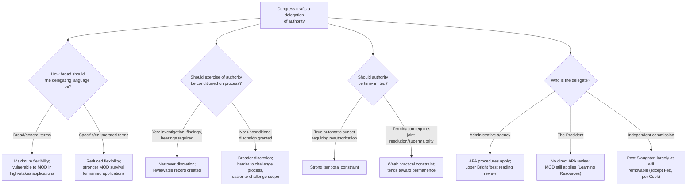

## Delegation Drafting Choices and Statutory Design

### Doctrinal Overview

Congress's principal tool for controlling the administrative state is exercised at the moment of drafting: the specific choices legislators make about how to structure a delegation of authority to an agency or the President fundamentally shape how much discretion the delegate receives, how vulnerable the resulting action is to judicial invalidation, and how durable the resulting policy will be across changing administrations. Following the collapse of *Chevron* deference in *Loper Bright* (2024) and the consolidation of the Major Questions Doctrine through *West Virginia v. EPA* (2022) and *Learning Resources v. Trump* (2026), drafting choices have taken on substantially increased significance — courts no longer supply a background presumption favoring the agency's reading of ambiguous language, and ambiguity in high-stakes delegations is now affirmatively construed against the delegate. This topic surveys the principal statutory design choices available to Congress and their doctrinal consequences.

### The Basic Design Space

#### Breadth of the Delegating Language

**Key Points**

- Congress can choose language ranging from highly specific and constrained (naming precise actions, numeric thresholds, and procedural prerequisites) to highly general and open-ended (broad standards like "best system of emission reduction," "necessary and appropriate," or "public interest, convenience, and necessity").
- Broad, general language has historically been favored by legislative drafters precisely because it allows agencies flexibility to apply expertise and respond to evolving circumstances (new technologies, unforeseen emergencies, changing scientific understanding) without requiring repeated legislative amendment.
- Post-MQD, however, broad general language carries a significant liability: in "extraordinary cases" involving major economic or political significance, courts now presume such language does *not* extend to transformative or unprecedented applications absent a clearer signal of congressional intent — meaning the same drafting choice that once maximized agency flexibility under *Chevron* now creates vulnerability precisely in the highest-stakes applications where that flexibility matters most.

#### Specificity as a Drafting Response to MQD

**Key Points**

- One direct drafting response to MQD is increased **textual specificity**: naming the precise tool, mechanism, or category of action authorized (e.g., explicitly referencing "tariffs" or "duties" rather than relying on the general term "regulate," as the Court's analysis in *Learning Resources v. Trump* emphasized was necessary for tariff-authorizing statutes).
- Congress has, in fact, historically drafted tariff-delegating statutes with exactly this kind of specificity — using terms like "duty," capping rates and durations numerically, and conditioning exercise of the power on procedural prerequisites (investigation, public hearings, formal findings) — a pattern the *Learning Resources* Court expressly contrasted with IEEPA's general "regulate" language to conclude Congress had not clearly delegated tariff authority there.
- The lesson generalizes: where Congress anticipates an agency or the President might need to exercise authority of major economic or political significance, MQD's clear-statement requirement effectively pushes drafters toward explicit enumeration of that authority, rather than reliance on general, multi-purpose statutory verbs.

### Procedural Constraints as a Design Tool

#### Conditioning Authority on Process

**Key Points**

- Congress can constrain delegated discretion not only through substantive specificity but through **procedural prerequisites**: requiring formal investigation, interagency consultation, public notice and hearings, findings on the record, or a specified factual predicate before the delegated authority may be exercised.
- Section 232 of the Trade Expansion Act of 1962 illustrates this design: the President's tariff-adjustment authority is triggered only after the Secretary of Commerce, in consultation with the Secretary of Defense, conducts an investigation and prepares a report finding the relevant imports threaten to impair national security — a structured, multi-step process that both constrains discretion and creates a documented record capable of supporting judicial review.
- Procedural constraints serve a **dual function**: they narrow the range of circumstances in which the delegated authority can be lawfully invoked, and they generate a decisional record making judicial review of the ultimate exercise of authority more meaningful (since a court can assess whether the required findings were actually made and supported).

#### Sunset Provisions and Temporal Limits

**Key Points**

- Congress can cap the duration of delegated authority through sunset clauses, requiring periodic reauthorization, or limiting emergency-based delegations to defined time windows unless affirmatively extended.
- IEEPA's National Emergencies Act framework nominally includes a mechanism for terminating declared emergencies, but as the *Learning Resources v. Trump* majority observed, the practical effect has been that emergencies, once declared, tend to persist indefinitely (some IEEPA-based emergencies remaining "ongoing" for decades), since termination requires an affirmative joint resolution enacted into law — a high bar functionally requiring veto-proof congressional majorities to reverse.
- This illustrates a broader design lesson: a nominal sunset or termination mechanism that requires the delegate's own cooperation (or a supermajority to override) provides much weaker practical constraint than a true automatic sunset requiring affirmative reauthorization to *continue* the delegated authority.

### Delegate Selection: Agency vs. President

**Key Points**

- A significant and consequential drafting choice is **which delegate** receives authority: an expert administrative agency (subject to APA procedures, judicial review of individual rules, and — historically — *Chevron*/now *Loper Bright* review) versus the President directly (subject to different procedural expectations, since the APA does not directly apply to the President himself under *Franklin v. Massachusetts*).
- *Learning Resources v. Trump* (2026) confirmed that delegating to the President rather than an agency does **not** exempt the delegation from MQD scrutiny — the doctrine applies with equal force to presidential invocations of statutory authority — but the different institutional posture (no notice-and-comment rulemaking record, no APA arbitrary-and-capricious review of the President's own action, greater assertions of unreviewability for underlying factual predicates like emergency declarations) means presidential delegations may in practice face different *procedural* review pathways even under the same substantive MQD standard.
- Delegating to a **multi-member independent commission** historically carried the added consequence of removal-power insulation under *Humphrey's Executor* — a structural insulation from at-will presidential control that, following *Trump v. Slaughter* (2026), has been substantially eliminated for commissions exercising executive power, narrowing (though not eliminating, per the *Trump v. Cook* Federal Reserve carve-out) the practical difference between delegating to an independent commission and delegating to an ordinary executive agency.

### Diagram: The Statutory Design Decision Tree

### Interaction with the Post-Loper Bright Interpretive Landscape

**Key Points**

- Because *Loper Bright* eliminated *Chevron* deference, agencies (and the President) can no longer rely on courts to resolve genuine statutory ambiguity in the delegate's favor merely because the reading is "reasonable" — courts now independently determine the statute's "best reading" using ordinary interpretive tools, with any applicable *Skidmore* respect for consistent, well-reasoned agency interpretations functioning as persuasive rather than binding authority.
- This shift increases the drafting stakes across the board, not merely in MQD's "extraordinary case" category: **any** genuine ambiguity now risks resolution against the delegate's preferred reading if a reviewing court's independent judgment favors a narrower construction, whereas under *Chevron* such ambiguity would have been resolved in the agency's favor as a matter of course.
- The combined effect of *Loper Bright* and MQD counsels a general drafting shift toward **greater precision throughout delegating statutes** — not only in major-questions-prone provisions — since the interpretive safety net that once cushioned ambiguous drafting no longer exists in either the ordinary or the extraordinary case.

### Comparative Table: Drafting Choices and Their Doctrinal Consequences

| Drafting Choice | Flexibility Granted | MQD Vulnerability | Post-Loper Bright Interpretive Risk |
| --- | --- | --- | --- |
| Broad general verb (e.g., "regulate") | High | High in major-stakes applications | High — courts independently construe |
| Specific enumerated powers (e.g., "impose duties up to X%") | Low | Low for named applications | Low — clear text leaves little to construe |
| Procedural prerequisites (investigation, findings) | Moderate | Reduced — signals deliberate, bounded delegation | Moderate — record aids judicial review |
| True sunset/reauthorization requirement | Time-limited | N/A directly, but limits scope of "transformative" claims over time | N/A |
| Delegate: independent commission (pre-*Slaughter*) | High (insulated) | Same MQD analysis applies to substance | Same interpretive risk; removal insulation now largely gone |
| Delegate: the President | High | Same MQD analysis applies (*Learning Resources*) | Different procedural review pathway (no APA) |

### Legislative Drafting Recommendations Emerging from Recent Doctrine

**Key Points**

- [Inference] Based on the pattern of statutory language the Court has found to satisfy (Section 232, explicit tariff-specific statutes) versus fail (IEEPA's "regulate," the HEROES Act's "waive or modify," CAA Section 111(d)'s "best system of emission reduction") MQD's clear-statement requirement, legislative drafters seeking to ensure a delegation survives major-questions scrutiny would likely benefit from explicitly naming the specific power contemplated (rather than relying on general, multi-purpose verbs), attaching numeric or durational limits, and including procedural prerequisites — though this is an inference about likely doctrinal application rather than a holding explicitly prescribing a drafting checklist.
- Conversely, [inference] drafters seeking to preserve maximum agency or presidential flexibility for unforeseen future circumstances face an inherent tension post-MQD: the same open-ended language that best serves flexibility for ordinary applications is precisely the language most vulnerable to judicial narrowing in the extraordinary, high-stakes applications where flexibility may matter most — a tension the doctrine's critics argue is a significant cost of the current framework, discussed further in this chapter's treatment of MQD critiques.
- [Unverified] Whether Congress has in practice begun systematically adjusting its drafting practices in response to *West Virginia v. EPA*, *Biden v. Nebraska*, and *Learning Resources v. Trump* is an empirical question about legislative behavior that continues to develop and has not been comprehensively documented as of these decisions.

### Related Topics

- *Learning Resources v. Trump* / *Trump v. V.O.S. Selections* (2026) — MQD applied to presidential delegation and IEEPA's "regulate" language
- *Loper Bright Enterprises v. Raimondo* (2024) — the elimination of *Chevron* deference and its interaction with drafting precision
- Section 232 of the Trade Expansion Act of 1962 as a model of procedurally-constrained delegation
- *West Virginia v. EPA* (2022) and the "best system of emission reduction" drafting failure
- *Trump v. Slaughter* (2026) — removal-power consequences of delegate selection
- The nondelegation doctrine as a background constitutional constraint on drafting choices
- Sunset provisions and reauthorization requirements in emergency and national security statutes
- Comparative legislative drafting practices across regulatory domains (environmental, financial, trade, healthcare)