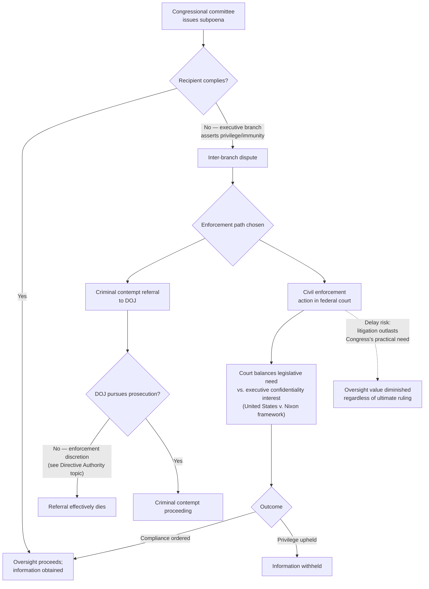

## Oversight Hearings, Investigations, and the Congressional Subpoena Power

### Doctrinal Overview

Beyond statutory drafting, Congress exercises control over the administrative state through its **oversight power** — the authority to hold hearings, conduct investigations, and compel testimony and documents from executive branch officials and private parties through the subpoena power. Unlike drafting choices, which shape delegation at the moment of enactment, oversight operates continuously and retrospectively, allowing Congress to monitor how agencies exercise delegated authority, expose maladministration or misconduct, and generate the informational record that supports future legislation. The oversight power is not explicitly enumerated in the Constitution but has been recognized as an implied incident of the legislative power since the nation's early history, and it operates in frequent tension with executive branch assertions of confidentiality, privilege, and separation-of-powers immunity.

### Constitutional Foundation of the Oversight Power

#### The Implied Power Doctrine

**Key Points**

- The Constitution contains no explicit textual grant of an investigative or oversight power to Congress, but the Supreme Court has long recognized such a power as **necessarily implied** from Article I's grant of legislative authority — the power to investigate is treated as inherent in and auxiliary to the power to legislate, since Congress cannot legislate wisely or effectively without information about the operation of existing law and the need for new law.
- ***McGrain v. Daugherty*** (1927) is the foundational case establishing this principle, upholding a Senate investigation into the Department of Justice's handling of the Teapot Dome scandal and affirming Congress's implied power to compel testimony in aid of legitimate legislative inquiry.
- ***Watkins v. United States*** (1957) reaffirmed the breadth of the power while articulating an important limit: "the power of Congress to conduct investigations is inherent in the legislative process," but that power "is not unlimited" — it must be related to, and in furtherance of, a legitimate task of Congress, rather than exposure for exposure's sake or a freestanding law-enforcement function properly belonging to the executive.

#### Legitimate Purpose Requirement

**Key Points**

- Because the oversight power is grounded in and limited by its connection to the legislative function, congressional investigations must generally be conducted in furtherance of a legitimate legislative purpose — informing potential legislation, assessing the efficacy of existing law, or overseeing the expenditure of appropriated funds.
- This requirement has rarely proven a significant practical constraint in modern practice, given the extremely broad range of subjects on which Congress could plausibly legislate, but it remains doctrinally significant as a limiting principle distinguishing legitimate oversight from impermissible exercises of a general "police" or prosecutorial power that the separation of powers reserves to the executive and judicial branches.

### The Subpoena Power

#### Mechanics and Scope

**Key Points**

- Congressional committees, acting pursuant to authorizing rules adopted by their parent chamber, may issue subpoenas compelling the production of documents (*subpoena duces tecum*) or compelling testimony (*subpoena ad testificandum*) from both government officials and private parties.
- Subpoena authority is typically vested in committee chairs (sometimes requiring concurrence of the ranking minority member or a committee vote, depending on chamber and committee rules) and is exercised as part of a committee's investigative or oversight jurisdiction as defined by chamber rules.
- Recipients who fail to comply face several potential enforcement mechanisms: **criminal contempt of Congress** (referral to the Department of Justice for prosecution under federal contempt statutes), **civil enforcement** (a civil action seeking a court order compelling compliance), and, historically though now essentially dormant, **inherent contempt** (Congress's own historical power to detain and even imprison a noncompliant witness through its Sergeant-at-Arms, a power not exercised in modern practice).

#### Enforcement Challenges

**Key Points**

- **Criminal contempt referrals** require the U.S. Attorney for the District of Columbia (part of the executive branch DOJ) to actually present the matter to a grand jury and pursue prosecution — creating a structural vulnerability when the contempt referral targets an executive branch official or when the referring chamber's political majority differs from the administration in power, since DOJ enforcement discretion (discussed elsewhere in this chapter) gives the executive branch substantial practical control over whether criminal contempt referrals are actually pursued.
- **Civil enforcement actions**, typically brought by the House or Senate (or an authorized committee) seeking declaratory or injunctive relief compelling compliance with a subpoena, face their own delays: such litigation can take months or years to resolve, often extending well beyond the period of a Congress's two-year term or the practical window in which the requested information remains legislatively useful.
- This enforcement gap — the mismatch between Congress's formal subpoena authority and the practical difficulty of securing timely compliance, particularly from a resistant executive branch — is a longstanding and frequently criticized structural weakness in the oversight system, since the executive branch actor whose compliance is sought often controls or influences the very enforcement mechanisms designed to compel that compliance.

### Executive Privilege as the Principal Counterweight

#### The Doctrinal Basis

**Key Points**

- Executive privilege — the President's qualified authority to withhold certain communications and information from Congress, the courts, and the public — operates as the primary executive branch counterweight to the oversight and subpoena power, itself grounded (like the oversight power) in constitutional structure and inference rather than explicit text.
- ***United States v. Nixon*** (1974) is the foundational modern case, recognizing a constitutionally-based presidential communications privilege rooted in Article II and the separation of powers, while holding that the privilege is **qualified, not absolute** — it must yield to a sufficiently specific and demonstrated need for evidence in a criminal proceeding, particularly where the claimed privilege rests on a generalized interest in confidentiality rather than a specific concern (such as military, diplomatic, or national security secrets) meriting greater protection.
- The privilege is generally understood to encompass communications made in the course of the President's deliberative decision-making process (a "deliberative process" component) and, more strongly protected, communications implicating military, diplomatic, or national security matters (a "state secrets"-adjacent component receiving the greatest deference).

#### Application to Congressional (as Opposed to Judicial) Demands

**Key Points**

- *Nixon* arose in the context of a criminal trial subpoena, and courts have recognized that the balancing calculus may differ somewhat in the congressional oversight context, where the demanding institution is itself a coordinate political branch rather than the judiciary — congressional demands for information implicate a more direct inter-branch structural conflict than a criminal subpoena issued through the judicial process.
- Lower courts adjudicating congressional-executive information disputes (a recurring feature of oversight litigation across administrations) have generally applied a similar functional balancing approach, weighing the legislative branch's demonstrated need for the specific information against the executive branch's interest in confidentiality, though the Supreme Court has not definitively resolved a uniform standard governing all congressional-subpoena-versus-executive-privilege disputes.
- Executive privilege claims are frequently asserted not merely by the President personally but are extended, through DOJ Office of Legal Counsel guidance, to protect communications of numerous executive branch officials and agency deliberations, generating recurring disputes over the privilege's proper scope and the process for invoking it (including disputes over whether a formal presidential assertion of privilege, as opposed to agency-level resistance, is required).

### Diagram: The Oversight-Privilege Conflict Structure

### Forms and Functions of Oversight Beyond Subpoenas

#### Hearings

**Key Points**

- Oversight hearings — both routine (annual budget and posture hearings) and investigative (responding to a specific controversy or scandal) — serve multiple functions beyond information-gathering: they create a public record, generate political accountability through media coverage and public attention, and can prompt voluntary agency behavioral change even absent any formal legislative or enforcement action.
- Hearings can be structured as informational (agency officials testify about programs and operations) or adversarial/investigative (witnesses testify under oath regarding alleged misconduct, often with the committee having already gathered substantial documentary evidence through prior subpoenas or voluntary production).

#### Government Accountability Office (GAO) Investigations

**Key Points**

- The Government Accountability Office, a legislative branch agency headed by the Comptroller General, conducts audits, program evaluations, and legal opinions (including the ICA-enforcement opinions discussed elsewhere in this chapter) at the request of congressional committees or pursuant to its own statutory mandate, providing Congress with an independent, professionalized investigative and auditing capacity that supplements committee-level oversight.
- GAO findings, while not independently binding on the executive branch in the way a court judgment would be, carry substantial institutional weight and frequently inform subsequent legislative or appropriations action, as well as serving as a basis for referrals to the Comptroller General's own statutory enforcement authority under statutes like the Impoundment Control Act.

#### Inspectors General

**Key Points**

- Statutory Inspectors General, positioned within (but intended to operate with a degree of independence from) individual executive agencies, conduct audits and investigations of their home agencies and report both to agency leadership and directly to Congress, providing an internal oversight mechanism that complements external congressional investigation.
- IG independence — including removal protections and reporting requirements — has itself become a contested feature of the unitary executive debate discussed elsewhere in this chapter, since IG functions straddle the line between internal executive branch accountability and a quasi-independent watchdog function historically understood to serve Congress's oversight interests as much as the President's own management interests.

### Comparative Table: Oversight Mechanisms

| Mechanism | Actor | Compulsory? | Primary Function | Key Enforcement Weakness |
| --- | --- | --- | --- | --- |
| Hearings | Congressional committees | No (voluntary testimony common) | Public record, political accountability | No compulsion absent subpoena |
| Subpoenas | Congressional committees | Yes, formally | Compel documents/testimony | Enforcement depends on DOJ/courts |
| GAO investigations | Comptroller General | Partial (statutory audit authority) | Independent professional audit/legal opinion | No independent enforcement power beyond referral |
| Inspector General reviews | Agency-embedded IGs | Internal agency authority | Agency-specific audit/investigation | Removal-protection vulnerability; access disputes |

### Contemporary Tensions

**Key Points**

- The practical efficacy of congressional oversight has become an increasingly salient concern given the broader trajectory toward expanded presidential control of administration traced throughout this chapter (*Trump v. Slaughter*'s removal-power holding, directive authority over enforcement discretion, and centralized litigation-position control) — as agency leadership becomes more uniformly responsive to presidential direction, the traditional model of oversight partially relying on some degree of agency-level institutional resistance or independent testimony may correspondingly weaken.
- [Inference] The interaction between expanded presidential removal power and the effectiveness of congressional oversight — specifically, whether agency officials more directly subject to at-will removal are less willing to provide candid testimony or documentary cooperation adverse to the administration's interests — is a structural dynamic likely to generate continued institutional friction and scholarly attention, though its precise empirical magnitude has not been comprehensively established.
- [Unverified] The current balance of practical power between Congress's oversight and subpoena authority and the executive branch's privilege and enforcement-discretion counterweights continues to evolve through ongoing inter-branch disputes, and any generalized assessment of which branch holds the practical advantage in a given dispute depends heavily on the specific subject matter, the political alignment of the relevant actors, and the litigation posture of any resulting enforcement action.

### Related Topics

- *McGrain v. Daugherty* (1927) and *Watkins v. United States* (1957) — the foundational oversight-power cases
- *United States v. Nixon* (1974) — the executive privilege framework
- The Impoundment Control Act and GAO/Comptroller General enforcement authority
- Inspector General independence and its relationship to unitary executive theory
- Directive authority over enforcement discretion (this chapter) — the executive-branch counterpart dynamic
- Criminal and civil contempt of Congress enforcement mechanisms
- The Office of Legal Counsel's role in executive privilege determinations
- Comparative legislative oversight models (parliamentary question time vs. U.S. committee-based investigation)