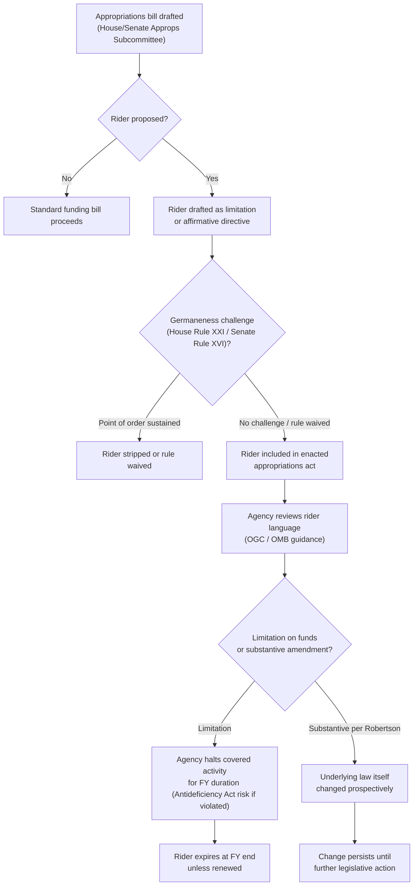

## Appropriations Riders and the Power of the Purse

### Overview

**Key Points**

- The "power of the purse" refers to Congress's exclusive constitutional authority to control federal spending, rooted in Article I, Section 9, Clause 7 (the Appropriations Clause): "No Money shall be drawn from the Treasury, but in Consequence of Appropriations made by Law."
- Appropriations riders are substantive policy provisions attached to appropriations bills — legislation whose primary function is to fund government operations — that direct, limit, or prohibit agency action, often without amending the underlying organic statute.
- Riders function as a mechanism of *ex post* congressional control over agencies, operating alongside oversight hearings, the Congressional Review Act, and statutory amendment as tools for legislative-branch supervision of the administrative state.

### Constitutional and Structural Foundations

#### The Appropriations Clause

The Appropriations Clause serves two interlocking functions:

1. **Fiscal gatekeeping** — no executive branch disbursement of Treasury funds may occur absent a legislative enactment authorizing it.
2. **Structural separation of powers** — it prevents the executive from acting as a self-funding branch, tying agency operations to periodic congressional reauthorization or renewed funding.

This creates a recurring point of leverage: because most agencies require annual or periodic appropriations to function, Congress can use the appropriations process — not just organic statutes — as a vehicle for policy control.

#### Distinguishing Authorization from Appropriation

| Concept | Function | Committee Jurisdiction |
| --- | --- | --- |
| Authorization | Establishes or continues an agency/program, defines its authority and (often) a funding ceiling | Authorizing committees (e.g., Energy & Commerce, Natural Resources) |
| Appropriation | Actually provides budget authority to obligate and spend funds | Appropriations Committees (House/Senate, via subcommittees) |

Riders exploit the fact that appropriations bills, though formally about funding, are "must-pass" legislation, making them attractive vehicles for policy riders that might not survive as standalone bills or through the authorizing committee process.

### Anatomy of an Appropriations Rider

**Key Points**

- Riders are typically short, freestanding provisions inserted into the text of an appropriations act (not the accompanying committee report, which is not legally binding).
- Common forms:
  - **Limitation riders**: "None of the funds made available by this Act may be used to [X]." This is the dominant form because it fits comfortably within the germaneness and scope-of-appropriation constraints applicable to appropriations bills.
  - **Affirmative directive riders**: mandate that an agency take, prioritize, or expedite a specific action.
  - **Sunset/moratorium riders**: temporarily suspend an agency's regulatory authority over a specific subject matter for the life of the appropriations act (typically one fiscal year, unless renewed).
  - **Defunding riders targeting specific rules**: prohibit spending funds "to implement, administer, or enforce" a named or described regulation.

#### Example: Classic Limitation Rider Structure

> "None of the funds appropriated or otherwise made available by this Act may be used by the Administrator of the Environmental Protection Agency to finalize, implement, or enforce the rule titled '[Rule Name],' published at [Federal Register citation]."

This structure avoids repealing the underlying statutory authority (e.g., the Clean Air Act) — it merely denies the *operational funds* needed to act on that authority for the covered fiscal year, making it formally a spending limitation rather than a substantive amendment.

### Why Riders Are a Distinct Control Mechanism

**Key Points**

- **Speed and leverage**: Appropriations bills must pass to avoid a government shutdown, creating must-pass pressure that individual policy bills lack.
- **Avoiding committee gatekeeping**: Riders let appropriators (or floor amendments) enact policy outside the jurisdiction of authorizing committees, which may be less sympathetic to the rider's substance.
- **Temporal limitation**: Because most riders are tied to annual appropriations, they typically expire with the fiscal year unless renewed — giving Congress an annual re-negotiation point over agency conduct, unlike permanent statutory amendments.
- **Lower visibility**: Riders are frequently attached to omnibus or "must-pass" packages late in the legislative process, reducing the opportunity for standalone floor debate or veto by the President in isolation (absent line-item veto authority).

### Procedural Constraints on Riders

#### House and Senate Rules

- **House Rule XXI, clause 2**: Generally bars "legislating on an appropriations bill" — i.e., provisions changing existing law or authorizing new spending not previously authorized — through a germaneness-style constraint. Riders in the "limitation" form (restricting use of funds) are generally permitted because they don't affirmatively create new law; they merely restrict how appropriated funds may be spent.
- **Senate Rule XVI**: Similarly restricts legislative provisions on general appropriations bills, though enforcement is more permissive in practice and often waived by unanimous consent or through omnibus packaging.
- These rules can be, and frequently are, waived via special rules (House) or unanimous consent agreements (Senate), especially for omnibus or "must-pass" year-end packages — meaning the formal constraint is often circumvented as a practical matter.

#### The Antideficiency Act Backdrop

The Antideficiency Act (31 U.S.C. §§ 1341–1342, 1511–1519) criminalizes and creates civil liability for obligating or expending funds in excess of or in advance of an appropriation, and for accepting voluntary services except in emergencies involving safety of life or property. This gives riders real teeth: an agency that spends money in violation of a limitation rider risks Antideficiency Act violations, agency officer personal liability exposure, and mandatory reporting to the President and Congress.

### Judicial and Interpretive Doctrine

#### Presumption Against Repeal by Implication

Courts read appropriations riders narrowly against the backdrop of a strong presumption that appropriations acts do not repeal or amend substantive law by implication.

- *TVA v. Hill*, 437 U.S. 153 (1978) — The Supreme Court held that a general appropriations rider funding the Tellico Dam did not implicitly repeal the Endangered Species Act's substantive protections for the snail darter, reasoning that repeals by implication are disfavored and that Congress must speak with clarity to alter substantive law through an appropriations vehicle.
- *Robertson v. Seattle Audubon Society*, 503 U.S. 429 (1992) — By contrast, the Court upheld a rider (Section 318 of a 1990 Interior appropriations act) that expressly amended the legal standards governing timber harvest litigation, because Congress had been sufficiently explicit that the rider modified the operative law rather than merely restricting fund use — illustrating that specificity and clarity of congressional intent determine whether a rider effects substantive change.

**Key Points**

- The core doctrinal distinction: a rider that merely restricts spending ("no funds shall be used to...") does **not** repeal underlying substantive authority — the statute remains on the books, just unfunded for the period covered.
- A rider that is explicit enough in amending legal standards or repealing prior law **can** effect substantive change, per *Robertson*.
- This matters enormously for administrative law because a funding restriction that lapses at the end of the fiscal year restores the agency's full underlying authority, whereas a substantive repeal is permanent absent new legislation.

#### Non-Delegation and Separation of Powers Considerations

[Inference] Riders that direct highly specific outcomes for pending adjudications or rulemakings (rather than general funding limitations) raise separation-of-powers concerns under doctrines like *United States v. Klein*, 80 U.S. 128 (1871), which limits Congress's ability to direct courts to reach specific outcomes in pending cases. This is contested terrain and courts have generally distinguished funding conditions from direct outcome-dictation to the judiciary.

### Appropriations Riders in Environmental and Administrative Law

**Key Points**

Appropriations riders have been an especially prominent tool in environmental regulatory politics because major environmental statutes (Clean Air Act, Clean Water Act, ESA, NEPA) delegate broad discretionary authority to agencies (EPA, FWS, NMFS, Army Corps), making funding limitations an efficient way to constrain that discretion without the difficulty of amending the organic statute itself.

Recurring patterns include:

- **EPA "workload riders"**: prohibiting EPA from using funds to require permits for certain emissions sources (e.g., agricultural methane/particulate matter from livestock operations) in various fiscal years' Interior/EPA appropriations acts.
- **Species-specific delisting/relisting riders**: Congress has used riders to directly delist particular populations from ESA protection — most notably the 2011 rider (Section 1713 of P.L. 112-10) that legislatively delisted the northern Rocky Mountain gray wolf population in specified states, an action upheld against a separation-of-powers challenge in *Alliance for the Wild Rockies v. Salazar*, 672 F.3d 1170 (9th Cir. 2012), because Congress amended the applicable law directly rather than directing a particular result under existing law (distinguishing it from *Klein*).
- **NEPA categorical exclusion riders**: directing that certain agency actions (e.g., specific forest management or grazing decisions) be deemed to satisfy or be exempt from NEPA review.
- **Rider-based rulemaking moratoria**: prohibiting funds for implementation of specific EPA rules (e.g., recurring riders targeting Waters of the United States (WOTUS) rulemakings, various NSPS/NESHAP rules, and coal ash/CCR regulations across different fiscal years).

### Process Flow: From Rider Insertion to Agency Effect

### Diagram: Constitutional and Statutory Architecture (svg_diagram)

<svg xmlns="http://www.w3.org/2000/svg" viewBox="0 0 760 480" font-family="Helvetica, Arial, sans-serif">
<text x="380" y="28" text-anchor="middle" font-size="18" font-weight="bold" fill="#1a1a1a">Appropriations Riders: Architecture of Control (svg_diagram)</text>
<rect x="30" y="50" width="700" height="60" rx="8" fill="#eef3fb" stroke="#3b5b8c" stroke-width="1.5" />
<text x="380" y="75" text-anchor="middle" font-size="14" font-weight="bold" fill="#1a1a1a">Article I, Sec. 9, Cl. 7 — Appropriations Clause</text>
<text x="380" y="95" text-anchor="middle" font-size="12" fill="#333">No money drawn from Treasury except by law — exclusive congressional control over disbursement</text>
<line x1="380" y1="110" x2="380" y2="140" stroke="#555" stroke-width="1.5" marker-end="url(#arrow)" />
<rect x="30" y="140" width="330" height="90" rx="8" fill="#fdf3e7" stroke="#b8823f" stroke-width="1.5" />
<text x="195" y="163" text-anchor="middle" font-size="13" font-weight="bold" fill="#1a1a1a">Organic Statute</text>
<text x="195" y="182" text-anchor="middle" font-size="11" fill="#333">(e.g., Clean Air Act, ESA)</text>
<text x="195" y="200" text-anchor="middle" font-size="11" fill="#333">Grants agency substantive</text>
<text x="195" y="216" text-anchor="middle" font-size="11" fill="#333">regulatory authority</text>
<rect x="400" y="140" width="330" height="90" rx="8" fill="#fdf3e7" stroke="#b8823f" stroke-width="1.5" />
<text x="565" y="163" text-anchor="middle" font-size="13" font-weight="bold" fill="#1a1a1a">Annual Appropriations Act</text>
<text x="565" y="182" text-anchor="middle" font-size="11" fill="#333">Provides funds necessary</text>
<text x="565" y="200" text-anchor="middle" font-size="11" fill="#333">to exercise that authority</text>
<text x="565" y="216" text-anchor="middle" font-size="11" fill="#333">(carries the rider)</text>
<line x1="195" y1="230" x2="195" y2="260" stroke="#555" stroke-width="1.5" marker-end="url(#arrow)" />
<line x1="565" y1="230" x2="565" y2="260" stroke="#555" stroke-width="1.5" marker-end="url(#arrow)" />
<line x1="195" y1="245" x2="565" y2="245" stroke="#999" stroke-width="1" stroke-dasharray="4,3" />
<rect x="30" y="260" width="330" height="70" rx="8" fill="#eaf6ec" stroke="#3f8a4f" stroke-width="1.5" />
<text x="195" y="283" text-anchor="middle" font-size="12" font-weight="bold" fill="#1a1a1a">Authority remains intact</text>
<text x="195" y="300" text-anchor="middle" font-size="11" fill="#333">Statute unaffected by funding gap</text>
<text x="195" y="316" text-anchor="middle" font-size="11" fill="#333">(TVA v. Hill presumption)</text>
<rect x="400" y="260" width="330" height="70" rx="8" fill="#fbeaea" stroke="#a13c3c" stroke-width="1.5" />
<text x="565" y="283" text-anchor="middle" font-size="12" font-weight="bold" fill="#1a1a1a">Rider restricts fund use</text>
<text x="565" y="300" text-anchor="middle" font-size="11" fill="#333">"None of the funds... may be used"</text>
<text x="565" y="316" text-anchor="middle" font-size="11" fill="#333">Agency action halted for FY</text>
<line x1="565" y1="330" x2="565" y2="360" stroke="#555" stroke-width="1.5" marker-end="url(#arrow)" />
<rect x="400" y="360" width="330" height="90" rx="8" fill="#f3eefb" stroke="#6b3f9c" stroke-width="1.5" />
<text x="565" y="383" text-anchor="middle" font-size="12" font-weight="bold" fill="#1a1a1a">Two Possible Legal Effects</text>
<text x="565" y="402" text-anchor="middle" font-size="11" fill="#333">(a) Temporary limitation — expires with FY</text>
<text x="565" y="418" text-anchor="middle" font-size="11" fill="#333">(b) Explicit amendment of law — persists</text>
<text x="565" y="434" text-anchor="middle" font-size="11" fill="#333">(Robertson v. Seattle Audubon standard)</text>
</svg>

### Political Economy Considerations

**Key Points**

- **Appropriations riders as a workaround for gridlock**: When Congress cannot agree on standalone legislation to amend a statute (e.g., reforming the ESA or Clean Water Act's WOTUS definition), riders offer a lower-friction path because they attach to legislation that must pass, shifting negotiating leverage toward whichever party controls the "must-pass" timeline.
- **Presidential leverage**: Because the President lacks a line-item veto (struck down for the federal budget context in *Clinton v. City of New York*, 524 U.S. 417 (1998)), the President must accept or reject the entire appropriations package, including any embedded riders — significantly increasing rider leverage in omnibus negotiations.
- **Accountability critique**: Critics argue riders reduce transparency and single-subject deliberation by bundling controversial policy changes into must-pass vehicles, avoiding the scrutiny that a standalone bill addressing the same substantive issue would receive in authorizing committees.
- [Inference] Defenders counter that riders are a legitimate exercise of Congress's Article I appropriations power and provide an important safety valve against unresponsive or aggressively discretionary agency rulemaking, particularly where the authorizing committee process is itself gridlocked.

### Distinguishing Riders from Related Congressional Tools

| Tool | Mechanism | Permanence | Example Context |
| --- | --- | --- | --- |
| Appropriations rider | Funding restriction/directive in annual spending bill | Typically 1 FY unless renewed | EPA rule defunding |
| Congressional Review Act (CRA) resolution | Joint resolution disapproving a specific final rule | Permanent; agency barred from "substantially similar" rule | Overturning a finalized EPA/OSHA rule |
| Statutory amendment | Direct amendment of organic statute | Permanent | Amending the Clean Air Act definition of "stationary source" |
| Sunset provision (non-appropriations) | Built into authorizing statute itself | As specified in statute | Program reauthorization deadlines |
| Non-appropriation oversight (hearings, GAO reports) | Informal/investigatory pressure | N/A — no binding legal effect | Agency accountability without funding leverage |

### Practical Illustration

**Example**

Consider a hypothetical fiscal year appropriations act for the Department of the Interior containing the following rider:

> "SEC. 122. None of the funds made available by this Act may be used by the United States Fish and Wildlife Service to issue a final rule listing the [Species X] as threatened or endangered under the Endangered Species Act of 1973 prior to October 1, [Year]."

**Effects**:

1. FWS retains full statutory authority under the ESA to list the species — the ESA itself is untouched.
2. FWS is barred from *expending appropriated funds* to finalize that specific listing decision during the covered fiscal year.
3. If FWS finalizes the rule anyway using appropriated funds, responsible officials risk Antideficiency Act exposure (administrative discipline, and in willful/knowing cases, potential criminal liability under 31 U.S.C. § 1350).
4. On October 1 of the following fiscal year (absent renewal of the rider), FWS's authority to finalize the listing rule is fully restored, since the rider was a temporal funding limitation, not a repeal of ESA authority — consistent with the *TVA v. Hill* presumption against implied statutory repeal via appropriations.

### Common Exam/Analysis Traps

**Key Points**

- Do not conflate a limitation rider with a substantive repeal — the *TVA v. Hill*/*Robertson* line requires close reading of whether Congress used sufficiently explicit language to amend underlying law, versus merely restricting the use of funds.
- Riders attached to *continuing resolutions* (temporary stopgap funding measures) raise the same doctrinal issues but are functionally even more temporary, since CRs themselves often only extend funding for weeks or months.
- The fact that a rider survives a point-of-order challenge under House/Senate rules says nothing about its ultimate judicial interpretation — procedural passage and substantive legal effect are analytically distinct questions.
- [Unverified] The precise scope of what counts as "sufficiently explicit" language to trigger the *Robertson* substantive-amendment exception is not reducible to a bright-line test and is assessed case-by-case by reviewing courts, based on specificity of the statutory cross-reference and clarity of intent to alter legal standards.

### Related Topics

- Congressional Review Act (CRA) and joint resolutions of disapproval
- The Antideficiency Act and agency fiscal officer liability
- *TVA v. Hill* and the canon against repeals by implication
- *Clinton v. City of New York* and the line-item veto
- Continuing resolutions, omnibus packaging, and government shutdown dynamics
- Legislative vetoes after *INS v. Chadha* and modern substitutes for direct congressional control
- Government Accountability Office (GAO) bid protests and impoundment control under the Impoundment Control Act of 1974
- Nondelegation doctrine and *United States v. Klein* limits on directed judicial outcomes
- Sue-and-settle litigation as an indirect check on agency rulemaking priorities