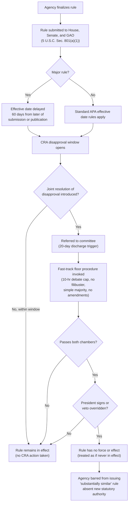

## The Congressional Review Act and Expedited Disapproval of Rules

### Overview

**Key Points**

- The Congressional Review Act (CRA), 5 U.S.C. §§ 801–808, enacted in 1996 as part of the Small Business Regulatory Enforcement Fairness Act (SBREFA), establishes a fast-track legislative mechanism for Congress to review and disapprove federal agency rules before or shortly after they take effect.
- The CRA operationalizes ongoing congressional oversight of the administrative state by requiring agencies to submit every "rule" to both chambers of Congress and the Government Accountability Office (GAO) before it can take effect, and by creating expedited, filibuster-proof procedures in the Senate for a joint resolution of disapproval.
- Unlike an appropriations rider (temporary, funding-based), a CRA disapproval is **permanent**: the rule is treated as if it had never taken effect, and the agency is barred from issuing a "substantially similar" rule absent new statutory authorization.

### Statutory Architecture

#### Definition of "Rule" Under the CRA

The CRA incorporates the Administrative Procedure Act's broad definition of "rule" (5 U.S.C. § 551(4)), covering not only notice-and-comment legislative rules but also:

- Interpretive rules
- General statements of policy
- Some guidance documents (contested in practice — see below)

Excluded from CRA coverage:

- Rules of particular applicability
- Rules relating to agency management or personnel
- Rules of agency organization, procedure, or practice that do not substantially affect the rights or obligations of non-agency parties

#### Submission and Reporting Requirement

**Key Points**

Before a covered rule can take effect, the issuing agency must submit to both Houses of Congress and to the Comptroller General (GAO):

1. A copy of the rule
2. A concise general statement relating to the rule (including whether it is a "major rule")
3. The proposed effective date

For a **major rule** — defined as one likely to have (a) an annual effect on the economy of $100 million or more, (b) a major increase in costs or prices, or (c) significant adverse effects on competition, employment, investment, productivity, or innovation, or on the ability of U.S. enterprises to compete with foreign enterprises — the rule generally cannot take effect until **60 days after** submission/publication (whichever is later), unless the President determines an exception applies (emergency, national security, statutory deadline).

For a **non-major rule**, the standard effective-date rules under the APA apply, but the rule remains subject to the disapproval mechanism regardless.

### The Expedited Disapproval Procedure

#### Joint Resolution of Disapproval

**Key Points**

Any Member of Congress may introduce a joint resolution stating:

> "Congress disapproves the rule submitted by [agency] relating to [subject], and such rule shall have no force or effect."

If enacted (passed by both chambers and either signed by the President or enacted over veto), the rule:

- Is treated as though it had never taken effect (or, if already in effect, is nullified retroactively to some extent as specified by the resolution and CRA text);
- Cannot be reissued in "substantially the same form" unless subsequently authorized by a law enacted after the disapproval.

#### Senate Fast-Track Procedures

This is the CRA's most consequential structural feature. Within a specified window (generally **60 legislative/session days** after submission or publication, whichever is later), the Senate has "fast track" procedures:

- A **privileged motion** to discharge the resolution from committee if it has been pending 20 calendar days.
- **Debate is limited to 10 hours**, divided equally, preventing extended floor debate.
- **No filibuster** — the CRA displaces the ordinary 60-vote cloture threshold, meaning disapproval passes with a **simple majority**.
- **No amendments** are in order, and motions to postpone or proceed to other business are not permitted, preserving the resolution's fast-track character.

This filibuster-proof, simple-majority structure is what makes the CRA uniquely powerful compared to ordinary legislation attempting to countermand agency action, which would otherwise require overcoming a Senate filibuster (60 votes) — a very high bar absent unified, large majorities.

#### The "Lookback" Period and Session Counting

**Key Points**

- If a rule is submitted late in a session (within 60 legislative days of Congress's adjournment sine die), the CRA clock resets: the rule is treated as though submitted on the **15th legislative day of the next session**, giving the new Congress a fresh opportunity to disapprove rules finalized in the closing months of a prior administration or session.
- This "lookback window" mechanism is why CRA disapprovals cluster heavily at the start of a new Congress/Administration when control of government has shifted — outgoing agencies' late-term "midnight rules" become vulnerable to disapproval by the incoming Congress and President working together.
- [Inference] This structural feature creates recurring incentives for outgoing administrations to finalize rules earlier in their term (to avoid the lookback window) and for incoming unified governments to prioritize CRA resolutions against the prior administration's late rules in their first months.

### Process Flow

### Diagram: CRA Timeline Architecture (svg_diagram)

<svg xmlns="http://www.w3.org/2000/svg" viewBox="0 0 760 420" font-family="Helvetica, Arial, sans-serif">
<text x="380" y="26" text-anchor="middle" font-size="17" font-weight="bold" fill="#1a1a1a">CRA Disapproval Timeline (svg_diagram)</text>
<line x1="60" y1="200" x2="700" y2="200" stroke="#444" stroke-width="2" />
<polygon points="700,200 690,194 690,206" fill="#444" />
<circle cx="100" cy="200" r="6" fill="#3b5b8c" />
<text x="100" y="180" text-anchor="middle" font-size="11" font-weight="bold">Day 0</text>
<text x="100" y="225" text-anchor="middle" font-size="10">Rule submitted to</text>
<text x="100" y="238" text-anchor="middle" font-size="10">Congress + GAO</text>
<circle cx="250" cy="200" r="6" fill="#b8823f" />
<text x="250" y="180" text-anchor="middle" font-size="11" font-weight="bold">Day ~60</text>
<text x="250" y="225" text-anchor="middle" font-size="10">Major rule effective</text>
<text x="250" y="238" text-anchor="middle" font-size="10">date (if applicable)</text>
<circle cx="400" cy="200" r="6" fill="#3f8a4f" />
<text x="400" y="180" text-anchor="middle" font-size="11" font-weight="bold">Disapproval Window</text>
<text x="400" y="225" text-anchor="middle" font-size="10">Resolution may be</text>
<text x="400" y="238" text-anchor="middle" font-size="10">introduced (60 session/leg. days)</text>
<circle cx="530" cy="200" r="6" fill="#a13c3c" />
<text x="530" y="180" text-anchor="middle" font-size="11" font-weight="bold">+20 calendar days</text>
<text x="530" y="225" text-anchor="middle" font-size="10">Discharge motion</text>
<text x="530" y="238" text-anchor="middle" font-size="10">available (Senate)</text>
<circle cx="650" cy="200" r="6" fill="#6b3f9c" />
<text x="650" y="180" text-anchor="middle" font-size="11" font-weight="bold">Fast-track vote</text>
<text x="650" y="225" text-anchor="middle" font-size="10">Simple majority,</text>
<text x="650" y="238" text-anchor="middle" font-size="10">no filibuster</text>
<rect x="60" y="270" width="640" height="120" rx="8" fill="#f5f5f5" stroke="#999" stroke-width="1" />
<text x="380" y="292" text-anchor="middle" font-size="12" font-weight="bold">Lookback Rule</text>
<text x="380" y="312" text-anchor="middle" font-size="11" fill="#333">If rule submitted within 60 legislative days of sine die adjournment,</text>
<text x="380" y="330" text-anchor="middle" font-size="11" fill="#333">the CRA clock is deemed to restart on the 15th legislative day</text>
<text x="380" y="348" text-anchor="middle" font-size="11" fill="#333">of the next session — giving the succeeding Congress a fresh</text>
<text x="380" y="366" text-anchor="middle" font-size="11" fill="#333">opportunity to disapprove "midnight rules" from the prior session.</text>
</svg>

### Judicial Reviewability of CRA Actions

**Key Points**

- 5 U.S.C. § 805 provides that **"no determination, finding, action, or omission under this chapter shall be subject to judicial review."**
- This provision has been read by most courts to preclude judicial review of *how Congress and the agency conducted the CRA process itself* (e.g., whether a rule was properly classified as "major," whether the submission requirement was satisfied) — but courts remain divided and cautious on the outer edges of this preclusion.
- Litigants have occasionally argued that an agency's *failure to submit* a rule under the CRA renders the rule never legally effective, attempting to use non-submission defensively in unrelated litigation; courts have generally been skeptical of allowing collateral use of CRA compliance questions to invalidate rules outside the CRA's own disapproval mechanism, though this remains a live and somewhat unsettled area. [Unverified] The precise contours of § 805 preclusion as applied to collateral non-submission arguments have not been definitively resolved by the Supreme Court.
- Courts generally have not treated § 805 as barring review of a rule's substance under ordinary APA/judicial review doctrines when raised through the normal channels of a rulemaking challenge — § 805 addresses the CRA mechanism itself, not all downstream questions about the underlying rule.

### The "Substantially Similar" Bar and Its Ambiguity

**Key Points**

- Once a rule is disapproved, the agency is barred from reissuing a rule in "substantially similar form" unless subsequently authorized by law.
- Neither the CRA nor its legislative history precisely defines "substantially similar," leaving agencies with genuine uncertainty about how much they may revise a disapproved rule before a new version would be considered a permissible, distinct regulatory approach versus a prohibited reissuance.
- [Inference] Because the CRA does not create an enforcement mechanism specifying who adjudicates a "substantially similar" dispute (and § 805 forecloses ordinary judicial review of CRA determinations), the practical check on agencies is largely political — an agency proceeding with a similar rule risks renewed congressional and public scrutiny, rather than a guaranteed judicial remedy grounding a "substantially similar" claim.
- This ambiguity has led agencies in subsequent rulemakings to take a cautious posture, often substantially restructuring successor rules or relying on distinguishable statutory hooks to avoid the "substantially similar" bar.

### Practical Usage Patterns

**Key Points**

- From enactment in 1996 through the mid-2010s, the CRA was used successfully only once (the 2001 disapproval of OSHA's ergonomics standard under a Republican Congress and incoming Republican President).
- The mechanism's practical utility depends on **unified government aligned against the issuing administration's rules** combined with **temporal proximity** (the lookback window) — this is why usage surged dramatically in 2017 (start of a new administration with unified control, disapproving over a dozen Obama-era rules) and again in subsequent unified-government transitions.
- Environmentally significant rules disapproved or targeted via CRA resolutions have included stream protection and resource extraction-related rules, methane venting/flaring limitation rules on federal lands, and various other Interior/EPA "midnight rules" finalized near the end of an outgoing administration.
- [Inference] Because of the lookback mechanism's structural bias toward the start of a new unified government, the CRA functions less as a continuous oversight tool and more as an episodic, transition-triggered instrument concentrated in narrow windows after control of the White House and Congress changes hands.

### Comparison: CRA Disapproval vs. Ordinary Repeal-by-Rulemaking

| Dimension | CRA Disapproval | Agency Repeal via Notice-and-Comment |
| --- | --- | --- |
| Initiator | Congress (joint resolution) | The agency itself |
| Vote threshold (Senate) | Simple majority, no filibuster | N/A — not a legislative act |
| Timeline | Fast-track, bounded window | Full APA notice-and-comment (often 1–2+ years) |
| Reviewability | Largely precluded by § 805 | Subject to full APA/*State Farm* arbitrary-and-capricious review |
| Future agency flexibility | Barred from "substantially similar" rule absent new statutory authority | Agency may repeal and re-regulate, subject to reasoned explanation under *FCC v. Fox* |
| Typical political precondition | Unified government + lookback window | Any point during an administration, with adequate record support |

### Interaction with Other Congressional Control Tools

**Key Points**

- The CRA operates as a complement to, not a substitute for, appropriations riders: a rider can defund implementation of a rule for a fiscal year, while a successful CRA resolution permanently nullifies it and forecloses substantially similar reissuance.
- Unlike a standalone statutory amendment repealing agency authority, the CRA specifically targets *individual rules*, not the underlying organic statute or the agency's general regulatory jurisdiction.
- The CRA's simple-majority, filibuster-proof design distinguishes it from ordinary legislative override attempts, which must clear the Senate's 60-vote cloture threshold — a critical structural reason the CRA is disproportionately used relative to standalone repeal bills targeting the same rules.

### Common Exam/Analysis Traps

**Key Points**

- Do not confuse the CRA's disapproval mechanism with a "legislative veto" of the *Chadha* variety — the CRA resolution requires bicameral passage and presentment (or veto override), satisfying *INS v. Chadha*'s Article I, Section 7 requirements, unlike the one-house or committee vetoes invalidated in *Chadha*.
- The 60-day major-rule effective-date delay is a *default* subject to presidential exception (emergency, national security, or statutory deadlines) — it is not an absolute bar to earlier effectiveness.
- Non-major rules are still fully subject to CRA disapproval; the major/non-major distinction affects only the effective-date delay, not disapproval eligibility.
- The CRA's judicial review bar under § 805 is narrower than sometimes assumed — it precludes review of the CRA process itself, not necessarily all downstream substantive challenges to the underlying rule brought through ordinary channels.

### Related Topics

- Appropriations riders and the power of the purse
- *INS v. Chadha* and the legislative veto
- Notice-and-comment rulemaking under APA § 553 and *State Farm* arbitrary-and-capricious review
- "Midnight regulations" and end-of-administration rulemaking dynamics
- Major Questions Doctrine and its interaction with congressional disapproval of agency rules
- Nondelegation doctrine and congressional oversight mechanisms
- Sue-and-settle litigation and third-party influence on agency rulemaking priorities
- Statutory deadlines and agency rulemaking under citizen-suit-forcing provisions