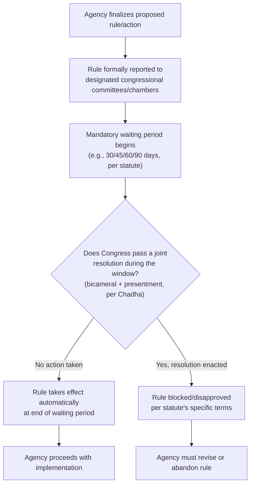

## Sunset Provisions and Report-and-Wait Mechanisms

### Overview

**Key Points**

- Sunset provisions and report-and-wait mechanisms are two distinct but related tools by which Congress builds *automatic* or *procedural* expiration/delay features directly into authorizing or enabling statutes, rather than relying on after-the-fact tools like appropriations riders or CRA disapproval.
- A **sunset provision** causes a statute, program, or specific grant of agency authority to automatically expire on a fixed date unless Congress affirmatively acts to reauthorize it.
- A **report-and-wait provision** (sometimes called a "report-and-wait" or "lay-before-Congress" requirement) requires an agency to notify Congress of a proposed rule or action and then wait a specified period before the rule may take effect, giving Congress a window to act — but, critically, the rule takes effect automatically at the end of the waiting period unless Congress affirmatively blocks it, distinguishing this "default-to-effect" model from a pure legislative veto.
- Both mechanisms are *ex ante* structural design choices embedded in the authorizing statute itself, in contrast to riders (funding-cycle-based) and the CRA (a generic, cross-cutting statute applicable to virtually all rules).

### Sunset Provisions

#### Definition and Function

**Key Points**

A sunset clause specifies that a statute, program, agency, or specific regulatory authority terminates automatically on a stated date or upon a triggering event, absent affirmative reauthorizing legislation. This shifts the default from continuation to termination — reversing the ordinary inertia that favors permanent programs once enacted.

**Common forms:**

- **Full-agency sunsets**: an entire agency's authorizing statute expires (rare at the federal level for major agencies, more common in state "sunset review" systems).
- **Program-specific sunsets**: individual programs or titles within a larger statute expire while the parent agency and its other authorities continue.
- **Provision-specific sunsets**: individual sections (e.g., surveillance authorities, tax credits, emergency powers) expire while the surrounding statutory framework remains.

#### Illustrative Examples

- **USA PATRIOT Act reauthorization provisions**: several surveillance-related sections (e.g., roving wiretap authority, business records provisions) were subject to periodic sunset and required repeated reauthorization votes — a recurring, non-environmental example of the mechanism's design logic.
- **Federal tax extenders**: numerous tax credit provisions (including several renewable energy production and investment tax credits, such as historical iterations of the Production Tax Credit (PTC) and Investment Tax Credit (ITC) for wind and solar) have historically been enacted with sunset dates, requiring periodic congressional extension — creating well-documented investment uncertainty in the renewable energy sector during "extender" negotiation periods.
- **State "sunset review" commissions**: many state legislatures (e.g., Texas's Sunset Advisory Commission) apply comprehensive sunset review to state administrative agencies on a rotating schedule, requiring the legislature to affirmatively vote to continue each agency's existence — a design not generally replicated at the federal level but frequently referenced as a model for federal sunset reform proposals.

#### Effects on Agency Behavior

**Key Points**

- **Investment/planning uncertainty**: Regulated parties (and agencies themselves) face planning difficulty when authority may lapse, particularly acute in the renewable energy sector where tax-credit sunset/extension cycles have historically produced pronounced "boom-bust" installation patterns tied to credit expiration deadlines.
- **Renewed deliberative opportunity**: Sunset provisions force periodic reconsideration of a program's costs, benefits, and continued necessity — proponents argue this counteracts bureaucratic inertia and "agency capture" dynamics that entrench programs regardless of continued merit.
- [Inference] Because reauthorization requires the same bicameralism-and-presentment process as any ordinary statute (no fast-track mechanism analogous to the CRA applies to reauthorization votes), sunset provisions can produce prolonged periods of lapsed authority when Congress is gridlocked — as has recurrently occurred with programs like the Land and Water Conservation Fund prior to permanent reauthorization, and various National Flood Insurance Program short-term extensions.

### Report-and-Wait Mechanisms

#### Definition and Function

**Key Points**

A report-and-wait provision requires an agency, before a rule or action takes legal effect, to:

1. Formally transmit ("report") the rule, along with supporting materials, to designated congressional committees or both chambers; and
2. Observe a mandatory waiting period (commonly 30, 45, 60, or 90 days, varying by statute) during which the rule cannot take effect.

Unless Congress takes some specified action during the waiting period (which varies by statute — anything from passing a joint resolution of disapproval to simply holding a hearing), the rule automatically takes effect at the end of the period.

#### Distinguishing Report-and-Wait from the Legislative Veto

**Key Points**

- This is the doctrinally crucial distinction. In *INS v. Chadha*, 462 U.S. 919 (1983), the Supreme Court invalidated the "legislative veto" — a mechanism by which one house of Congress (or even a single committee) could unilaterally block executive action without bicameral passage and presentment to the President — as violating Article I's lawmaking procedures.
- A **pure report-and-wait** provision survives *Chadha* scrutiny because it does not give Congress (or a subset of Congress) unilateral power to block the rule through anything short of full bicameralism and presentment. The rule takes effect automatically unless Congress passes an actual joint resolution (bicameral, presented to the President) — which is functionally similar to the CRA model.
- By contrast, a statute purporting to let a single committee, single chamber, or the Speaker/Majority Leader alone block a rule via disapproval (without going through full legislative process) would be a *Chadha*-invalid legislative veto.
- **Post-*Chadha* statutory drafting practice**: many older report-and-wait or legislative-veto-style provisions enacted before 1983 were rendered constitutionally infirm by *Chadha* and either fell into desuetude, were judicially severed, or were subsequently amended by Congress into *Chadha*-compliant "report-and-wait" or full joint-resolution disapproval structures (the CRA itself, enacted in 1996, was explicitly designed as a *Chadha*-compliant model).

#### Comparison Table: Report-and-Wait Variants

| Variant | Congressional Action Required to Block | *Chadha* Compliance |
| --- | --- | --- |
| Pure report-and-wait (rule takes effect automatically after waiting period) | None required to allow; joint resolution (bicameral + presentment) required to block | Compliant |
| One-house veto (pre-*Chadha* design) | Single chamber resolution | Invalid |
| Committee veto (pre-*Chadha* design) | Single committee action | Invalid |
| CRA-style disapproval | Joint resolution via fast-track, bicameral + presentment | Compliant (post-*Chadha* model statute) |

### Process Flow: Report-and-Wait Mechanism

### Diagram: Ex Ante vs. Ex Post Control Design (svg_diagram)

<svg xmlns="http://www.w3.org/2000/svg" viewBox="0 0 760 380" font-family="Helvetica, Arial, sans-serif">
<text x="380" y="26" text-anchor="middle" font-size="17" font-weight="bold" fill="#1a1a1a">Structural Placement of Control Mechanisms (svg_diagram)</text>
<rect x="30" y="55" width="330" height="130" rx="8" fill="#eef3fb" stroke="#3b5b8c" stroke-width="1.5" />
<text x="195" y="80" text-anchor="middle" font-size="13" font-weight="bold">Ex Ante (Built into Statute)</text>
<text x="195" y="105" text-anchor="middle" font-size="11">Sunset provisions</text>
<text x="195" y="123" text-anchor="middle" font-size="11">Report-and-wait requirements</text>
<text x="195" y="141" text-anchor="middle" font-size="11">Automatic expiration defaults</text>
<text x="195" y="159" text-anchor="middle" font-size="11">Embedded at time of enactment</text>
<rect x="400" y="55" width="330" height="130" rx="8" fill="#fdf3e7" stroke="#b8823f" stroke-width="1.5" />
<text x="565" y="80" text-anchor="middle" font-size="13" font-weight="bold">Ex Post (Applied After Rule Exists)</text>
<text x="565" y="105" text-anchor="middle" font-size="11">Appropriations riders</text>
<text x="565" y="123" text-anchor="middle" font-size="11">CRA joint resolutions</text>
<text x="565" y="141" text-anchor="middle" font-size="11">Statutory amendment/repeal</text>
<text x="565" y="159" text-anchor="middle" font-size="11">Triggered by later congressional action</text>
<rect x="130" y="220" width="500" height="130" rx="8" fill="#eaf6ec" stroke="#3f8a4f" stroke-width="1.5" />
<text x="380" y="245" text-anchor="middle" font-size="13" font-weight="bold">Common Constitutional Constraint</text>
<text x="380" y="270" text-anchor="middle" font-size="11">All mechanisms that block agency action via</text>
<text x="380" y="288" text-anchor="middle" font-size="11">less than full bicameralism + presentment</text>
<text x="380" y="306" text-anchor="middle" font-size="11">are unconstitutional under INS v. Chadha.</text>
<text x="380" y="324" text-anchor="middle" font-size="11">Report-and-wait and CRA both satisfy this</text>
<text x="380" y="340" text-anchor="middle" font-size="11">by requiring a full joint resolution to block.</text>
</svg>

### Application in Environmental Regulatory Contexts

**Key Points**

- **Tax credit sunset cycles**: Federal renewable energy tax incentives (PTC/ITC and their successors) have historically been drafted with expiration dates requiring periodic legislative extension, producing observable installation-timing effects in wind and solar deployment data around expiration deadlines. [Inference] Analysts generally attribute pre-sunset installation surges to developers accelerating project completion to qualify under expiring credit terms, though the precise magnitude of this effect varies by study and market conditions.
- **Endangered Species Act five-year status reviews**: while not a "sunset" in the strict expiration sense, the ESA's mandated periodic status review requirement (16 U.S.C. § 1533(c)(2)) functions analogously by forcing FWS/NMFS to periodically revisit listing determinations rather than treating them as permanent by default.
- **Report-and-wait analogues in environmental rulemaking**: certain environmental statutes contain congressional notification requirements before specific high-impact agency actions become final (though full CRA submission requirements, discussed separately, now serve as the generally applicable cross-cutting version of this concept for essentially all federal rules).

### Comparative Table: All Four Congressional Control Tools

| Mechanism | Timing | Trigger | Congressional Action Needed to Block | Constitutional Basis/Constraint |
| --- | --- | --- | --- | --- |
| Appropriations rider | Annual/periodic funding cycle | Included in must-pass spending bill | Passage of the funding bill itself | Article I § 9 cl. 7; House/Senate germaneness rules |
| CRA disapproval | Post-rule-finalization, bounded window | GAO/Congress submission | Joint resolution, fast-track, simple majority | *Chadha*-compliant; 5 U.S.C. §§ 801–808 |
| Sunset provision | Fixed statutory date | Automatic, built into statute | Reauthorizing legislation (ordinary process) | No special constitutional issue; ordinary lawmaking |
| Report-and-wait | Pre-effectiveness of a specific rule | Rule reported to Congress | Joint resolution during waiting window (or automatic effect if none) | *Chadha*-compliant if requires full bicameralism + presentment |

### Common Exam/Analysis Traps

**Key Points**

- Do not describe a "report-and-wait" provision as a legislative veto — the constitutionally decisive feature is whether blocking the rule requires full bicameralism and presentment (report-and-wait, CRA) versus something less (invalid one-house or committee veto under *Chadha*).
- A sunset provision does not require any congressional *action* to take effect — expiration is the default; this is the inverse structural logic of report-and-wait, where continuation (not expiration) is the default absent congressional action.
- Distinguish "sunset of a specific tax credit or program" from "sunset review of an entire agency" (the latter is common at the state level via sunset commissions but rare in federal practice).
- Report-and-wait periods are not synonymous with the CRA's disapproval window — report-and-wait provisions can be statute-specific with different notice periods and different procedural mechanics, whereas the CRA is a single, generally applicable cross-cutting statute.

### Related Topics

- Appropriations riders and the power of the purse
- The Congressional Review Act and expedited disapproval of rules
- *INS v. Chadha* and the legislative veto
- Statutory reauthorization politics and program lapse risk
- Tax extenders and renewable energy investment cycles
- Endangered Species Act periodic status review requirements
- Nondelegation doctrine and congressional design of agency discretion
- Nunn-McCurdy-style breach-and-report mechanisms in other regulatory contexts (illustrative of report-and-wait design outside environmental law)

Updating memoryUpdating memory1m 8s