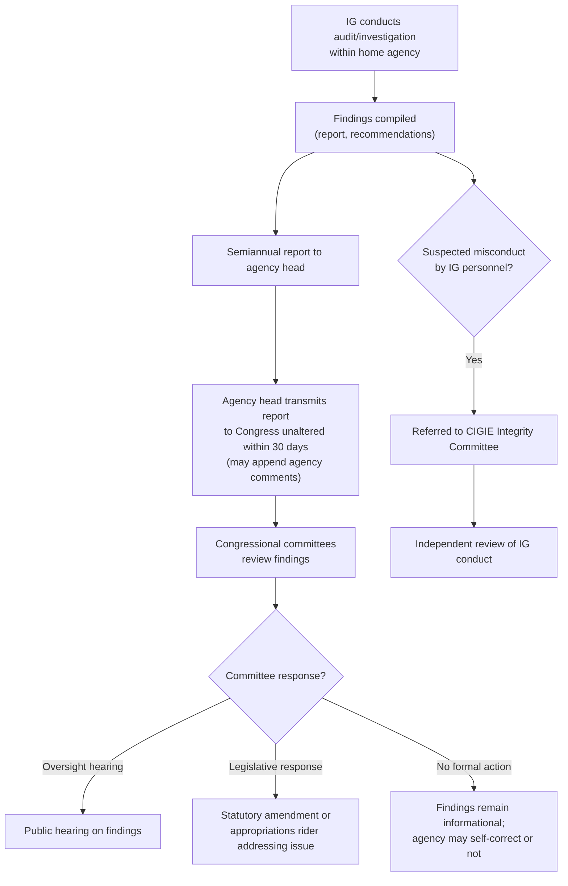

## Inspectors General and Independent Oversight Structures

### Overview

**Key Points**

- Inspectors General (IGs) are internal-but-independent oversight officials embedded within federal agencies, tasked with detecting fraud, waste, abuse, and mismanagement, and with promoting economy and efficiency in agency operations.
- The IG system institutionalizes a form of continuous, embedded congressional oversight: IGs report both to their agency head (or, in some structures, directly to the President) **and** to Congress, creating a dual-reporting structure designed to give Congress an internal window into agency operations without requiring Congress to conduct its own investigations from scratch.
- This mechanism complements the more episodic tools of appropriations riders, CRA disapproval, and sunset/report-and-wait provisions by providing **ongoing, granular, fact-finding oversight capacity** rather than a binary block/allow mechanism over specific rules.

### Statutory Foundation: The Inspector General Act of 1978

#### Core Structure

**Key Points**

The Inspector General Act of 1978 (5 U.S.C. App., now largely codified at 5 U.S.C. §§ 401 et seq. following the 2022 IG Act codification) established statutory IG offices across major federal agencies. Key structural features:

- **Presidential appointment, Senate confirmation** for IGs at "designated federal entities" and major departments (e.g., EPA, DOI, DOD, Treasury) — appointed **without regard to political affiliation**, based solely on integrity and demonstrated ability in accounting, auditing, financial analysis, law, management analysis, public administration, or investigations.
- **Removal**: The President may remove an IG, but must communicate the reasons for removal to both Houses of Congress **30 days before** the removal takes effect (strengthened by the 2022 IG Act amendments following high-profile IG removals, which added a requirement that the President provide "substantive rationale, including detailed and case-specific reasons" for removal).
- **Dual reporting obligation**: IGs report to the head of their agency for administrative purposes, but the statute is explicit that IGs are **not subject to supervision or control** by any agency officer regarding audits, investigations, subpoena issuance, or the timing/content of reports.
- **Semiannual reports**: Each IG must submit a semiannual report to the agency head, who must transmit it unaltered to Congress within 30 days, describing significant problems, recommendations, and agency responses.

#### Independence-Preserving Design Features

| Feature | Mechanism | Purpose |
| --- | --- | --- |
| Appointment | Presidential nomination + Senate confirmation (major agencies) or agency-head appointment (smaller "designated federal entities") | Insulate from purely internal agency control |
| Removal notice | 30-day advance notice to Congress with substantive rationale | Deter retaliatory or pretextual removal |
| Budget line-item | IG budget requests often transmitted to Congress with agency comment but without alteration | Prevent agency from starving IG office of resources |
| Subpoena power | IGs may issue subpoenas for documents (not testimony, absent separate authority) | Enable independent fact-gathering |
| Direct congressional access | IGs may communicate directly with Congress; whistleblower protections for complainants who go to the IG | Bypass agency gatekeeping of unfavorable findings |
| Personnel authority | IG hires/manages own staff, subject to certain budget constraints | Prevent agency leadership from staffing the IG office with loyalists |

### Types of IG Offices

**Key Points**

- **Presidentially appointed, Senate-confirmed (PAS) IGs**: cover the largest cabinet departments and major agencies (e.g., DOD, DOJ, Treasury, DOI, EPA). These IGs have the strongest formal independence protections.
- **Agency-appointed IGs** (for smaller "designated federal entities" under the Act): appointed by the agency head rather than the President, with somewhat different (generally weaker) removal-protection structures, though the 2022 amendments narrowed some of these gaps.
- **Special Inspectors General**: created by separate legislation for specific, often temporary, high-profile oversight missions (e.g., SIGAR — Special Inspector General for Afghanistan Reconstruction; SIGTARP — Special Inspector General for the Troubled Asset Relief Program). These are typically time-limited to the life of the program or mission they oversee, structurally resembling a sunset-provision design layered onto an oversight office itself.
- **The intelligence community IG** and certain other specialized IGs (e.g., for the CIA) have distinct, more restrictive reporting and access rules reflecting classification and national security sensitivities.

### The Council of the Inspectors General on Integrity and Efficiency (CIGIE)

**Key Points**

- CIGIE is a statutorily established independent entity (codified by the Inspector General Reform Act of 2008) that coordinates and enhances the work of individual IG offices government-wide.
- Functions include: developing government-wide audit/investigation standards, coordinating cross-agency reviews, training IG personnel, and — notably — housing the **Integrity Committee**, which investigates allegations of misconduct against IGs themselves (addressing the "who watches the watchmen" problem inherent in any internal oversight structure).
- CIGIE issues government-wide reports (e.g., on pandemic relief spending, cybersecurity practices) that synthesize findings across multiple individual agency IG reports.

### EPA and Interior Department IG Offices: Environmental Law Relevance

**Key Points**

- The **EPA Office of Inspector General (EPA OIG)**, established under the Inspector General Act, conducts audits and investigations of EPA programs, including Superfund cleanup spending, Clean Water Act state revolving fund administration, grant fraud, and agency compliance with its own environmental justice and regulatory commitments.
- The **Department of the Interior OIG** oversees agencies including the Fish and Wildlife Service, Bureau of Land Management, National Park Service, and Bureau of Ocean Energy Management — frequently investigating matters such as offshore drilling permit integrity, endangered species program administration, and land management contracting.
- IG reports in the environmental space have historically influenced subsequent legislative and appropriations action: findings of program mismanagement or fraud frequently precede appropriations riders restricting agency discretion, oversight hearings, or GAO follow-up studies — illustrating how the IG mechanism feeds into, rather than substitutes for, the other congressional control tools covered elsewhere in this chapter.
- [Inference] Because IG reports are investigatory and advisory rather than self-executing, their practical effect on agency behavior depends heavily on subsequent congressional or agency-leadership action — an IG finding alone does not compel a policy change absent a follow-on legislative, budgetary, or internal administrative response.

### Institutional Position and Process Flow

### Diagram: The Dual-Reporting Independence Model (svg_diagram)

<svg xmlns="http://www.w3.org/2000/svg" viewBox="0 0 760 420" font-family="Helvetica, Arial, sans-serif">
<text x="380" y="26" text-anchor="middle" font-size="17" font-weight="bold" fill="#1a1a1a">IG Dual-Reporting Independence Model (svg_diagram)</text>
<rect x="290" y="55" width="180" height="70" rx="8" fill="#eef3fb" stroke="#3b5b8c" stroke-width="1.5" />
<text x="380" y="85" text-anchor="middle" font-size="13" font-weight="bold">Agency Inspector General</text>
<text x="380" y="103" text-anchor="middle" font-size="10">Audits, investigations, subpoena power</text>
<line x1="290" y1="90" x2="150" y2="90" stroke="#555" stroke-width="1.5" marker-end="url(#a1)" />
<rect x="30" y="60" width="180" height="60" rx="8" fill="#fdf3e7" stroke="#b8823f" stroke-width="1.5" />
<text x="120" y="85" text-anchor="middle" font-size="12" font-weight="bold">Agency Head</text>
<text x="120" y="102" text-anchor="middle" font-size="10">Administrative reporting line only</text>
<line x1="470" y1="90" x2="610" y2="90" stroke="#555" stroke-width="1.5" marker-end="url(#a1)" />
<rect x="610" y="60" width="120" height="60" rx="8" fill="#fdf3e7" stroke="#b8823f" stroke-width="1.5" />
<text x="670" y="85" text-anchor="middle" font-size="12" font-weight="bold">Congress</text>
<text x="670" y="102" text-anchor="middle" font-size="10">Semiannual reports</text>
<line x1="380" y1="125" x2="380" y2="160" stroke="#555" stroke-width="1.5" marker-end="url(#a1)" />
<rect x="200" y="160" width="360" height="90" rx="8" fill="#eaf6ec" stroke="#3f8a4f" stroke-width="1.5" />
<text x="380" y="183" text-anchor="middle" font-size="12" font-weight="bold">Independence Safeguards</text>
<text x="380" y="202" text-anchor="middle" font-size="10">No agency supervision over audits/investigations</text>
<text x="380" y="218" text-anchor="middle" font-size="10">30-day removal notice with substantive rationale</text>
<text x="380" y="234" text-anchor="middle" font-size="10">Reports transmitted to Congress unaltered</text>
<line x1="380" y1="250" x2="380" y2="285" stroke="#555" stroke-width="1.5" marker-end="url(#a1)" />
<rect x="230" y="285" width="300" height="70" rx="8" fill="#f3eefb" stroke="#6b3f9c" stroke-width="1.5" />
<text x="380" y="308" text-anchor="middle" font-size="12" font-weight="bold">CIGIE Integrity Committee</text>
<text x="380" y="326" text-anchor="middle" font-size="10">Investigates misconduct allegations</text>
<text x="380" y="342" text-anchor="middle" font-size="10">against IGs themselves</text>
</svg>

### Judicial and Constitutional Considerations

**Key Points**

- **Removal power tension**: IG removal protections sit within the broader constitutional debate over the President's Article II removal power and the degree to which Congress may insulate executive branch officials from at-will presidential removal. Unlike multi-member independent agency heads addressed in cases such as *Humphrey's Executor v. United States*, 295 U.S. 602 (1935), IGs remain removable by the President; the statutory protection is procedural (advance notice and rationale to Congress) rather than a substantive "for cause" removal standard, which reduces (though does not eliminate) removal-power litigation risk compared to for-cause protections for agency heads.
- **Subpoena enforcement**: IG subpoenas for documents are generally enforceable in federal district court if an agency or third party refuses compliance, similar to other administrative subpoena enforcement mechanisms, though IGs generally lack independent testimonial subpoena authority absent specific statutory grants.
- [Unverified] The precise doctrinal effect of the 2022 IG Act codification and removal-notice strengthening amendments on future separation-of-powers litigation has not been extensively tested in appellate courts as of general knowledge available; this remains an area where case law continues to develop.

### Comparative Position Among Oversight Tools

| Tool | Nature | Timing | Binding Effect |
| --- | --- | --- | --- |
| Inspector General | Internal, embedded, continuous investigatory office | Ongoing | Advisory — findings inform but don't compel action |
| GAO | External, legislative-branch auditing arm | Ongoing/on request | Advisory, though "GAO bid protest" decisions carry more direct procurement effect |
| Appropriations rider | Funding restriction | Annual/periodic | Directly binding (subject to Antideficiency Act enforcement) |
| CRA disapproval | Rule nullification | Bounded post-rule window | Directly binding, permanent |
| Sunset/report-and-wait | Structural default in statute | Fixed date / pre-effectiveness window | Directly binding by statutory design |

### Distinguishing IGs from GAO

**Key Points**

- The **Government Accountability Office (GAO)** is a legislative-branch agency (led by the Comptroller General) that conducts government-wide audits and program evaluations at Congress's request or under statutory mandate — GAO is external to the agencies it reviews and reports directly to Congress as an institutional matter of course.
- **Inspectors General** are located *within* the executive branch agency they oversee, giving them closer operational access and more granular, continuous visibility into agency programs, but correspondingly closer physical and administrative proximity to the entities being investigated — the independence safeguards in the IG Act exist precisely to mitigate this proximity risk.
- [Inference] The two institutions are frequently complementary in environmental oversight matters: an EPA or Interior OIG investigation may surface agency-specific operational problems that later prompt a broader GAO government-wide review of the same issue across multiple agencies, or vice versa.

### Common Exam/Analysis Traps

**Key Points**

- Do not conflate IG independence with judicial or Article III independence — IGs remain executive branch officials, and their independence is statutorily created and procedurally protected (removal notice), not constitutionally mandated in the way for-cause removal protections for certain agency heads have been litigated.
- Distinguish "designated federal entity" agency-appointed IGs from PAS (Presidential appointment, Senate confirmation) IGs — the two have meaningfully different appointment/removal structures under the Act, and exam questions sometimes test this distinction.
- IG semiannual reports are transmitted "unaltered" to Congress, but the agency head may append comments — do not assume agency leadership has no opportunity to respond to or contextualize an IG report before Congress sees it.
- Special IGs (SIGAR, SIGTARP-style) are mission/program-specific and typically time-limited, unlike permanent department-wide statutory IG offices — don't treat them as interchangeable with the standing IG Act structure.

### Related Topics

- Appropriations riders and the power of the purse
- The Congressional Review Act and expedited disapproval of rules
- Sunset provisions and report-and-wait mechanisms
- The Government Accountability Office and legislative-branch oversight
- *Humphrey's Executor* and removal power doctrine for independent agency officials
- Whistleblower protections in federal agency oversight
- Congressional subpoena power and agency compliance
- GAO bid protest procedures and procurement oversight