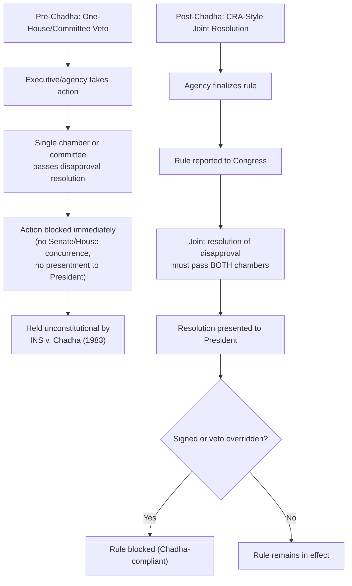

## Legislative Veto History after INS v Chadha

### Overview

**Key Points**

- The legislative veto was, prior to 1983, a widely used device by which Congress reserved for itself (or for one chamber, or even a single committee) the power to disapprove or block specified executive or agency actions without going through the full Article I lawmaking process of bicameral passage and presentment to the President.
- *INS v. Chadha*, 462 U.S. 919 (1983), held the one-house legislative veto unconstitutional, reasoning that any congressional action having the "purpose and effect of altering the legal rights, duties, and relations of persons" outside the legislative branch must satisfy both bicameralism (passage by both House and Senate) and presentment (transmittal to the President for signature or veto).
- Despite its sweeping logic, *Chadha* did not eliminate legislative vetoes from the U.S. Code overnight; Congress has continued enacting nominally unconstitutional legislative veto provisions, agencies have continued informally honoring committee-level "vetoes" as a matter of practice, and Congress redesigned several mechanisms (CRA, various report-and-wait statutes) into *Chadha*-compliant substitutes.

### The Chadha Decision Itself

#### Factual and Procedural Background

**Key Points**

The case arose from the Immigration and Nationality Act, which permitted the Attorney General to suspend deportation of a removable noncitizen, subject to a provision allowing **either house of Congress**, by resolution, to veto that suspension and require deportation to proceed. The House of Representatives passed a resolution vetoing the Attorney General's suspension of deportation for Jagdish Rai Chadha, without Senate action and without presentment to the President.

#### Holding and Reasoning

**Key Points**

- The Supreme Court (7-2, per Chief Justice Burger) held the one-house veto provision unconstitutional.
- **Bicameralism rationale**: Article I, Section 1 vests "All legislative Powers" in a Congress consisting of a House and a Senate; Article I, Section 7 specifies the process by which a "Bill" becomes law (passage by both chambers, presentment to the President). The Court held that the one-house veto was a **legislative act in substance** — it altered Chadha's legal status and rights — and therefore had to comply with Sections 1 and 7 regardless of the convenient label "veto" attached to it.
- **Rejection of a functional/pragmatic exception**: The government argued the legislative veto was a practical, efficient tool necessitated by the modern administrative state's complexity. The Court rejected this functionalist argument, adopting a **formalist** approach: constitutional structure does not yield to legislative convenience, however administratively practical the veto device might be.
- **Severability**: The Court held the one-house veto severable from the remainder of the Immigration and Nationality Act, preserving the underlying suspension-of-deportation authority while striking only the veto mechanism.

#### Companion Cases Decided the Same Day

The Court simultaneously disposed of two related cases applying the same reasoning:

- *United States House of Representatives v. Chadha*
- *United States Senate v. Chadha*

These reinforced that the holding applied regardless of which single chamber attempted to exercise the veto.

### Scope of the Holding: What Chadha Actually Reaches

**Key Points**

The *Chadha* holding, read broadly by lower courts and Congress's own subsequent practice, reaches:

- **One-house vetoes** (either chamber alone can block)
- **Committee vetoes** (a single committee, or even a subcommittee, can block)
- **Two-house vetoes without presentment** (both chambers act by concurrent resolution, but the resolution is never presented to the President)

What survives *Chadha*:

- **Joint resolutions** that are bicamerally passed **and** presented to the President (or enacted over veto) — this is the *Chadha*-compliant model underlying the CRA.
- **Report-and-wait requirements** where the rule takes effect automatically absent a full joint resolution blocking it (see the related "Sunset Provisions and Report-and-Wait Mechanisms" entry in this chapter).
- **Appropriations-based conditions** — Congress can still exercise control by withholding funds (an appropriations rider) because that operates through ordinary bicameral-and-presented legislation, not through a unilateral veto mechanism.

### The "Legislative Veto Persists in the Code" Phenomenon

**Key Points**

- At the time *Chadha* was decided, estimates placed the number of legislative veto provisions scattered across the U.S. Code in the hundreds (a commonly cited figure is roughly 200–300 provisions enacted since the 1930s, though exact counts vary across sources and commentary).
- [Inference] Despite the formal unconstitutionality of these provisions after 1983, Congress has not systematically repealed most of them; many remain nominally on the books as dead letter, unenforced or unenforceable text.
- More strikingly, Congress **continued to enact new legislative veto-style provisions** after 1983 in a range of statutes, particularly informal, non-codified "report-and-wait with committee notification" arrangements where an agency, by unwritten practice, voluntarily seeks informal committee sign-off before proceeding — sometimes termed the "de facto" or "informal" legislative veto.
- [Inference] This informal practice persists because it serves the practical interests of both branches: agencies obtain political cover and predictability by informally consulting appropriations or authorizing committees before major actions, and committees retain influence without needing to test the formal constitutionality of a codified veto mechanism, since no binding legal instrument is actually being exercised — the agency's compliance is voluntary and can be characterized as prudential deference rather than a legally binding veto.

### Congressional Adaptation: Redesigning Around Chadha

#### Design Pattern 1 — Full Joint Resolution Requirement (the CRA Model)

**Key Points**

The Congressional Review Act (1996) represents Congress's most significant structural adaptation to *Chadha*: rather than allowing a single chamber or committee to block a rule, the CRA requires a **joint resolution of disapproval**, subject to expedited (but still bicameral, presented) procedures. This satisfies *Chadha* while still giving Congress meaningful, fast-tracked leverage over agency rules.

#### Design Pattern 2 — Report-and-Wait with Automatic Effect

**Key Points**

Statutes drafted or amended after *Chadha* frequently use a "the rule shall take effect after N days unless Congress passes a joint resolution of disapproval" structure — making inaction the default that favors the rule taking effect, and requiring an affirmative, *Chadha*-compliant joint resolution to block it. This differs meaningfully from the pre-*Chadha* structure where a single house's disapproval sufficed.

#### Design Pattern 3 — Informal/Non-Codified Committee Consultation

**Key Points**

Some appropriations acts include "reprogramming" or "notification" requirements directing agencies to notify (and sometimes obtain informal, non-binding concurrence from) appropriations subcommittees before reallocating funds above certain thresholds. Because these mechanisms do not purport to create a legally binding veto — agency compliance is a matter of practice, political prudence, and continued relationship-management with appropriators who control future funding — they are generally understood not to trigger *Chadha* problems, since no formal legal veto is exercised; the leverage instead flows from the appropriations committees' ongoing power over future funding bills.

### Process Comparison: Pre- and Post-Chadha Structures

### Diagram: The Bicameralism-Presentment Test (svg_diagram)

<svg xmlns="http://www.w3.org/2000/svg" viewBox="0 0 760 400" font-family="Helvetica, Arial, sans-serif">
<text x="380" y="26" text-anchor="middle" font-size="17" font-weight="bold" fill="#1a1a1a">Chadha's Bicameralism + Presentment Test (svg_diagram)</text>
<rect x="60" y="55" width="640" height="60" rx="8" fill="#eef3fb" stroke="#3b5b8c" stroke-width="1.5" />
<text x="380" y="80" text-anchor="middle" font-size="13" font-weight="bold">Does the action alter legal rights/duties/relations of persons outside Congress?</text>
<text x="380" y="100" text-anchor="middle" font-size="11">If yes, it is "legislative in character" regardless of label used</text>
<line x1="380" y1="115" x2="380" y2="145" stroke="#555" stroke-width="1.5" marker-end="url(#b1)" />
<rect x="60" y="145" width="300" height="90" rx="8" fill="#fbeaea" stroke="#a13c3c" stroke-width="1.5" />
<text x="210" y="168" text-anchor="middle" font-size="12" font-weight="bold">Fails Test → Unconstitutional</text>
<text x="210" y="188" text-anchor="middle" font-size="10">One-house resolution</text>
<text x="210" y="204" text-anchor="middle" font-size="10">Committee-level veto</text>
<text x="210" y="220" text-anchor="middle" font-size="10">Concurrent resolution, no presentment</text>
<rect x="400" y="145" width="300" height="90" rx="8" fill="#eaf6ec" stroke="#3f8a4f" stroke-width="1.5" />
<text x="550" y="168" text-anchor="middle" font-size="12" font-weight="bold">Passes Test → Constitutional</text>
<text x="550" y="188" text-anchor="middle" font-size="10">Joint resolution, both chambers</text>
<text x="550" y="204" text-anchor="middle" font-size="10">Presented to President</text>
<text x="550" y="220" text-anchor="middle" font-size="10">Signed or veto overridden</text>
<rect x="130" y="265" width="500" height="100" rx="8" fill="#f3eefb" stroke="#6b3f9c" stroke-width="1.5" />
<text x="380" y="288" text-anchor="middle" font-size="12" font-weight="bold">Formalism Over Functionalism</text>
<text x="380" y="308" text-anchor="middle" font-size="10">Chadha rejected the argument that administrative</text>
<text x="380" y="324" text-anchor="middle" font-size="10">convenience or practical necessity could excuse</text>
<text x="380" y="340" text-anchor="middle" font-size="10">departure from Article I's structural requirements.</text>
</svg>

### Related and Follow-On Separation-of-Powers Doctrine

**Key Points**

- *Bowsher v. Synar*, 478 U.S. 714 (1986) — decided three years after *Chadha*, struck down a Gramm-Rudman-Hollings budget provision allowing the Comptroller General (a legislative-branch officer, removable by Congress) to exercise executive-type budget-sequestration authority, reinforcing *Chadha*'s formalist separation-of-powers approach by holding that Congress cannot reserve for itself (or its own officers) a role in executing the law.
- *Clinton v. City of New York*, 524 U.S. 417 (1998) — struck down the Line Item Veto Act on similar formalist bicameralism/presentment grounds, holding that the President could not unilaterally cancel specific spending items after signing a bill, because doing so would amend or repeal a duly enacted law without going through the Article I, Section 7 process again — a structurally analogous (though directionally reversed) application of *Chadha*'s logic to executive rather than legislative unilateral action.
- Both cases are frequently paired with *Chadha* in administrative law and separation-of-powers coursework as the trilogy illustrating the Court's insistence on formal Article I procedures for altering legal rights, regardless of whether the shortcut favors Congress or the President.

### Practical and Political Science Literature on Post-Chadha Practice

**Key Points**

- [Inference] A substantial body of political science and administrative law scholarship has documented that agencies often continue to defer informally to congressional committees on matters where a formal legislative veto would be unconstitutional, because agencies depend on those same committees for future authorizing legislation and friendly appropriations treatment — creating what some scholars term a "shadow" or "de facto" legislative veto sustained by repeated-game incentives rather than binding legal obligation.
- This dynamic is sometimes cited as evidence that *Chadha*'s formalist holding, while doctrinally clear, has had a more limited practical effect on the underlying congressional-agency bargaining relationship than the opinion's sweeping language might suggest — agencies' incentives to maintain good relations with oversight committees persist independent of the formal enforceability of any specific veto provision.
- [Unverified] The precise extent to which informal committee consultation functions as a "de facto veto" versus genuine collaborative consultation is difficult to measure empirically and is a matter of ongoing scholarly debate rather than settled doctrine.

### Common Exam/Analysis Traps

**Key Points**

- Do not describe the CRA as a "post-*Chadha* legislative veto" — this is imprecise; the CRA is specifically **not** a legislative veto because it requires full bicameralism and presentment. It is better described as a *Chadha*-compliant congressional disapproval mechanism.
- The mere presence of an unrepealed legislative veto provision in the U.S. Code today does not mean it is enforceable — many remain as unconstitutional dead letter following *Chadha*, distinguishable from constitutionally valid, more recently drafted report-and-wait or joint-resolution mechanisms.
- *Chadha*'s formalist reasoning applies regardless of how sympathetic or administratively convenient the underlying congressional check might be — the Court explicitly declined to weigh practical necessity against the structural requirement, a point often tested in exam hypotheticals involving seemingly reasonable but procedurally deficient congressional control mechanisms.
- Distinguish the *Chadha* one-house veto from *Bowsher*'s distinct problem (Congress reserving *execution* authority to its own removable officer) — both are separation-of-powers cases from the same era but rest on different structural defects.

### Related Topics

- Appropriations riders and the power of the purse
- The Congressional Review Act and expedited disapproval of rules
- Sunset provisions and report-and-wait mechanisms
- Inspectors general and independent oversight structures
- *Bowsher v. Synar* and congressional control over executive functions
- *Clinton v. City of New York* and the line-item veto
- Formalism versus functionalism in separation-of-powers doctrine
- Nondelegation doctrine and the constitutional structure of agency lawmaking authority