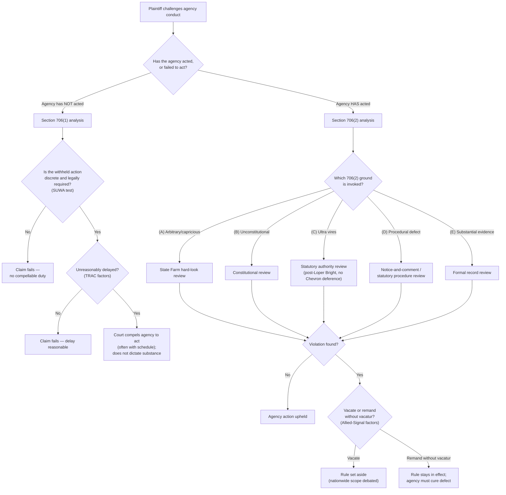

## Section 706 Remedies: Compelling Agency Action and Setting Aside Unlawful Action

### Overview

**Key Points**

- Section 706 of the Administrative Procedure Act, 5 U.S.C. § 706, defines the **scope of judicial review** and the **remedial powers** available to a reviewing court once an administrative action is properly before it, functioning as the operative remedies provision that translates a finding of agency error into an actual judicial order.
- § 706 contains two structurally distinct remedial pathways: § 706(1), which authorizes a court to **"compel agency action unlawfully withheld or unreasonably delayed,"** and § 706(2), which authorizes a court to **"hold unlawful and set aside"** agency action found deficient under one of six enumerated standards of review.
- These two pathways address fundamentally different postures: § 706(1) addresses **agency inaction** (the agency has failed to act at all, or is unreasonably slow), while § 706(2) addresses **agency action** that has occurred but is legally defective.

### Statutory Text and Structure

#### Full Text of § 706 (Paraphrased Structure)

The reviewing court shall:

1. Decide all relevant questions of law, interpret constitutional and statutory provisions, and determine the meaning or applicability of agency action;
2. **§ 706(1)**: Compel agency action unlawfully withheld or unreasonably delayed; and
3. **§ 706(2)**: Hold unlawful and set aside agency action, findings, and conclusions found to be:
   - (A) Arbitrary, capricious, an abuse of discretion, or otherwise not in accordance with law;
   - (B) Contrary to constitutional right, power, privilege, or immunity;
   - (C) In excess of statutory jurisdiction, authority, or limitations, or short of statutory right;
   - (D) Without observance of procedure required by law;
   - (E) Unsupported by substantial evidence (in cases subject to §§ 556–557 or otherwise reviewed on the record);
   - (F) Unwarranted by the facts to the extent the facts are subject to trial de novo by the reviewing court.

The statute further directs that the court must review "the whole record or those parts of it cited by a party," and that "due account shall be taken of the rule of prejudicial error" (the harmless-error principle in administrative review).

### § 706(1): Compelling Agency Action

#### The "Unlawfully Withheld or Unreasonably Delayed" Standard

**Key Points**

- § 706(1) applies only where an agency has a **discrete, legally required** action it has failed to take — it is not a general vehicle for compelling an agency to regulate more aggressively or to exercise discretionary authority in a particular direction.
- ***Norton v. Southern Utah Wilderness Alliance (SUWA)***, 542 U.S. 55 (2004), is the controlling Supreme Court precedent construing § 706(1). The Court held that a court may compel agency action under § 706(1) only when the agency has failed to take a **discrete** agency action that it is **legally required to take** — a two-part limitation:
  1. **Discreteness**: The action sought to be compelled must be a specific, identifiable action (e.g., issuing a particular permit, completing a specific mandated report), not a broad, programmatic course of conduct or general "better management" of a program.
  2. **Legally required**: The duty to act must be mandatory, not merely a matter within the agency's discretion — courts distinguish statutory language using "shall" (potentially mandatory) from "may" (discretionary), though the mandatory/discretionary line depends on the statute's overall structure, not the presence of a single verb.
- ***SUWA*** specifically rejected environmental plaintiffs' attempt to use § 706(1) to compel the Bureau of Land Management to more vigorously manage wilderness study areas under the Federal Land Policy and Management Act's general "non-impairment" mandate, holding that the claimed duty was not sufficiently discrete — it amounted to a broad programmatic management obligation rather than a specific, identifiable act.

#### Unreasonable Delay Analysis

**Key Points**

- Where an agency has a mandatory, discrete duty but has not acted within a stated statutory deadline (or, absent a deadline, within a reasonable time), courts analyze "unreasonable delay" using a multi-factor framework most commonly associated with ***Telecommunications Research & Action Center v. FCC (TRAC)***, 750 F.2d 70 (D.C. Cir. 1984) (the "**TRAC factors**"):
  1. The time agencies take to make decisions must be governed by a "rule of reason";
  2. Where Congress has provided a timetable or other indication of the speed it expects, that timetable may supply content for the rule of reason;
  3. Delays reasonable in the sphere of economic regulation are less tolerable when human health and welfare are at stake;
  4. The court should consider the effect of expediting delayed action on agency activities of a higher or competing priority;
  5. The court should consider the nature and extent of the interests prejudiced by delay;
  6. The court need not find any impropriety lurking behind agency lassitude to hold that agency action is unreasonably delayed.
- [Inference] In environmental law contexts, unreasonable-delay claims frequently arise where a statute imposes a specific deadline for agency rulemaking or a listing decision (e.g., ESA listing petition deadlines, Clean Air Act NAAQS review cycles) and the agency has substantially exceeded that deadline without adequate justification — these "deadline suits" are a recurring form of citizen-suit litigation in environmental practice.

#### Remedy Upon Success

**Key Points**

- A successful § 706(1) claim typically results in an order compelling the agency to act — often with a court-imposed or court-approved schedule/deadline for completion — rather than dictating the substantive outcome the agency must reach.
- Courts generally decline to dictate the **content** of the compelled action (e.g., what a rule must say), respecting the agency's substantive discretion once the procedural obligation to act is triggered — the remedy compels the *act* of deciding, not a particular *result*.

### § 706(2): Setting Aside Unlawful Agency Action

#### The Arbitrary-and-Capricious Standard — § 706(2)(A)

**Key Points**

- The dominant, most frequently litigated standard is § 706(2)(A)'s arbitrary-and-capricious review, governed principally by ***Motor Vehicle Manufacturers Association v. State Farm Mutual Automobile Insurance Co.***, 463 U.S. 29 (1983).
- Under *State Farm*, agency action is arbitrary and capricious if the agency:
  - Relied on factors Congress did not intend it to consider;
  - Entirely failed to consider an important aspect of the problem;
  - Offered an explanation that runs counter to the evidence before the agency; or
  - Is so implausible that it could not be ascribed to a difference in view or the product of agency expertise.
- This is a **"hard look" review** standard — deferential to agency expertise and policy judgment, but requiring a reasoned explanation connecting the facts found to the choices made ("reasoned decisionmaking").
- ***FCC v. Fox Television Stations***, 556 U.S. 502 (2009), clarified that an agency changing a prior policy position need not demonstrate that the new policy is *better* than the old one, but must acknowledge the change and provide a reasoned explanation — a heightened explanation is required specifically where the new policy rests on factual findings that contradict those underlying the prior policy, or where the prior policy engendered serious reliance interests.

#### Statutory Ultra Vires Review — § 706(2)(C)

**Key Points**

§ 706(2)(C) authorizes courts to set aside action found to be "in excess of statutory jurisdiction, authority, or limitations, or short of statutory right." This ground overlaps substantially with statutory-interpretation-based challenges to agency action — including, post-*Loper Bright Enterprises v. Raimondo*, 603 U.S. 369 (2024), courts' independent judgment on the best reading of the statute rather than deference to the agency's own interpretation, since *Loper Bright* overruled *Chevron U.S.A. v. NRDC*'s framework of deferring to reasonable agency interpretations of ambiguous statutes.

#### Procedural Review — § 706(2)(D)

**Key Points**

§ 706(2)(D) permits courts to set aside action taken "without observance of procedure required by law" — covering failures to comply with APA notice-and-comment requirements (§ 553), statute-specific procedural mandates (e.g., NEPA's environmental review procedures), or an agency's own binding procedural regulations.

#### Substantial Evidence Review — § 706(2)(E)

**Key Points**

- Applies specifically to formal rulemaking/adjudication conducted under §§ 556–557, or to informal actions where a separate statute specifies substantial-evidence review (as several environmental and other regulatory statutes do).
- "Substantial evidence" means such relevant evidence as a reasonable mind might accept as adequate to support a conclusion — a somewhat more searching standard than arbitrary-and-capricious in practice, though courts and commentators disagree about how much daylight actually separates the two standards as applied.

### The Remedy of "Setting Aside": Vacatur and Its Scope

#### Nationwide/Universal Vacatur Debate

**Key Points**

- A significant and currently unsettled question is whether "setting aside" a rule under § 706(2) automatically **vacates** the rule as to all regulated parties nationwide, or whether relief should be limited to the parties before the court (**party-specific** or "plaintiff-oriented" relief).
- Historically, the traditional and majority practice among courts (especially the D.C. Circuit, given its frequent role reviewing nationwide regulations) has been to treat "set aside" as producing **nationwide vacatur** — the rule is voided as to everyone, not just the litigating parties, reasoning that vacatur under § 706(2) is a remedy operating on the *rule itself*, not merely on the parties' rights.
- Some courts and commentators have increasingly questioned this practice, drawing an analogy to the debate over "universal" or "nationwide" injunctions in other contexts, and arguing that relief should ordinarily be limited to the parties, with broader vacatur reserved for circumstances where nationwide relief is necessary to give the prevailing party full relief or where the rule is not readily severable.
- [Unverified] This remains a genuinely contested and evolving area of administrative law doctrine; the Supreme Court has not issued a definitive, comprehensive ruling resolving the scope-of-vacatur question, and lower courts have applied varying approaches. Practitioners should verify the current state of circuit-specific practice when this issue is outcome-determinative.

#### Remand Without Vacatur

**Key Points**

- Courts sometimes choose to **remand a rule to the agency without vacating it**, allowing a legally deficient rule to remain in effect while the agency cures the identified defect — typically applying a balancing test weighing (1) the seriousness of the deficiency and likelihood the agency can adequately justify its decision on remand, against (2) the disruptive consequences of vacatur (a framework most associated with ***Allied-Signal, Inc. v. NRC***, 988 F.2d 146 (D.C. Cir. 1993)).
- This remedy is particularly relevant in environmental law contexts where vacating a protective regulation (e.g., an emissions standard) could create a regulatory gap with public-health or environmental consequences more severe than the underlying procedural or substantive defect being remedied — courts have invoked remand-without-vacatur to avoid such gaps while requiring the agency to fix the rule's deficiencies.

### Process Flow: Choosing Between § 706(1) and § 706(2)

### Diagram: The Two Remedial Pathways of Section 706 (svg_diagram)

<svg xmlns="http://www.w3.org/2000/svg" viewBox="0 0 760 440" font-family="Helvetica, Arial, sans-serif">
<text x="380" y="26" text-anchor="middle" font-size="17" font-weight="bold" fill="#1a1a1a">Section 706: Two Remedial Pathways (svg_diagram)</text>
<rect x="30" y="55" width="330" height="150" rx="8" fill="#eef3fb" stroke="#3b5b8c" stroke-width="1.5" />
<text x="195" y="80" text-anchor="middle" font-size="13" font-weight="bold">Sec. 706(1)</text>
<text x="195" y="98" text-anchor="middle" font-size="11">Compel Agency Action</text>
<text x="195" y="122" text-anchor="middle" font-size="10">Addresses: agency INACTION</text>
<text x="195" y="140" text-anchor="middle" font-size="10">Test: discrete + legally required</text>
<text x="195" y="158" text-anchor="middle" font-size="10">(SUWA) + unreasonable delay (TRAC)</text>
<text x="195" y="180" text-anchor="middle" font-size="10">Remedy: order to act, not what to decide</text>
<rect x="400" y="55" width="330" height="150" rx="8" fill="#fdf3e7" stroke="#b8823f" stroke-width="1.5" />
<text x="565" y="80" text-anchor="middle" font-size="13" font-weight="bold">Sec. 706(2)</text>
<text x="565" y="98" text-anchor="middle" font-size="11">Set Aside Unlawful Action</text>
<text x="565" y="122" text-anchor="middle" font-size="10">Addresses: agency action that OCCURRED</text>
<text x="565" y="140" text-anchor="middle" font-size="10">Six grounds (A)-(F): arbitrary/capricious,</text>
<text x="565" y="158" text-anchor="middle" font-size="10">unconstitutional, ultra vires, procedural,</text>
<text x="565" y="176" text-anchor="middle" font-size="10">substantial evidence, de novo facts</text>
<line x1="195" y1="205" x2="195" y2="240" stroke="#555" stroke-width="1.5" marker-end="url(#c1)" />
<line x1="565" y1="205" x2="565" y2="240" stroke="#555" stroke-width="1.5" marker-end="url(#c1)" />
<rect x="30" y="240" width="330" height="80" rx="8" fill="#eaf6ec" stroke="#3f8a4f" stroke-width="1.5" />
<text x="195" y="263" text-anchor="middle" font-size="11" font-weight="bold">Result if granted</text>
<text x="195" y="283" text-anchor="middle" font-size="10">Mandamus-like order compelling</text>
<text x="195" y="299" text-anchor="middle" font-size="10">the discrete act, often with deadline</text>
<rect x="400" y="240" width="330" height="80" rx="8" fill="#fbeaea" stroke="#a13c3c" stroke-width="1.5" />
<text x="565" y="263" text-anchor="middle" font-size="11" font-weight="bold">Result if granted</text>
<text x="565" y="283" text-anchor="middle" font-size="10">Vacatur (full or remand-without-</text>
<text x="565" y="299" text-anchor="middle" font-size="10">vacatur under Allied-Signal balancing)</text>
<rect x="130" y="345" width="500" height="75" rx="8" fill="#f3eefb" stroke="#6b3f9c" stroke-width="1.5" />
<text x="380" y="368" text-anchor="middle" font-size="11" font-weight="bold">Common Thread</text>
<text x="380" y="388" text-anchor="middle" font-size="10">Both pathways generally preserve agency discretion over</text>
<text x="380" y="404" text-anchor="middle" font-size="10">substance — courts compel process/decision, not outcome</text>
</svg>

### Environmental Law Applications

**Key Points**

- **§ 706(1) "deadline suits"**: Environmental citizen-suit provisions (Clean Air Act § 304, Clean Water Act § 505, ESA § 11) frequently combine with § 706(1) principles to compel EPA, the Army Corps, or FWS to complete statutorily mandated, non-discretionary actions — such as issuing overdue NAAQS reviews, completing overdue ESA listing determinations following a "warranted but precluded" finding, or promulgating effluent guidelines on a statutory schedule.
- **§ 706(2)(A) challenges to environmental rules**: The bulk of substantive environmental rule litigation (NAAQS-setting, vehicle emissions standards, WOTUS definitional rules, NEPA categorical exclusions) proceeds under arbitrary-and-capricious review, applying the *State Farm* factors to agency technical and policy judgments.
- **Vacatur consequences in environmental cases**: The nationwide-vacatur-versus-remand-without-vacatur choice carries acute stakes in environmental litigation, since vacating a protective standard (e.g., an air toxics rule) removes the regulatory floor entirely pending any replacement rule, whereas vacating a rule that *loosened* a prior standard could restore a more protective prior rule — courts weigh these asymmetric consequences under the *Allied-Signal* framework.

### Common Exam/Analysis Traps

**Key Points**

- Do not treat § 706(1) as a general tool for judicial policy oversight of agency priorities — after *SUWA*, courts will not compel "better," more vigorous, or more comprehensive agency management absent a discrete, legally mandated action.
- Distinguish "unreasonably delayed" (§ 706(1), addressing timing of a still-pending mandatory duty) from "arbitrary and capricious" (§ 706(2)(A), addressing the substantive or explanatory adequacy of a completed action) — these are analytically separate inquiries governed by different tests (TRAC vs. *State Farm*).
- The *Loper Bright* overruling of *Chevron* deference primarily affects how courts approach § 706(2)(C) statutory-authority questions (and, more broadly, "questions of law" under § 706's opening clause) — it does not change the arbitrary-and-capricious standard itself, which remains governed by *State Farm*.
- Vacatur scope (nationwide vs. party-specific) is a live, unsettled doctrinal question — avoid treating "set aside" as having one uniformly agreed meaning across circuits; flag this uncertainty explicitly in analysis.

### Related Topics

- *Motor Vehicle Mfrs. Ass'n v. State Farm* and arbitrary-and-capricious review
- *Loper Bright Enterprises v. Raimondo* and the end of *Chevron* deference
- *Norton v. SUWA* and the limits of compelling agency action
- Standing and ripeness in administrative litigation
- Citizen-suit provisions in federal environmental statutes
- Nationwide injunctions and universal vacatur debates in administrative law
- Remand without vacatur and the *Allied-Signal* balancing test
- NEPA procedural review and adequacy of environmental impact statements