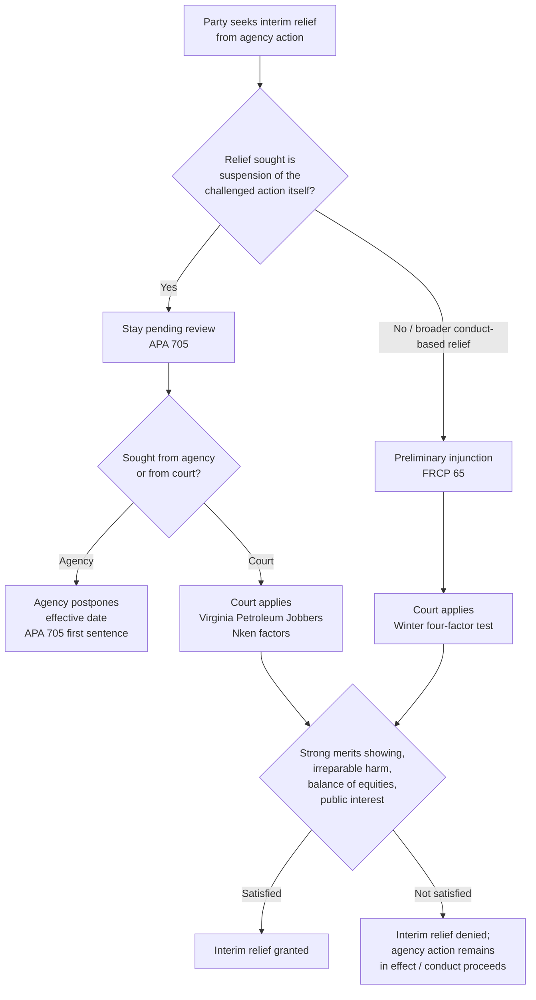

## Preliminary Injunctions and Stays Pending Review

### Overview

Preliminary injunctions and stays pending review are the two principal mechanisms by which a party can obtain interim relief from agency action while the merits of a legal challenge are litigated. Both address the same underlying problem — the risk that a party will suffer irreparable harm before a final decision issues — but they operate through different procedural vehicles, are governed by different statutory and doctrinal sources, and produce different legal effects on the challenged agency action. Understanding the taxonomy of interim relief is essential because administrative litigation frequently turns on interim posture: agency rules take effect on statutory deadlines, enforcement orders carry immediate compliance obligations, and permit denials halt regulated activity long before a court can reach the merits.

### The Two Mechanisms Distinguished

**Preliminary Injunction**

- An equitable remedy issued by a **court**, ordering a party (often the agency, sometimes a private party) to act or refrain from acting
- Governed by Federal Rule of Civil Procedure 65 and traditional equitable principles
- Available in original district court actions challenging agency conduct (e.g., suits for declaratory and injunctive relief under the APA or a constitutional cause of action)
- Directed at conduct, not necessarily at "staying" a specific agency order

**Stay Pending Review**

- An order **suspending the legal effect** of an agency action (a rule, order, or license decision) while judicial review of that action proceeds
- Governed principally by APA §705, and by the all-writs and inherent-authority doctrines of reviewing courts
- Available both from the **agency itself** and from the **reviewing court**
- Directed specifically at the operative effect of the challenged agency action, not at broader conduct

[Inference] The practical distinction matters because a stay leaves the underlying agency action legally suspended in its entirety — as though held in abeyance — whereas an injunction can be narrower or broader than the agency action itself, tailored to the specific harm alleged.

### Statutory Basis: APA §705

Section 705 of the APA is the primary statutory hook for stays of agency action pending review. It operates on two tracks:

1. **Agency-issued postponement**: "When an agency finds that justice so requires, it may postpone the effective date of action taken by it, pending judicial review."
2. **Court-issued stay**: "On such conditions as may be required and to the extent necessary to prevent irreparable injury, the reviewing court... may issue all necessary and appropriate process to postpone the effective date of an agency action or to preserve status or rights pending conclusion of the review proceedings."

[Unverified — evolving doctrine] The precise scope of a court's §705 stay power — particularly whether it permits a "universal" or "vacatur-like" stay that suspends a rule as to all regulated parties nationwide, versus only as to the parties before the court — has been a matter of significant recent litigation and scholarly dispute, echoing the broader controversy over nationwide/universal vacatur under §706(2). Practitioners should verify current circuit-specific treatment, as this area has evolved rapidly in recent years.

### The Four-Factor Preliminary Injunction Standard

Federal courts apply a settled four-factor test, most authoritatively stated in **Winter v. Natural Resources Defense Council, Inc.** (2008), for both traditional preliminary injunctions and (with adaptation) §705 stays:

1. **Likelihood of success on the merits** — the movant must show a substantial likelihood (not mere possibility) of prevailing on the underlying legal challenge
2. **Irreparable harm** — the movant must show it will suffer harm that cannot be adequately remedied by money damages or a later victory on the merits, absent interim relief
3. **Balance of equities** — the harm to the movant from denial of relief must outweigh the harm to the non-movant (often the agency or intervenors) from granting it
4. **Public interest** — the court must consider whether the injunction or stay serves or disserves the public interest, a factor that carries particular weight in cases involving public health, safety, or environmental regulation

[Inference] Courts do not treat these four factors as strictly independent; the D.C. Circuit and several other circuits have historically used a "sliding scale" approach, under which a very strong showing on the merits can offset a comparatively weaker showing on irreparable harm, though *Winter*'s emphasis on treating irreparable harm as a genuinely independent, non-waivable requirement has narrowed the room for this tradeoff, particularly in cases against the government.

### Stay Standard Applied to Agency Action: The *Virginia Petroleum Jobbers* / *Nken* Framework

For stays specifically of agency orders pending review, courts historically applied a four-factor formulation traced to **Virginia Petroleum Jobbers Ass'n v. FPC** (D.C. Cir. 1958), later substantially adopted by the Supreme Court in the analogous context of stays of removal orders in **Nken v. Holder** (2009):

1. Whether the applicant has made a strong showing of likely success on the merits
2. Whether the applicant will be irreparably injured absent a stay
3. Whether issuance of the stay will substantially injure other interested parties
4. Where the public interest lies

Nken confirmed that the third and fourth factors merge when the government is the opposing party, and reaffirmed that a stay is "an exercise of judicial discretion" dependent on the circumstances of the particular case, not a matter of right even upon a strong merits showing.

### Comparative Table

| Dimension | Preliminary Injunction | Stay Pending Review |
| --- | --- | --- |
| Issuing body | Court | Agency or court |
| Primary authority | Fed. R. Civ. P. 65; equity | APA §705 |
| Object of relief | Conduct of a party | Legal effect of agency action |
| Governing standard | *Winter* four-factor test | *Virginia Petroleum Jobbers*/*Nken* four-factor test |
| Typical procedural posture | District court civil action | Petition for review in circuit court, or agency reconsideration |
| Scope of effect | Tailored to parties/conduct at issue | Often coextensive with the challenged action itself |
| Bond requirement | Often required under Rule 65(c) | Discretionary; less uniformly required against agencies |

### Irreparable Harm in the Environmental and Regulatory Context

Irreparable harm analysis carries specialized content in administrative and environmental litigation:

- **Environmental harm** is frequently treated by courts as presumptively difficult to remedy through money damages, given the often-permanent character of ecological injury (species loss, habitat destruction, contamination). [Inference] However, *Winter* itself rejected an automatic presumption of irreparable harm from environmental injury alone, holding that plaintiffs must make a concrete evidentiary showing rather than relying on a categorical assumption — this significantly raised the evidentiary bar in environmental preliminary injunction practice.
- **Purely economic harm** (e.g., compliance costs from a new rule) is traditionally disfavored as a basis for irreparable harm, since compliance costs are ordinarily compensable or recoverable, though courts have split on whether unrecoverable compliance costs — costs a regulated party cannot recoup even if it later prevails — can independently satisfy the irreparable harm prong.
- **Loss of a business opportunity, permit, or license** pending review can constitute irreparable harm where the delay itself causes non-recoupable competitive or operational injury.

### Diagram: Interim Relief Decision Pathway

### Practical Illustration

**Example — Environmental Law Context:**

A trade association challenges EPA's newly promulgated rule tightening emissions standards for a category of industrial sources, arguing the rule exceeds EPA's statutory authority.

- If the association seeks to **suspend the rule's effective date** while its petition for review proceeds in the circuit court, it seeks a **§705 stay** — first potentially from EPA itself (asking the agency to postpone the effective date), and if denied, from the reviewing court applying the *Nken* factors.
- If instead a member facility separately sues in district court to **enjoin EPA from initiating an enforcement action** against it specifically while the rule's validity is being litigated elsewhere, that facility seeks a **preliminary injunction** under Rule 65, evaluated under *Winter*.

**Key Points**

- The choice between seeking a stay and seeking an injunction is driven by the object of relief: suspending the rule itself points to §705; restraining specific agency conduct toward a specific party points to Rule 65.
- Exhaustion principles often require a party to first seek a stay from the agency before a reviewing court will entertain a stay motion, though this is statute- and circuit-dependent. [Unverified — verify against the specific organic statute and circuit rule at issue]
- Winter's rejection of a categorical environmental-harm presumption significantly reshaped preliminary injunction practice in environmental cases, requiring particularized evidentiary showings even where the underlying injury type (habitat loss, species harm) is traditionally viewed as irremediable.
- The scope question — party-specific versus universal stay effect — remains one of the most actively litigated procedural issues in contemporary administrative law and should be checked against current authority before relying on any categorical statement of the rule.

**Related Topics**

- Exhaustion of administrative remedies as a precondition to judicial review
- APA §706(2) vacatur and the nationwide/universal vacatur controversy
- Ripeness and finality doctrines as gatekeepers to interim relief
- Standing requirements in suits seeking preliminary injunctive relief against agencies
- The automatic stay provisions of specific organic statutes (e.g., Clean Air Act §307(d))
- Bond requirements under Rule 65(c) in suits against government defendants
- Emergency/administrative stays versus preliminary injunctions (the shorter-duration, lower-showing interim device)