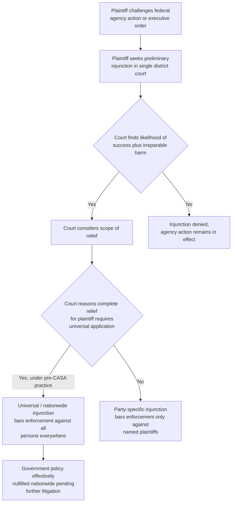

## Nationwide and Universal Injunctions before Trump v. CASA

### Overview

Before the Supreme Court's 2025 decision in *Trump v. CASA, Inc.*, federal district courts had, over roughly the preceding half-century, developed and increasingly exercised the power to issue "nationwide" or "universal" injunctions — orders that barred the government from enforcing a challenged statute, regulation, or executive action not merely against the named plaintiffs, but against *all* persons everywhere, including non-parties to the litigation. This pre-CASA landscape is the essential doctrinal baseline for understanding both the remedial architecture of administrative litigation and the significance of CASA's subsequent narrowing. This entry covers the doctrine as it stood before CASA; the post-CASA framework is addressed separately.

### Definitional Terminology

The terms "nationwide injunction" and "universal injunction" were often used interchangeably in pre-CASA practice, though scholars (notably Samuel Bray, whose work the Supreme Court would later cite extensively) distinguished them by emphasis:

- **Nationwide injunction** emphasized the *geographic* scope of the order — it applied throughout the United States, not merely within the issuing court's district or circuit.
- **Universal injunction** emphasized the *personal* scope of the order — it protected all persons, including non-parties who had never appeared before the court, not merely the named plaintiffs.

[Inference] In practice, most orders described as "nationwide injunctions" against federal executive action were universal in both senses: geographically unbounded and extending protection to non-parties. The label "universal injunction" became the preferred academic and, eventually, judicial term precisely because the personal-scope dimension (protecting strangers to the suit) was the doctrinally controversial feature, not the geographic dimension alone.

### Historical Emergence

- Universal injunctions against federal government action were rare through most of the twentieth century and are widely described by scholars as a late-twentieth and early-twenty-first century development, with the practice accelerating markedly during the Obama, first Trump, Biden, and second Trump administrations.
- Courts and commentators frequently trace the doctrinal opening to Federal Rule of Civil Procedure 23's class-action mechanism falling out of favor for broad injunctive relief against the government, combined with courts' inherent equitable powers and the APA's §706(2) "set aside" language being read by some courts as authorizing vacatur-like, universally effective relief.
- The practice was not partisan in direction: district courts issued universal injunctions against policies of administrations of both parties, and the identity of which ideological wing of the judiciary favored the practice shifted depending on which administration was in power at a given time.

### The Traditional Equitable Basis (Pre-CASA Justification)

Prior to CASA, courts justifying universal injunctions typically relied on one or more of the following rationales:

1. **Completeness of relief for the plaintiff.** Some courts reasoned that certain harms (e.g., regulatory uncertainty, competitive disadvantage, or the practical impossibility of the government applying a rule differently to different individuals) could only be remedied for the named plaintiff if the challenged policy were enjoined as to everyone.
2. **Inherent equitable authority.** Courts drew on the general grant of equity jurisdiction to federal courts, without requiring express statutory authorization for universally-scoped relief.
3. **APA §706(2) "set aside" language.** In APA record-review cases, some courts and commentators argued that a court's power to "set aside" unlawful agency action was inherently universal in effect — that once a rule was set aside, it was void as to everyone, not merely the litigants, by analogy to vacatur of an agency rule.
4. **Nationwide uniformity concerns.** Courts sometimes reasoned that patchwork enforcement — a policy valid in some jurisdictions and enjoined in others — was administratively unworkable or created unacceptable inequities among similarly situated individuals depending on geography.
5. **Class-like efficiency without certification.** Universal injunctions allowed courts to grant class-action-like breadth of relief without the procedural rigor (commonality, typicality, adequacy of representation, notice) that Rule 23 class certification requires.

### The Pre-CASA Critique

A substantial and increasingly influential body of scholarship and judicial opinion — most prominently associated with Professor Samuel Bray — challenged the legitimacy of universal injunctions well before CASA reached the Supreme Court. The core objections:

1. **Absence of historical equitable pedigree.** Critics argued that traditional equity practice, as inherited from the English Court of Chancery at the time of the Judiciary Act of 1789, never recognized a power to grant relief benefiting non-parties; equitable relief was bound by the traditional party-specific scope of the "bill in equity."
2. **Forum shopping and single-judge control.** A single district judge, anywhere in the country, could functionally nullify a federal policy nationwide, incentivizing plaintiffs to seek out favorable jurisdictions and judges perceived as sympathetic — a dynamic critics argued undermined the ordinary percolation of legal questions through multiple courts before Supreme Court resolution.
3. **Undermining of class-action safeguards.** Universal injunctions were said to provide class-wide relief without any of Rule 23's protections — no notice to absent class members, no adequacy-of-representation scrutiny, and no mechanism for excluded or conflicting interests to be heard.
4. **Interference with percolation and Supreme Court review.** A single nationwide injunction could freeze a legal question in place, preventing the issue from being tested in multiple circuits and depriving the Supreme Court of the benefit of divergent appellate reasoning before granting certiorari.
5. **Asymmetric-risk litigation dynamics.** Because a single successful nationwide injunction gave a challenger everything, while the government needed to win in every court to fully defend a policy, critics argued the practice structurally favored those seeking to block government action.

Justices across the ideological spectrum – including Justice Gorsuch and, at different points, other members of the Court – had flagged concerns about nationwide injunctions in separate writings well before CASA, though the Court did not squarely resolve the question until CASA itself.

### Comparative Table: Universal Injunction vs. Traditional Party-Specific Injunction (Pre-CASA)

| Dimension | Universal/Nationwide Injunction | Traditional Party-Specific Injunction |
| --- | --- | --- |
| Beneficiaries | All persons nationwide, including non-parties | Only the named plaintiffs |
| Geographic scope | Entire United States | Typically coextensive with the court's jurisdiction over the parties |
| Procedural safeguards | None equivalent to Rule 23 | N/A — matches scope of adjudicated parties |
| Historical equity pedigree | Contested; largely absent from Founding-era practice | Well-established Chancery practice |
| Effect on percolation | Forecloses parallel litigation of the same issue | Preserves parallel litigation in other circuits |
| Typical procedural vehicle | Preliminary injunction in APA or constitutional challenge | Same |

### Illustrative Pre-CASA Case Pattern

**Example — Environmental/Regulatory Context (Illustrative Pattern):**

[Inference] A recurring pre-CASA pattern involved a coalition of states challenging a federal environmental regulation (for example, a Clean Water Act rule redefining "waters of the United States," or a Clean Air Act emissions rule) in a single favorable district court, obtaining a preliminary injunction framed not merely as protecting the plaintiff states but as barring the agency from enforcing the rule anywhere in the country — including against regulated parties and in states that were not plaintiffs and had taken no position in the litigation. This pattern repeated across administrations and subject areas (immigration, healthcare, environmental regulation, student loan policy), and is precisely the pattern the Supreme Court addressed in CASA itself, which arose from three universal preliminary injunctions blocking Executive Order 14,160 (the birthright citizenship order) nationwide, issued by district courts in Washington, Maryland, and Massachusetts and affirmed by the Ninth, Fourth, and First Circuits before the Supreme Court granted review.

### Diagram: Pre-CASA Universal Injunction Reasoning Structure

### Doctrinal Trajectory Toward CASA

- Through the 2010s and into the 2020s, universal injunctions became a routine feature of high-profile challenges to executive branch policy — immigration enforcement priorities, healthcare mandates, environmental rules, and student loan forgiveness programs were all subject to nationwide injunctions at various points.
- The volume and frequency of such injunctions increased sharply during the opening months of the second Trump administration in 2025, which is the immediate litigation context that produced *Trump v. CASA, Inc.*
- The Supreme Court granted certiorari specifically to resolve the procedural legitimacy of universal injunctive relief, consolidating *Trump v. CASA*, *Trump v. Washington*, and *Trump v. New Jersey* — all arising from district court injunctions against the birthright citizenship executive order.
- On June 27, 2025, the Court held, in a 6–3 decision authored by Justice Barrett, that universal injunctions exceed the judiciary's power unless necessary to provide the formal plaintiff with "complete relief," resolving the question on statutory grounds under the Judiciary Act of 1789 rather than reaching the constitutional Article III question. This holding is addressed in full in the companion entry on the post-CASA framework. [Wikipedia](https://en.wikipedia.org/wiki/Trump_v._CASA,_Inc.)

**Key Points**

- Pre-CASA, "nationwide" and "universal" injunction were largely synonymous in practice, though the terms emphasized geographic versus personal scope respectively.
- The practice grew substantially from the early 2000s onward and was used against administrations of both parties.
- The core pre-CASA critique — lack of historical equitable pedigree, forum shopping, bypassing of Rule 23 safeguards, and interference with percolation — supplied the intellectual foundation the Supreme Court would later adopt in CASA.
- CASA itself arose directly from this pre-CASA pattern: three district courts issued universal preliminary injunctions against the birthright citizenship executive order, all affirmed at the circuit level, before the Supreme Court intervened.

**Related Topics**

- Trump v. CASA, Inc. (2025) and the post-CASA framework for "complete relief"
- The Article III standing and case-or-controversy limits on the scope of equitable relief
- Rule 23 class actions as an alternative vehicle for broad-based relief against government policy
- APA §706(2) vacatur and its relationship to (and distinction from) universal injunctive relief
- Nationwide injunctions in immigration and healthcare policy litigation as comparative case studies
- Judicial forum shopping and single-judge divisions in federal district courts
- The "complete relief" standard and its application to state-plaintiff and organizational-plaintiff cases post-CASA