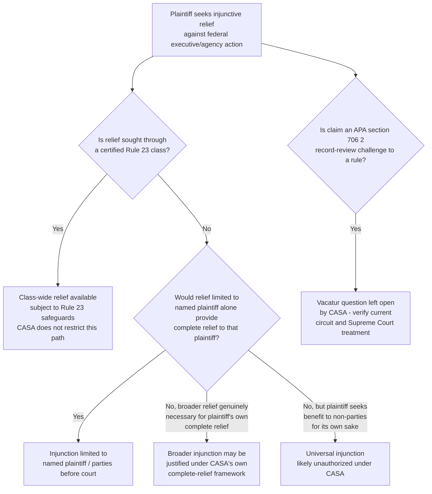

## Trump v. CASA and the Narrowing of Universal Injunctive Relief

### Overview

*Trump v. CASA, Inc.*, 606 U.S. 831 (2025), is the Supreme Court's resolution of the decades-long controversy over district courts' power to issue universal (nationwide) injunctions. Decided June 27, 2025, by a 6–3 majority authored by Justice Barrett, the Court held that universal injunctions "likely exceed the equitable authority that Congress has granted to federal courts," grounding its holding in a statutory interpretation of the Judiciary Act of 1789 rather than reaching the underlying constitutional Article III question. CASA does not eliminate broad-scope relief altogether; it redirects the doctrinal pathway by which such relief must be sought and justified.

### Procedural Posture and Underlying Dispute

- CASA consolidated three cases — *Trump v. CASA, Inc.*, *Trump v. Washington*, and *Trump v. New Jersey* — all arising from challenges to Executive Order 14,160, "Protecting the Meaning and Value of American Citizenship," which purported to deny birthright citizenship recognition under the Fourteenth Amendment's Citizenship Clause to children born in the United States to certain categories of noncitizen parents.
- District courts in Washington, Maryland, and Massachusetts each issued universal preliminary injunctions blocking enforcement of the executive order nationwide, not merely as to the named plaintiffs. These injunctions were affirmed on appeal by the Ninth, Fourth, and First Circuits respectively.
- The federal government's stay applications to the Supreme Court raised both statutory and constitutional challenges to the propriety of universal injunctive relief. The Court granted review, heard oral argument on May 15, 2025, and limited its decision to the narrower statutory question: "whether Congress has granted federal courts the authority to universally enjoin the enforcement of an executive or legislative policy."
- Notably, the substantive constitutionality of the birthright citizenship executive order itself was not resolved by CASA — the decision addressed only the procedural/remedial question of injunctive scope, leaving the merits of the underlying citizenship dispute for further litigation.

### The Holding

Writing for six Justices (Roberts, Thomas, Alito, Gorsuch, Kavanaugh joining), Justice Barrett held that the Judiciary Act of 1789 does not authorize federal courts to issue injunctions that reach more broadly than necessary to provide complete relief to the parties actually before the court.

The Court's reasoning proceeded through the following analytical steps:

1. **Textual anchor in the 1789 Judiciary Act.** The Court looked to the Act's grant of jurisdiction over "all suits ... in equity" as the source of federal courts' equitable powers, rather than to any modern statute expressly authorizing universal relief.
2. **Historical equity practice as the limiting principle.** The Court applied the settled interpretive rule that "the equity jurisdiction of the federal courts is the jurisdiction in equity exercised by the High Court of Chancery in England at the time of the adoption of the Constitution and the enactment of the original Judiciary Act, 1789." Because founding-era Chancery practice did not recognize relief extending to non-parties, the Court concluded that modern federal equity power is bound by the same limitation absent express congressional authorization.
3. **"Complete relief" as the governing standard.** The majority distinguished "complete relief" for the plaintiff — relief broad enough to fully remedy that plaintiff's own injury — from "universal relief" benefiting all similarly situated persons nationwide. Justice Barrett emphasized these are analytically distinct concepts: a plaintiff may require broad relief to be made whole, but that breadth must be measured against the plaintiff's own injury, not against the interests of non-parties.
4. **Application to the consolidated cases.** The Court held that a nationwide injunction was not required to protect the *individual* plaintiffs in the consolidated cases, since individualized relief could fully remedy their injuries without extending to non-parties.

### What CASA Left Open

CASA's holding is significant for what it does *not* foreclose. The decision expressly preserves — or at minimum leaves ambiguous — several avenues by which litigants may still obtain broad-scope relief:

1. **Class actions under Rule 23.** The Court's statutory holding addressed equitable injunctive power outside the class-action context; a properly certified nationwide class retains the traditional mechanism for binding relief extending to absent class members, subject to Rule 23's commonality, typicality, adequacy, and notice requirements.
2. **State-plaintiff "complete relief" theories.** Where a state plaintiff can show that anything short of a broader injunction would fail to give it complete relief (for example, because a policy's effects on non-resident individuals indirectly injure the state itself, or because a patchwork of citizenship or eligibility statuses is administratively unworkable for the state to implement), a broader-than-party-specific injunction may still be justified under CASA's own framework rather than as an exception to it. The decision left open the possibility that the New Jersey-led coalition's injunction, which the district court had grounded in the states' own complete-relief needs, might remain effective.
3. **Organizational-plaintiff associational relief.** Where an organizational plaintiff sues on behalf of its members, the completeness of relief owed to the organization itself may, depending on further litigation, justify a scope of relief broader than the organization's named individual plaintiffs — though the Court's decision "casts doubt" on the district court's organizational-relief holding in CASA itself without squarely resolving it.
4. **APA §706(2) vacatur (left unaddressed).** CASA did not resolve whether courts retain the separate power to "set aside" unlawful agency action under APA §706(2) in a manner that has vacatur-like, universally effective consequences distinct from an injunction. [Unverified — actively litigated] Whether vacatur under the APA provides a surviving pathway to broad-scope relief in administrative law cases specifically, notwithstanding CASA's limits on injunctive relief, remains an open and heavily contested question that practitioners must track through subsequent lower-court and Supreme Court treatment.
5. **Supreme Court emergency-docket uniformity.** Justice Kavanaugh's concurrence expressed the view that the Supreme Court itself, through its emergency/"shadow docket" practice of granting or denying stays, can and will continue to provide effectively nationwide uniformity on high-stakes legal questions even without lower courts issuing universal injunctions — a functional substitute some commentators view skeptically.

### The Opinion Lineup

| Opinion | Author | Joined by | Disposition |
| --- | --- | --- | --- |
| Majority | Barrett | Roberts, Thomas, Alito, Gorsuch, Kavanaugh | Universal injunctions likely exceed equitable authority granted by Congress |
| Concurrence | Thomas | Gorsuch | [Unverified — specific reasoning not confirmed in sources reviewed; verify against slip opinion] |
| Concurrence | Alito | Thomas | [Unverified — specific reasoning not confirmed in sources reviewed; verify against slip opinion] |
| Concurrence | Kavanaugh | — | Emphasized Supreme Court's emergency docket as a uniformity-preserving mechanism |
| Dissent(s) | [Unverified] | — | Three Justices dissented (6–3 split); specific dissenting authorship and reasoning should be verified against the slip opinion |

### Comparative Table: Pre-CASA versus Post-CASA Injunctive Scope

| Dimension | Pre-CASA | Post-CASA |
| --- | --- | --- |
| Default scope of preliminary/permanent injunctions | Frequently nationwide/universal | Limited to relief necessary for named plaintiffs |
| Justification required for broad relief | General equitable discretion; completeness-of-relief reasoning applied loosely | Must show broader relief is genuinely necessary to make the *named plaintiff* whole |
| Primary source of authority examined | Modern equitable practice; APA §706(2) analogized to vacatur | Judiciary Act of 1789; founding-era Chancery practice |
| Effect on non-parties | Often directly protected without appearing in the suit | Not directly protected absent class certification or a qualifying complete-relief theory |
| Class actions | One tool among several for broad relief | Reasserted as the primary/preferred vehicle for non-party-inclusive relief |
| State-plaintiff broad relief | Common and largely unscrutinized | Available only on a genuine complete-relief showing tied to the state's own injury |
| Constitutional Article III question | Unresolved | Still unresolved — CASA rested on statutory grounds only |

### Diagram: Post-CASA Scope-of-Relief Analysis

### Practical Implications for Administrative Litigation

**Key Points**

- Litigants challenging federal agency rules or executive action can no longer assume that a single favorable district court will produce nationwide relief; multi-plaintiff and multi-jurisdiction litigation strategies, or formal class certification, become more central to achieving broad-scope remedies.
- Regulatory uncertainty increases: a rule enjoined as to one set of plaintiffs may remain in effect and enforceable as to everyone else, creating the patchwork effect that pre-CASA universal-injunction proponents had cited as a rationale for broader relief in the first place.
- The unresolved relationship between CASA's injunction-specific holding and APA §706(2) vacatur is the single most consequential open question for administrative law practitioners going forward — if vacatur survives as an independently available, broadly-effective remedy, CASA's practical impact on administrative litigation specifically may be considerably narrower than its impact on constitutional and immigration litigation.
- The decision's statutory (rather than constitutional) grounding means Congress retains the power to expressly authorize universal injunctive relief by statute, and future legislative action in this area is possible.

[Inference] Given that CASA was decided in mid-2025 and directly implicates ongoing, fast-moving litigation (including the birthright citizenship dispute itself, remanded for further proceedings on the "complete relief" question), practitioners should treat any specific characterization of current lower-court application of CASA — including outcomes in the New Jersey state-plaintiff litigation and the organizational-plaintiff litigation — as provisional and subject to verification against the most current case law.

**Related Topics**

- Nationwide and universal injunctions before Trump v. CASA (doctrinal background and critique)
- APA §706(2) vacatur and its uncertain post-CASA relationship to injunctive relief
- Rule 23 class actions as the primary post-CASA vehicle for broad-based relief
- The Article III case-or-controversy question left unresolved by CASA's statutory holding
- The birthright citizenship dispute on remand: merits litigation following the CASA remedial ruling
- The Supreme Court's emergency/"shadow docket" as a uniformity-preserving mechanism post-CASA
- State standing and the "complete relief" theory for state-plaintiff coalitions in administrative litigation